# Java Missing Book Manuscript

Generated from section guides and chapter guides.

## Fundamentals

Current chapters:

- `ch01_java_basics`
- `ch02_classes_and_objects`

## Before You Start

- Prerequisites: None. Start here even if you are new to Java.
- This section prepares you for: Collections, generics, streams, testing, and every later chapter.
- Suggested pace: 3 to 5 focused sessions.

## How To Read This Section

- run the topic files before trying to memorize names
- compare the printed output with the explanation in each topic
- finish the chapter with its revision sheet before moving on

## Why This Section Matters

Collections, generics, streams, testing, and every later chapter.

## Recommended Next Step

Move to sec02_collections and sec03_generics next.

### Java Basics

This chapter is bundled into one guide so the learner does not need to jump across many files.

## What You Learn

- variables and type choice
- control flow
- writing small clear methods
- basic OCJP traps
- basic interview-style answers

## Study Order

1. Run [StoringAndNamingValues.java](/Users/indiadelhi/repo/career/java-missing-tutorial/code/src/main/java/com/learning/javamissing/sec01_fundamentals/ch01_java_basics/topics/storing_and_naming_values/StoringAndNamingValues.java)
2. Run [MakingDecisionsAndRepeatingWork.java](/Users/indiadelhi/repo/career/java-missing-tutorial/code/src/main/java/com/learning/javamissing/sec01_fundamentals/ch01_java_basics/topics/making_decisions_and_repeating_work/MakingDecisionsAndRepeatingWork.java)
3. Run [DesigningSmallMethods.java](/Users/indiadelhi/repo/career/java-missing-tutorial/code/src/main/java/com/learning/javamissing/sec01_fundamentals/ch01_java_basics/topics/designing_small_methods/DesigningSmallMethods.java)
4. Review quiz and interview questions below

## Visual Map

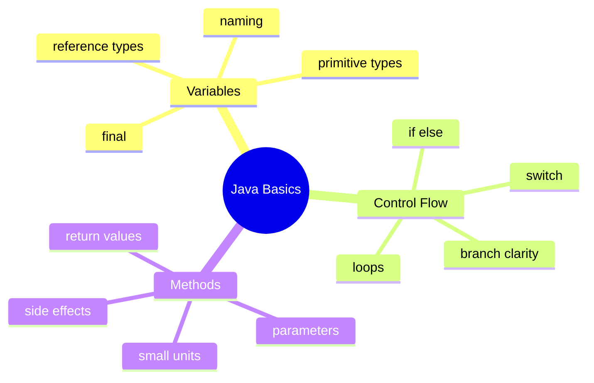

## Learning Flow

## Core Notes

### Variables

- choose names that explain the value
- use exact numeric types when correctness matters
- use `final` when reassignment should not happen

### Control Flow

- prefer simple branches first
- use loops that match the problem
- avoid deeply nested logic when guard clauses or simpler conditions work

### Methods

- one method should do one clear thing
- prefer return values over hidden side effects
- method names should explain intent

## Compare With

- variable vs value:
  a variable is the name, the value is the data stored inside it
- `if/else` vs loop:
  `if/else` chooses once, a loop repeats work
- method vs print statement:
  a method can return reusable logic, a print statement only shows text

## Senior Engineer Lens

- naming is not cosmetic; it controls how quickly code can be reviewed under pressure
- exact types reduce hidden defects, especially around money, rounding, and API contracts
- small methods are easier to test, inline mentally, and evolve safely
- basic control-flow clarity matters more in large codebases than clever syntax does

## Decision Chart

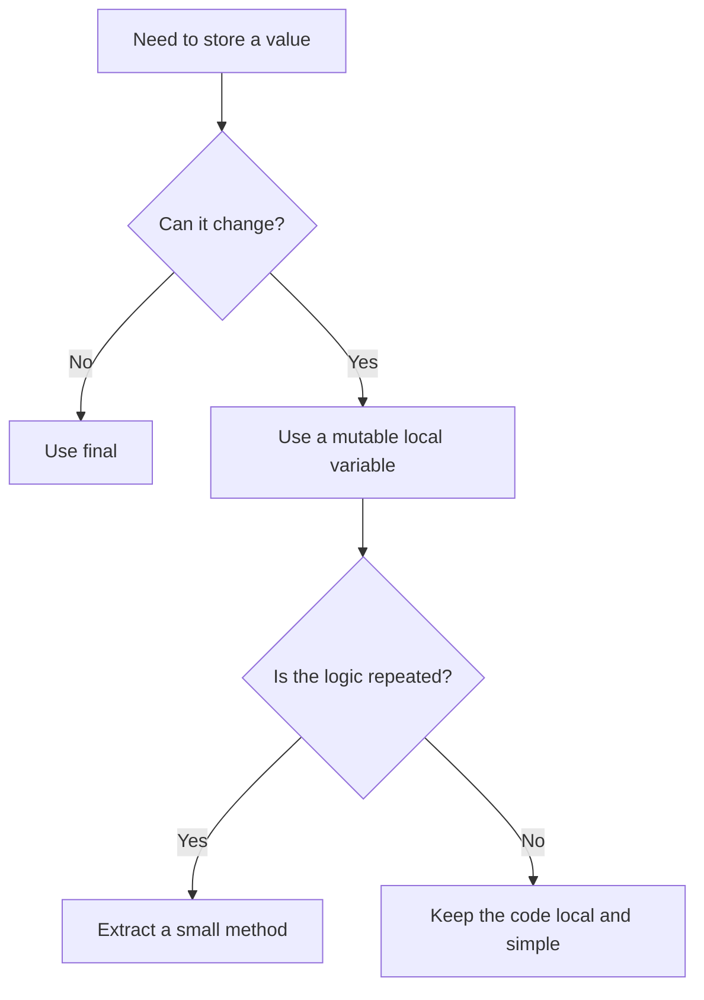

## Mini Case Study

Imagine a simple student marks program.

- variables store marks and names
- control flow decides pass or fail
- methods calculate total marks and average

This is why Java basics matter. Larger programs still depend on these same small ideas.

## OCJP Traps

- arithmetic on `byte`, `short`, and `char` promotes to `int`
- `switch` coverage rules matter
- Java is pass-by-value, even for object references
- `while` and `do-while` do not behave the same

## Interview Questions

Q: Why should local variables use meaningful names?  
A: Because names reduce mental load and make behavior easier to verify during reviews, debugging, and interviews.

Q: When is a `for-each` loop better than an indexed loop?  
A: When you only need the value and not the position.

Q: What makes a method easy to maintain?  
A: Small scope, clear name, obvious input and output, and limited side effects.

## Quick Quiz

1. Why does `byte c = a + b;` fail without a cast?
2. When would you use `final` on a local variable?
3. Why might a loop be clearer than a stream for very basic branching logic?
4. Why is returning a value often better than printing inside a method?

## Effective Java Coverage

- Item 5: Prefer dependency injection to hardwiring resources
  Relevance: constructor and method design will expand this in later chapters
- Item 49: Check parameters for validity
  Relevance: methods and defensive thinking
- Item 56: Write doc comments for all exposed API elements
  Relevance: method clarity and teaching style
- Item 61: Prefer primitive types to boxed primitives
  Relevance: variable type choice
- Item 62: Avoid strings where other types are more appropriate
  Relevance: variable and method design
- Item 68: Adhere to generally accepted naming conventions
  Relevance: variables and methods

## Sources

- Oracle Java SE overview: https://www.oracle.com/java/technologies/java-se-glance.html
- Java Language Specification: https://docs.oracle.com/javase/specs/
- Java API documentation: https://docs.oracle.com/en/java/
- Effective Java, 3rd Edition: https://www.informit.com/store/effective-java-9780134686042
- Core Java, Volume I: https://www.informit.com/store/core-java-volume-i-fundamentals-9780135558577
- Learn Java 17 Programming: https://www.packtpub.com/en-us/product/learn-java-17-programming-second-edition-9781803241432

## Slide-Ready Outline

Slide 1: Java basics matter because every later topic depends on them.  
Slide 2: Variables teach type choice and naming.  
Slide 3: Control flow teaches decisions and repetition.  
Slide 4: Methods teach reuse and clearer design.  
Slide 5: OCJP traps come from small syntax and type details.  
Slide 6: Interview questions test explanation, not just syntax.

#### Revision

## Before Revision

- rerun `RunAllTopics.java`
- compare the actual output with the expected output comments in each topic file
- explain the chapter in your own words before reading this sheet

## Five Key Ideas

- understand the core idea behind Designing Small Methods
- understand how Making Decisions And Repeating Work changes code behavior or design choice
- know when Storing And Naming Values is useful in real code
- know the common confusion around Making Decisions And Repeating Work
- be able to explain the tradeoff behind Storing And Naming Values

## Three Mistakes To Avoid

- memorizing syntax without checking why the output appears
- using this chapter's idea where a simpler option would be clearer
- ignoring naming, input, output, and side-effect clarity

## Three Interview Questions

1. What real problem does Java Basics solve?
2. When would you avoid a heavier approach and choose a simpler one instead?
3. Which example in this chapter is most useful in production code, and why?

## Three OCJP Checks

1. Can you predict the output of the main runnable example without executing it?
2. Can you explain which behavior is compile-time and which is runtime?
3. Can you name one edge case that could confuse a learner in this chapter?

## After Reading This Chapter, You Should Know

- what this chapter is trying to solve
- which Java tool or pattern expresses that idea
- what common mistake to avoid
- how to explain the idea in plain English

### Classes And Objects

This chapter teaches how Java models real things in code.

Beginner-friendly promise: this chapter is written so a college fresher can read the guide, run the code, and understand the output step by step.

## Why This Chapter Exists

Business software is full of things with identity and behavior:

- a student
- a vehicle
- an order
- a notification

If the code cannot model those clearly, everything later becomes harder:
validation, testing, maintenance, and debugging.

## Study Order

1. Run [ClassesObjects.java](/Users/indiadelhi/repo/career/java-missing-tutorial/code/src/main/java/com/learning/javamissing/sec01_fundamentals/ch02_classes_and_objects/topics/classes_objects/ClassesObjects.java)
2. Run [Inheritance.java](/Users/indiadelhi/repo/career/java-missing-tutorial/code/src/main/java/com/learning/javamissing/sec01_fundamentals/ch02_classes_and_objects/topics/inheritance/Inheritance.java)
3. Run [Polymorphism.java](/Users/indiadelhi/repo/career/java-missing-tutorial/code/src/main/java/com/learning/javamissing/sec01_fundamentals/ch02_classes_and_objects/topics/polymorphism/Polymorphism.java)
4. Revisit this guide for quiz, interview questions, traps, and design notes.

## Concept Map

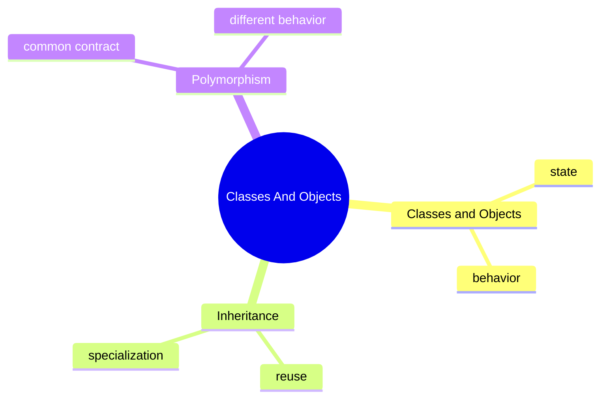

## Core Ideas

### Classes And Objects

- a class is the blueprint
- an object is the working instance
- fields describe state
- methods describe behavior

### Inheritance

- inheritance models an `is-a` relationship
- it is useful when a child type is a specialized version of a parent type
- it becomes harmful when used only to reuse code mechanically

### Polymorphism

- polymorphism lets one contract support many implementations
- it is useful when the caller should not care about the exact subtype

## Real Problems This Chapter Solves

- how to model a student, product, or notification in code
- how to avoid copy-paste behavior across similar types
- how to write code that depends on abstractions instead of concrete classes

## Compare With

- class vs object:
  a class defines the shape, an object is one real instance
- inheritance vs composition:
  inheritance specializes a parent, composition builds behavior from parts
- compile-time type vs runtime type:
  the reference type and the real object type are not always the same

## Deep Dive

The main danger in OOP is not syntax.
It is modeling the wrong relationship.

Good design questions:

- is this really an `is-a` relationship?
- should this caller know the exact subtype?
- is behavior attached to the correct object?
- would composition make this easier to change later?

This is where beginners and experienced engineers both benefit from slowing down.

## Mini Case Study

Imagine a notification system.

- a base notification contract defines `send()`
- email, SMS, and push notifications implement it differently
- the caller only knows it is sending a notification

That is a small but real example of polymorphism helping design.

## OCJP Focus

- reference type and object type can differ
- overridden methods are chosen at runtime
- hidden fields do not behave like overridden methods
- constructor chaining rules matter

## Interview Focus

Q: When is inheritance a bad choice?  
A: When the relationship is only code reuse and not true specialization.

Q: Why is polymorphism useful in production code?  
A: It reduces coupling by letting callers depend on behavior contracts instead of concrete implementations.

Q: What is the difference between composition and inheritance?  
A: Composition builds behavior from collaborating objects, while inheritance reuses and specializes a parent type.

## Quick Quiz

1. What is the difference between a class and an object?
2. Why is overriding resolved differently from field access?
3. When would composition be safer than inheritance?

## Effective Java Mapping

- Item 18: Favor composition over inheritance
- Item 19: Design and document for inheritance or else prohibit it
- Item 20: Prefer interfaces to abstract classes
- Item 23: Prefer class hierarchies to tagged classes

## Sources

- Effective Java, 3rd Edition: https://www.informit.com/store/effective-java-9780134686042
- Core Java, Volume I: https://www.informit.com/store/core-java-volume-i-fundamentals-9780135558577
- Java Language Specification: https://docs.oracle.com/javase/specs/
- Java API documentation: https://docs.oracle.com/en/java/

#### Revision

## Before Revision

- rerun `RunAllTopics.java`
- compare the actual output with the expected output comments in each topic file
- explain the chapter in your own words before reading this sheet

## Five Key Ideas

- understand the core idea behind Classes Objects
- understand how Inheritance changes code behavior or design choice
- know when Polymorphism is useful in real code
- know the common confusion around Inheritance
- be able to explain the tradeoff behind Polymorphism

## Three Mistakes To Avoid

- memorizing syntax without checking why the output appears
- using this chapter's idea where a simpler option would be clearer
- ignoring naming, input, output, and side-effect clarity

## Three Interview Questions

1. What real problem does Classes And Objects solve?
2. When would you avoid a heavier approach and choose a simpler one instead?
3. Which example in this chapter is most useful in production code, and why?

## Three OCJP Checks

1. Can you predict the output of the main runnable example without executing it?
2. Can you explain which behavior is compile-time and which is runtime?
3. Can you name one edge case that could confuse a learner in this chapter?

## After Reading This Chapter, You Should Know

- what this chapter is trying to solve
- which Java tool or pattern expresses that idea
- what common mistake to avoid
- how to explain the idea in plain English

## Collections

Current chapters:

- `ch01_collections`

## Before You Start

- Prerequisites: sec01_fundamentals.
- This section prepares you for: Streams, DSA, clean code, and many interview questions.
- Suggested pace: 2 to 3 focused sessions.

## How To Read This Section

- run the topic files before trying to memorize names
- compare the printed output with the explanation in each topic
- finish the chapter with its revision sheet before moving on

## Why This Section Matters

Streams, DSA, clean code, and many interview questions.

## Recommended Next Step

Move to sec03_generics, sec04_streams_and_functional_style, or sec20_data_structures_and_complexity.

### Collections

This chapter is written for a college fresher.

You should be able to run the files, read the output, and understand why the output appears.

## Beginner Focus

- know the difference between `List`, `Set`, and `Map`
- understand when duplicate values are allowed
- understand why immutable collections are safer
- understand how a comparator changes sorting rules

## Study Order

1. Run [ListSetMap.java](/Users/indiadelhi/repo/career/java-missing-tutorial/code/src/main/java/com/learning/javamissing/sec02_collections/ch01_collections/topics/list_set_map/ListSetMap.java)
2. Run [Immutability.java](/Users/indiadelhi/repo/career/java-missing-tutorial/code/src/main/java/com/learning/javamissing/sec02_collections/ch01_collections/topics/immutability/Immutability.java)
3. Run [Comparator.java](/Users/indiadelhi/repo/career/java-missing-tutorial/code/src/main/java/com/learning/javamissing/sec02_collections/ch01_collections/topics/comparator/Comparator.java)

## Visual Map

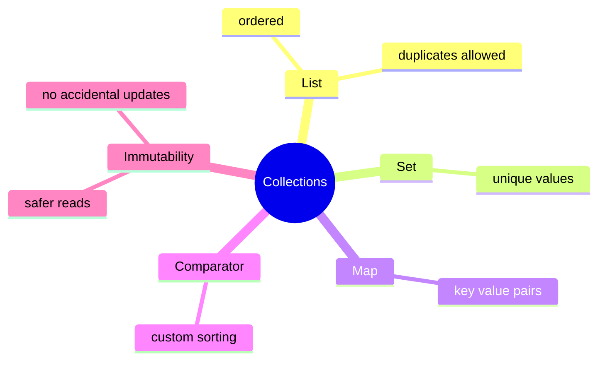

## Quick Summary

### List, Set, Map

- `List` keeps order and allows duplicates
- `Set` keeps unique values
- `Map` stores data as `key -> value`

### Immutability

- immutable collections cannot be changed after creation
- they reduce accidental bugs

### Comparator

- a comparator tells Java how to sort objects
- it is useful when one object can be sorted in different ways

## Compare With

| Compare | Prefer Left When | Prefer Right When |
| --- | --- | --- |
| `List` vs `Set` | order and duplicates matter | uniqueness matters more than duplicates |
| mutable vs immutable collection | the same owner must keep updating data | callers should not accidentally change shared data |
| built-in order vs comparator | one natural order is enough everywhere | sorting rules change by use case |

## Senior Engineer Lens

- the collection type is part of the API contract, not just a storage detail
- immutability reduces defensive coding and makes concurrent reading safer
- comparator design affects correctness, reproducibility, and sometimes cache or query behavior
- choosing the wrong collection leaks as both readability and performance debt

## Decision Chart

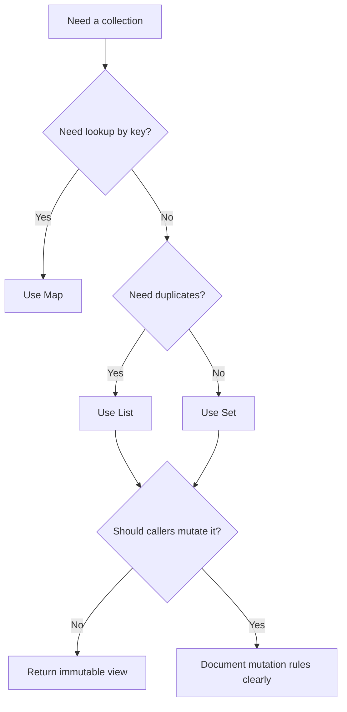

## Mini Case Study

Imagine a shopping app.

- `List` keeps products in cart order
- `Set` keeps unique coupon codes
- `Map` stores product id to quantity
- `Comparator` sorts products by price or name
- immutable collections protect a final order summary

## When To Use

- use `List` when order matters
- use `Set` when duplicates should not exist
- use `Map` when you need lookup by key
- use `Comparator` when sorting rules must be explicit

## When Not To Use

- do not use `Set` if duplicates are meaningful
- do not use `Map` if you only need plain ordered values
- do not use mutable collections if shared code should not update them

## OCJP Focus

- know which collections allow duplicates
- know that immutable collections throw exceptions on modification
- know how comparator-based sorting changes result order

## Interview Focus

Q: When would you choose a `Set` over a `List`?  
A: When uniqueness is more important than duplicates or index-based access.

Q: Why are immutable collections useful?  
A: They protect shared data from accidental modification.

Q: Why use a comparator?  
A: Because the same object may need different sorting rules in different situations.

## Quick Quiz

1. Which collection type allows duplicates and keeps order?
2. What happens if you call `add()` on `List.of(...)`?
3. When is a comparator better than changing the class itself?

## Effective Java Mapping

- Item 17: Minimize mutability
- Item 50: Make defensive copies when needed
- Item 58: Prefer for-each loops to traditional for loops
- Item 61: Prefer primitive types to boxed primitives

## Sources

- Core Java, Volume I: https://www.informit.com/store/core-java-volume-i-fundamentals-9780135558577
- Effective Java, 3rd Edition: https://www.informit.com/store/effective-java-9780134686042
- Java API documentation: https://docs.oracle.com/en/java/

#### Revision

## Before Revision

- rerun `RunAllTopics.java`
- compare the actual output with the expected output comments in each topic file
- explain the chapter in your own words before reading this sheet

## Five Key Ideas

- understand the core idea behind Comparator
- understand how Immutability changes code behavior or design choice
- know when List Set Map is useful in real code
- know the common confusion around Immutability
- be able to explain the tradeoff behind List Set Map

## Three Mistakes To Avoid

- memorizing syntax without checking why the output appears
- using this chapter's idea where a simpler option would be clearer
- ignoring naming, input, output, and side-effect clarity

## Three Interview Questions

1. What real problem does Collections solve?
2. When would you avoid a heavier approach and choose a simpler one instead?
3. Which example in this chapter is most useful in production code, and why?

## Three OCJP Checks

1. Can you predict the output of the main runnable example without executing it?
2. Can you explain which behavior is compile-time and which is runtime?
3. Can you name one edge case that could confuse a learner in this chapter?

## After Reading This Chapter, You Should Know

- what this chapter is trying to solve
- which Java tool or pattern expresses that idea
- what common mistake to avoid
- how to explain the idea in plain English

## Generics

Current chapters:

- `ch01_generics`

## Before You Start

- Prerequisites: sec01_fundamentals and basic collections awareness.
- This section prepares you for: Streams, APIs, framework code, and interview reasoning about type safety.
- Suggested pace: 2 to 3 focused sessions.

## How To Read This Section

- run the topic files before trying to memorize names
- compare the printed output with the explanation in each topic
- finish the chapter with its revision sheet before moving on

## Why This Section Matters

Streams, APIs, framework code, and interview reasoning about type safety.

## Recommended Next Step

Move to sec04_streams_and_functional_style or revisit collections APIs with stronger type understanding.

### Generics

This chapter teaches how Java reuses one design safely across many types.

Beginner-friendly promise: this chapter is written so a college fresher can read the guide, run the code, and understand the output step by step.

## Why This Chapter Exists

Without generics, reusable code becomes unsafe:

- you store the wrong type
- you cast too often
- errors move from compile time to runtime

Generics solve the problem of reuse with type safety.

## Deep-Dive Promise

This chapter does not stop at syntax.
It explains:

- what the compiler checks
- what survives at runtime
- why API flexibility becomes hard
- why wildcards confuse so many learners

## Study Order

1. Run [GenericType.java](/Users/indiadelhi/repo/career/java-missing-tutorial/code/src/main/java/com/learning/javamissing/sec03_generics/ch01_generics/topics/generic_type/GenericType.java)
2. Run [Bounds.java](/Users/indiadelhi/repo/career/java-missing-tutorial/code/src/main/java/com/learning/javamissing/sec03_generics/ch01_generics/topics/bounds/Bounds.java)
3. Run [Wildcards.java](/Users/indiadelhi/repo/career/java-missing-tutorial/code/src/main/java/com/learning/javamissing/sec03_generics/ch01_generics/topics/wildcards/Wildcards.java)
4. Revisit this guide for traps, interview angles, and the deeper mental model.

## Concept Map

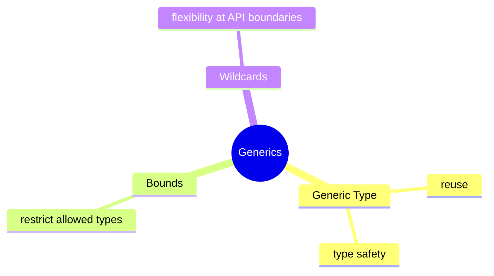

## Core Ideas

### Generic Type

- one class or method can work for many types
- the compiler still checks correctness

### Bounds

- bounds say which kinds of types are allowed
- they are useful when reusable code still needs specific capabilities

### Wildcards

- wildcards make APIs more flexible
- they are useful when exact type parameters are not the main point of the caller

## Real Problems This Chapter Solves

- how to build a reusable container without losing type safety
- how to restrict an API to numbers, comparable values, or some other capability
- how to accept a wider range of collections safely in reusable methods

## Compare With

| Compare | Prefer Left When | Prefer Right When |
| --- | --- | --- |
| raw type vs generic type | almost never in modern code | you want compile-time type safety |
| exact type parameter vs wildcard | the API both reads and writes one exact type | the API boundary should accept a wider related family |
| unbounded vs bounded generic | behavior does not depend on capabilities | behavior needs a guarantee such as `Number` or `Comparable` |

## Deep Dive

Generics are mainly about API design, not syntax.

The real questions are:

- where should the type parameter live?
- should this method consume values, produce values, or both?
- is this API too rigid or too vague?

This is why generics become hard for many learners.
They are easy to read as symbols and hard to understand as design choices.

## What The Compiler Checks

- whether the type arguments match the declaration
- whether a bound is respected
- whether a value can be safely assigned without an explicit cast

## What Happens At Runtime

- most generic type information is erased
- the JVM does not keep full generic detail for ordinary object instances
- this is why `List<String>` and `List<Integer>` do not stay fully distinct at runtime in the same way they are at compile time

## Wrong Mental Model

- “generics are only fancy syntax”
- “wildcards are random symbols to memorize”
- “runtime knows every generic detail”

## Right Mental Model

- generics are compile-time contracts for reusable APIs
- bounds describe capability requirements
- wildcards are about flexibility at method boundaries
- type erasure explains many generic restrictions

## Mental Model

Use this simple rule:

- if your code only needs “some type”, use a generic type parameter
- if your code needs “some subtype of X”, use an upper bound
- if your API should accept a range of related types, think about wildcards

## Mini Case Study

Imagine a reporting system.

- one report box may hold `StudentReport`
- another may hold `SalesReport`
- both should use the same reusable container design

That is the everyday value of generics: reuse without unsafe casting.

## When To Use

- use a generic type when one abstraction should safely support many data types
- use bounds when behavior depends on a capability such as being numeric or comparable
- use wildcards when callers should not be forced into one exact type argument

## When Not To Use

- do not use raw types in normal modern code
- do not add type parameters only for style
- do not make APIs so generic that the business meaning disappears

## OCJP Focus

- type erasure affects runtime behavior
- raw types compile but lose safety
- `? extends` and `? super` are common exam traps
- the compiler, not the JVM, enforces most generic checks

## Interview Focus

Q: Why are generics important in production code?  
A: They let reusable APIs stay type-safe and reduce casts and runtime failures.

Q: When would you use a bound?  
A: When reusable code still needs a guarantee about the capabilities of the type.

Q: Why do wildcards confuse people?  
A: Because they are about API flexibility, not only about syntax.

## Quick Quiz

1. Why are raw types risky?
2. What problem does an upper bound solve?
3. When is a wildcard more useful than an exact type parameter?

## Effective Java Mapping

- Item 26: Don’t use raw types
- Item 28: Prefer lists to arrays
- Item 29: Favor generic types
- Item 30: Favor generic methods
- Item 31: Use bounded wildcards to increase API flexibility

## Sources

- Effective Java, 3rd Edition: https://www.informit.com/store/effective-java-9780134686042
- Core Java, Volume I: https://www.informit.com/store/core-java-volume-i-fundamentals-9780135558577
- Java Language Specification: https://docs.oracle.com/javase/specs/
- Java API documentation: https://docs.oracle.com/en/java/

#### Revision

## Before Revision

- rerun `RunAllTopics.java`
- compare the actual output with the expected output comments in each topic file
- explain the chapter in your own words before reading this sheet

## Five Key Ideas

- understand the core idea behind Bounds
- understand how Generic Type changes code behavior or design choice
- know when Wildcards is useful in real code
- know the common confusion around Generic Type
- be able to explain the tradeoff behind Wildcards

## Three Mistakes To Avoid

- memorizing syntax without checking why the output appears
- using this chapter's idea where a simpler option would be clearer
- ignoring naming, input, output, and side-effect clarity

## Three Interview Questions

1. What real problem does Generics solve?
2. When would you avoid a heavier approach and choose a simpler one instead?
3. Which example in this chapter is most useful in production code, and why?

## Three OCJP Checks

1. Can you predict the output of the main runnable example without executing it?
2. Can you explain which behavior is compile-time and which is runtime?
3. Can you name one edge case that could confuse a learner in this chapter?

## After Reading This Chapter, You Should Know

- what this chapter is trying to solve
- which Java tool or pattern expresses that idea
- what common mistake to avoid
- how to explain the idea in plain English

## Streams And Functional Style

This section is about one broad problem: turning raw data into useful answers without burying the business intent.

## What Real Problems This Section Solves

- a list of orders must be filtered down to only the ones that matter
- raw rows must become names, totals, grouped maps, or summaries
- the same filtering and mapping logic should stay readable as rules grow
- business code should describe transformation intent, not only loops and temporary variables

## Start Here If

- loops feel easier than streams, but you want to know when streams actually help
- collectors still feel like syntax instead of a problem-solving tool
- lambdas and functional interfaces feel related, but not yet connected

## How To Read This Section

- start with the problem story before the API name
- run the smallest example first
- compare the printed output with the business rule it represents
- ask whether a loop, stream, or collector makes the intent clearer
- revisit collections and generics if a pipeline feels unclear

## Current Chapters

- `ch01_streams`
- `ch02_functional_interfaces`
- `ch03_data_filtering_and_mapping`
- `ch04_data_grouping_and_aggregation`

## Reading Order

- begin with `ch01_streams` to understand the pipeline model
- continue to `ch02_functional_interfaces` so behavior-as-data stops feeling magical
- then study `ch03_data_filtering_and_mapping` where streams start to look like business logic
- end with `ch04_data_grouping_and_aggregation` where collectors and summaries become practical

## Common Mistakes

- using streams for tiny logic that a loop explains better
- mutating external state inside pipelines
- treating collectors as memorization instead of asking what final result is needed
- choosing parallel streams before measuring or understanding side effects

## Recommended Next Step

Move to sec16_core_data_time_and_text for more real business data handling, or to sec19_testing_and_quality to test transformation logic cleanly.

### Streams

This chapter answers one question first: when is a stream a clearer way to express data work than a loop?

## The Problem

Business code often needs to:

- keep only the matching records
- reshape those records into another form
- group or summarize the result

If the code is really “take data, transform it, produce an answer,” streams can be clearer than manual loops. If the code is stateful or awkward in a pipeline, a loop is usually better.

## Run This First

1. Run [StreamPipeline.java](/Users/indiadelhi/repo/career/java-missing-tutorial/code/src/main/java/com/learning/javamissing/sec04_streams_and_functional_style/ch01_streams/topics/stream_pipeline/StreamPipeline.java)
2. Run [Collectors.java](/Users/indiadelhi/repo/career/java-missing-tutorial/code/src/main/java/com/learning/javamissing/sec04_streams_and_functional_style/ch01_streams/topics/collectors/Collectors.java)
3. Run [ParallelStreams.java](/Users/indiadelhi/repo/career/java-missing-tutorial/code/src/main/java/com/learning/javamissing/sec04_streams_and_functional_style/ch01_streams/topics/parallel_streams/ParallelStreams.java)

## What To Look For

- a stream pipeline reads like a chain of data steps
- collectors define the final shape of the answer
- parallel streams are a performance decision, not a style upgrade

## Use This Chapter When

- the work is mostly filtering, mapping, grouping, or counting
- you want the transformation steps to read directly in the code
- the final result is a list, set, map, summary, or joined string

## Avoid This Approach When

- a simple loop is shorter and clearer
- the logic depends on mutation or complicated state across steps
- you are thinking about parallel before understanding the sequential version

## Common Confusion

- streams do not execute until a terminal operation runs
- `groupingBy` and `toMap` do not solve the same problem
- parallel streams can give correct output and still be the wrong choice

## Next Chapter

Move to `ch02_functional_interfaces` so passing behavior into stream-style code stops feeling abstract.

## Sources

- Modern Java in Action: https://www.manning.com/books/modern-java-in-action
- Core Java, Volume II: https://www.informit.com/store/core-java-volume-ii-advanced-features-9780135558690
- Effective Java, 3rd Edition: https://www.informit.com/store/effective-java-9780134686042

#### Revision

## Before Revision

- rerun `RunAllTopics.java`
- compare the actual output with the expected output comments in each topic file
- explain the chapter in your own words before reading this sheet

## Five Key Ideas

- understand the core idea behind Collectors
- understand how Parallel Streams changes code behavior or design choice
- know when Stream Pipeline is useful in real code
- know the common confusion around Parallel Streams
- be able to explain the tradeoff behind Stream Pipeline

## Three Mistakes To Avoid

- memorizing syntax without checking why the output appears
- using this chapter's idea where a simpler option would be clearer
- ignoring naming, input, output, and side-effect clarity

## Three Interview Questions

1. What real problem does Streams solve?
2. When would you avoid a heavier approach and choose a simpler one instead?
3. Which example in this chapter is most useful in production code, and why?

## Three OCJP Checks

1. Can you predict the output of the main runnable example without executing it?
2. Can you explain which behavior is compile-time and which is runtime?
3. Can you name one edge case that could confuse a learner in this chapter?

## After Reading This Chapter, You Should Know

- what this chapter is trying to solve
- which Java tool or pattern expresses that idea
- what common mistake to avoid
- how to explain the idea in plain English

### Functional Interfaces

This chapter exists because stream-style Java only feels natural once “passing behavior as data” stops feeling strange.

## The Problem

Sometimes the important thing is not just the data. It is the rule:

- how to price
- how to validate
- how to transform

If a rule should be supplied from outside, Java needs a way to pass that rule around. Functional interfaces are that shape.

## Run This First

1. Run [DefiningFunctions.java](/Users/indiadelhi/repo/career/java-missing-tutorial/code/src/main/java/com/learning/javamissing/sec04_streams_and_functional_style/ch02_functional_interfaces/topics/defining_functions/DefiningFunctions.java)

## What To Look For

- one abstract method defines one action shape
- different lambdas can satisfy that shape
- code becomes more reusable when the rule is passed in instead of hard-coded

## Use This Chapter When

- one workflow should support changing rules
- you want to understand the bridge between lambdas and real business code
- stream operations like `map`, `filter`, and `reduce` still feel too magical

## Avoid Overcomplicating It When

- one small private method is enough
- the behavior is not really meant to vary
- introducing a functional interface makes the code harder to explain than before

## Next Chapter

Move to `ch03_data_filtering_and_mapping` to see behavior-passing used in actual transformation problems.

#### Revision

## Before Revision

- rerun `RunAllTopics.java`
- compare the actual output with the expected output comments in each topic file
- explain the chapter in your own words before reading this sheet

## Five Key Ideas

- understand the core idea behind Defining Functions
- understand how Defining Functions changes code behavior or design choice
- know when Defining Functions is useful in real code
- know the common confusion around Defining Functions
- be able to explain the tradeoff behind Defining Functions

## Three Mistakes To Avoid

- memorizing syntax without checking why the output appears
- using this chapter's idea where a simpler option would be clearer
- ignoring naming, input, output, and side-effect clarity

## Three Interview Questions

1. What real problem does Functional Interfaces solve?
2. When would you avoid a heavier approach and choose a simpler one instead?
3. Which example in this chapter is most useful in production code, and why?

## Three OCJP Checks

1. Can you predict the output of the main runnable example without executing it?
2. Can you explain which behavior is compile-time and which is runtime?
3. Can you name one edge case that could confuse a learner in this chapter?

## After Reading This Chapter, You Should Know

- what this chapter is trying to solve
- which Java tool or pattern expresses that idea
- what common mistake to avoid
- how to explain the idea in plain English

### Data Filtering And Mapping

This chapter is about the most common transformation job in business code: keep the records you need, then reshape them into the result the caller actually wants.

## The Problem

Raw input is rarely the final answer.

You usually need to:

- remove the rows that do not matter
- keep only the fields you care about
- return a simpler result than the original data model

That is filtering plus mapping.

## Run This First

1. Run [FilteringOrders.java](/Users/indiadelhi/repo/career/java-missing-tutorial/code/src/main/java/com/learning/javamissing/sec04_streams_and_functional_style/ch03_data_filtering_and_mapping/topics/filtering_orders/FilteringOrders.java)

## What To Look For

- filter decides what stays
- map decides what shape the result takes
- the final answer should match the business need, not the original input structure

## Use This Chapter When

- you have raw records and need a smaller answer
- the result type should be simpler than the input type
- you want transformation code to read like a business rule

## Avoid This Approach When

- the transformation is stateful and clearer with a loop
- you are filtering and mapping so aggressively that the pipeline becomes harder to read than plain code

## Next Chapter

Move to `ch04_data_grouping_and_aggregation` when you no longer need a flat result and instead need grouped summaries or totals.

#### Revision

## Before Revision

- rerun `RunAllTopics.java`
- compare the actual output with the expected output comments in each topic file
- explain the chapter in your own words before reading this sheet

## Five Key Ideas

- understand the core idea behind Filtering Orders
- understand how Filtering Orders changes code behavior or design choice
- know when Filtering Orders is useful in real code
- know the common confusion around Filtering Orders
- be able to explain the tradeoff behind Filtering Orders

## Three Mistakes To Avoid

- memorizing syntax without checking why the output appears
- using this chapter's idea where a simpler option would be clearer
- ignoring naming, input, output, and side-effect clarity

## Three Interview Questions

1. What real problem does Data Filtering And Mapping solve?
2. When would you avoid a heavier approach and choose a simpler one instead?
3. Which example in this chapter is most useful in production code, and why?

## Three OCJP Checks

1. Can you predict the output of the main runnable example without executing it?
2. Can you explain which behavior is compile-time and which is runtime?
3. Can you name one edge case that could confuse a learner in this chapter?

## After Reading This Chapter, You Should Know

- what this chapter is trying to solve
- which Java tool or pattern expresses that idea
- what common mistake to avoid
- how to explain the idea in plain English

### Data Grouping And Aggregation

This chapter is about moving from raw rows to business answers like totals, counts, grouped maps, and summaries.

## The Problem

Decision-makers rarely want:

- every row exactly as stored

They usually want:

- sales by category
- total revenue by region
- pass/fail buckets
- counts by status

That means grouping and aggregation.

## Run This First

1. Run [GroupingSales.java](/Users/indiadelhi/repo/career/java-missing-tutorial/code/src/main/java/com/learning/javamissing/sec04_streams_and_functional_style/ch04_data_grouping_and_aggregation/topics/grouping_sales/GroupingSales.java)

## What To Look For

- the grouping key answers “by what dimension?”
- the aggregation answers “what final fact do we want?”
- collectors make the shape of the final result explicit

## Use This Chapter When

- you need maps of grouped values
- you need totals, counts, or summaries from many rows
- the business question starts with “by category,” “by status,” or “by region”

## Avoid This Approach When

- the result does not need grouping at all
- the pipeline becomes more complex than a direct loop for a tiny dataset

## Next Step

Go back to `ch01_streams` after this chapter. Collectors usually become much easier once grouping and aggregation feel like real business questions instead of syntax.

#### Revision

## Before Revision

- rerun `RunAllTopics.java`
- compare the actual output with the expected output comments in each topic file
- explain the chapter in your own words before reading this sheet

## Five Key Ideas

- understand the core idea behind Grouping Sales
- understand how Grouping Sales changes code behavior or design choice
- know when Grouping Sales is useful in real code
- know the common confusion around Grouping Sales
- be able to explain the tradeoff behind Grouping Sales

## Three Mistakes To Avoid

- memorizing syntax without checking why the output appears
- using this chapter's idea where a simpler option would be clearer
- ignoring naming, input, output, and side-effect clarity

## Three Interview Questions

1. What real problem does Data Grouping And Aggregation solve?
2. When would you avoid a heavier approach and choose a simpler one instead?
3. Which example in this chapter is most useful in production code, and why?

## Three OCJP Checks

1. Can you predict the output of the main runnable example without executing it?
2. Can you explain which behavior is compile-time and which is runtime?
3. Can you name one edge case that could confuse a learner in this chapter?

## After Reading This Chapter, You Should Know

- what this chapter is trying to solve
- which Java tool or pattern expresses that idea
- what common mistake to avoid
- how to explain the idea in plain English

## Multithreading And Concurrency

This section is about one hard reality: once work overlaps in time, correctness becomes harder than syntax.

## What Real Problems This Section Solves

- a request waits on many slow operations at once
- two tasks update the same state and produce inconsistent answers
- background work needs a cleaner execution model than raw thread creation
- request context must flow safely without becoming global mutable state

## Start Here If

- threads and executors feel related but blurry
- you understand the syntax but not the ownership model
- concurrency still feels “advanced” because the bugs are hard to see

## How To Read This Section

- read the problem statement before the API name
- run the example and compare the output with the explanation
- ask who owns the task lifetime, who owns the shared state, and what should happen on failure
- do not move to virtual threads or structured concurrency until raw thread and synchronization ideas are clear

## Current Chapters

- `ch01_concurrency_basics`
- `ch02_virtual_threads`
- `ch03_structured_concurrency`
- `ch04_scoped_values`

## Reading Order

- start with `ch01_concurrency_basics` to understand raw threads, shared state, and executors
- continue to `ch02_virtual_threads` to see how the cost model changes for waiting-heavy workloads
- then study `ch03_structured_concurrency` so task lifetime and failure handling become explicit
- finish with `ch04_scoped_values` to learn how request-scoped context travels safely

## Common Mistakes

- treating concurrency as only “faster code”
- sharing mutable state without a safety model
- assuming virtual threads remove design problems
- scattering task management across unrelated code

## Recommended Next Step

Revisit sec20_data_structures_and_complexity after this section so performance reasoning and concurrency reasoning start reinforcing each other.

### Concurrency Basics

This chapter exists for one reason: before virtual threads or modern APIs make sense, you need to understand what goes wrong when work overlaps in time.

## The Problem

As soon as two tasks run concurrently, three things become important:

- how work starts
- how you wait for it
- what happens when both tasks touch the same mutable state

If that model is unclear, every later concurrency feature feels like extra syntax instead of clearer design.

## Run This First

1. Run [Threads.java](/Users/indiadelhi/repo/career/java-missing-tutorial/code/src/main/java/com/learning/javamissing/sec05_multithreading_and_concurrency/ch01_concurrency_basics/topics/threads/Threads.java)
2. Run [Synchronization.java](/Users/indiadelhi/repo/career/java-missing-tutorial/code/src/main/java/com/learning/javamissing/sec05_multithreading_and_concurrency/ch01_concurrency_basics/topics/synchronization/Synchronization.java)
3. Run [Executors.java](/Users/indiadelhi/repo/career/java-missing-tutorial/code/src/main/java/com/learning/javamissing/sec05_multithreading_and_concurrency/ch01_concurrency_basics/topics/executors/Executors.java)

## What To Look For

- `start()` and `run()` are not the same thing
- shared mutable state is where correctness starts to break
- executors improve structure by separating task submission from thread management

## Use This Chapter When

- you are new to Java concurrency
- concurrency still feels invisible or mysterious
- you need the foundation before learning virtual threads or structured concurrency

## Avoid Jumping Ahead When

- raw thread behavior is still unclear
- race conditions still feel theoretical instead of concrete

## Next Chapter

Move to `ch02_virtual_threads` after this chapter so you can compare “what a thread is” with “what changes when threads become much cheaper.”

#### Revision

## Before Revision

- rerun `RunAllTopics.java`
- compare the actual output with the expected output comments in each topic file
- explain the chapter in your own words before reading this sheet

## Five Key Ideas

- understand the core idea behind Executors
- understand how Synchronization changes code behavior or design choice
- know when Threads is useful in real code
- know the common confusion around Synchronization
- be able to explain the tradeoff behind Threads

## Three Mistakes To Avoid

- memorizing syntax without checking why the output appears
- using this chapter's idea where a simpler option would be clearer
- ignoring naming, input, output, and side-effect clarity

## Three Interview Questions

1. What real problem does Concurrency Basics solve?
2. When would you avoid a heavier approach and choose a simpler one instead?
3. Which example in this chapter is most useful in production code, and why?

## Three OCJP Checks

1. Can you predict the output of the main runnable example without executing it?
2. Can you explain which behavior is compile-time and which is runtime?
3. Can you name one edge case that could confuse a learner in this chapter?

## After Reading This Chapter, You Should Know

- what this chapter is trying to solve
- which Java tool or pattern expresses that idea
- what common mistake to avoid
- how to explain the idea in plain English

### Virtual Threads

This chapter is about one practical question: what changes when Java can afford a much cheaper thread-per-task model for waiting-heavy work?

## The Problem

Traditional platform threads become expensive when you need huge numbers of tasks that mostly wait:

- remote service calls
- database waits
- socket waits
- file waits

Virtual threads help when the work is mostly waiting. They do not repair bad locking, CPU-heavy algorithms, or poor resource design.

## Run This First

1. Run [WhyVirtualThreadsMatter.java](/Users/indiadelhi/repo/career/java-missing-tutorial/code/src/main/java/com/learning/javamissing/sec05_multithreading_and_concurrency/ch02_virtual_threads/topics/why_virtual_threads_matter/WhyVirtualThreadsMatter.java)
2. Run [RunningTasksWithVirtualThreadExecutor.java](/Users/indiadelhi/repo/career/java-missing-tutorial/code/src/main/java/com/learning/javamissing/sec05_multithreading_and_concurrency/ch02_virtual_threads/topics/running_tasks_with_virtual_thread_executor/RunningTasksWithVirtualThreadExecutor.java)
3. Run [AvoidingVirtualThreadMisuse.java](/Users/indiadelhi/repo/career/java-missing-tutorial/code/src/main/java/com/learning/javamissing/sec05_multithreading_and_concurrency/ch02_virtual_threads/topics/avoiding_virtual_thread_misuse/AvoidingVirtualThreadMisuse.java)

## What To Look For

- a virtual thread is still a `Thread`
- the coding style can stay direct and blocking
- the main win is the cost model for waiting-heavy tasks
- poor locking and poor design still hurt

## Use This Chapter When

- you are handling many blocking tasks
- callback-heavy code is hurting readability
- you want a clearer request-per-task style

## Avoid Wrong Expectations

- virtual threads are not “automatic performance mode”
- they do not make CPU-bound work faster
- they do not justify long blocking inside synchronized code

## Next Chapter

Move to `ch03_structured_concurrency` to see how related tasks should be owned, awaited, and cancelled together instead of just started cheaply.

#### Revision

## Before Revision

- rerun `RunAllTopics.java`
- compare the actual output with the expected output comments in each topic file
- explain the chapter in your own words before reading this sheet

## Five Key Ideas

- understand the core idea behind Avoiding Virtual Thread Misuse
- understand how Running Tasks With Virtual Thread Executor changes code behavior or design choice
- know when Why Virtual Threads Matter is useful in real code
- know the common confusion around Running Tasks With Virtual Thread Executor
- be able to explain the tradeoff behind Why Virtual Threads Matter

## Three Mistakes To Avoid

- memorizing syntax without checking why the output appears
- using this chapter's idea where a simpler option would be clearer
- ignoring naming, input, output, and side-effect clarity

## Three Interview Questions

1. What real problem does Virtual Threads solve?
2. When would you avoid a heavier approach and choose a simpler one instead?
3. Which example in this chapter is most useful in production code, and why?

## Three OCJP Checks

1. Can you predict the output of the main runnable example without executing it?
2. Can you explain which behavior is compile-time and which is runtime?
3. Can you name one edge case that could confuse a learner in this chapter?

## After Reading This Chapter, You Should Know

- what this chapter is trying to solve
- which Java tool or pattern expresses that idea
- what common mistake to avoid
- how to explain the idea in plain English

### Structured Concurrency

This chapter teaches a design idea first: related tasks should live and die together.

## The Problem

Many request flows need multiple subtasks:

- fetch user profile
- fetch plan
- fetch recommendations

If those tasks are scattered across futures and helpers, they can outlive the request, fail independently, or keep running after their result is no longer useful. Structured concurrency keeps them inside one parent scope.

## Run This First

1. Run [KeepingChildTasksInsideOneRequest.java](/Users/indiadelhi/repo/career/java-missing-tutorial/code/src/main/java/com/learning/javamissing/sec05_multithreading_and_concurrency/ch03_structured_concurrency/topics/keeping_child_tasks_inside_one_request/KeepingChildTasksInsideOneRequest.java)
2. Run [CollectingResultsFromChildTasks.java](/Users/indiadelhi/repo/career/java-missing-tutorial/code/src/main/java/com/learning/javamissing/sec05_multithreading_and_concurrency/ch03_structured_concurrency/topics/collecting_results_from_child_tasks/CollectingResultsFromChildTasks.java)
3. Run [ChoosingFirstSuccessfulResult.java](/Users/indiadelhi/repo/career/java-missing-tutorial/code/src/main/java/com/learning/javamissing/sec05_multithreading_and_concurrency/ch03_structured_concurrency/topics/choosing_first_successful_result/ChoosingFirstSuccessfulResult.java)

## What To Look For

- task lifetime belongs to the parent operation
- “need all results” and “need first success” are different business decisions
- cancellation and failure policy should be explicit where tasks are launched

## Use This Chapter When

- several tasks belong to one request or workflow
- task cancellation should follow request cancellation
- failure handling should stay local and readable

## Avoid This Approach When

- tasks are truly independent long-lived jobs
- you are not ready to track JDK preview changes for this API

## Version Note

These examples use the Java 25 preview form of `StructuredTaskScope`. Match the JDK and preview flags when you run them.

## Next Chapter

Move to `ch04_scoped_values` to see how request-scoped context can travel safely through the same kind of structured execution tree.

#### Revision

## Before Revision

- rerun `RunAllTopics.java`
- compare the actual output with the expected output comments in each topic file
- explain the chapter in your own words before reading this sheet

## Five Key Ideas

- understand the core idea behind Choosing First Successful Result
- understand how Collecting Results From Child Tasks changes code behavior or design choice
- know when Keeping Child Tasks Inside One Request is useful in real code
- know the common confusion around Collecting Results From Child Tasks
- be able to explain the tradeoff behind Keeping Child Tasks Inside One Request

## Three Mistakes To Avoid

- memorizing syntax without checking why the output appears
- using this chapter's idea where a simpler option would be clearer
- ignoring naming, input, output, and side-effect clarity

## Three Interview Questions

1. What real problem does Structured Concurrency solve?
2. When would you avoid a heavier approach and choose a simpler one instead?
3. Which example in this chapter is most useful in production code, and why?

## Three OCJP Checks

1. Can you predict the output of the main runnable example without executing it?
2. Can you explain which behavior is compile-time and which is runtime?
3. Can you name one edge case that could confuse a learner in this chapter?

## After Reading This Chapter, You Should Know

- what this chapter is trying to solve
- which Java tool or pattern expresses that idea
- what common mistake to avoid
- how to explain the idea in plain English

### Scoped Values

This chapter is about one narrow but useful problem: some context belongs to one operation and should be readable through many nested calls without becoming global mutable state.

## The Problem

Real systems often need request-scoped metadata:

- request id
- current user
- tenant id
- trace id

Passing that through every method can become noisy. Mutable thread-local state can leak. Scoped values give a bounded context mechanism.

## Run This First

1. Run [IntroducingScopedValues.java](/Users/indiadelhi/repo/career/java-missing-tutorial/code/src/main/java/com/learning/javamissing/sec05_multithreading_and_concurrency/ch04_scoped_values/topics/introducing_scoped_values/IntroducingScopedValues.java)
2. Run [BindingRequestContext.java](/Users/indiadelhi/repo/career/java-missing-tutorial/code/src/main/java/com/learning/javamissing/sec05_multithreading_and_concurrency/ch04_scoped_values/topics/binding_request_context/BindingRequestContext.java)
3. Run [ScopedValuesVsThreadLocal.java](/Users/indiadelhi/repo/career/java-missing-tutorial/code/src/main/java/com/learning/javamissing/sec05_multithreading_and_concurrency/ch04_scoped_values/topics/scoped_values_vs_thread_local/ScopedValuesVsThreadLocal.java)

## What To Look For

- the bound value exists only inside one execution scope
- this is good for read-mostly request metadata
- ordinary business data should still be passed as normal parameters when that is clearer

## Use This Chapter When

- one request-level value must cross many layers
- you want a bounded context mechanism instead of mutable thread-local state
- virtual threads and structured tasks make request lifetime more important

## Avoid This Approach When

- the value is ordinary business data for one small call chain
- the state is mutable domain state
- you are not matching the correct JDK preview setup

## Next Step

Go back through the virtual-thread and structured-concurrency examples and notice how much easier they become to reason about when both task lifetime and context lifetime are explicit.

#### Revision

## Before Revision

- rerun `RunAllTopics.java`
- compare the actual output with the expected output comments in each topic file
- explain the chapter in your own words before reading this sheet

## Five Key Ideas

- understand the core idea behind Binding Request Context
- understand how Introducing Scoped Values changes code behavior or design choice
- know when Scoped Values Vs Thread Local is useful in real code
- know the common confusion around Introducing Scoped Values
- be able to explain the tradeoff behind Scoped Values Vs Thread Local

## Three Mistakes To Avoid

- memorizing syntax without checking why the output appears
- using this chapter's idea where a simpler option would be clearer
- ignoring naming, input, output, and side-effect clarity

## Three Interview Questions

1. What real problem does Scoped Values solve?
2. When would you avoid a heavier approach and choose a simpler one instead?
3. Which example in this chapter is most useful in production code, and why?

## Three OCJP Checks

1. Can you predict the output of the main runnable example without executing it?
2. Can you explain which behavior is compile-time and which is runtime?
3. Can you name one edge case that could confuse a learner in this chapter?

## After Reading This Chapter, You Should Know

- what this chapter is trying to solve
- which Java tool or pattern expresses that idea
- what common mistake to avoid
- how to explain the idea in plain English

## Design Patterns

This section treats design patterns as recurring pressure points in real systems, not as names to memorize.

## The Story

Most teams do not wake up and decide to "use a pattern".  
They feel pressure first:

- a checkout flow keeps growing new discount rules
- constructors stop telling a readable story
- a stable class needs logging or retries around it
- one event must notify many listeners
- request validation becomes one long unreadable method

Patterns matter only when that pressure keeps repeating.

## Start Here If

- you know the pattern names but still hesitate when asked where they help
- you have seen factories, builders, observers, and decorators in frameworks but want to understand the shape behind them
- you want examples that begin with a business problem instead of UML diagrams

## How To Read This Section

- read the story hook first
- run the topic file before reading the whole chapter guide
- ask what the "boring but direct" version would look like without the pattern
- keep only the pattern if it removes visible branching, coupling, or construction noise

## Pattern Lens

- strategy handles changing behavior
- factory and builder handle creation pressure
- adapter and decorator handle awkward boundaries
- observer and template method handle event flow and workflow shape
- chain of responsibility handles staged request processing

## Current Chapters

- `ch01_strategy_pattern`
- `ch02_creational_patterns`
- `ch03_structural_patterns`
- `ch04_behavioral_patterns`
- `ch05_request_routing_patterns`

## Watch Out

- a pattern should remove a real code smell, not decorate ordinary code with more classes
- if a simpler method is still easier to explain, keep the simpler method
- "enterprise-looking" code is not the same as better design

## What An Experienced Engineer Should Still Get From This Section

- clearer judgment about when patterns reduce change risk
- stronger language for design reviews
- better mapping between small examples and framework internals
- more confidence in rejecting unnecessary ceremony

## Recommended Next Step

Move to `sec18_architecture_and_integration` after this section so you can see how these small patterns show up again at system boundaries.

### Strategy Pattern

Strategy is the pattern you reach for when the workflow stays stable but one decision keeps changing.

## The Story

An online store starts with one discount rule.  
Then the business adds:

- festival discounts
- student discounts
- premium-member discounts
- region-specific rules

The dangerous move is to keep adding branches inside checkout.  
Checkout should run the purchase flow, not own every marketing rule.

## Run This First

1. Run [ChoosingBehaviorWithStrategy.java](/Users/indiadelhi/repo/career/java-missing-tutorial/code/src/main/java/com/learning/javamissing/sec06_design_patterns/ch01_strategy_pattern/topics/choosing_behavior_with_strategy/ChoosingBehaviorWithStrategy.java)
2. Notice that `applyDiscount()` does not change when you swap discount behavior
3. Imagine adding one more campaign without touching checkout flow

## What To Look For

- the stable workflow depends on an interface, not a concrete rule
- each rule gets its own focused implementation
- the design pressure is "changing behavior", not "creating more classes"

## Use This Pattern When

- one small part of the workflow changes often
- each rule should be tested independently
- callers should stop knowing every rule formula

## Avoid This Pattern When

- there are only one or two tiny stable cases
- a short method is still more readable than introducing new classes
- the rule will never vary separately from the workflow

## Compare With

| Compare | Use Left When | Use Right When |
| --- | --- | --- |
| `if/switch` | there are few stable cases | new rules will keep appearing |
| inheritance | the whole type meaning changes | only one behavior changes |
| enum branching | logic is tiny and static | rules need their own tests and growth path |

## Small Case Study

Think about a pricing engine used by checkout, order preview, and analytics.  
If discount logic lives inside checkout, those other flows will either duplicate it or call checkout for the wrong reason.  
Strategy keeps discount logic reusable and local.

## Interview Focus

Q: What problem does strategy solve?  
A: It isolates interchangeable behavior behind a contract so the caller stops growing branching logic.

Q: What is the most common misuse?  
A: Introducing strategy when the behavior is too small and stable to justify extra structure.

## Effective Java Mapping

- Item 18: Favor composition over inheritance
- Item 64: Refer to objects by their interfaces

## Sources

- Head First Design Patterns: https://www.oreilly.com/library/view/head-first-design/9781492077992/
- Effective Java, 3rd Edition: https://www.informit.com/store/effective-java-9780134686042

#### Revision

## Before Revision

- rerun `RunAllTopics.java`
- compare the actual output with the expected output comments in each topic file
- explain the chapter in your own words before reading this sheet

## Five Key Ideas

- understand the core idea behind Choosing Behavior With Strategy
- understand how Choosing Behavior With Strategy changes code behavior or design choice
- know when Choosing Behavior With Strategy is useful in real code
- know the common confusion around Choosing Behavior With Strategy
- be able to explain the tradeoff behind Choosing Behavior With Strategy

## Three Mistakes To Avoid

- memorizing syntax without checking why the output appears
- using this chapter's idea where a simpler option would be clearer
- ignoring naming, input, output, and side-effect clarity

## Three Interview Questions

1. What real problem does Strategy Pattern solve?
2. When would you avoid a heavier approach and choose a simpler one instead?
3. Which example in this chapter is most useful in production code, and why?

## Three OCJP Checks

1. Can you predict the output of the main runnable example without executing it?
2. Can you explain which behavior is compile-time and which is runtime?
3. Can you name one edge case that could confuse a learner in this chapter?

## After Reading This Chapter, You Should Know

- what this chapter is trying to solve
- which Java tool or pattern expresses that idea
- what common mistake to avoid
- how to explain the idea in plain English

### Creational Patterns

This chapter is about one question: how should object creation read once construction starts hiding business intent?

## The Story

Creation starts simple:

- call a constructor
- pass a few values
- move on

Then reality arrives:

- optional values start piling up
- callers should not know the concrete class
- validation needs to happen before the object is usable
- long constructor calls stop telling a readable story

That is where factory method and builder become useful.

## Run This First

1. Run [CreatingObjectsWithFactoryMethod.java](/Users/indiadelhi/repo/career/java-missing-tutorial/code/src/main/java/com/learning/javamissing/sec06_design_patterns/ch02_creational_patterns/topics/creating_objects_with_factory_method/CreatingObjectsWithFactoryMethod.java)
2. Run [AssemblingObjectsWithBuilder.java](/Users/indiadelhi/repo/career/java-missing-tutorial/code/src/main/java/com/learning/javamissing/sec06_design_patterns/ch02_creational_patterns/topics/assembling_objects_with_builder/AssemblingObjectsWithBuilder.java)
3. Ask which example hides implementation choice and which one improves call-site readability

## What To Look For

- factory hides *which type* gets created
- builder improves *how creation reads*
- constructors are still fine when the object is small and obvious

## Use This Pattern When

- use factory when callers should ask for behavior, not concrete classes
- use builder when optional inputs make constructors hard to read
- use plain constructors when the object is still tiny and direct

## Avoid This Pattern When

- avoid factory if there is no real selection logic
- avoid builder for tiny value objects with obvious parameters
- avoid any creational pattern that makes construction harder to follow than before

## Compare With

| Compare | Use Left When | Use Right When |
| --- | --- | --- |
| constructor vs factory | one concrete type is obvious | implementation choice should stay hidden |
| constructor vs builder | only a few required values exist | optional values and readability matter |
| factory vs builder | you need the right implementation | you already know the type but need readable assembly |

## Small Case Study

Imagine a reporting module.

- report type is required
- delivery email is optional
- charts are optional
- row limit is optional

Builder makes the call look like a checklist.  
Now imagine payment methods.  
The caller should ask for `"CARD"` or `"UPI"` behavior and not construct those classes directly. That is factory territory.

## Interview Focus

Q: When is a factory method better than a constructor?  
A: When the caller should depend on a capability while the implementation choice stays inside one creation point.

Q: When is a builder better than telescoping constructors?  
A: When many optional values make positional arguments unreadable and error-prone.

## Effective Java Mapping

- Item 1: Consider static factory methods instead of constructors
- Item 2: Consider a builder when faced with many constructor parameters

## Sources

- Effective Java, 3rd Edition: https://www.informit.com/store/effective-java-9780134686042
- Head First Design Patterns: https://www.oreilly.com/library/view/head-first-design/9781492077992/

#### Revision

## Before Revision

- rerun `RunAllTopics.java`
- compare the actual output with the expected output comments in each topic file
- explain the chapter in your own words before reading this sheet

## Five Key Ideas

- understand the core idea behind Assembling Objects With Builder
- understand how Creating Objects With Factory Method changes code behavior or design choice
- know when Assembling Objects With Builder is useful in real code
- know the common confusion around Creating Objects With Factory Method
- be able to explain the tradeoff behind Assembling Objects With Builder

## Three Mistakes To Avoid

- memorizing syntax without checking why the output appears
- using this chapter's idea where a simpler option would be clearer
- ignoring naming, input, output, and side-effect clarity

## Three Interview Questions

1. What real problem does Creational Patterns solve?
2. When would you avoid a heavier approach and choose a simpler one instead?
3. Which example in this chapter is most useful in production code, and why?

## Three OCJP Checks

1. Can you predict the output of the main runnable example without executing it?
2. Can you explain which behavior is compile-time and which is runtime?
3. Can you name one edge case that could confuse a learner in this chapter?

## After Reading This Chapter, You Should Know

- what this chapter is trying to solve
- which Java tool or pattern expresses that idea
- what common mistake to avoid
- how to explain the idea in plain English

### Structural Patterns

Structural patterns help when the business logic is mostly fine, but the edges between parts of the code are awkward.

## The Story

Two common frustrations show up in mature codebases:

- new code wants one interface, but a legacy library gives another
- a stable class needs extra behavior like logging, auditing, retries, or caching

The pain is not "what should the business rule be?"  
The pain is "how do these objects fit together cleanly?"

## Run This First

1. Run [TranslatingIncompatibleApisWithAdapter.java](/Users/indiadelhi/repo/career/java-missing-tutorial/code/src/main/java/com/learning/javamissing/sec06_design_patterns/ch03_structural_patterns/topics/translating_incompatible_apis_with_adapter/TranslatingIncompatibleApisWithAdapter.java)
2. Run [AddingFeaturesWithDecorator.java](/Users/indiadelhi/repo/career/java-missing-tutorial/code/src/main/java/com/learning/javamissing/sec06_design_patterns/ch03_structural_patterns/topics/adding_features_with_decorator/AddingFeaturesWithDecorator.java)
3. Ask whether the problem is interface mismatch or optional added behavior

## What To Look For

- adapter changes the shape of collaboration
- decorator preserves the interface and adds behavior around it
- both patterns are strongest near integration boundaries

## Use This Pattern When

- use adapter when you cannot or should not rewrite a dependency
- use decorator when you want optional behavior around a stable interface
- use these patterns when changing the original type would spread risk

## Avoid This Pattern When

- avoid adapter if you control both sides and can align the interface directly
- avoid decorator if the "extra behavior" is really a different service with a different responsibility
- avoid creating wrappers that hide where the real work happens

## Compare With

| Compare | Use Left When | Use Right When |
| --- | --- | --- |
| adapter vs decorator | interfaces do not match | interfaces match and you need extra behavior |
| subclassing vs decorator | extension is intrinsic to the base class | behavior should be optional and composable |

## Small Case Study

You migrate a payment gateway but still depend on an old vendor API.  
Adapter lets new code talk through a cleaner interface.  
Later operations asks for audit logging around notifications without editing the stable notifier.  
Decorator adds that feature without changing callers.

## Interview Focus

Q: Adapter vs decorator?  
A: Adapter changes the interface shape. Decorator keeps the same interface and adds behavior around it.

Q: Why are these patterns common in framework code?  
A: Because framework code often integrates third-party APIs and layers optional cross-cutting behavior.

## Sources

- Head First Design Patterns: https://www.oreilly.com/library/view/head-first-design/9781492077992/
- Refactoring.Guru Pattern Catalog: https://refactoring.guru/design-patterns/catalog

#### Revision

## Before Revision

- rerun `RunAllTopics.java`
- compare the actual output with the expected output comments in each topic file
- explain the chapter in your own words before reading this sheet

## Five Key Ideas

- understand the core idea behind Adding Features With Decorator
- understand how Translating Incompatible Apis With Adapter changes code behavior or design choice
- know when Adding Features With Decorator is useful in real code
- know the common confusion around Translating Incompatible Apis With Adapter
- be able to explain the tradeoff behind Adding Features With Decorator

## Three Mistakes To Avoid

- memorizing syntax without checking why the output appears
- using this chapter's idea where a simpler option would be clearer
- ignoring naming, input, output, and side-effect clarity

## Three Interview Questions

1. What real problem does Structural Patterns solve?
2. When would you avoid a heavier approach and choose a simpler one instead?
3. Which example in this chapter is most useful in production code, and why?

## Three OCJP Checks

1. Can you predict the output of the main runnable example without executing it?
2. Can you explain which behavior is compile-time and which is runtime?
3. Can you name one edge case that could confuse a learner in this chapter?

## After Reading This Chapter, You Should Know

- what this chapter is trying to solve
- which Java tool or pattern expresses that idea
- what common mistake to avoid
- how to explain the idea in plain English

### Behavioral Patterns

Behavioral patterns are about flow: who reacts, what order work happens in, and how much of that flow stays visible.

## The Story

Two very common flow problems appear in business systems:

- one event should trigger several listeners
- one workflow should keep the same outer steps while allowing a few variations

Observer and template method solve those two pressures in very different ways.

## Run This First

1. Run [PublishingUpdatesWithObserver.java](/Users/indiadelhi/repo/career/java-missing-tutorial/code/src/main/java/com/learning/javamissing/sec06_design_patterns/ch04_behavioral_patterns/topics/publishing_updates_with_observer/PublishingUpdatesWithObserver.java)
2. Run [CapturingWorkflowsWithTemplateMethod.java](/Users/indiadelhi/repo/career/java-missing-tutorial/code/src/main/java/com/learning/javamissing/sec06_design_patterns/ch04_behavioral_patterns/topics/capturing_workflows_with_template_method/CapturingWorkflowsWithTemplateMethod.java)
3. Ask whether your problem is event fan-out or fixed workflow shape

## What To Look For

- observer is about many listeners reacting to one event
- template method is about keeping one workflow order stable
- both patterns affect readability because they influence where control flow lives

## Use This Pattern When

- use observer when one event should notify many independent listeners
- use template method when the algorithm order is stable but a few steps vary
- use either pattern only if the flow stays explainable to the next reader

## Avoid This Pattern When

- avoid observer when one direct collaborator would be simpler
- avoid template method when composition can vary behavior more clearly than inheritance
- avoid hidden control flow that readers cannot trace from the caller

## Compare With

| Compare | Use Left When | Use Right When |
| --- | --- | --- |
| observer | one event fans out to many listeners | one caller needs one direct response |
| template method | process order is fixed | flexible composition is more important than inheritance |

## Small Case Study

Shipping status changes once, but email, SMS, and analytics should all react.  
Observer matches that shape.  
Now imagine export jobs.  
Every export fetches data, formats it, and delivers it, but CSV and JSON exports vary in one step. Template method matches that shape.

## Interview Focus

Q: When does observer become risky?  
A: When too many listeners create hidden control flow, unclear ordering, or unclear failure behavior.

Q: When is template method the wrong fit?  
A: When subclassing starts varying too many steps and composition would be clearer.

## Sources

- Head First Design Patterns: https://www.oreilly.com/library/view/head-first-design/9781492077992/
- Refactoring.Guru Pattern Catalog: https://refactoring.guru/design-patterns/catalog

#### Revision

## Before Revision

- rerun `RunAllTopics.java`
- compare the actual output with the expected output comments in each topic file
- explain the chapter in your own words before reading this sheet

## Five Key Ideas

- understand the core idea behind Capturing Workflows With Template Method
- understand how Publishing Updates With Observer changes code behavior or design choice
- know when Capturing Workflows With Template Method is useful in real code
- know the common confusion around Publishing Updates With Observer
- be able to explain the tradeoff behind Capturing Workflows With Template Method

## Three Mistakes To Avoid

- memorizing syntax without checking why the output appears
- using this chapter's idea where a simpler option would be clearer
- ignoring naming, input, output, and side-effect clarity

## Three Interview Questions

1. What real problem does Behavioral Patterns solve?
2. When would you avoid a heavier approach and choose a simpler one instead?
3. Which example in this chapter is most useful in production code, and why?

## Three OCJP Checks

1. Can you predict the output of the main runnable example without executing it?
2. Can you explain which behavior is compile-time and which is runtime?
3. Can you name one edge case that could confuse a learner in this chapter?

## After Reading This Chapter, You Should Know

- what this chapter is trying to solve
- which Java tool or pattern expresses that idea
- what common mistake to avoid
- how to explain the idea in plain English

### Request Routing Patterns

This chapter focuses on chain of responsibility because request processing is where design patterns stop feeling theoretical very quickly.

## The Story

Checkout validation starts with one rule:

- cart must not be empty

Then more rules arrive:

- address must be present
- payment must be ready
- inventory may need to be checked
- user may need authorization

One long validation method becomes noisy, hard to reorder, and hard to extend.

## Run This First

1. Run [RequestValidationChain.java](/Users/indiadelhi/repo/career/java-missing-tutorial/code/src/main/java/com/learning/javamissing/sec06_design_patterns/ch05_request_routing_patterns/topics/request_validation_chain/RequestValidationChain.java)
2. Notice how each handler owns one rule
3. Imagine adding one more handler without rewriting the existing chain

## What To Look For

- each handler owns one decision
- the request moves in sequence
- the chain may stop early when a rule fails

## Use This Pattern When

- request handling is a series of independent checks
- you need to insert, remove, or reorder stages over time
- middleware or validation should read as a pipeline

## Avoid This Pattern When

- the rules are tiny and very stable
- one short method is still easier to explain
- handlers secretly depend on each other and stop being independent

## Compare With

| Compare | Use Left When | Use Right When |
| --- | --- | --- |
| one method | validation is short and stable | rules will grow and change independently |
| chain of responsibility | stages may stop early or be reordered | every step must always run in one fixed batch |

## Small Case Study

A servlet filter chain, Spring interceptor chain, or checkout validation pipeline all share the same basic pressure:  
small stages, local decisions, and forward movement until something fails or the request is done.

## Interview Focus

Q: What problem does chain of responsibility solve?  
A: It separates request handling into small handlers so rules can evolve independently and the request can move stage by stage.

Q: What is the most common misuse?  
A: Turning a very small fixed validation method into many handlers that add ceremony without adding flexibility.

## Sources

- Head First Design Patterns: https://www.oreilly.com/library/view/head-first-design/9781492077992/
- Refactoring.Guru Pattern Catalog: https://refactoring.guru/design-patterns/catalog

#### Revision

## Before Revision

- rerun `RunAllTopics.java`
- compare the actual output with the expected output comments in each topic file
- explain the chapter in your own words before reading this sheet

## Five Key Ideas

- understand the core idea behind Passing Requests With Chain Of Responsibility
- understand how Passing Requests With Chain Of Responsibility changes code behavior or design choice
- know when Passing Requests With Chain Of Responsibility is useful in real code
- know the common confusion around Passing Requests With Chain Of Responsibility
- be able to explain the tradeoff behind Passing Requests With Chain Of Responsibility

## Three Mistakes To Avoid

- memorizing syntax without checking why the output appears
- using this chapter's idea where a simpler option would be clearer
- ignoring naming, input, output, and side-effect clarity

## Three Interview Questions

1. What real problem does Request Routing Patterns solve?
2. When would you avoid a heavier approach and choose a simpler one instead?
3. Which example in this chapter is most useful in production code, and why?

## Three OCJP Checks

1. Can you predict the output of the main runnable example without executing it?
2. Can you explain which behavior is compile-time and which is runtime?
3. Can you name one edge case that could confuse a learner in this chapter?

## After Reading This Chapter, You Should Know

- what this chapter is trying to solve
- which Java tool or pattern expresses that idea
- what common mistake to avoid
- how to explain the idea in plain English

## Principles And Solid

Current chapters:

- `ch01_designing_classes`
- `ch02_immutability_and_value_objects`

## Before You Start

- Prerequisites: sec01_fundamentals and some experience with classes.
- This section prepares you for: Design patterns, clean code, refactoring, and large-codebase thinking.
- Suggested pace: 2 to 4 focused sessions.

## How To Read This Section

- run the topic files before trying to memorize names
- compare the printed output with the explanation in each topic
- finish the chapter with its revision sheet before moving on

## Why This Section Matters

Design patterns, clean code, refactoring, and large-codebase thinking.

## Recommended Next Step

Move to sec06_design_patterns and sec15_clean_code_and_refactoring.

### Designing Classes

This chapter teaches the concept of giving each class one clear responsibility.

## Study Order

1. Run [SeparatingResponsibilities.java](/Users/indiadelhi/repo/career/java-missing-tutorial/code/src/main/java/com/learning/javamissing/sec07_principles_and_solid/ch01_designing_classes/topics/separating_responsibilities/SeparatingResponsibilities.java)
2. Focus on the concept first: classes should model roles, not piles of mixed behavior.

#### Revision

## Before Revision

- rerun `RunAllTopics.java`
- compare the actual output with the expected output comments in each topic file
- explain the chapter in your own words before reading this sheet

## Five Key Ideas

- understand the core idea behind Separating Responsibilities
- understand how Separating Responsibilities changes code behavior or design choice
- know when Separating Responsibilities is useful in real code
- know the common confusion around Separating Responsibilities
- be able to explain the tradeoff behind Separating Responsibilities

## Three Mistakes To Avoid

- memorizing syntax without checking why the output appears
- using this chapter's idea where a simpler option would be clearer
- ignoring naming, input, output, and side-effect clarity

## Three Interview Questions

1. What real problem does Designing Classes solve?
2. When would you avoid a heavier approach and choose a simpler one instead?
3. Which example in this chapter is most useful in production code, and why?

## Three OCJP Checks

1. Can you predict the output of the main runnable example without executing it?
2. Can you explain which behavior is compile-time and which is runtime?
3. Can you name one edge case that could confuse a learner in this chapter?

## After Reading This Chapter, You Should Know

- what this chapter is trying to solve
- which Java tool or pattern expresses that idea
- what common mistake to avoid
- how to explain the idea in plain English

### Immutability And Value Objects

This chapter teaches the concept of keeping important data stable and predictable.

## Study Order

1. Run [ProtectingInvoiceData.java](/Users/indiadelhi/repo/career/java-missing-tutorial/code/src/main/java/com/learning/javamissing/sec07_principles_and_solid/ch02_immutability_and_value_objects/topics/protecting_invoice_data/ProtectingInvoiceData.java)
2. Focus on the concept first: stable data is easier to trust and share.

#### Revision

## Before Revision

- rerun `RunAllTopics.java`
- compare the actual output with the expected output comments in each topic file
- explain the chapter in your own words before reading this sheet

## Five Key Ideas

- understand the core idea behind Protecting Invoice Data
- understand how Protecting Invoice Data changes code behavior or design choice
- know when Protecting Invoice Data is useful in real code
- know the common confusion around Protecting Invoice Data
- be able to explain the tradeoff behind Protecting Invoice Data

## Three Mistakes To Avoid

- memorizing syntax without checking why the output appears
- using this chapter's idea where a simpler option would be clearer
- ignoring naming, input, output, and side-effect clarity

## Three Interview Questions

1. What real problem does Immutability And Value Objects solve?
2. When would you avoid a heavier approach and choose a simpler one instead?
3. Which example in this chapter is most useful in production code, and why?

## Three OCJP Checks

1. Can you predict the output of the main runnable example without executing it?
2. Can you explain which behavior is compile-time and which is runtime?
3. Can you name one edge case that could confuse a learner in this chapter?

## After Reading This Chapter, You Should Know

- what this chapter is trying to solve
- which Java tool or pattern expresses that idea
- what common mistake to avoid
- how to explain the idea in plain English

## Internal Of Jvm

Current chapters:

- `ch01_memory_and_execution_basics`

## Before You Start

- Prerequisites: sec01_fundamentals. Concurrency and DSA experience help deepen the discussion.
- This section prepares you for: Performance reasoning, memory discussions, and debugging harder Java behavior.
- Suggested pace: 1 to 2 focused sessions.

## How To Read This Section

- run the topic files before trying to memorize names
- compare the printed output with the explanation in each topic
- finish the chapter with its revision sheet before moving on

## Why This Section Matters

Performance reasoning, memory discussions, and debugging harder Java behavior.

## Recommended Next Step

Move to sec20_data_structures_and_complexity and sec05_multithreading_and_concurrency.

### Memory And Execution Basics

This chapter gives the first JVM-internals mental model: local variables live in one place, objects live in another place, and references connect them.

## Study Order

1. Run [UnderstandingStackHeapAndReferences.java](/Users/indiadelhi/repo/career/java-missing-tutorial/code/src/main/java/com/learning/javamissing/sec08_internal_of_jvm/ch01_memory_and_execution_basics/topics/understanding_stack_heap_and_references/UnderstandingStackHeapAndReferences.java)

## Why This Chapter Matters

This chapter helps answer:

- what a reference really points to
- why object mutation is seen through multiple references
- why local values and object state behave differently

#### Revision

## Before Revision

- rerun `RunAllTopics.java`
- compare the actual output with the expected output comments in each topic file
- explain the chapter in your own words before reading this sheet

## Five Key Ideas

- understand the core idea behind Understanding Stack Heap And References
- understand how Understanding Stack Heap And References changes code behavior or design choice
- know when Understanding Stack Heap And References is useful in real code
- know the common confusion around Understanding Stack Heap And References
- be able to explain the tradeoff behind Understanding Stack Heap And References

## Three Mistakes To Avoid

- memorizing syntax without checking why the output appears
- using this chapter's idea where a simpler option would be clearer
- ignoring naming, input, output, and side-effect clarity

## Three Interview Questions

1. What real problem does Memory And Execution Basics solve?
2. When would you avoid a heavier approach and choose a simpler one instead?
3. Which example in this chapter is most useful in production code, and why?

## Three OCJP Checks

1. Can you predict the output of the main runnable example without executing it?
2. Can you explain which behavior is compile-time and which is runtime?
3. Can you name one edge case that could confuse a learner in this chapter?

## After Reading This Chapter, You Should Know

- what this chapter is trying to solve
- which Java tool or pattern expresses that idea
- what common mistake to avoid
- how to explain the idea in plain English

## Hidden Java Features

Current chapters:

- `ch01_underused_core_utilities`

## Before You Start

- Prerequisites: sec01_fundamentals and some day-to-day Java coding.
- This section prepares you for: Cleaner standard-library usage and stronger modern Java style.
- Suggested pace: 1 to 2 focused sessions.

## How To Read This Section

- run the topic files before trying to memorize names
- compare the printed output with the explanation in each topic
- finish the chapter with its revision sheet before moving on

## Why This Section Matters

Cleaner standard-library usage and stronger modern Java style.

## Recommended Next Step

Use these ideas while reading collections, streams, clean code, and architecture sections.

### Underused Core Utilities

This chapter shows that some very small Java features remove a lot of boilerplate when used well.

## Study Order

1. Run [UsingFactoryMethodsAndCopyOf.java](/Users/indiadelhi/repo/career/java-missing-tutorial/code/src/main/java/com/learning/javamissing/sec09_hidden_java_features/ch01_underused_core_utilities/topics/using_factory_methods_and_copy_of/UsingFactoryMethodsAndCopyOf.java)

## Why This Chapter Matters

Many teams keep writing verbose collection setup even though modern Java already provides compact factory methods and safe copy helpers.

#### Revision

## Before Revision

- rerun `RunAllTopics.java`
- compare the actual output with the expected output comments in each topic file
- explain the chapter in your own words before reading this sheet

## Five Key Ideas

- understand the core idea behind Using Factory Methods And Copy Of
- understand how Using Factory Methods And Copy Of changes code behavior or design choice
- know when Using Factory Methods And Copy Of is useful in real code
- know the common confusion around Using Factory Methods And Copy Of
- be able to explain the tradeoff behind Using Factory Methods And Copy Of

## Three Mistakes To Avoid

- memorizing syntax without checking why the output appears
- using this chapter's idea where a simpler option would be clearer
- ignoring naming, input, output, and side-effect clarity

## Three Interview Questions

1. What real problem does Underused Core Utilities solve?
2. When would you avoid a heavier approach and choose a simpler one instead?
3. Which example in this chapter is most useful in production code, and why?

## Three OCJP Checks

1. Can you predict the output of the main runnable example without executing it?
2. Can you explain which behavior is compile-time and which is runtime?
3. Can you name one edge case that could confuse a learner in this chapter?

## After Reading This Chapter, You Should Know

- what this chapter is trying to solve
- which Java tool or pattern expresses that idea
- what common mistake to avoid
- how to explain the idea in plain English

## Reflection And Metadata

Current chapters:

- `ch01_metadata_and_annotations`

## Before You Start

- Prerequisites: sec01_fundamentals and sec02_collections are enough to start.
- This section prepares you for: Framework understanding, annotations, and advanced library design.
- Suggested pace: 1 to 2 focused sessions.

## How To Read This Section

- run the topic files before trying to memorize names
- compare the printed output with the explanation in each topic
- finish the chapter with its revision sheet before moving on

## Why This Section Matters

Framework understanding, annotations, and advanced library design.

## Recommended Next Step

Move to sec18_architecture_and_integration or sec19_testing_and_quality.

### Metadata And Annotations

This chapter teaches the concept of attaching meaning to code beyond plain statements.

## Study Order

1. Run [MarkingApiContracts.java](/Users/indiadelhi/repo/career/java-missing-tutorial/code/src/main/java/com/learning/javamissing/sec10_reflection_and_metadata/ch01_metadata_and_annotations/topics/marking_api_contracts/MarkingApiContracts.java)
2. Focus on the concept first: metadata helps tools and teammates understand intent.

#### Revision

## Before Revision

- rerun `RunAllTopics.java`
- compare the actual output with the expected output comments in each topic file
- explain the chapter in your own words before reading this sheet

## Five Key Ideas

- understand the core idea behind Marking Api Contracts
- understand how Marking Api Contracts changes code behavior or design choice
- know when Marking Api Contracts is useful in real code
- know the common confusion around Marking Api Contracts
- be able to explain the tradeoff behind Marking Api Contracts

## Three Mistakes To Avoid

- memorizing syntax without checking why the output appears
- using this chapter's idea where a simpler option would be clearer
- ignoring naming, input, output, and side-effect clarity

## Three Interview Questions

1. What real problem does Metadata And Annotations solve?
2. When would you avoid a heavier approach and choose a simpler one instead?
3. Which example in this chapter is most useful in production code, and why?

## Three OCJP Checks

1. Can you predict the output of the main runnable example without executing it?
2. Can you explain which behavior is compile-time and which is runtime?
3. Can you name one edge case that could confuse a learner in this chapter?

## After Reading This Chapter, You Should Know

- what this chapter is trying to solve
- which Java tool or pattern expresses that idea
- what common mistake to avoid
- how to explain the idea in plain English

## Exception Handling

Current chapters:

- `ch01_handling_errors`

## Before You Start

- Prerequisites: sec01_fundamentals.
- This section prepares you for: Safer APIs, better error messages, and production failure handling.
- Suggested pace: 1 to 2 focused sessions.

## How To Read This Section

- run the topic files before trying to memorize names
- compare the printed output with the explanation in each topic
- finish the chapter with its revision sheet before moving on

## Why This Section Matters

Safer APIs, better error messages, and production failure handling.

## Recommended Next Step

Move to sec13_io_and_data_access, sec12_networking, and sec19_testing_and_quality.

### Handling Errors

This chapter teaches the concept of turning failures into understandable program behavior.

## Study Order

1. Run [HandlingPaymentFailures.java](/Users/indiadelhi/repo/career/java-missing-tutorial/code/src/main/java/com/learning/javamissing/sec11_exception_handling/ch01_handling_errors/topics/handling_payment_failures/HandlingPaymentFailures.java)
2. Focus on the concept first: errors are part of system behavior, not side notes.

#### Revision

## Before Revision

- rerun `RunAllTopics.java`
- compare the actual output with the expected output comments in each topic file
- explain the chapter in your own words before reading this sheet

## Five Key Ideas

- understand the core idea behind Handling Payment Failures
- understand how Handling Payment Failures changes code behavior or design choice
- know when Handling Payment Failures is useful in real code
- know the common confusion around Handling Payment Failures
- be able to explain the tradeoff behind Handling Payment Failures

## Three Mistakes To Avoid

- memorizing syntax without checking why the output appears
- using this chapter's idea where a simpler option would be clearer
- ignoring naming, input, output, and side-effect clarity

## Three Interview Questions

1. What real problem does Handling Errors solve?
2. When would you avoid a heavier approach and choose a simpler one instead?
3. Which example in this chapter is most useful in production code, and why?

## Three OCJP Checks

1. Can you predict the output of the main runnable example without executing it?
2. Can you explain which behavior is compile-time and which is runtime?
3. Can you name one edge case that could confuse a learner in this chapter?

## After Reading This Chapter, You Should Know

- what this chapter is trying to solve
- which Java tool or pattern expresses that idea
- what common mistake to avoid
- how to explain the idea in plain English

## Networking

Current chapters:

- `ch01_http_client_basics`

## Before You Start

- Prerequisites: sec01_fundamentals and sec11_exception_handling.
- This section prepares you for: HTTP integrations, remote service calls, and distributed-system boundaries.
- Suggested pace: 1 to 2 focused sessions.

## How To Read This Section

- run the topic files before trying to memorize names
- compare the printed output with the explanation in each topic
- finish the chapter with its revision sheet before moving on

## Why This Section Matters

HTTP integrations, remote service calls, and distributed-system boundaries.

## Recommended Next Step

Move to sec18_architecture_and_integration or sec13_io_and_data_access.

### Http Client Basics

This chapter teaches the first networking idea in Java: build requests clearly and treat the network as a boundary with latency and failure.

## Study Order

1. Run [BuildingRequestsWithHttpClient.java](/Users/indiadelhi/repo/career/java-missing-tutorial/code/src/main/java/com/learning/javamissing/sec12_networking/ch01_http_client_basics/topics/building_requests_with_http_client/BuildingRequestsWithHttpClient.java)

## Why This Chapter Matters

Many systems call external APIs. Before worrying about retries and resilience, the learner should understand the basic request model.

#### Revision

## Before Revision

- rerun `RunAllTopics.java`
- compare the actual output with the expected output comments in each topic file
- explain the chapter in your own words before reading this sheet

## Five Key Ideas

- understand the core idea behind Building Requests With Http Client
- understand how Building Requests With Http Client changes code behavior or design choice
- know when Building Requests With Http Client is useful in real code
- know the common confusion around Building Requests With Http Client
- be able to explain the tradeoff behind Building Requests With Http Client

## Three Mistakes To Avoid

- memorizing syntax without checking why the output appears
- using this chapter's idea where a simpler option would be clearer
- ignoring naming, input, output, and side-effect clarity

## Three Interview Questions

1. What real problem does HTTP Client Basics solve?
2. When would you avoid a heavier approach and choose a simpler one instead?
3. Which example in this chapter is most useful in production code, and why?

## Three OCJP Checks

1. Can you predict the output of the main runnable example without executing it?
2. Can you explain which behavior is compile-time and which is runtime?
3. Can you name one edge case that could confuse a learner in this chapter?

## After Reading This Chapter, You Should Know

- what this chapter is trying to solve
- which Java tool or pattern expresses that idea
- what common mistake to avoid
- how to explain the idea in plain English

## Io And Data Access

Current chapters:

- `ch01_talking_to_databases`

## Before You Start

- Prerequisites: sec01_fundamentals and sec11_exception_handling.
- This section prepares you for: Database access, file boundaries, and persistence discussions.
- Suggested pace: 1 to 2 focused sessions.

## How To Read This Section

- run the topic files before trying to memorize names
- compare the printed output with the explanation in each topic
- finish the chapter with its revision sheet before moving on

## Why This Section Matters

Database access, file boundaries, and persistence discussions.

## Recommended Next Step

Move to sec18_architecture_and_integration and sec19_testing_and_quality.

### Talking To Databases

This chapter teaches the concept of moving data between Java code and persistent storage.

## Study Order

1. Run [QueryingStudentResults.java](/Users/indiadelhi/repo/career/java-missing-tutorial/code/src/main/java/com/learning/javamissing/sec13_io_and_data_access/ch01_talking_to_databases/topics/querying_student_results/QueryingStudentResults.java)
2. Focus on the concept first: code asks for data, then turns rows into domain meaning.

#### Revision

## Before Revision

- rerun `RunAllTopics.java`
- compare the actual output with the expected output comments in each topic file
- explain the chapter in your own words before reading this sheet

## Five Key Ideas

- understand the core idea behind Querying Student Results
- understand how Querying Student Results changes code behavior or design choice
- know when Querying Student Results is useful in real code
- know the common confusion around Querying Student Results
- be able to explain the tradeoff behind Querying Student Results

## Three Mistakes To Avoid

- memorizing syntax without checking why the output appears
- using this chapter's idea where a simpler option would be clearer
- ignoring naming, input, output, and side-effect clarity

## Three Interview Questions

1. What real problem does Talking To Databases solve?
2. When would you avoid a heavier approach and choose a simpler one instead?
3. Which example in this chapter is most useful in production code, and why?

## Three OCJP Checks

1. Can you predict the output of the main runnable example without executing it?
2. Can you explain which behavior is compile-time and which is runtime?
3. Can you name one edge case that could confuse a learner in this chapter?

## After Reading This Chapter, You Should Know

- what this chapter is trying to solve
- which Java tool or pattern expresses that idea
- what common mistake to avoid
- how to explain the idea in plain English

## Famous Design Problems

Current chapters:

- `ch01_cache_design_basics`

## Before You Start

- Prerequisites: sec01_fundamentals, sec02_collections, and sec20_data_structures_and_complexity.
- This section prepares you for: Interview system-design conversations and practical tradeoff discussions.
- Suggested pace: 1 to 2 focused sessions.

## How To Read This Section

- run the topic files before trying to memorize names
- compare the printed output with the explanation in each topic
- finish the chapter with its revision sheet before moving on

## Why This Section Matters

Interview system-design conversations and practical tradeoff discussions.

## Recommended Next Step

Move to sec06_design_patterns and sec18_architecture_and_integration.

### Cache Design Basics

This chapter introduces a famous design problem: keeping frequently used data close so the system avoids repeated expensive work.

## Study Order

1. Run [BuildingASimpleLruCache.java](/Users/indiadelhi/repo/career/java-missing-tutorial/code/src/main/java/com/learning/javamissing/sec14_famous_design_problems/ch01_cache_design_basics/topics/building_a_simple_lru_cache/BuildingASimpleLruCache.java)

## Why This Chapter Matters

Cache design appears in interviews and in real systems because it forces tradeoff thinking:

- what to keep
- when to evict
- what consistency means

#### Revision

## Before Revision

- rerun `RunAllTopics.java`
- compare the actual output with the expected output comments in each topic file
- explain the chapter in your own words before reading this sheet

## Five Key Ideas

- understand the core idea behind Building A Simple Lru Cache
- understand how Building A Simple Lru Cache changes code behavior or design choice
- know when Building A Simple Lru Cache is useful in real code
- know the common confusion around Building A Simple Lru Cache
- be able to explain the tradeoff behind Building A Simple Lru Cache

## Three Mistakes To Avoid

- memorizing syntax without checking why the output appears
- using this chapter's idea where a simpler option would be clearer
- ignoring naming, input, output, and side-effect clarity

## Three Interview Questions

1. What real problem does Cache Design Basics solve?
2. When would you avoid a heavier approach and choose a simpler one instead?
3. Which example in this chapter is most useful in production code, and why?

## Three OCJP Checks

1. Can you predict the output of the main runnable example without executing it?
2. Can you explain which behavior is compile-time and which is runtime?
3. Can you name one edge case that could confuse a learner in this chapter?

## After Reading This Chapter, You Should Know

- what this chapter is trying to solve
- which Java tool or pattern expresses that idea
- what common mistake to avoid
- how to explain the idea in plain English

## Clean Code And Refactoring

Current chapters:

- `ch01_readable_code_basics`

## Before You Start

- Prerequisites: sec01_fundamentals. sec07_principles_and_solid helps.
- This section prepares you for: Safer code reviews, day-to-day cleanup work, and maintainability discussions.
- Suggested pace: 1 to 2 focused sessions.

## How To Read This Section

- run the topic files before trying to memorize names
- compare the printed output with the explanation in each topic
- finish the chapter with its revision sheet before moving on

## Why This Section Matters

Safer code reviews, day-to-day cleanup work, and maintainability discussions.

## Recommended Next Step

Apply this lens to every other section, especially sec06_design_patterns and sec19_testing_and_quality.

### Readable Code Basics

This chapter teaches one practical clean-code idea: clarity improves when code names intent and separates small steps.

## Study Order

1. Run [RenamingAndExtractingMethods.java](/Users/indiadelhi/repo/career/java-missing-tutorial/code/src/main/java/com/learning/javamissing/sec15_clean_code_and_refactoring/ch01_readable_code_basics/topics/renaming_and_extracting_methods/RenamingAndExtractingMethods.java)

## Why This Chapter Matters

Readable code matters because most code is read more often than it is written.

#### Revision

## Before Revision

- rerun `RunAllTopics.java`
- compare the actual output with the expected output comments in each topic file
- explain the chapter in your own words before reading this sheet

## Five Key Ideas

- understand the core idea behind Renaming And Extracting Methods
- understand how Renaming And Extracting Methods changes code behavior or design choice
- know when Renaming And Extracting Methods is useful in real code
- know the common confusion around Renaming And Extracting Methods
- be able to explain the tradeoff behind Renaming And Extracting Methods

## Three Mistakes To Avoid

- memorizing syntax without checking why the output appears
- using this chapter's idea where a simpler option would be clearer
- ignoring naming, input, output, and side-effect clarity

## Three Interview Questions

1. What real problem does Readable Code Basics solve?
2. When would you avoid a heavier approach and choose a simpler one instead?
3. Which example in this chapter is most useful in production code, and why?

## Three OCJP Checks

1. Can you predict the output of the main runnable example without executing it?
2. Can you explain which behavior is compile-time and which is runtime?
3. Can you name one edge case that could confuse a learner in this chapter?

## After Reading This Chapter, You Should Know

- what this chapter is trying to solve
- which Java tool or pattern expresses that idea
- what common mistake to avoid
- how to explain the idea in plain English

## Core Data Time And Text

Current chapters:

- `ch01_optional`
- `ch02_date_and_time`
- `ch03_missing_values_and_optional`
- `ch04_working_with_time`
- `ch05_numbers_and_formatting`
- `ch06_text_processing_and_regex`

## Before You Start

- Prerequisites: sec01_fundamentals and sec02_collections.
- This section prepares you for: Real business code involving dates, money formatting, text cleanup, and optional values.
- Suggested pace: 3 to 4 focused sessions.

## How To Read This Section

- run the topic files before trying to memorize names
- compare the printed output with the explanation in each topic
- finish the chapter with its revision sheet before moving on

## Why This Section Matters

Real business code involving dates, money formatting, text cleanup, and optional values.

## Recommended Next Step

Move to sec18_architecture_and_integration and sec19_testing_and_quality.

### Optional

This chapter is written for a college fresher.

The goal is to understand how Java represents “value may be missing” in a clearer way.

## Beginner Focus

- represent missing values with `Optional` safely
- transform present values without manual null checks
- choose where `Optional` belongs in an API

## Study Order

1. Run [RepresentingOptionalValues.java](/Users/indiadelhi/repo/career/java-missing-tutorial/code/src/main/java/com/learning/javamissing/sec16_core_data_time_and_text/ch01_optional/topics/representing_optional_values/RepresentingOptionalValues.java)
2. Run [TransformingOptionalValues.java](/Users/indiadelhi/repo/career/java-missing-tutorial/code/src/main/java/com/learning/javamissing/sec16_core_data_time_and_text/ch01_optional/topics/transforming_optional_values/TransformingOptionalValues.java)
3. Run [ChoosingOptionalBoundaries.java](/Users/indiadelhi/repo/career/java-missing-tutorial/code/src/main/java/com/learning/javamissing/sec16_core_data_time_and_text/ch01_optional/topics/choosing_optional_boundaries/ChoosingOptionalBoundaries.java)

## Visual Map

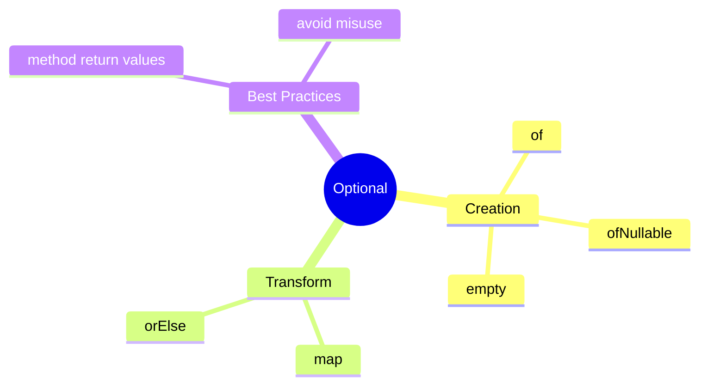

## Quick Summary

### Representing Optional Values

- `Optional.of(value)` means the value must not be null
- `Optional.ofNullable(value)` is safe when null is possible
- `Optional.empty()` means no value is present

### Transforming Optional Values

- `map(...)` changes the inside value if present
- `orElse(...)` gives a fallback if missing

### Choosing Optional Boundaries

- `Optional` is useful in method returns
- it is not a replacement for every field or every parameter

## Compare With

| Compare | Prefer Left When | Prefer Right When |
| --- | --- | --- |
| `null` vs `Optional` | almost never for a meaningful API boundary | absence should be explicit to the caller |
| `of()` vs `ofNullable()` | you already know the value must exist | the input may be null |
| `map()` vs `orElse()` | you want to transform the present value | you want a fallback result when the value is absent |

## Senior Engineer Lens

- Optional is most valuable at API boundaries where absence is business-meaningful
- using Optional everywhere often adds ceremony without clarifying the model
- `get()` is rarely the right abstraction because it bypasses the contract
- good Optional usage reduces null-handling bugs and makes call sites more explicit

## Decision Chart

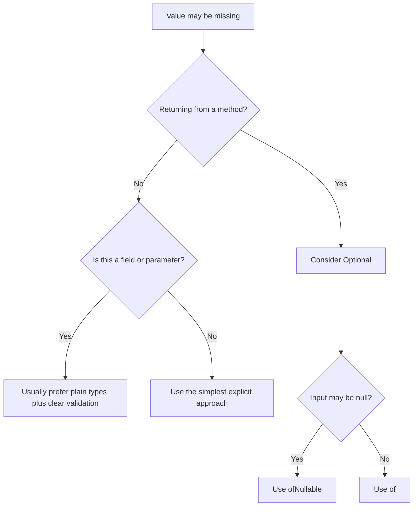

## Mini Case Study

Imagine a user profile page.

- nickname may be present or missing
- middle name may be missing
- profile picture URL may be missing

`Optional` helps the code handle those missing values clearly.

## When To Use

- use `Optional` for return values when absence is normal
- use it when you want the caller to think about the missing case

## When Not To Use

- do not use `Optional.of(...)` on a possibly null value
- do not use `Optional` only for style
- do not call `get()` without proving the value exists

## OCJP Focus

- `Optional.of(null)` throws `NullPointerException`
- `Optional.ofNullable(null)` returns `Optional.empty()`
- `map()` does not run if the value is missing

## Interview Focus

Q: Why return `Optional` from a method?  
A: It makes the missing-value case explicit for the caller.

Q: Why avoid `Optional.get()` in normal code?  
A: Because it can fail at runtime if the value is absent.

Q: When is `orElse(...)` useful?  
A: When you want a clear fallback value.

## Quick Quiz

1. What is the difference between `of()` and `ofNullable()`?
2. What does `map()` do on an empty `Optional`?
3. Why is `Optional` better than hidden null checks in some APIs?

## Effective Java Mapping

- Item 55: Return optionals judiciously
- Item 54: Return empty collections or arrays, not nulls

## Sources

- Effective Java, 3rd Edition: https://www.informit.com/store/effective-java-9780134686042
- Modern Java in Action: https://www.manning.com/books/modern-java-in-action
- Java API documentation: https://docs.oracle.com/en/java/

#### Revision

## Before Revision

- rerun `RunAllTopics.java`
- compare the actual output with the expected output comments in each topic file
- explain the chapter in your own words before reading this sheet

## Five Key Ideas

- understand the core idea behind Choosing Optional Boundaries
- understand how Representing Optional Values changes code behavior or design choice
- know when Transforming Optional Values is useful in real code
- know the common confusion around Representing Optional Values
- be able to explain the tradeoff behind Transforming Optional Values

## Three Mistakes To Avoid

- memorizing syntax without checking why the output appears
- using this chapter's idea where a simpler option would be clearer
- ignoring naming, input, output, and side-effect clarity

## Three Interview Questions

1. What real problem does Optional solve?
2. When would you avoid a heavier approach and choose a simpler one instead?
3. Which example in this chapter is most useful in production code, and why?

## Three OCJP Checks

1. Can you predict the output of the main runnable example without executing it?
2. Can you explain which behavior is compile-time and which is runtime?
3. Can you name one edge case that could confuse a learner in this chapter?

## After Reading This Chapter, You Should Know

- what this chapter is trying to solve
- which Java tool or pattern expresses that idea
- what common mistake to avoid
- how to explain the idea in plain English

### Date And Time

This chapter teaches one core idea: date and time values should be modeled as time values, not as loose strings or integers.

Read the topic files in order. Run each example. Check the printed output. After reading this chapter, you should know when to use `LocalDateTime`, when to use a zone-aware type, and why formatting belongs at the boundary of the system.

## What Problem This Chapter Solves

Real systems constantly handle:

- meeting schedules
- delivery windows
- report timestamps
- user-visible dates

Most bugs happen when teams mix these ideas together. A date without a zone is not the same thing as a point in global time. A formatted string is not the same thing as a time value.

## Study Order

1. Run [LocalDateTime.java](/Users/indiadelhi/repo/career/java-missing-tutorial/code/src/main/java/com/learning/javamissing/sec16_core_data_time_and_text/ch02_date_and_time/topics/local_date_time/LocalDateTime.java)
2. Run [Zones.java](/Users/indiadelhi/repo/career/java-missing-tutorial/code/src/main/java/com/learning/javamissing/sec16_core_data_time_and_text/ch02_date_and_time/topics/zones/Zones.java)
3. Run [Formatting.java](/Users/indiadelhi/repo/career/java-missing-tutorial/code/src/main/java/com/learning/javamissing/sec16_core_data_time_and_text/ch02_date_and_time/topics/formatting/Formatting.java)

## Concept Map

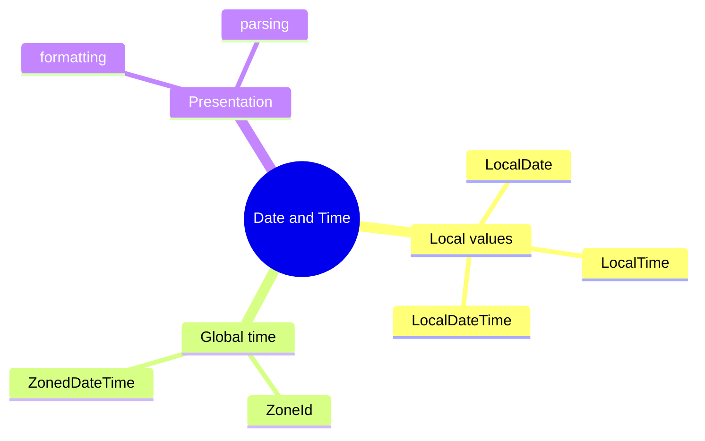

## Quick Summary

### Local Date Time

- use `LocalDateTime` when the value is local to one business context, like "store opens at 9:30"
- operations like `plusMinutes(...)` return a new value because `java.time` types are immutable

### Zones

- use a zone-aware type when the same event must be understood across locations
- `withZoneSameInstant(...)` keeps the same real instant but shows it in another zone

### Formatting

- formatting is for display or input parsing
- keep internal logic on typed date/time values, not on strings

## Compare With

- `LocalDateTime` vs `ZonedDateTime`:
  `LocalDateTime` has no zone, `ZonedDateTime` represents a date-time in a specific region
- formatting vs modeling:
  formatting is presentation, modeling is the actual business value
- storing string dates vs typed dates:
  strings are fragile, typed values are safer and easier to validate

## Mini Case Study

An online learning platform sends a webinar reminder.

- the course team stores the event as `2026-04-07 18:00` in India time
- a learner in London should see the same instant in London time
- the email should display a formatted value like `07 Apr 2026`

This chapter covers exactly those three steps:

- model the local time
- convert across zones
- format for display

## When To Use

- use local date/time types for business-local schedules
- use zone-aware types for shared global events
- use formatters only at display and parsing boundaries

## When Not To Use

- do not store dates as free-form strings in core logic
- do not use `LocalDateTime` when the zone actually matters
- do not confuse formatting with conversion

## OCJP Focus

- `java.time` types are immutable
- parsing and formatting require matching patterns
- changing zones can either preserve the instant or preserve the local fields, depending on the API

## Interview Focus

Q: Why is `java.time` better than old mutable date APIs?  
A: It is clearer, immutable, and models dates, times, and zones separately.

Q: When is `LocalDateTime` the wrong choice?  
A: When the value must mean the same instant across regions, because it has no zone.

Q: Why should formatting be delayed until the boundary?  
A: Because business logic should work with typed values, not presentation strings.

## Quick Quiz

1. Why can two users see different clock times for the same `ZonedDateTime` instant?
2. Why is `DateTimeFormatter` not a replacement for `LocalDateTime`?
3. Why does `plusMinutes(...)` return a new value instead of changing the original one?

## Effective Java Mapping

- Item 17: Minimize mutability
- Item 49: Check parameters for validity
- Item 61: Prefer primitive types to boxed primitives where they make modeling clearer

## Sources

- Java API documentation: https://docs.oracle.com/en/java/
- Core Java, Volume I: https://www.informit.com/store/core-java-volume-i-fundamentals-9780135558577
- Core Java, Volume II: https://www.informit.com/store/core-java-volume-ii-advanced-features-9780135558690
- Effective Java, 3rd Edition: https://www.informit.com/store/effective-java-9780134686042

#### Revision

## Before Revision

- rerun `RunAllTopics.java`
- compare the actual output with the expected output comments in each topic file
- explain the chapter in your own words before reading this sheet

## Five Key Ideas

- understand the core idea behind Formatting
- understand how Local Date Time changes code behavior or design choice
- know when Zones is useful in real code
- know the common confusion around Local Date Time
- be able to explain the tradeoff behind Zones

## Three Mistakes To Avoid

- memorizing syntax without checking why the output appears
- using this chapter's idea where a simpler option would be clearer
- ignoring naming, input, output, and side-effect clarity

## Three Interview Questions

1. What real problem does Date And Time solve?
2. When would you avoid a heavier approach and choose a simpler one instead?
3. Which example in this chapter is most useful in production code, and why?

## Three OCJP Checks

1. Can you predict the output of the main runnable example without executing it?
2. Can you explain which behavior is compile-time and which is runtime?
3. Can you name one edge case that could confuse a learner in this chapter?

## After Reading This Chapter, You Should Know

- what this chapter is trying to solve
- which Java tool or pattern expresses that idea
- what common mistake to avoid
- how to explain the idea in plain English

### Missing Values And Optional

This chapter teaches the concept of absence in data.

## Study Order

1. Run [RepresentingAbsence.java](/Users/indiadelhi/repo/career/java-missing-tutorial/code/src/main/java/com/learning/javamissing/sec16_core_data_time_and_text/ch03_missing_values_and_optional/topics/representing_absence/RepresentingAbsence.java)
2. Focus on the concept first: a value may exist or may be missing.

#### Revision

## Before Revision

- rerun `RunAllTopics.java`
- compare the actual output with the expected output comments in each topic file
- explain the chapter in your own words before reading this sheet

## Five Key Ideas

- understand the core idea behind Representing Absence
- understand how Representing Absence changes code behavior or design choice
- know when Representing Absence is useful in real code
- know the common confusion around Representing Absence
- be able to explain the tradeoff behind Representing Absence

## Three Mistakes To Avoid

- memorizing syntax without checking why the output appears
- using this chapter's idea where a simpler option would be clearer
- ignoring naming, input, output, and side-effect clarity

## Three Interview Questions

1. What real problem does Missing Values And Optional solve?
2. When would you avoid a heavier approach and choose a simpler one instead?
3. Which example in this chapter is most useful in production code, and why?

## Three OCJP Checks

1. Can you predict the output of the main runnable example without executing it?
2. Can you explain which behavior is compile-time and which is runtime?
3. Can you name one edge case that could confuse a learner in this chapter?

## After Reading This Chapter, You Should Know

- what this chapter is trying to solve
- which Java tool or pattern expresses that idea
- what common mistake to avoid
- how to explain the idea in plain English

### Working With Time

This chapter teaches the concept of modeling dates, times, and schedules correctly.

## Study Order

1. Run [SchedulingDeliveries.java](/Users/indiadelhi/repo/career/java-missing-tutorial/code/src/main/java/com/learning/javamissing/sec16_core_data_time_and_text/ch04_working_with_time/topics/scheduling_deliveries/SchedulingDeliveries.java)
2. Focus on the concept first: business time is data, not just text.

#### Revision

## Before Revision

- rerun `RunAllTopics.java`
- compare the actual output with the expected output comments in each topic file
- explain the chapter in your own words before reading this sheet

## Five Key Ideas

- understand the core idea behind Scheduling Deliveries
- understand how Scheduling Deliveries changes code behavior or design choice
- know when Scheduling Deliveries is useful in real code
- know the common confusion around Scheduling Deliveries
- be able to explain the tradeoff behind Scheduling Deliveries

## Three Mistakes To Avoid

- memorizing syntax without checking why the output appears
- using this chapter's idea where a simpler option would be clearer
- ignoring naming, input, output, and side-effect clarity

## Three Interview Questions

1. What real problem does Working With Time solve?
2. When would you avoid a heavier approach and choose a simpler one instead?
3. Which example in this chapter is most useful in production code, and why?

## Three OCJP Checks

1. Can you predict the output of the main runnable example without executing it?
2. Can you explain which behavior is compile-time and which is runtime?
3. Can you name one edge case that could confuse a learner in this chapter?

## After Reading This Chapter, You Should Know

- what this chapter is trying to solve
- which Java tool or pattern expresses that idea
- what common mistake to avoid
- how to explain the idea in plain English

### Numbers And Formatting

This chapter teaches the concept of presenting numeric values clearly and correctly.

## Study Order

1. Run [FormattingPrices.java](/Users/indiadelhi/repo/career/java-missing-tutorial/code/src/main/java/com/learning/javamissing/sec16_core_data_time_and_text/ch05_numbers_and_formatting/topics/formatting_prices/FormattingPrices.java)
2. Focus on the concept first: internal numeric values and displayed values are not the same thing.

#### Revision

## Before Revision

- rerun `RunAllTopics.java`
- compare the actual output with the expected output comments in each topic file
- explain the chapter in your own words before reading this sheet

## Five Key Ideas

- understand the core idea behind Formatting Prices
- understand how Formatting Prices changes code behavior or design choice
- know when Formatting Prices is useful in real code
- know the common confusion around Formatting Prices
- be able to explain the tradeoff behind Formatting Prices

## Three Mistakes To Avoid

- memorizing syntax without checking why the output appears
- using this chapter's idea where a simpler option would be clearer
- ignoring naming, input, output, and side-effect clarity

## Three Interview Questions

1. What real problem does Numbers And Formatting solve?
2. When would you avoid a heavier approach and choose a simpler one instead?
3. Which example in this chapter is most useful in production code, and why?

## Three OCJP Checks

1. Can you predict the output of the main runnable example without executing it?
2. Can you explain which behavior is compile-time and which is runtime?
3. Can you name one edge case that could confuse a learner in this chapter?

## After Reading This Chapter, You Should Know

- what this chapter is trying to solve
- which Java tool or pattern expresses that idea
- what common mistake to avoid
- how to explain the idea in plain English

### Text Processing And Regex

This chapter teaches the concept of checking and transforming text data safely.

## Study Order

1. Run [ValidatingUserInput.java](/Users/indiadelhi/repo/career/java-missing-tutorial/code/src/main/java/com/learning/javamissing/sec16_core_data_time_and_text/ch06_text_processing_and_regex/topics/validating_user_input/ValidatingUserInput.java)
2. Focus on the concept first: text from users must be checked before it is trusted.

#### Revision

## Before Revision

- rerun `RunAllTopics.java`
- compare the actual output with the expected output comments in each topic file
- explain the chapter in your own words before reading this sheet

## Five Key Ideas

- understand the core idea behind Validating User Input
- understand how Validating User Input changes code behavior or design choice
- know when Validating User Input is useful in real code
- know the common confusion around Validating User Input
- be able to explain the tradeoff behind Validating User Input

## Three Mistakes To Avoid

- memorizing syntax without checking why the output appears
- using this chapter's idea where a simpler option would be clearer
- ignoring naming, input, output, and side-effect clarity

## Three Interview Questions

1. What real problem does Text Processing And Regex solve?
2. When would you avoid a heavier approach and choose a simpler one instead?
3. Which example in this chapter is most useful in production code, and why?

## Three OCJP Checks

1. Can you predict the output of the main runnable example without executing it?
2. Can you explain which behavior is compile-time and which is runtime?
3. Can you name one edge case that could confuse a learner in this chapter?

## After Reading This Chapter, You Should Know

- what this chapter is trying to solve
- which Java tool or pattern expresses that idea
- what common mistake to avoid
- how to explain the idea in plain English

## Language Modeling And Modern Types

Current chapters:

- `ch01_pattern_matching`
- `ch02_records_and_sealed_types`

## Before You Start

- Prerequisites: sec01_fundamentals and classes/interfaces basics.
- This section prepares you for: Modern Java modeling, safer domain types, and cleaner branching.
- Suggested pace: 2 to 3 focused sessions.

## How To Read This Section

- run the topic files before trying to memorize names
- compare the printed output with the explanation in each topic
- finish the chapter with its revision sheet before moving on

## Why This Section Matters

Modern Java modeling, safer domain types, and cleaner branching.

## Recommended Next Step

Move to sec18_architecture_and_integration and sec06_design_patterns.

### Pattern Matching

This chapter teaches a modeling idea: code becomes safer and clearer when the program can check shape and unpack data in one step.

Read the examples with one question in mind: "What do I know about the value after this check succeeds?" After reading this chapter, you should know why pattern matching reduces manual casting noise and why it works best with well-modeled data.

## What Problem This Chapter Solves

Java programs often receive mixed input:

- event objects
- API payload variants
- different payment types
- different command shapes

Older code often uses `instanceof`, then a cast, then more branching. Pattern matching makes the check and the usable variable part of the same statement.

## Study Order

1. Run [CheckingShapeWithInstanceof.java](/Users/indiadelhi/repo/career/java-missing-tutorial/code/src/main/java/com/learning/javamissing/sec17_language_modeling_and_modern_types/ch01_pattern_matching/topics/checking_shape_with_instanceof/CheckingShapeWithInstanceof.java)
2. Run [UnpackingRecordsWithPatterns.java](/Users/indiadelhi/repo/career/java-missing-tutorial/code/src/main/java/com/learning/javamissing/sec17_language_modeling_and_modern_types/ch01_pattern_matching/topics/unpacking_records_with_patterns/UnpackingRecordsWithPatterns.java)
3. Run [SwitchingOnRuntimeShape.java](/Users/indiadelhi/repo/career/java-missing-tutorial/code/src/main/java/com/learning/javamissing/sec17_language_modeling_and_modern_types/ch01_pattern_matching/topics/switching_on_runtime_shape/SwitchingOnRuntimeShape.java)

## Concept Map

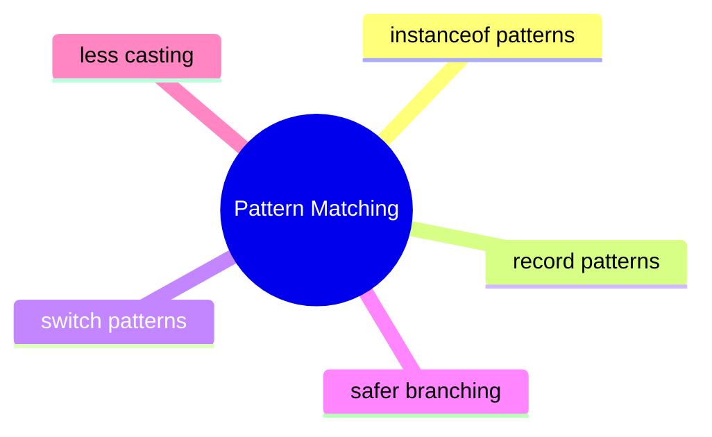

## Quick Summary

### `instanceof` Patterns

- the check and the typed variable appear together
- code becomes shorter and less error-prone

### Record Patterns

- record patterns unpack data while matching shape
- they are strongest when records model stable data clearly

### Switch Patterns

- switch can choose behavior based on the runtime shape of data
- guarded cases add more precise branching

## Compare With

- old `instanceof` plus cast vs pattern matching:
  pattern matching removes duplicated type information
- manual getter extraction vs record patterns:
  record patterns unpack the structure directly in the match
- `if-else` chains vs switch patterns:
  switch patterns can centralize branching more clearly

## Mini Case Study

An event-processing service receives different event shapes:

- login event
- payment event
- shipping event

The service needs to inspect the type, extract fields, and decide behavior. Pattern matching keeps that branching readable when the domain is modeled well.

## When To Use

- use pattern matching when behavior depends on the runtime shape of data
- use record patterns when records already express the domain well
- use switch patterns when one branching point should describe all supported shapes

## When Not To Use

- do not use pattern matching to compensate for a badly modeled domain
- do not add complex nested patterns when ordinary method calls are clearer
- do not forget that maintainability matters more than language cleverness

## Interview Focus

Q: What is the main gain from pattern matching for `instanceof`?  
A: It combines type test and typed variable binding, reducing boilerplate and cast noise.

Q: When do record patterns shine most?  
A: When records represent stable structured data that must be unpacked often.

Q: What is the real prerequisite for good pattern-matching code?  
A: A well-designed data model.

## Quick Quiz

1. Why is pattern matching better than separate check-and-cast code?
2. Why do record patterns work best with clearly structured data?
3. When would a normal method call be clearer than a complex pattern?

## Effective Java Mapping

- Item 15: Minimize the accessibility of classes and members
- Item 17: Minimize mutability
- Item 18: Favor composition over inheritance

## Sources

- Java API documentation: https://docs.oracle.com/en/java/
- OpenJDK JEP index: https://openjdk.org/jeps/0
- Core Java, Volume I: https://www.informit.com/store/core-java-volume-i-fundamentals-9780135558577

#### Revision

## Before Revision

- rerun `RunAllTopics.java`
- compare the actual output with the expected output comments in each topic file
- explain the chapter in your own words before reading this sheet

## Five Key Ideas

- understand the core idea behind Checking Shape With Instanceof
- understand how Switching On Runtime Shape changes code behavior or design choice
- know when Unpacking Records With Patterns is useful in real code
- know the common confusion around Switching On Runtime Shape
- be able to explain the tradeoff behind Unpacking Records With Patterns

## Three Mistakes To Avoid

- memorizing syntax without checking why the output appears
- using this chapter's idea where a simpler option would be clearer
- ignoring naming, input, output, and side-effect clarity

## Three Interview Questions

1. What real problem does Pattern Matching solve?
2. When would you avoid a heavier approach and choose a simpler one instead?
3. Which example in this chapter is most useful in production code, and why?

## Three OCJP Checks

1. Can you predict the output of the main runnable example without executing it?
2. Can you explain which behavior is compile-time and which is runtime?
3. Can you name one edge case that could confuse a learner in this chapter?

## After Reading This Chapter, You Should Know

- what this chapter is trying to solve
- which Java tool or pattern expresses that idea
- what common mistake to avoid
- how to explain the idea in plain English

### Records And Sealed Types

This chapter teaches two related modeling tools:

- records for transparent data carriers
- sealed types for closed sets of allowed variants

After reading this chapter, you should know that these features are not shortcuts for less code only. They are ways to make domain boundaries and intent clearer.

## What Problem This Chapter Solves

Many business models have one of these shapes:

- pure data objects such as invoice summaries
- closed families such as payment status or delivery state

Without clear modeling, teams end up with verbose data classes, weak invariants, and switches that silently miss new cases.

## Study Order

1. Run [ModelingImmutableDataWithRecords.java](/Users/indiadelhi/repo/career/java-missing-tutorial/code/src/main/java/com/learning/javamissing/sec17_language_modeling_and_modern_types/ch02_records_and_sealed_types/topics/modeling_immutable_data_with_records/ModelingImmutableDataWithRecords.java)
2. Run [ClosingHierarchiesWithSealedTypes.java](/Users/indiadelhi/repo/career/java-missing-tutorial/code/src/main/java/com/learning/javamissing/sec17_language_modeling_and_modern_types/ch02_records_and_sealed_types/topics/closing_hierarchies_with_sealed_types/ClosingHierarchiesWithSealedTypes.java)
3. Run [ExhaustiveSealedBranching.java](/Users/indiadelhi/repo/career/java-missing-tutorial/code/src/main/java/com/learning/javamissing/sec17_language_modeling_and_modern_types/ch02_records_and_sealed_types/topics/exhaustive_sealed_branching/ExhaustiveSealedBranching.java)

## Concept Map

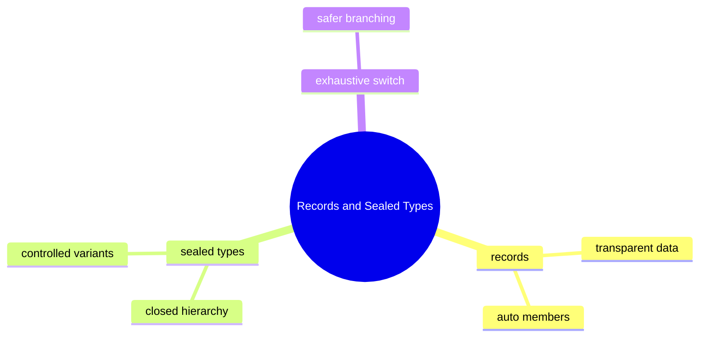

## Quick Summary

### Records

- records are a good fit for immutable data carriers
- they express that the data itself is the main point of the type

### Sealed Types

- sealed types declare exactly which implementations are allowed
- they help model known variants explicitly

### Exhaustive Switch

- sealed hierarchies improve switch safety because the compiler knows the permitted cases
- missing cases become visible earlier

## Compare With

- record vs ordinary class:
  use a record when the type is mainly data, use a class when custom identity or mutable behavior matters
- sealed hierarchy vs open hierarchy:
  sealed types are better when the domain variants are intentionally closed
- enum vs sealed hierarchy:
  enums fit constant-like variants, sealed hierarchies fit variants with different data and behavior

## Mini Case Study

Consider an order system.

- `Order` summary is pure data: record is a natural fit
- `DeliveryStatus` has a fixed set of states: sealed type is a natural fit
- the UI needs one branch per status: exhaustive switch becomes safer

This chapter shows those three ideas working together.

## When To Use

- use records for small immutable value-focused models
- use sealed types for domains with intentionally closed variants
- use exhaustive switches when business logic truly depends on every supported case

## When Not To Use

- do not use records for entities that need complex mutable lifecycle behavior
- do not use sealed types when extension by outside code is a real requirement
- do not confuse "less code" with "better model"

## Interview Focus

Q: What is the real benefit of a record?  
A: It communicates that the type is a transparent immutable data carrier.

Q: Why use a sealed type instead of a normal interface?  
A: To express and enforce that only a known set of implementations is valid.

Q: Why are sealed types and pattern matching often discussed together?  
A: Because a closed hierarchy makes branching more complete and safer.

## Quick Quiz

1. Why is a record better than a verbose data class for pure value data?
2. Why might an enum be insufficient where a sealed hierarchy works well?
3. Why does a closed hierarchy improve switch safety?

## Effective Java Mapping

- Item 15: Minimize the accessibility of classes and members
- Item 17: Minimize mutability
- Item 18: Favor composition over inheritance

## Sources

- Java API documentation: https://docs.oracle.com/en/java/
- OpenJDK JEP index: https://openjdk.org/jeps/0
- Effective Java, 3rd Edition: https://www.informit.com/store/effective-java-9780134686042

#### Revision

## Before Revision

- rerun `RunAllTopics.java`
- compare the actual output with the expected output comments in each topic file
- explain the chapter in your own words before reading this sheet

## Five Key Ideas

- understand the core idea behind Closing Hierarchies With Sealed Types
- understand how Exhaustive Branching Over Closed Hierarchies changes code behavior or design choice
- know when Modeling Immutable Data With Records is useful in real code
- know the common confusion around Exhaustive Branching Over Closed Hierarchies
- be able to explain the tradeoff behind Modeling Immutable Data With Records

## Three Mistakes To Avoid

- memorizing syntax without checking why the output appears
- using this chapter's idea where a simpler option would be clearer
- ignoring naming, input, output, and side-effect clarity

## Three Interview Questions

1. What real problem does Records And Sealed Types solve?
2. When would you avoid a heavier approach and choose a simpler one instead?
3. Which example in this chapter is most useful in production code, and why?

## Three OCJP Checks

1. Can you predict the output of the main runnable example without executing it?
2. Can you explain which behavior is compile-time and which is runtime?
3. Can you name one edge case that could confuse a learner in this chapter?

## After Reading This Chapter, You Should Know

- what this chapter is trying to solve
- which Java tool or pattern expresses that idea
- what common mistake to avoid
- how to explain the idea in plain English

## Architecture And Integration

Current chapters:

- `ch01_modules`
- `ch02_modular_design`
- `ch03_building_for_many_languages`
- `ch04_writing_safe_java`

## Before You Start

- Prerequisites: sec01_fundamentals, sec07_principles_and_solid, and helpful exposure to modules or localization.
- This section prepares you for: Real application boundaries, modular thinking, and safer integration design.
- Suggested pace: 3 to 4 focused sessions.

## How To Read This Section

- run the topic files before trying to memorize names
- compare the printed output with the explanation in each topic
- finish the chapter with its revision sheet before moving on

## Why This Section Matters

Real application boundaries, modular thinking, and safer integration design.

## Recommended Next Step

Use this section together with sec19_testing_and_quality and sec06_design_patterns.

### Modules

This chapter teaches a boundary concept: a large codebase becomes easier to reason about when dependencies and exported APIs are made explicit.

After reading this chapter, you should know what problem modules solve, what `requires` and `exports` actually mean, and why service loading is about decoupling implementations from consumers.

## What Problem This Chapter Solves

As a system grows, these problems appear:

- too many accidental dependencies
- unclear public API surface
- implementation packages being used directly
- hard-wired implementations

Modules help make those boundaries visible.

## Study Order

1. Run [DeclaringModuleBoundaries.java](/Users/indiadelhi/repo/career/java-missing-tutorial/code/src/main/java/com/learning/javamissing/sec18_architecture_and_integration/ch01_modules/topics/declaring_module_boundaries/DeclaringModuleBoundaries.java)
2. Run [ModuleBoundaries.java](/Users/indiadelhi/repo/career/java-missing-tutorial/code/src/main/java/com/learning/javamissing/sec18_architecture_and_integration/ch01_modules/topics/module_boundaries/ModuleBoundaries.java)
3. Run [PluggableImplementations.java](/Users/indiadelhi/repo/career/java-missing-tutorial/code/src/main/java/com/learning/javamissing/sec18_architecture_and_integration/ch01_modules/topics/pluggable_implementations/PluggableImplementations.java)

## Concept Map

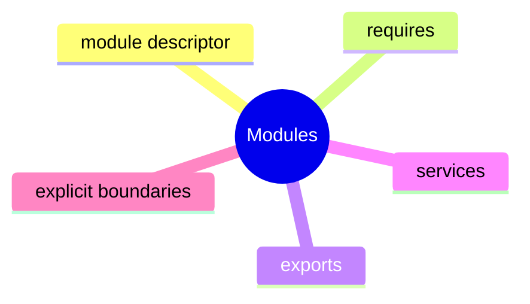

## Quick Summary

### Module Descriptor

- `module-info.java` declares the module boundary
- it is the entry point for understanding dependencies and exposed packages

### `requires` And `exports`

- `requires` says what this module depends on
- `exports` says what packages other modules may use

### Services

- services let consumers depend on an abstraction instead of a concrete implementation
- this supports pluggable designs

## Compare With

- classpath vs module path:
  classpath is looser, modules make boundaries more explicit
- public class vs exported package:
  a public type is not enough by itself in a modular world; package export matters too
- direct implementation dependency vs service loading:
  services reduce coupling to one specific implementation

## Mini Case Study

Imagine a retail platform split into modules:

- `store.api`
- `store.pricing`
- `store.reporting`

Reporting should not reach into pricing internals. Pricing should expose only its API package. Discount providers may vary by country, so a service-based design fits better than hard-coded implementation references.

## When To Use

- use modules when the codebase is large enough that dependency boundaries matter
- use `exports` to expose only intended API packages
- use services when one abstraction may have multiple implementations

## When Not To Use

- do not add modules mechanically to a tiny toy application with no boundary benefit
- do not export internal implementation packages
- do not use service loading where a direct dependency is simpler and clearer

## Interview Focus

Q: What problem do Java modules primarily solve?  
A: They make dependencies and visible API boundaries explicit.

Q: What is the difference between `requires` and `exports`?  
A: `requires` brings in another module; `exports` makes one of your packages available to other modules.

Q: Why use services in a modular design?  
A: To decouple consumers from concrete implementations.

## Quick Quiz

1. Why can "public" still be insufficient without `exports`?
2. Why is service loading useful in a pluggable system?
3. What is the risk of exporting too many packages?

## Effective Java Mapping

- Item 15: Minimize the accessibility of classes and members
- Item 18: Favor composition over inheritance
- Item 64: Refer to objects by their interfaces

## Sources

- Java API documentation: https://docs.oracle.com/en/java/
- Core Java, Volume II: https://www.informit.com/store/core-java-volume-ii-advanced-features-9780135558690
- Effective Java, 3rd Edition: https://www.informit.com/store/effective-java-9780134686042

#### Revision

## Before Revision

- rerun `RunAllTopics.java`
- compare the actual output with the expected output comments in each topic file
- explain the chapter in your own words before reading this sheet

## Five Key Ideas

- understand the core idea behind Choosing Dependencies And Exposed Packages
- understand how Declaring Module Boundaries changes code behavior or design choice
- know when Pluggable Implementations is useful in real code
- know the common confusion around Declaring Module Boundaries
- be able to explain the tradeoff behind Pluggable Implementations

## Three Mistakes To Avoid

- memorizing syntax without checking why the output appears
- using this chapter's idea where a simpler option would be clearer
- ignoring naming, input, output, and side-effect clarity

## Three Interview Questions

1. What real problem does Java Modules solve?
2. When would you avoid a heavier approach and choose a simpler one instead?
3. Which example in this chapter is most useful in production code, and why?

## Three OCJP Checks

1. Can you predict the output of the main runnable example without executing it?
2. Can you explain which behavior is compile-time and which is runtime?
3. Can you name one edge case that could confuse a learner in this chapter?

## After Reading This Chapter, You Should Know

- what this chapter is trying to solve
- which Java tool or pattern expresses that idea
- what common mistake to avoid
- how to explain the idea in plain English

### Modular Design

This chapter teaches the concept of splitting a large system into understandable parts.

## Study Order

1. Run [SeparatingSystemBoundaries.java](/Users/indiadelhi/repo/career/java-missing-tutorial/code/src/main/java/com/learning/javamissing/sec18_architecture_and_integration/ch02_modular_design/topics/separating_system_boundaries/SeparatingSystemBoundaries.java)
2. Focus on the concept first: boundaries reduce coupling.

#### Revision

## Before Revision

- rerun `RunAllTopics.java`
- compare the actual output with the expected output comments in each topic file
- explain the chapter in your own words before reading this sheet

## Five Key Ideas

- understand the core idea behind Separating System Boundaries
- understand how Separating System Boundaries changes code behavior or design choice
- know when Separating System Boundaries is useful in real code
- know the common confusion around Separating System Boundaries
- be able to explain the tradeoff behind Separating System Boundaries

## Three Mistakes To Avoid

- memorizing syntax without checking why the output appears
- using this chapter's idea where a simpler option would be clearer
- ignoring naming, input, output, and side-effect clarity

## Three Interview Questions

1. What real problem does Modular Design solve?
2. When would you avoid a heavier approach and choose a simpler one instead?
3. Which example in this chapter is most useful in production code, and why?

## Three OCJP Checks

1. Can you predict the output of the main runnable example without executing it?
2. Can you explain which behavior is compile-time and which is runtime?
3. Can you name one edge case that could confuse a learner in this chapter?

## After Reading This Chapter, You Should Know

- what this chapter is trying to solve
- which Java tool or pattern expresses that idea
- what common mistake to avoid
- how to explain the idea in plain English

### Building For Many Languages

This chapter teaches the concept of adapting software for users in different locales.

## Study Order

1. Run [ShowingMessagesByLocale.java](/Users/indiadelhi/repo/career/java-missing-tutorial/code/src/main/java/com/learning/javamissing/sec18_architecture_and_integration/ch03_building_for_many_languages/topics/showing_messages_by_locale/ShowingMessagesByLocale.java)
2. Focus on the concept first: user-facing text depends on language and region.

#### Revision

## Before Revision

- rerun `RunAllTopics.java`
- compare the actual output with the expected output comments in each topic file
- explain the chapter in your own words before reading this sheet

## Five Key Ideas

- understand the core idea behind Showing Messages By Locale
- understand how Showing Messages By Locale changes code behavior or design choice
- know when Showing Messages By Locale is useful in real code
- know the common confusion around Showing Messages By Locale
- be able to explain the tradeoff behind Showing Messages By Locale

## Three Mistakes To Avoid

- memorizing syntax without checking why the output appears
- using this chapter's idea where a simpler option would be clearer
- ignoring naming, input, output, and side-effect clarity

## Three Interview Questions

1. What real problem does Building For Many Languages solve?
2. When would you avoid a heavier approach and choose a simpler one instead?
3. Which example in this chapter is most useful in production code, and why?

## Three OCJP Checks

1. Can you predict the output of the main runnable example without executing it?
2. Can you explain which behavior is compile-time and which is runtime?
3. Can you name one edge case that could confuse a learner in this chapter?

## After Reading This Chapter, You Should Know

- what this chapter is trying to solve
- which Java tool or pattern expresses that idea
- what common mistake to avoid
- how to explain the idea in plain English

### Writing Safe Java

This chapter teaches the concept of validating inputs and reducing avoidable bugs.

## Study Order

1. Run [ValidatingCheckoutInput.java](/Users/indiadelhi/repo/career/java-missing-tutorial/code/src/main/java/com/learning/javamissing/sec18_architecture_and_integration/ch04_writing_safe_java/topics/validating_checkout_input/ValidatingCheckoutInput.java)
2. Focus on the concept first: trusted systems still need defensive boundaries.

#### Revision

## Before Revision

- rerun `RunAllTopics.java`
- compare the actual output with the expected output comments in each topic file
- explain the chapter in your own words before reading this sheet

## Five Key Ideas

- understand the core idea behind Validating Checkout Input
- understand how Validating Checkout Input changes code behavior or design choice
- know when Validating Checkout Input is useful in real code
- know the common confusion around Validating Checkout Input
- be able to explain the tradeoff behind Validating Checkout Input

## Three Mistakes To Avoid

- memorizing syntax without checking why the output appears
- using this chapter's idea where a simpler option would be clearer
- ignoring naming, input, output, and side-effect clarity

## Three Interview Questions

1. What real problem does Writing Safe Java solve?
2. When would you avoid a heavier approach and choose a simpler one instead?
3. Which example in this chapter is most useful in production code, and why?

## Three OCJP Checks

1. Can you predict the output of the main runnable example without executing it?
2. Can you explain which behavior is compile-time and which is runtime?
3. Can you name one edge case that could confuse a learner in this chapter?

## After Reading This Chapter, You Should Know

- what this chapter is trying to solve
- which Java tool or pattern expresses that idea
- what common mistake to avoid
- how to explain the idea in plain English

## Testing And Quality

Current chapters:

- `ch01_testing_and_quality`

## Before You Start

- Prerequisites: sec01_fundamentals. Every earlier section benefits from testing.
- This section prepares you for: Reliable refactoring, safer releases, and stronger interview answers about quality.
- Suggested pace: 2 to 3 focused sessions.

## How To Read This Section

- run the topic files before trying to memorize names
- compare the printed output with the explanation in each topic
- finish the chapter with its revision sheet before moving on

## Why This Section Matters

Reliable refactoring, safer releases, and stronger interview answers about quality.

## Recommended Next Step

Use testing as the companion section while revisiting any earlier part of the book.

### Testing And Quality

This chapter teaches a durable engineering idea: good code is not only code that works once. Good code can be checked repeatedly, confidently, and cheaply.

After reading this chapter, you should know why test design matters more than test count, why JUnit is a tool instead of the goal, and why parameterized tests are useful for repeating one rule across many inputs.

## What Problem This Chapter Solves

Without tests, teams usually suffer from:

- fear of changing code
- hidden regressions
- unclear business rules
- duplicate manual checking

This chapter focuses on small, readable, repeatable verification.

## Study Order

1. Run [DesigningTestsAroundBusinessRules.java](/Users/indiadelhi/repo/career/java-missing-tutorial/code/src/main/java/com/learning/javamissing/sec19_testing_and_quality/ch01_testing_and_quality/topics/designing_tests_around_business_rules/DesigningTestsAroundBusinessRules.java)
2. Run [WritingReadableJUnitTests.java](/Users/indiadelhi/repo/career/java-missing-tutorial/code/src/main/java/com/learning/javamissing/sec19_testing_and_quality/ch01_testing_and_quality/topics/writing_readable_junit_tests/WritingReadableJUnitTests.java)
3. Run [CheckingOneRuleWithManyInputs.java](/Users/indiadelhi/repo/career/java-missing-tutorial/code/src/main/java/com/learning/javamissing/sec19_testing_and_quality/ch01_testing_and_quality/topics/checking_one_rule_with_many_inputs/CheckingOneRuleWithManyInputs.java)

## Concept Map

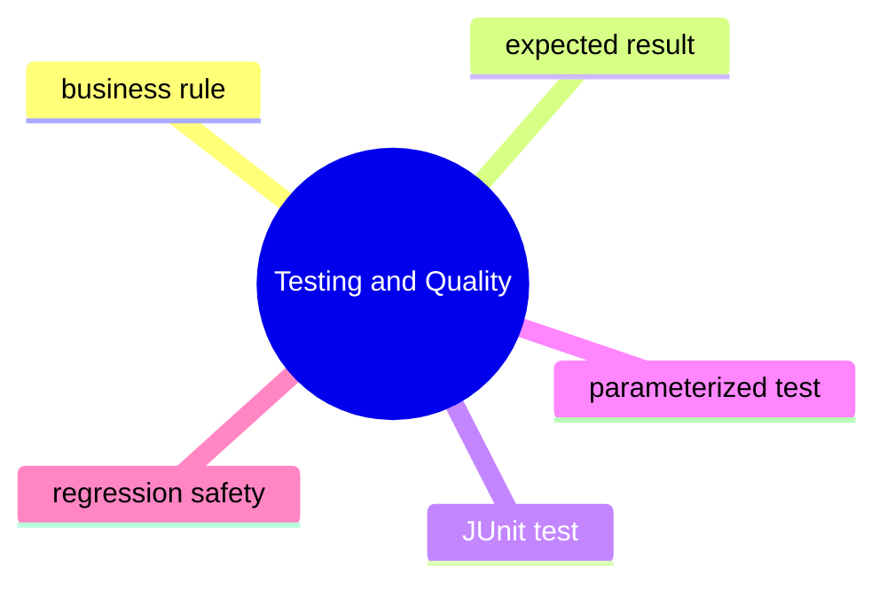

## Quick Summary

### Designing Tests

- start from the business rule, not from framework syntax
- a good test states expected and actual behavior clearly

### JUnit Basics

- JUnit gives structure to setup, execution, and assertion
- the real value comes from precise assertions and readable test names

### Parameterized Tests

- parameterized tests help when the same rule must hold for many inputs
- they reduce repetition while preserving clarity

## Compare With

- manual checking vs automated test:
  manual checking is slow and inconsistent, automated tests are repeatable
- one giant test vs focused tests:
  focused tests fail more clearly and are easier to maintain
- copy-paste tests vs parameterized tests:
  parameterized tests work well when one rule is evaluated against multiple cases

## Mini Case Study

A pricing service adds tax to an item price.

- one test should verify the normal case
- another should verify edge cases such as zero tax
- if many tax rates are checked, parameterized tests reduce repetition

That is exactly what the topic files in this chapter model.

## When To Use

- write tests for business rules and failure-prone behavior
- use JUnit when you need structured automated verification
- use parameterized tests when many inputs exercise one rule

## When Not To Use

- do not write vague tests that only repeat implementation details
- do not create huge assertion bundles that hide the failing behavior
- do not parameterize tests so heavily that readability collapses

## Interview Focus

Q: What makes a test high quality?  
A: It is readable, focused, repeatable, and clearly tied to a business rule.

Q: When is a parameterized test better than several copied tests?  
A: When the same behavior should be checked against many input combinations.

Q: Why is test design more important than framework syntax?  
A: Because poor tests remain poor even if they use a good tool.

## Quick Quiz

1. Why should a test name describe behavior instead of only the method name?
2. When does a parameterized test improve quality, and when can it hurt readability?
3. Why is asserting a business rule stronger than only asserting that a method ran?

## Effective Java Mapping

- Item 49: Check parameters for validity
- Item 67: Optimize judiciously
- Item 76: Strive for failure atomicity

## Sources

- Unit Testing: Principles, Practices, and Patterns: https://www.manning.com/books/unit-testing
- Refactoring, 2nd Edition: https://www.informit.com/store/refactoring-improving-the-design-of-existing-code-9780134757698
- Effective Java, 3rd Edition: https://www.informit.com/store/effective-java-9780134686042

#### Revision

## Before Revision

- rerun `RunAllTopics.java`
- compare the actual output with the expected output comments in each topic file
- explain the chapter in your own words before reading this sheet

## Five Key Ideas

- understand the core idea behind Checking One Rule With Many Inputs
- understand how Designing Tests Around Business Rules changes code behavior or design choice
- know when Writing Readable Junit Tests is useful in real code
- know the common confusion around Designing Tests Around Business Rules
- be able to explain the tradeoff behind Writing Readable Junit Tests

## Three Mistakes To Avoid

- memorizing syntax without checking why the output appears
- using this chapter's idea where a simpler option would be clearer
- ignoring naming, input, output, and side-effect clarity

## Three Interview Questions

1. What real problem does Testing And Quality solve?
2. When would you avoid a heavier approach and choose a simpler one instead?
3. Which example in this chapter is most useful in production code, and why?

## Three OCJP Checks

1. Can you predict the output of the main runnable example without executing it?
2. Can you explain which behavior is compile-time and which is runtime?
3. Can you name one edge case that could confuse a learner in this chapter?

## After Reading This Chapter, You Should Know

- what this chapter is trying to solve
- which Java tool or pattern expresses that idea
- what common mistake to avoid
- how to explain the idea in plain English

## Data Structures And Complexity

This section is where Java API choices meet algorithmic reality.

It should teach more than interview symbols. It should explain why some code keeps working as data grows while other code quietly becomes slow, memory-heavy, or fragile.

## Before You Start

- Prerequisites: sec01_fundamentals and sec02_collections.
- This section prepares you for: stronger collection choices, better performance discussions, and more confident interview problem solving.
- Suggested pace: 4 to 6 focused sessions.

## What Real Problems This Section Solves

- a feature works for 100 rows but slows down badly for 100,000
- the collection chosen “because it worked” is no longer the right fit
- a nested-loop solution is simple but too expensive at scale
- engineers know Big-O terms but cannot connect them to Java code
- sorting, searching, and grouping decisions are made without understanding the hidden cost

## How To Read This Section

- first understand the real operation being measured: lookup, insert, scan, resize, collision, sort
- do not memorize complexity labels without connecting them to the Java data structure underneath
- run the example and ask what work grows as input grows
- compare “simple now” versus “still acceptable later”
- revisit sec02_collections and sec04_streams_and_functional_style after this section to see the tradeoffs more clearly

## Core Mental Models

- Big-O describes growth, not exact runtime on one machine
- average-case and worst-case are both useful, but they answer different questions
- amortized cost means most operations are cheap even if occasional operations are expensive
- choosing the right data structure often matters more than micro-optimizing the code around it

## Current Chapters

- `ch01_reasoning_about_time_and_space`
- `ch02_collections_internals_and_tradeoffs`
- `ch03_sorting_searching_and_binary_search`
- `ch04_problem_solving_patterns`

## How The Chapters Fit Together

- start with Big-O so later tradeoffs have a language
- then connect complexity to actual Java collections like `ArrayList` and `HashMap`
- then study sorting and binary search, where preprocessing changes later cost
- end with sliding window and two-pointers, where pattern recognition removes brute force

## Common Beginner Mistakes

- treating Big-O as exact timing
- ignoring constant work and memory cost completely
- using binary search on unsorted data
- saying `HashMap` is always `O(1)` without understanding collisions
- using nested loops when the data shape allows a better pattern

## What An Experienced Engineer Should Still Get From This Section

- clearer language for performance reviews
- stronger ability to justify collection choices
- better connection between DSA interview patterns and real Java services
- stronger intuition about what work is hidden by convenient APIs

## Recommended Next Step

Revisit sec02_collections, sec04_streams_and_functional_style, and sec05_multithreading_and_concurrency with this stronger cost model.

### Reasoning About Time And Space

This chapter teaches the mental model behind complexity before you attach it to specific Java collections or algorithms.

## What Problem This Chapter Solves

Developers often hear:

- `O(1)`
- `O(log n)`
- `O(n)`
- `O(n log n)`

But those labels stay shallow unless you can answer a simpler question:

What work grows as input grows?

This chapter trains that question first.

## Study Order

1. Run [MeasuringGrowthWithBigO.java](/Users/indiadelhi/repo/career/java-missing-tutorial/code/src/main/java/com/learning/javamissing/sec20_data_structures_and_complexity/ch01_reasoning_about_time_and_space/topics/measuring_growth_with_big_o/MeasuringGrowthWithBigO.java)

## Quick Summary

- Big-O is about growth trend, not exact milliseconds
- linear search checks items one by one
- binary search removes half the remaining search space each step
- complexity language becomes useful only when tied to an actual operation

## Compare With

| Compare | What It Tells You |
| --- | --- |
| timing result vs Big-O | timing shows one environment, Big-O shows how the work grows |
| `O(n)` vs `O(log n)` | both may look fine at small sizes, but growth diverges sharply as input becomes large |
| time complexity vs space complexity | one tracks how much work grows, the other tracks how much memory grows |

## Mini Case Study

Imagine a student portal searching for a roll number.

- scanning every entry works for a small class list
- repeated searching across a large, sorted list changes the tradeoff completely

This is why complexity matters. It tells you when a design will stop scaling comfortably.

## Interview Focus

Q: Why is `O(log n)` usually better than `O(n)` for search?  
A: Because the work grows much more slowly as the input size becomes large.

Q: Why is Big-O not the same as benchmarking?  
A: Because Big-O describes growth shape, while benchmarking measures one implementation under one environment.

## Sources

- Grokking Algorithms: https://www.manning.com/books/grokking-algorithms-second-edition
- Java Performance, 2nd Edition: https://www.oreilly.com/library/view/java-performance-2nd/9781492056102/

#### Revision

## Before Revision

- rerun `RunAllTopics.java`
- compare the actual output with the expected output comments in each topic file
- explain the chapter in your own words before reading this sheet

## Five Key Ideas

- understand the core idea behind Measuring Growth With Big O
- understand how Measuring Growth With Big O changes code behavior or design choice
- know when Measuring Growth With Big O is useful in real code
- know the common confusion around Measuring Growth With Big O
- be able to explain the tradeoff behind Measuring Growth With Big O

## Three Mistakes To Avoid

- memorizing syntax without checking why the output appears
- using this chapter's idea where a simpler option would be clearer
- ignoring naming, input, output, and side-effect clarity

## Three Interview Questions

1. What real problem does Reasoning About Time And Space solve?
2. When would you avoid a heavier approach and choose a simpler one instead?
3. Which example in this chapter is most useful in production code, and why?

## Three OCJP Checks

1. Can you predict the output of the main runnable example without executing it?
2. Can you explain which behavior is compile-time and which is runtime?
3. Can you name one edge case that could confuse a learner in this chapter?

## After Reading This Chapter, You Should Know

- what this chapter is trying to solve
- which Java tool or pattern expresses that idea
- what common mistake to avoid
- how to explain the idea in plain English

### Collections Internals And Tradeoffs

This chapter connects everyday Java collection usage to the hidden work underneath.

## What Problem This Chapter Solves

Many developers know how to use `ArrayList` and `HashMap`, but not what costs appear when data grows:

- `ArrayList` appends usually feel fast, so resize cost gets ignored
- `HashMap` lookups usually feel instant, so collisions get ignored

This chapter turns those hidden costs into visible mental models.

## Study Order

1. Run [ArrayListGrowthAndLookup.java](/Users/indiadelhi/repo/career/java-missing-tutorial/code/src/main/java/com/learning/javamissing/sec20_data_structures_and_complexity/ch02_collections_internals_and_tradeoffs/topics/arraylist_growth_and_lookup/ArrayListGrowthAndLookup.java)
2. Run [HashMapBucketsAndCollisions.java](/Users/indiadelhi/repo/career/java-missing-tutorial/code/src/main/java/com/learning/javamissing/sec20_data_structures_and_complexity/ch02_collections_internals_and_tradeoffs/topics/hashmap_buckets_and_collisions/HashMapBucketsAndCollisions.java)

## Quick Summary

- `ArrayList` index lookup is fast because elements live in a backing array
- growth is amortized: most appends are cheap, occasional resizes copy old elements
- `HashMap` lookup is fast on average when hashes spread keys well
- collisions do not break correctness if `equals` and `hashCode` are implemented properly, but they affect lookup work

## Quick Compare Table

| Compare | Prefer Left When | Prefer Right When |
| --- | --- | --- |
| `ArrayList` append vs middle insert | most items are added at the end | middle changes are dominant and another structure is justified |
| direct index lookup vs repeated scan | the collection is index-based and you know the position | the data shape forces sequential traversal |
| average `HashMap` lookup vs collision-heavy lookup | keys hash well and distribute evenly | collisions concentrate many keys into the same bucket |

## Mini Case Study

Imagine an order dashboard.

- new orders arrive at the end of a list
- the UI often reads by index for pagination
- user sessions are stored by ID in a map

This looks simple until scale increases. Then growth cost and collision behavior start mattering.

## Interview Focus

Q: Why is `ArrayList` append called amortized `O(1)`?  
A: Because most appends are cheap, but occasional growth resizes and copies old elements.

Q: Why can `HashMap` performance degrade?  
A: Because collisions increase the amount of work inside buckets when many keys land together.

## Sources

- Core Java, Volume I: https://www.informit.com/store/core-java-volume-i-fundamentals-9780135558577
- Java Performance, 2nd Edition: https://www.oreilly.com/library/view/java-performance-2nd/9781492056102/

#### Revision

## Before Revision

- rerun `RunAllTopics.java`
- compare the actual output with the expected output comments in each topic file
- explain the chapter in your own words before reading this sheet

## Five Key Ideas

- understand the core idea behind Understanding Arraylist Growth And Lookup
- understand how Understanding Hashmap Buckets And Collisions changes code behavior or design choice
- know when Understanding Arraylist Growth And Lookup is useful in real code
- know the common confusion around Understanding Hashmap Buckets And Collisions
- be able to explain the tradeoff behind Understanding Arraylist Growth And Lookup

## Three Mistakes To Avoid

- memorizing syntax without checking why the output appears
- using this chapter's idea where a simpler option would be clearer
- ignoring naming, input, output, and side-effect clarity

## Three Interview Questions

1. What real problem does Collections Internals And Tradeoffs solve?
2. When would you avoid a heavier approach and choose a simpler one instead?
3. Which example in this chapter is most useful in production code, and why?

## Three OCJP Checks

1. Can you predict the output of the main runnable example without executing it?
2. Can you explain which behavior is compile-time and which is runtime?
3. Can you name one edge case that could confuse a learner in this chapter?

## After Reading This Chapter, You Should Know

- what this chapter is trying to solve
- which Java tool or pattern expresses that idea
- what common mistake to avoid
- how to explain the idea in plain English

### Sorting Searching And Binary Search

This chapter teaches a simple but important tradeoff: sometimes you spend work upfront so future operations become cheaper and clearer.

## What Problem This Chapter Solves

Real systems often need repeated lookups and ordered output:

- sort invoices by amount
- search a sorted list of IDs
- answer range questions quickly

Without a sorting/searching model, code either stays brute-force or uses binary search incorrectly on unsorted data.

## Study Order

1. Run [SortingTradeoffs.java](/Users/indiadelhi/repo/career/java-missing-tutorial/code/src/main/java/com/learning/javamissing/sec20_data_structures_and_complexity/ch03_sorting_searching_and_binary_search/topics/sorting_tradeoffs/SortingTradeoffs.java)
2. Run [UsingBinarySearchCorrectly.java](/Users/indiadelhi/repo/career/java-missing-tutorial/code/src/main/java/com/learning/javamissing/sec20_data_structures_and_complexity/ch03_sorting_searching_and_binary_search/topics/using_binary_search_correctly/UsingBinarySearchCorrectly.java)

## Quick Summary

- sorting costs work now so later operations can become easier
- binary search only works on sorted data
- the value of sorting depends on how often you search or compare later

## Compare With

| Compare | Prefer Left When | Prefer Right When |
| --- | --- | --- |
| unsorted scan | you search once or the data is tiny | you search repeatedly and can justify sorting first |
| sort now | later lookups, paging, or ranking matter | the data is one-off and sorting adds unnecessary cost |
| binary search | the data is sorted and random-access lookup is available | the data is unsorted or the structure does not support practical indexed access |

## Mini Case Study

Think about invoice data.

- finance wants the cheapest invoices first
- support wants to check whether one invoice ID exists
- search operations happen repeatedly

This is when paying an upfront sort cost can make later operations simpler and faster.

## Sources

- Grokking Algorithms: https://www.manning.com/books/grokking-algorithms-second-edition
- Core Java, Volume I: https://www.informit.com/store/core-java-volume-i-fundamentals-9780135558577

#### Revision

## Before Revision

- rerun `RunAllTopics.java`
- compare the actual output with the expected output comments in each topic file
- explain the chapter in your own words before reading this sheet

## Five Key Ideas

- understand the core idea behind Understanding Sorting Tradeoffs
- understand how Using Binary Search Correctly changes code behavior or design choice
- know when Understanding Sorting Tradeoffs is useful in real code
- know the common confusion around Using Binary Search Correctly
- be able to explain the tradeoff behind Understanding Sorting Tradeoffs

## Three Mistakes To Avoid

- memorizing syntax without checking why the output appears
- using this chapter's idea where a simpler option would be clearer
- ignoring naming, input, output, and side-effect clarity

## Three Interview Questions

1. What real problem does Sorting Searching And Binary Search solve?
2. When would you avoid a heavier approach and choose a simpler one instead?
3. Which example in this chapter is most useful in production code, and why?

## Three OCJP Checks

1. Can you predict the output of the main runnable example without executing it?
2. Can you explain which behavior is compile-time and which is runtime?
3. Can you name one edge case that could confuse a learner in this chapter?

## After Reading This Chapter, You Should Know

- what this chapter is trying to solve
- which Java tool or pattern expresses that idea
- what common mistake to avoid
- how to explain the idea in plain English

### Problem Solving Patterns

This chapter collects two patterns that matter because they replace repeated work with a smarter scanning model.

## What Problem This Chapter Solves

Many brute-force solutions repeat work they do not need to repeat:

- recalculate every overlapping window from scratch
- scan the same sorted data with nested loops

Sliding window and two pointers are valuable because they reduce repeated work without making the code magical.

## Study Order

1. Run [SlidingWindowProblems.java](/Users/indiadelhi/repo/career/java-missing-tutorial/code/src/main/java/com/learning/javamissing/sec20_data_structures_and_complexity/ch04_problem_solving_patterns/topics/sliding_window_problems/SlidingWindowProblems.java)
2. Run [ScanningSortedDataWithTwoPointers.java](/Users/indiadelhi/repo/career/java-missing-tutorial/code/src/main/java/com/learning/javamissing/sec20_data_structures_and_complexity/ch04_problem_solving_patterns/topics/scanning_sorted_data_with_two_pointers/ScanningSortedDataWithTwoPointers.java)

## Quick Summary

- sliding window reuses work from the previous range
- two pointers exploit sorted order to remove nested loops
- these patterns matter because they turn repeated recalculation into incremental progress

## Compare With

| Compare | Prefer Left When | Prefer Right When |
| --- | --- | --- |
| brute-force subarray scan | the data is tiny and clarity is more important | windows overlap heavily and repeated recalculation dominates |
| nested loops on sorted data | the size is tiny | the data is sorted and a left/right scan can shrink work |

## Mini Case Study

Imagine two analytics tasks.

- find the best three-hour sales window
- find two prices in a sorted list that match a target budget

Both tasks look like nested-loop problems at first. Both become simpler when you recognize the right scanning pattern.

## Sources

- Grokking Algorithms: https://www.manning.com/books/grokking-algorithms-second-edition
- Grokking the Coding Interview: https://www.educative.io/courses/grokking-the-coding-interview

#### Revision

## Before Revision

- rerun `RunAllTopics.java`
- compare the actual output with the expected output comments in each topic file
- explain the chapter in your own words before reading this sheet

## Five Key Ideas

- understand the core idea behind Scanning Sorted Data With Two Pointers
- understand how Solving Window Problems With Sliding Window changes code behavior or design choice
- know when Scanning Sorted Data With Two Pointers is useful in real code
- know the common confusion around Solving Window Problems With Sliding Window
- be able to explain the tradeoff behind Scanning Sorted Data With Two Pointers

## Three Mistakes To Avoid

- memorizing syntax without checking why the output appears
- using this chapter's idea where a simpler option would be clearer
- ignoring naming, input, output, and side-effect clarity

## Three Interview Questions

1. What real problem does Problem Solving Patterns solve?
2. When would you avoid a heavier approach and choose a simpler one instead?
3. Which example in this chapter is most useful in production code, and why?

## Three OCJP Checks

1. Can you predict the output of the main runnable example without executing it?
2. Can you explain which behavior is compile-time and which is runtime?
3. Can you name one edge case that could confuse a learner in this chapter?

## After Reading This Chapter, You Should Know

- what this chapter is trying to solve
- which Java tool or pattern expresses that idea
- what common mistake to avoid
- how to explain the idea in plain English

