# Java Missing Book Manuscript

Generated from section guides and chapter guides.

## Fundamentals

Current chapters:

- `ch01_java_basics`
- `ch02_classes_and_objects`

## Before You Start

- Prerequisites: None. Start here even if you are new to Java.
- This section prepares you for: Collections, generics, streams, testing, and every later chapter.
- Suggested pace: 3 to 5 focused sessions.

## How To Read This Section

- run the topic files before trying to memorize names
- compare the printed output with the explanation in each topic
- finish the chapter with its revision sheet before moving on

## Why This Section Matters

Collections, generics, streams, testing, and every later chapter.

## Recommended Next Step

Move to sec02_collections and sec03_generics next.

### Java Basics

This chapter is bundled into one guide so the learner does not need to jump across many files.

## What You Learn

- variables and type choice
- control flow
- writing small clear methods
- basic OCJP traps
- basic interview-style answers

## Study Order

1. Run [StoringAndNamingValues.java](/Users/indiadelhi/repo/career/java-missing-tutorial/code/src/main/java/com/learning/javamissing/sec01_fundamentals/ch01_java_basics/topics/storing_and_naming_values/StoringAndNamingValues.java)
2. Run [MakingDecisionsAndRepeatingWork.java](/Users/indiadelhi/repo/career/java-missing-tutorial/code/src/main/java/com/learning/javamissing/sec01_fundamentals/ch01_java_basics/topics/making_decisions_and_repeating_work/MakingDecisionsAndRepeatingWork.java)
3. Run [DesigningSmallMethods.java](/Users/indiadelhi/repo/career/java-missing-tutorial/code/src/main/java/com/learning/javamissing/sec01_fundamentals/ch01_java_basics/topics/designing_small_methods/DesigningSmallMethods.java)
4. Review quiz and interview questions below

## Visual Map

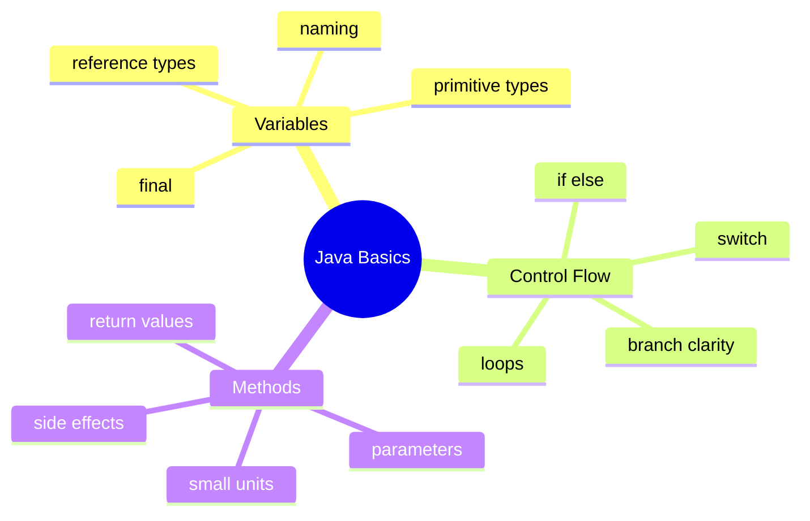
```mermaid
mindmap
  root((Java Basics))
    Variables
      primitive types
      reference types
      final
      naming
    Control Flow
      if else
      loops
      switch
      branch clarity
    Methods
      parameters
      return values
      side effects
      small units
```

## Learning Flow

```mermaid
flowchart LR
  A[Run StoringAndNamingValues] --> B[Understand type and naming choices]
  B --> C[Run MakingDecisionsAndRepeatingWork]
  C --> D[Understand branching and loops]
  D --> E[Run DesigningSmallMethods]
  E --> F[Understand input output and small design]
  F --> G[Review traps quiz interview answers]
```

## Core Notes

### Variables

- choose names that explain the value
- use exact numeric types when correctness matters
- use `final` when reassignment should not happen

### Control Flow

- prefer simple branches first
- use loops that match the problem
- avoid deeply nested logic when guard clauses or simpler conditions work

### Methods

- one method should do one clear thing
- prefer return values over hidden side effects
- method names should explain intent

## Compare With

- variable vs value:
  a variable is the name, the value is the data stored inside it
- `if/else` vs loop:
  `if/else` chooses once, a loop repeats work
- method vs print statement:
  a method can return reusable logic, a print statement only shows text

## Senior Engineer Lens

- naming is not cosmetic; it controls how quickly code can be reviewed under pressure
- exact types reduce hidden defects, especially around money, rounding, and API contracts
- small methods are easier to test, inline mentally, and evolve safely
- basic control-flow clarity matters more in large codebases than clever syntax does

## Decision Chart

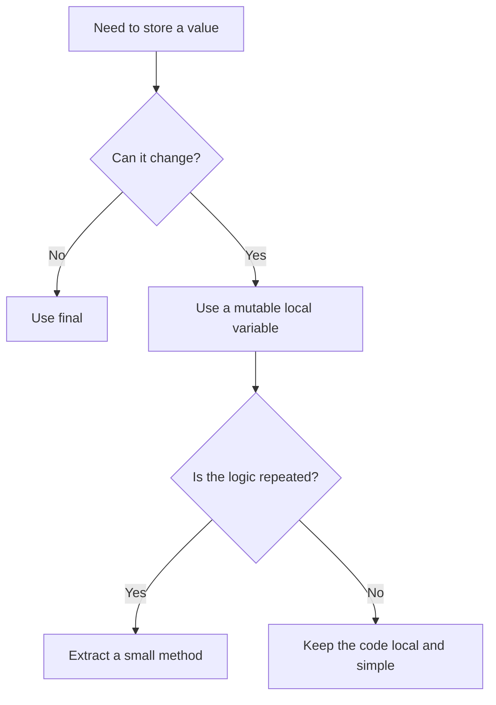
```mermaid
flowchart TD
  A[Need to store a value] --> B{Can it change?}
  B -->|No| C[Use final]
  B -->|Yes| D[Use a mutable local variable]
  D --> E{Is the logic repeated?}
  E -->|Yes| F[Extract a small method]
  E -->|No| G[Keep the code local and simple]
```

## Mini Case Study

Imagine a simple student marks program.

- variables store marks and names
- control flow decides pass or fail
- methods calculate total marks and average

This is why Java basics matter. Larger programs still depend on these same small ideas.

## OCJP Traps

- arithmetic on `byte`, `short`, and `char` promotes to `int`
- `switch` coverage rules matter
- Java is pass-by-value, even for object references
- `while` and `do-while` do not behave the same

## Interview Questions

Q: Why should local variables use meaningful names?  
A: Because names reduce mental load and make behavior easier to verify during reviews, debugging, and interviews.

Q: When is a `for-each` loop better than an indexed loop?  
A: When you only need the value and not the position.

Q: What makes a method easy to maintain?  
A: Small scope, clear name, obvious input and output, and limited side effects.

## Quick Quiz

1. Why does `byte c = a + b;` fail without a cast?
2. When would you use `final` on a local variable?
3. Why might a loop be clearer than a stream for very basic branching logic?
4. Why is returning a value often better than printing inside a method?

## Effective Java Coverage

- Item 5: Prefer dependency injection to hardwiring resources
  Relevance: constructor and method design will expand this in later chapters
- Item 49: Check parameters for validity
  Relevance: methods and defensive thinking
- Item 56: Write doc comments for all exposed API elements
  Relevance: method clarity and teaching style
- Item 61: Prefer primitive types to boxed primitives
  Relevance: variable type choice
- Item 62: Avoid strings where other types are more appropriate
  Relevance: variable and method design
- Item 68: Adhere to generally accepted naming conventions
  Relevance: variables and methods

## Sources

- Oracle Java SE overview: https://www.oracle.com/java/technologies/java-se-glance.html
- Java Language Specification: https://docs.oracle.com/javase/specs/
- Java API documentation: https://docs.oracle.com/en/java/
- Effective Java, 3rd Edition: https://www.informit.com/store/effective-java-9780134686042
- Core Java, Volume I: https://www.informit.com/store/core-java-volume-i-fundamentals-9780135558577
- Learn Java 17 Programming: https://www.packtpub.com/en-us/product/learn-java-17-programming-second-edition-9781803241432

## Slide-Ready Outline

Slide 1: Java basics matter because every later topic depends on them.  
Slide 2: Variables teach type choice and naming.  
Slide 3: Control flow teaches decisions and repetition.  
Slide 4: Methods teach reuse and clearer design.  
Slide 5: OCJP traps come from small syntax and type details.  
Slide 6: Interview questions test explanation, not just syntax.

#### Revision

## Before Revision

- rerun `RunAllTopics.java`
- compare the actual output with the expected output comments in each topic file
- explain the chapter in your own words before reading this sheet

## Five Key Ideas

- understand the core idea behind Designing Small Methods
- understand how Making Decisions And Repeating Work changes code behavior or design choice
- know when Storing And Naming Values is useful in real code
- know the common confusion around Making Decisions And Repeating Work
- be able to explain the tradeoff behind Storing And Naming Values

## Three Mistakes To Avoid

- memorizing syntax without checking why the output appears
- using this chapter's idea where a simpler option would be clearer
- ignoring naming, input, output, and side-effect clarity

## Three Interview Questions

1. What real problem does Java Basics solve?
2. When would you avoid a heavier approach and choose a simpler one instead?
3. Which example in this chapter is most useful in production code, and why?

## Three OCJP Checks

1. Can you predict the output of the main runnable example without executing it?
2. Can you explain which behavior is compile-time and which is runtime?
3. Can you name one edge case that could confuse a learner in this chapter?

## After Reading This Chapter, You Should Know

- what this chapter is trying to solve
- which Java tool or pattern expresses that idea
- what common mistake to avoid
- how to explain the idea in plain English

### Classes And Objects

This chapter teaches how Java models real things in code.

Beginner-friendly promise: this chapter is written so a college fresher can read the guide, run the code, and understand the output step by step.

## Why This Chapter Exists

Business software is full of things with identity and behavior:

- a student
- a vehicle
- an order
- a notification

If the code cannot model those clearly, everything later becomes harder:
validation, testing, maintenance, and debugging.

## Study Order

1. Run [ClassesObjects.java](/Users/indiadelhi/repo/career/java-missing-tutorial/code/src/main/java/com/learning/javamissing/sec01_fundamentals/ch02_classes_and_objects/topics/classes_objects/ClassesObjects.java)
2. Run [Inheritance.java](/Users/indiadelhi/repo/career/java-missing-tutorial/code/src/main/java/com/learning/javamissing/sec01_fundamentals/ch02_classes_and_objects/topics/inheritance/Inheritance.java)
3. Run [Polymorphism.java](/Users/indiadelhi/repo/career/java-missing-tutorial/code/src/main/java/com/learning/javamissing/sec01_fundamentals/ch02_classes_and_objects/topics/polymorphism/Polymorphism.java)
4. Revisit this guide for quiz, interview questions, traps, and design notes.

## Concept Map

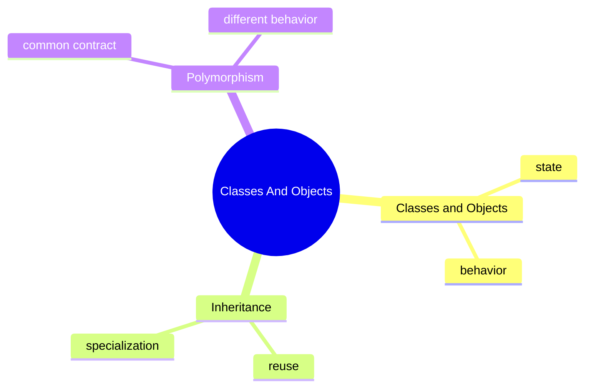
```mermaid
mindmap
  root((Classes And Objects))
    Classes and Objects
      state
      behavior
    Inheritance
      reuse
      specialization
    Polymorphism
      common contract
      different behavior
```

## Core Ideas

### Classes And Objects

- a class is the blueprint
- an object is the working instance
- fields describe state
- methods describe behavior

### Inheritance

- inheritance models an `is-a` relationship
- it is useful when a child type is a specialized version of a parent type
- it becomes harmful when used only to reuse code mechanically

### Polymorphism

- polymorphism lets one contract support many implementations
- it is useful when the caller should not care about the exact subtype

## Real Problems This Chapter Solves

- how to model a student, product, or notification in code
- how to avoid copy-paste behavior across similar types
- how to write code that depends on abstractions instead of concrete classes

## Compare With

- class vs object:
  a class defines the shape, an object is one real instance
- inheritance vs composition:
  inheritance specializes a parent, composition builds behavior from parts
- compile-time type vs runtime type:
  the reference type and the real object type are not always the same

## Deep Dive

The main danger in OOP is not syntax.
It is modeling the wrong relationship.

Good design questions:

- is this really an `is-a` relationship?
- should this caller know the exact subtype?
- is behavior attached to the correct object?
- would composition make this easier to change later?

This is where beginners and experienced engineers both benefit from slowing down.

## Mini Case Study

Imagine a notification system.

- a base notification contract defines `send()`
- email, SMS, and push notifications implement it differently
- the caller only knows it is sending a notification

That is a small but real example of polymorphism helping design.

## OCJP Focus

- reference type and object type can differ
- overridden methods are chosen at runtime
- hidden fields do not behave like overridden methods
- constructor chaining rules matter

## Interview Focus

Q: When is inheritance a bad choice?  
A: When the relationship is only code reuse and not true specialization.

Q: Why is polymorphism useful in production code?  
A: It reduces coupling by letting callers depend on behavior contracts instead of concrete implementations.

Q: What is the difference between composition and inheritance?  
A: Composition builds behavior from collaborating objects, while inheritance reuses and specializes a parent type.

## Quick Quiz

1. What is the difference between a class and an object?
2. Why is overriding resolved differently from field access?
3. When would composition be safer than inheritance?

## Effective Java Mapping

- Item 18: Favor composition over inheritance
- Item 19: Design and document for inheritance or else prohibit it
- Item 20: Prefer interfaces to abstract classes
- Item 23: Prefer class hierarchies to tagged classes

## Sources

- Effective Java, 3rd Edition: https://www.informit.com/store/effective-java-9780134686042
- Core Java, Volume I: https://www.informit.com/store/core-java-volume-i-fundamentals-9780135558577
- Java Language Specification: https://docs.oracle.com/javase/specs/
- Java API documentation: https://docs.oracle.com/en/java/

#### Revision

## Before Revision

- rerun `RunAllTopics.java`
- compare the actual output with the expected output comments in each topic file
- explain the chapter in your own words before reading this sheet

## Five Key Ideas

- understand the core idea behind Classes Objects
- understand how Inheritance changes code behavior or design choice
- know when Polymorphism is useful in real code
- know the common confusion around Inheritance
- be able to explain the tradeoff behind Polymorphism

## Three Mistakes To Avoid

- memorizing syntax without checking why the output appears
- using this chapter's idea where a simpler option would be clearer
- ignoring naming, input, output, and side-effect clarity

## Three Interview Questions

1. What real problem does Classes And Objects solve?
2. When would you avoid a heavier approach and choose a simpler one instead?
3. Which example in this chapter is most useful in production code, and why?

## Three OCJP Checks

1. Can you predict the output of the main runnable example without executing it?
2. Can you explain which behavior is compile-time and which is runtime?
3. Can you name one edge case that could confuse a learner in this chapter?

## After Reading This Chapter, You Should Know

- what this chapter is trying to solve
- which Java tool or pattern expresses that idea
- what common mistake to avoid
- how to explain the idea in plain English

## Collections

Current chapters:

- `ch01_collections`

## Before You Start

- Prerequisites: sec01_fundamentals.
- This section prepares you for: Streams, DSA, clean code, and many interview questions.
- Suggested pace: 2 to 3 focused sessions.

## How To Read This Section

- run the topic files before trying to memorize names
- compare the printed output with the explanation in each topic
- finish the chapter with its revision sheet before moving on

## Why This Section Matters

Streams, DSA, clean code, and many interview questions.

## Recommended Next Step

Move to sec03_generics, sec04_streams_and_functional_style, or sec20_data_structures_and_complexity.

### Collections

This chapter is written for a college fresher.

You should be able to run the files, read the output, and understand why the output appears.

## Beginner Focus

- know the difference between `List`, `Set`, and `Map`
- understand when duplicate values are allowed
- understand why immutable collections are safer
- understand how a comparator changes sorting rules

## Study Order

1. Run [ListSetMap.java](/Users/indiadelhi/repo/career/java-missing-tutorial/code/src/main/java/com/learning/javamissing/sec02_collections/ch01_collections/topics/list_set_map/ListSetMap.java)
2. Run [Immutability.java](/Users/indiadelhi/repo/career/java-missing-tutorial/code/src/main/java/com/learning/javamissing/sec02_collections/ch01_collections/topics/immutability/Immutability.java)
3. Run [Comparator.java](/Users/indiadelhi/repo/career/java-missing-tutorial/code/src/main/java/com/learning/javamissing/sec02_collections/ch01_collections/topics/comparator/Comparator.java)

## Visual Map

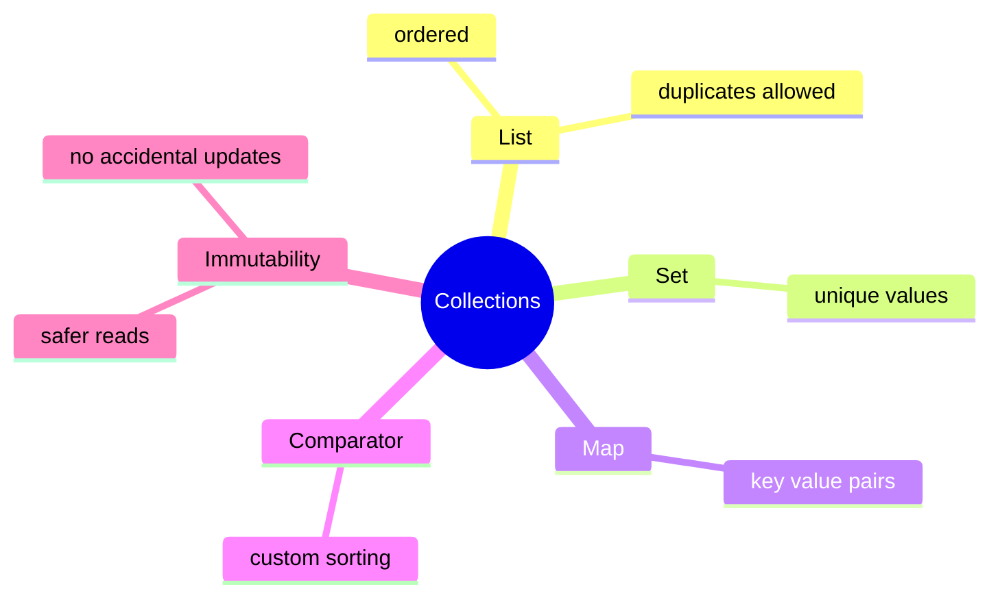
```mermaid
mindmap
  root((Collections))
    List
      ordered
      duplicates allowed
    Set
      unique values
    Map
      key value pairs
    Comparator
      custom sorting
    Immutability
      safer reads
      no accidental updates
```

## Quick Summary

### List, Set, Map

- `List` keeps order and allows duplicates
- `Set` keeps unique values
- `Map` stores data as `key -> value`

### Immutability

- immutable collections cannot be changed after creation
- they reduce accidental bugs

### Comparator

- a comparator tells Java how to sort objects
- it is useful when one object can be sorted in different ways

## Compare With

| Compare | Prefer Left When | Prefer Right When |
| --- | --- | --- |
| `List` vs `Set` | order and duplicates matter | uniqueness matters more than duplicates |
| mutable vs immutable collection | the same owner must keep updating data | callers should not accidentally change shared data |
| built-in order vs comparator | one natural order is enough everywhere | sorting rules change by use case |

## Senior Engineer Lens

- the collection type is part of the API contract, not just a storage detail
- immutability reduces defensive coding and makes concurrent reading safer
- comparator design affects correctness, reproducibility, and sometimes cache or query behavior
- choosing the wrong collection leaks as both readability and performance debt

## Decision Chart

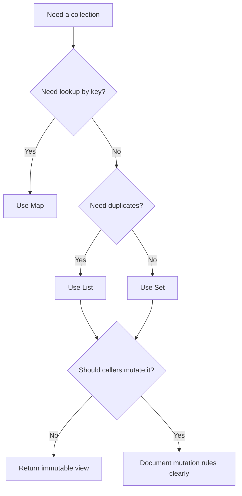
```mermaid
flowchart TD
  A[Need a collection] --> B{Need lookup by key?}
  B -->|Yes| C[Use Map]
  B -->|No| D{Need duplicates?}
  D -->|Yes| E[Use List]
  D -->|No| F[Use Set]
  E --> G{Should callers mutate it?}
  F --> G
  G -->|No| H[Return immutable view]
  G -->|Yes| I[Document mutation rules clearly]
```

## Mini Case Study

Imagine a shopping app.

- `List` keeps products in cart order
- `Set` keeps unique coupon codes
- `Map` stores product id to quantity
- `Comparator` sorts products by price or name
- immutable collections protect a final order summary

## When To Use

- use `List` when order matters
- use `Set` when duplicates should not exist
- use `Map` when you need lookup by key
- use `Comparator` when sorting rules must be explicit

## When Not To Use

- do not use `Set` if duplicates are meaningful
- do not use `Map` if you only need plain ordered values
- do not use mutable collections if shared code should not update them

## OCJP Focus

- know which collections allow duplicates
- know that immutable collections throw exceptions on modification
- know how comparator-based sorting changes result order

## Interview Focus

Q: When would you choose a `Set` over a `List`?  
A: When uniqueness is more important than duplicates or index-based access.

Q: Why are immutable collections useful?  
A: They protect shared data from accidental modification.

Q: Why use a comparator?  
A: Because the same object may need different sorting rules in different situations.

## Quick Quiz

1. Which collection type allows duplicates and keeps order?
2. What happens if you call `add()` on `List.of(...)`?
3. When is a comparator better than changing the class itself?

## Effective Java Mapping

- Item 17: Minimize mutability
- Item 50: Make defensive copies when needed
- Item 58: Prefer for-each loops to traditional for loops
- Item 61: Prefer primitive types to boxed primitives

## Sources

- Core Java, Volume I: https://www.informit.com/store/core-java-volume-i-fundamentals-9780135558577
- Effective Java, 3rd Edition: https://www.informit.com/store/effective-java-9780134686042
- Java API documentation: https://docs.oracle.com/en/java/

#### Revision

## Before Revision

- rerun `RunAllTopics.java`
- compare the actual output with the expected output comments in each topic file
- explain the chapter in your own words before reading this sheet

## Five Key Ideas

- understand the core idea behind Comparator
- understand how Immutability changes code behavior or design choice
- know when List Set Map is useful in real code
- know the common confusion around Immutability
- be able to explain the tradeoff behind List Set Map

## Three Mistakes To Avoid

- memorizing syntax without checking why the output appears
- using this chapter's idea where a simpler option would be clearer
- ignoring naming, input, output, and side-effect clarity

## Three Interview Questions

1. What real problem does Collections solve?
2. When would you avoid a heavier approach and choose a simpler one instead?
3. Which example in this chapter is most useful in production code, and why?

## Three OCJP Checks

1. Can you predict the output of the main runnable example without executing it?
2. Can you explain which behavior is compile-time and which is runtime?
3. Can you name one edge case that could confuse a learner in this chapter?

## After Reading This Chapter, You Should Know

- what this chapter is trying to solve
- which Java tool or pattern expresses that idea
- what common mistake to avoid
- how to explain the idea in plain English

## Generics

Current chapters:

- `ch01_generics`

## Before You Start

- Prerequisites: sec01_fundamentals and basic collections awareness.
- This section prepares you for: Streams, APIs, framework code, and interview reasoning about type safety.
- Suggested pace: 2 to 3 focused sessions.

## How To Read This Section

- run the topic files before trying to memorize names
- compare the printed output with the explanation in each topic
- finish the chapter with its revision sheet before moving on

## Why This Section Matters

Streams, APIs, framework code, and interview reasoning about type safety.

## Recommended Next Step

Move to sec04_streams_and_functional_style or revisit collections APIs with stronger type understanding.

### Generics

This chapter teaches how Java reuses one design safely across many types.

Beginner-friendly promise: this chapter is written so a college fresher can read the guide, run the code, and understand the output step by step.

## Why This Chapter Exists

Without generics, reusable code becomes unsafe:

- you store the wrong type
- you cast too often
- errors move from compile time to runtime

Generics solve the problem of reuse with type safety.

## Deep-Dive Promise

This chapter does not stop at syntax.
It explains:

- what the compiler checks
- what survives at runtime
- why API flexibility becomes hard
- why wildcards confuse so many learners

## Study Order

1. Run [GenericType.java](/Users/indiadelhi/repo/career/java-missing-tutorial/code/src/main/java/com/learning/javamissing/sec03_generics/ch01_generics/topics/generic_type/GenericType.java)
2. Run [Bounds.java](/Users/indiadelhi/repo/career/java-missing-tutorial/code/src/main/java/com/learning/javamissing/sec03_generics/ch01_generics/topics/bounds/Bounds.java)
3. Run [Wildcards.java](/Users/indiadelhi/repo/career/java-missing-tutorial/code/src/main/java/com/learning/javamissing/sec03_generics/ch01_generics/topics/wildcards/Wildcards.java)
4. Revisit this guide for traps, interview angles, and the deeper mental model.

## Concept Map

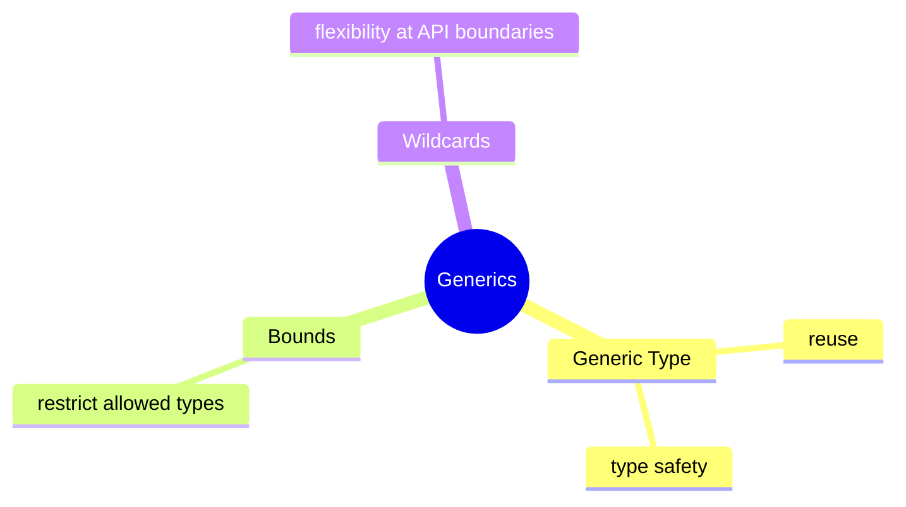
```mermaid
mindmap
  root((Generics))
    Generic Type
      reuse
      type safety
    Bounds
      restrict allowed types
    Wildcards
      flexibility at API boundaries
```

## Core Ideas

### Generic Type

- one class or method can work for many types
- the compiler still checks correctness

### Bounds

- bounds say which kinds of types are allowed
- they are useful when reusable code still needs specific capabilities

### Wildcards

- wildcards make APIs more flexible
- they are useful when exact type parameters are not the main point of the caller

## Real Problems This Chapter Solves

- how to build a reusable container without losing type safety
- how to restrict an API to numbers, comparable values, or some other capability
- how to accept a wider range of collections safely in reusable methods

## Compare With

| Compare | Prefer Left When | Prefer Right When |
| --- | --- | --- |
| raw type vs generic type | almost never in modern code | you want compile-time type safety |
| exact type parameter vs wildcard | the API both reads and writes one exact type | the API boundary should accept a wider related family |
| unbounded vs bounded generic | behavior does not depend on capabilities | behavior needs a guarantee such as `Number` or `Comparable` |

## Deep Dive

Generics are mainly about API design, not syntax.

The real questions are:

- where should the type parameter live?
- should this method consume values, produce values, or both?
- is this API too rigid or too vague?

This is why generics become hard for many learners.
They are easy to read as symbols and hard to understand as design choices.

## What The Compiler Checks

- whether the type arguments match the declaration
- whether a bound is respected
- whether a value can be safely assigned without an explicit cast

## What Happens At Runtime

- most generic type information is erased
- the JVM does not keep full generic detail for ordinary object instances
- this is why `List<String>` and `List<Integer>` do not stay fully distinct at runtime in the same way they are at compile time

## Wrong Mental Model

- “generics are only fancy syntax”
- “wildcards are random symbols to memorize”
- “runtime knows every generic detail”

## Right Mental Model

- generics are compile-time contracts for reusable APIs
- bounds describe capability requirements
- wildcards are about flexibility at method boundaries
- type erasure explains many generic restrictions

## Mental Model

Use this simple rule:

- if your code only needs “some type”, use a generic type parameter
- if your code needs “some subtype of X”, use an upper bound
- if your API should accept a range of related types, think about wildcards

## Mini Case Study

Imagine a reporting system.

- one report box may hold `StudentReport`
- another may hold `SalesReport`
- both should use the same reusable container design

That is the everyday value of generics: reuse without unsafe casting.

## When To Use

- use a generic type when one abstraction should safely support many data types
- use bounds when behavior depends on a capability such as being numeric or comparable
- use wildcards when callers should not be forced into one exact type argument

## When Not To Use

- do not use raw types in normal modern code
- do not add type parameters only for style
- do not make APIs so generic that the business meaning disappears

## OCJP Focus

- type erasure affects runtime behavior
- raw types compile but lose safety
- `? extends` and `? super` are common exam traps
- the compiler, not the JVM, enforces most generic checks

## Interview Focus

Q: Why are generics important in production code?  
A: They let reusable APIs stay type-safe and reduce casts and runtime failures.

Q: When would you use a bound?  
A: When reusable code still needs a guarantee about the capabilities of the type.

Q: Why do wildcards confuse people?  
A: Because they are about API flexibility, not only about syntax.

## Quick Quiz

1. Why are raw types risky?
2. What problem does an upper bound solve?
3. When is a wildcard more useful than an exact type parameter?

## Effective Java Mapping

- Item 26: Don’t use raw types
- Item 28: Prefer lists to arrays
- Item 29: Favor generic types
- Item 30: Favor generic methods
- Item 31: Use bounded wildcards to increase API flexibility

## Sources

- Effective Java, 3rd Edition: https://www.informit.com/store/effective-java-9780134686042
- Core Java, Volume I: https://www.informit.com/store/core-java-volume-i-fundamentals-9780135558577
- Java Language Specification: https://docs.oracle.com/javase/specs/
- Java API documentation: https://docs.oracle.com/en/java/

#### Revision

## Before Revision

- rerun `RunAllTopics.java`
- compare the actual output with the expected output comments in each topic file
- explain the chapter in your own words before reading this sheet

## Five Key Ideas

- understand the core idea behind Bounds
- understand how Generic Type changes code behavior or design choice
- know when Wildcards is useful in real code
- know the common confusion around Generic Type
- be able to explain the tradeoff behind Wildcards

## Three Mistakes To Avoid

- memorizing syntax without checking why the output appears
- using this chapter's idea where a simpler option would be clearer
- ignoring naming, input, output, and side-effect clarity

## Three Interview Questions

1. What real problem does Generics solve?
2. When would you avoid a heavier approach and choose a simpler one instead?
3. Which example in this chapter is most useful in production code, and why?

## Three OCJP Checks

1. Can you predict the output of the main runnable example without executing it?
2. Can you explain which behavior is compile-time and which is runtime?
3. Can you name one edge case that could confuse a learner in this chapter?

## After Reading This Chapter, You Should Know

- what this chapter is trying to solve
- which Java tool or pattern expresses that idea
- what common mistake to avoid
- how to explain the idea in plain English

## Streams And Functional Style

Current chapters:

- `ch01_streams`
- `ch02_functional_interfaces`
- `ch03_data_filtering_and_mapping`
- `ch04_data_grouping_and_aggregation`

## Before You Start

- Prerequisites: sec02_collections and sec03_generics.
- This section prepares you for: Modern Java data transformation, collectors, and business reporting code.
- Suggested pace: 3 to 4 focused sessions.

## How To Read This Section

- run the topic files before trying to memorize names
- compare the printed output with the explanation in each topic
- finish the chapter with its revision sheet before moving on

## Why This Section Matters

Modern Java data transformation, collectors, and business reporting code.

## Recommended Next Step

Move to sec16_core_data_time_and_text or sec19_testing_and_quality.

### Streams

This chapter is written for a college fresher.

Read one example at a time. Run the code. Compare the printed output with the explanation.

## Beginner Focus

- understand what a stream pipeline is
- understand when collectors are useful
- understand why parallel streams need care

## Study Order

1. Run [StreamPipeline.java](/Users/indiadelhi/repo/career/java-missing-tutorial/code/src/main/java/com/learning/javamissing/sec04_streams_and_functional_style/ch01_streams/topics/stream_pipeline/StreamPipeline.java)
2. Run [Collectors.java](/Users/indiadelhi/repo/career/java-missing-tutorial/code/src/main/java/com/learning/javamissing/sec04_streams_and_functional_style/ch01_streams/topics/collectors/Collectors.java)
3. Run [ParallelStreams.java](/Users/indiadelhi/repo/career/java-missing-tutorial/code/src/main/java/com/learning/javamissing/sec04_streams_and_functional_style/ch01_streams/topics/parallel_streams/ParallelStreams.java)

## Visual Map

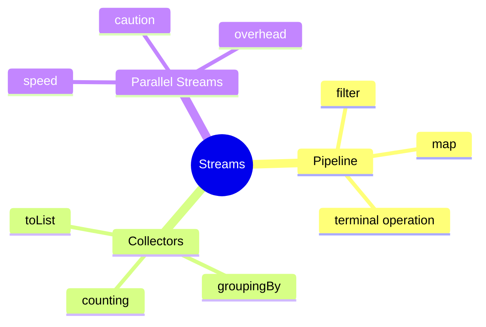
```mermaid
mindmap
  root((Streams))
    Pipeline
      filter
      map
      terminal operation
    Collectors
      toList
      groupingBy
      counting
    Parallel Streams
      speed
      caution
      overhead
```

## Quick Summary

### Stream Pipeline

- a stream pipeline processes data step by step
- intermediate operations prepare the work
- a terminal operation finishes the work

### Collectors

- collectors turn a stream into a final result
- examples: list, set, grouped map, count, summary

### Parallel Streams

- parallel streams can split work
- they are useful only when the work and data size justify the cost

## Compare With

| Compare | Prefer Left When | Prefer Right When |
| --- | --- | --- |
| loop vs stream | logic is stateful or easier to debug step by step | the task is mostly filtering, mapping, grouping, or aggregation |
| `groupingBy` vs `toMap` | many values can belong to one key | each key should map to one value, or you have a merge rule |
| sequential vs parallel stream | clarity and predictable execution matter most | the workload is large, side-effect free, and measured to benefit |

## Senior Engineer Lens

- streams are strongest when the business logic reads like data transformation
- side effects inside pipelines make debugging, testing, and parallelization harder
- collectors are often clearer than hand-written mutable accumulation
- parallel streams are a deployment decision, not a style preference

## Decision Chart

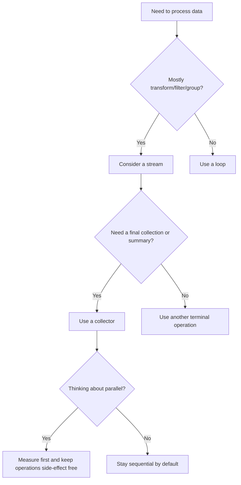
```mermaid
flowchart TD
  A[Need to process data] --> B{Mostly transform/filter/group?}
  B -->|Yes| C[Consider a stream]
  B -->|No| D[Use a loop]
  C --> E{Need a final collection or summary?}
  E -->|Yes| F[Use a collector]
  E -->|No| G[Use another terminal operation]
  F --> H{Thinking about parallel?}
  H -->|Yes| I[Measure first and keep operations side-effect free]
  H -->|No| J[Stay sequential by default]
```

## Mini Case Study

Imagine an order processing screen.

- filter only priority orders
- collect product names by category
- count products per category
- calculate total price of selected orders

This is a natural fit for streams because the task is “take data, transform it, and produce a result”.

## When To Use

- use streams when the task is about filtering, mapping, grouping, or counting
- use collectors when the final result is a collection or summary
- use parallel streams only after checking readability and real performance

## When Not To Use

- do not use streams when a loop is simpler
- do not use parallel streams by default
- do not mutate shared state inside a stream pipeline

## OCJP Focus

- intermediate operations are lazy
- terminal operations trigger execution
- `toMap` can fail on duplicate keys
- `joining` needs text values

## Interview Focus

Q: When is a loop better than a stream?  
A: When the logic is stateful, easier to debug with a loop, or clearer without chaining operations.

Q: When is `groupingBy` better than `toMap`?  
A: When multiple values should belong to the same key.

Q: Why should you be careful with parallel streams?  
A: Because they add overhead and can make code harder to reason about.

## Quick Quiz

1. What is the difference between an intermediate operation and a terminal operation?
2. Why can `Collectors.toMap(...)` fail?
3. Why are parallel streams not always faster?

## Effective Java Mapping

- Item 45: Use streams judiciously
- Item 46: Prefer side-effect-free functions in streams
- Item 47: Prefer Collection to Stream as a return type
- Item 48: Use caution when making streams parallel

## Sources

- Modern Java in Action: https://www.manning.com/books/modern-java-in-action
- Core Java, Volume II: https://www.informit.com/store/core-java-volume-ii-advanced-features-9780135558690
- Effective Java, 3rd Edition: https://www.informit.com/store/effective-java-9780134686042

#### Revision

## Before Revision

- rerun `RunAllTopics.java`
- compare the actual output with the expected output comments in each topic file
- explain the chapter in your own words before reading this sheet

## Five Key Ideas

- understand the core idea behind Collectors
- understand how Parallel Streams changes code behavior or design choice
- know when Stream Pipeline is useful in real code
- know the common confusion around Parallel Streams
- be able to explain the tradeoff behind Stream Pipeline

## Three Mistakes To Avoid

- memorizing syntax without checking why the output appears
- using this chapter's idea where a simpler option would be clearer
- ignoring naming, input, output, and side-effect clarity

## Three Interview Questions

1. What real problem does Streams solve?
2. When would you avoid a heavier approach and choose a simpler one instead?
3. Which example in this chapter is most useful in production code, and why?

## Three OCJP Checks

1. Can you predict the output of the main runnable example without executing it?
2. Can you explain which behavior is compile-time and which is runtime?
3. Can you name one edge case that could confuse a learner in this chapter?

## After Reading This Chapter, You Should Know

- what this chapter is trying to solve
- which Java tool or pattern expresses that idea
- what common mistake to avoid
- how to explain the idea in plain English

### Functional Interfaces

This chapter teaches the concept of passing behavior as data.

## Study Order

1. Run [DefiningFunctions.java](/Users/indiadelhi/repo/career/java-missing-tutorial/code/src/main/java/com/learning/javamissing/sec04_streams_and_functional_style/ch02_functional_interfaces/topics/defining_functions/DefiningFunctions.java)
2. Focus on the concept first: one abstract action, many implementations.
3. Connect the idea to lambdas, callbacks, and reusable business rules.

#### Revision

## Before Revision

- rerun `RunAllTopics.java`
- compare the actual output with the expected output comments in each topic file
- explain the chapter in your own words before reading this sheet

## Five Key Ideas

- understand the core idea behind Defining Functions
- understand how Defining Functions changes code behavior or design choice
- know when Defining Functions is useful in real code
- know the common confusion around Defining Functions
- be able to explain the tradeoff behind Defining Functions

## Three Mistakes To Avoid

- memorizing syntax without checking why the output appears
- using this chapter's idea where a simpler option would be clearer
- ignoring naming, input, output, and side-effect clarity

## Three Interview Questions

1. What real problem does Functional Interfaces solve?
2. When would you avoid a heavier approach and choose a simpler one instead?
3. Which example in this chapter is most useful in production code, and why?

## Three OCJP Checks

1. Can you predict the output of the main runnable example without executing it?
2. Can you explain which behavior is compile-time and which is runtime?
3. Can you name one edge case that could confuse a learner in this chapter?

## After Reading This Chapter, You Should Know

- what this chapter is trying to solve
- which Java tool or pattern expresses that idea
- what common mistake to avoid
- how to explain the idea in plain English

### Data Filtering And Mapping

This chapter teaches how to transform input data into useful output data.

## Study Order

1. Run [FilteringOrders.java](/Users/indiadelhi/repo/career/java-missing-tutorial/code/src/main/java/com/learning/javamissing/sec04_streams_and_functional_style/ch03_data_filtering_and_mapping/topics/filtering_orders/FilteringOrders.java)
2. Focus on the concept first: select the records you need, then shape them.

#### Revision

## Before Revision

- rerun `RunAllTopics.java`
- compare the actual output with the expected output comments in each topic file
- explain the chapter in your own words before reading this sheet

## Five Key Ideas

- understand the core idea behind Filtering Orders
- understand how Filtering Orders changes code behavior or design choice
- know when Filtering Orders is useful in real code
- know the common confusion around Filtering Orders
- be able to explain the tradeoff behind Filtering Orders

## Three Mistakes To Avoid

- memorizing syntax without checking why the output appears
- using this chapter's idea where a simpler option would be clearer
- ignoring naming, input, output, and side-effect clarity

## Three Interview Questions

1. What real problem does Data Filtering And Mapping solve?
2. When would you avoid a heavier approach and choose a simpler one instead?
3. Which example in this chapter is most useful in production code, and why?

## Three OCJP Checks

1. Can you predict the output of the main runnable example without executing it?
2. Can you explain which behavior is compile-time and which is runtime?
3. Can you name one edge case that could confuse a learner in this chapter?

## After Reading This Chapter, You Should Know

- what this chapter is trying to solve
- which Java tool or pattern expresses that idea
- what common mistake to avoid
- how to explain the idea in plain English

### Data Grouping And Aggregation

This chapter teaches how to group related records and calculate summaries.

## Study Order

1. Run [GroupingSales.java](/Users/indiadelhi/repo/career/java-missing-tutorial/code/src/main/java/com/learning/javamissing/sec04_streams_and_functional_style/ch04_data_grouping_and_aggregation/topics/grouping_sales/GroupingSales.java)
2. Focus on the concept first: organize many records into useful totals.

#### Revision

## Before Revision

- rerun `RunAllTopics.java`
- compare the actual output with the expected output comments in each topic file
- explain the chapter in your own words before reading this sheet

## Five Key Ideas

- understand the core idea behind Grouping Sales
- understand how Grouping Sales changes code behavior or design choice
- know when Grouping Sales is useful in real code
- know the common confusion around Grouping Sales
- be able to explain the tradeoff behind Grouping Sales

## Three Mistakes To Avoid

- memorizing syntax without checking why the output appears
- using this chapter's idea where a simpler option would be clearer
- ignoring naming, input, output, and side-effect clarity

## Three Interview Questions

1. What real problem does Data Grouping And Aggregation solve?
2. When would you avoid a heavier approach and choose a simpler one instead?
3. Which example in this chapter is most useful in production code, and why?

## Three OCJP Checks

1. Can you predict the output of the main runnable example without executing it?
2. Can you explain which behavior is compile-time and which is runtime?
3. Can you name one edge case that could confuse a learner in this chapter?

## After Reading This Chapter, You Should Know

- what this chapter is trying to solve
- which Java tool or pattern expresses that idea
- what common mistake to avoid
- how to explain the idea in plain English

## Multithreading And Concurrency

Current chapters:

- `ch01_concurrency_basics`
- `ch02_virtual_threads`
- `ch03_structured_concurrency`
- `ch04_scoped_values`

## Before You Start

- Prerequisites: sec01_fundamentals. Collections and DSA help with reasoning, but are not mandatory.
- This section prepares you for: Modern Java server work, background jobs, and higher-level concurrency APIs.
- Suggested pace: 4 to 6 focused sessions.

## How To Read This Section

- run the topic files before trying to memorize names
- compare the printed output with the explanation in each topic
- finish the chapter with its revision sheet before moving on

## Why This Section Matters

Modern Java server work, background jobs, and higher-level concurrency APIs.

## Recommended Next Step

Move to sec08_internal_of_jvm, sec19_testing_and_quality, and revisit performance tradeoffs in sec20_data_structures_and_complexity.

### Concurrency Basics

This chapter is written for a college fresher.

Read slowly here. Concurrency concepts are easier when you connect them to small examples and visible output.

## Beginner Focus

- understand what a thread is
- understand why shared data can break
- understand why executors are usually safer than manual thread creation

## Study Order

1. Run [Threads.java](/Users/indiadelhi/repo/career/java-missing-tutorial/code/src/main/java/com/learning/javamissing/sec05_multithreading_and_concurrency/ch01_concurrency_basics/topics/threads/Threads.java)
2. Run [Synchronization.java](/Users/indiadelhi/repo/career/java-missing-tutorial/code/src/main/java/com/learning/javamissing/sec05_multithreading_and_concurrency/ch01_concurrency_basics/topics/synchronization/Synchronization.java)
3. Run [Executors.java](/Users/indiadelhi/repo/career/java-missing-tutorial/code/src/main/java/com/learning/javamissing/sec05_multithreading_and_concurrency/ch01_concurrency_basics/topics/executors/Executors.java)

## Visual Map

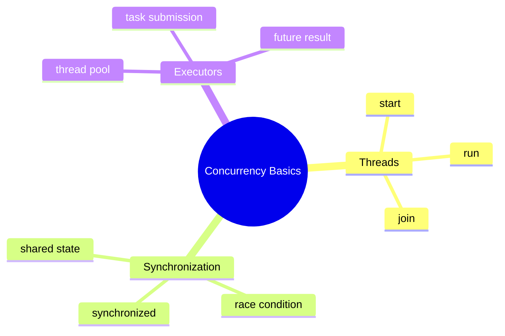
```mermaid
mindmap
  root((Concurrency Basics))
    Threads
      start
      run
      join
    Synchronization
      shared state
      race condition
      synchronized
    Executors
      thread pool
      task submission
      future result
```

## Quick Summary

### Threads

- a thread lets work happen independently
- `start()` begins a new thread
- `join()` waits for the work to finish

### Synchronization

- shared mutable data is dangerous without protection
- `synchronized` prevents lost updates in simple cases

### Executors

- executors manage threads for you
- they are usually cleaner than creating raw threads everywhere

## Compare With

| Compare | Prefer Left When | Prefer Right When |
| --- | --- | --- |
| `run()` vs `start()` | you intentionally want a normal method call on the current thread | you want real concurrent execution |
| thread vs executor | you are learning the basics or have a tiny one-off demo | you need task management, pooling, and cleaner production structure |
| synchronized vs unsynchronized updates | threads share mutable state and correctness matters | state is isolated and no shared mutation exists |

## Senior Engineer Lens

- concurrency bugs are expensive because they are intermittent and hard to reproduce
- executor-based designs usually age better than ad hoc thread creation
- synchronization is about protecting invariants, not only individual lines of code
- clarity beats micro-optimization until correctness and observability are solid

## Decision Chart

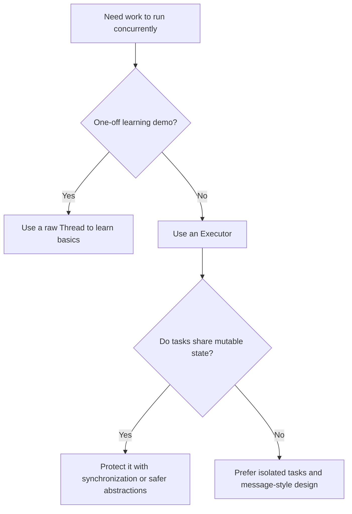
```mermaid
flowchart TD
  A[Need work to run concurrently] --> B{One-off learning demo?}
  B -->|Yes| C[Use a raw Thread to learn basics]
  B -->|No| D[Use an Executor]
  D --> E{Do tasks share mutable state?}
  E -->|Yes| F[Protect it with synchronization or safer abstractions]
  E -->|No| G[Prefer isolated tasks and message-style design]
```

## Mini Case Study

Imagine a reporting system.

- one task loads sales data
- one task loads customer data
- a shared counter tracks progress
- an executor manages tasks instead of creating raw threads everywhere

This is where concurrency starts to matter in real applications.

## When To Use

- use threads for learning the basics
- use synchronization when multiple threads update the same data
- use executors when you have many tasks to manage

## When Not To Use

- do not create raw threads for every task in production-style code
- do not share mutable data without protection
- do not assume thread execution order from `start()` order

## OCJP Focus

- `run()` and `start()` are not the same
- race conditions can produce unpredictable results
- executor tasks may return values through `Future`

## Interview Focus

Q: Why is shared mutable state risky?  
A: Because multiple threads may read and write it at the same time.

Q: Why are executors preferred over manually creating many threads?  
A: They separate task submission from thread management.

Q: What problem does `synchronized` solve?  
A: It protects critical sections from overlapping access.

## Quick Quiz

1. What is the difference between `run()` and `start()`?
2. What is a race condition?
3. Why might an executor be a better choice than raw threads?

## Effective Java Mapping

- Item 78: Synchronize access to shared mutable data
- Item 79: Avoid excessive synchronization
- Item 80: Prefer executors, tasks, and streams to threads
- Item 81: Prefer concurrency utilities to wait and notify

## Sources

- Java Concurrency in Practice: https://www.informit.com/store/java-concurrency-in-practice-9780321349606
- Effective Java, 3rd Edition: https://www.informit.com/store/effective-java-9780134686042
- Java API documentation: https://docs.oracle.com/en/java/

#### Revision

## Before Revision

- rerun `RunAllTopics.java`
- compare the actual output with the expected output comments in each topic file
- explain the chapter in your own words before reading this sheet

## Five Key Ideas

- understand the core idea behind Executors
- understand how Synchronization changes code behavior or design choice
- know when Threads is useful in real code
- know the common confusion around Synchronization
- be able to explain the tradeoff behind Threads

## Three Mistakes To Avoid

- memorizing syntax without checking why the output appears
- using this chapter's idea where a simpler option would be clearer
- ignoring naming, input, output, and side-effect clarity

## Three Interview Questions

1. What real problem does Concurrency Basics solve?
2. When would you avoid a heavier approach and choose a simpler one instead?
3. Which example in this chapter is most useful in production code, and why?

## Three OCJP Checks

1. Can you predict the output of the main runnable example without executing it?
2. Can you explain which behavior is compile-time and which is runtime?
3. Can you name one edge case that could confuse a learner in this chapter?

## After Reading This Chapter, You Should Know

- what this chapter is trying to solve
- which Java tool or pattern expresses that idea
- what common mistake to avoid
- how to explain the idea in plain English

### Virtual Threads

This chapter teaches one concept first: some workloads spend most of their time waiting, not computing. Virtual threads make that style of code easier to scale without forcing callback-heavy designs.

Read the examples in order. After reading this chapter, you should know what virtual threads are good at, what they do not fix, and why "many cheap threads" is different from "magically faster code".

## What Problem This Chapter Solves

Traditional platform threads are relatively expensive when you need huge numbers of blocking tasks, such as:

- request-per-user systems
- background job polling
- calling slow external services
- waiting on files, sockets, or databases

Virtual threads help when the work mostly waits. They do not remove bad locking, bad design, or slow algorithms.

## Study Order

1. Run [WhyVirtualThreadsMatter.java](/Users/indiadelhi/repo/career/java-missing-tutorial/code/src/main/java/com/learning/javamissing/sec05_multithreading_and_concurrency/ch02_virtual_threads/topics/why_virtual_threads_matter/WhyVirtualThreadsMatter.java)
2. Run [RunningTasksWithVirtualThreadExecutor.java](/Users/indiadelhi/repo/career/java-missing-tutorial/code/src/main/java/com/learning/javamissing/sec05_multithreading_and_concurrency/ch02_virtual_threads/topics/running_tasks_with_virtual_thread_executor/RunningTasksWithVirtualThreadExecutor.java)
3. Run [AvoidingVirtualThreadMisuse.java](/Users/indiadelhi/repo/career/java-missing-tutorial/code/src/main/java/com/learning/javamissing/sec05_multithreading_and_concurrency/ch02_virtual_threads/topics/avoiding_virtual_thread_misuse/AvoidingVirtualThreadMisuse.java)

## Concept Map

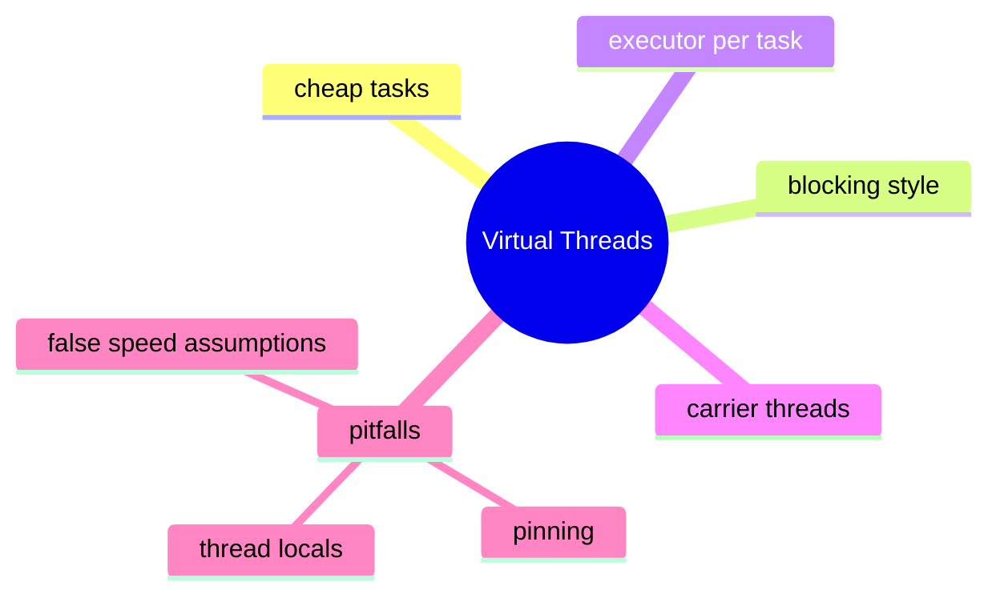
```mermaid
mindmap
  root((Virtual Threads))
    cheap tasks
    blocking style
    executor per task
    carrier threads
    pitfalls
      pinning
      thread locals
      false speed assumptions
```

## Quick Summary

### Why Virtual Threads Matter

- a virtual thread is still a `Thread`
- the difference is cost model, not the programming model
- it is useful when tasks block often

### Running Tasks With A Virtual-Thread Executor

- `newVirtualThreadPerTaskExecutor()` is a practical way to launch many independent tasks
- each submitted task can use a simple blocking style

### Avoiding Virtual Thread Misuse

- virtual threads do not make CPU-bound work faster
- long `synchronized` sections can pin carriers and reduce scalability
- thread-local-heavy code may need review

## Compare With

- platform thread vs virtual thread:
  both are threads, but virtual threads are meant to be much cheaper to create in large numbers
- thread pool reuse vs virtual-thread-per-task:
  pools limit concurrency explicitly, virtual threads let you model one task as one thread more naturally
- blocking style vs callback style:
  virtual threads let you keep blocking code readable in many I/O-heavy cases

## Mini Case Study

Imagine a travel site handling hotel search.

- one request needs room availability
- one request needs pricing
- one request needs reviews

All three calls mostly wait on I/O. Virtual threads let the code keep a direct request style while still handling large concurrency.

## When To Use

- use virtual threads for large numbers of mostly waiting tasks
- use them when simpler blocking code improves readability
- use per-task executors when tasks are independent

## When Not To Use

- do not expect them to speed up heavy CPU calculation
- do not keep long lock-holding blocks just because the thread is virtual
- do not ignore memory and context propagation costs

## OCJP Focus

- virtual threads are still threads
- code using them must still handle interruption and task coordination correctly
- thread safety rules do not change because the thread type changed

## Interview Focus

Q: What problem do virtual threads solve?  
A: They reduce the cost of handling very many blocking tasks while preserving a direct thread-based coding style.

Q: Are virtual threads always better than thread pools?  
A: No. They are better for many waiting tasks, not for every workload.

Q: What is a common mistake when adopting virtual threads?  
A: Assuming they automatically fix slow synchronized code, CPU-heavy work, or poor resource management.

## Quick Quiz

1. Why can a virtual-thread-based design still perform badly?
2. Why is "one task, one virtual thread" often easier to read than callback chains?
3. Why should you still care about locking and shared state when using virtual threads?

## Effective Java Mapping

- Item 78: Synchronize access to shared mutable data
- Item 79: Avoid excessive synchronization
- Item 80: Prefer executors, tasks, and streams to threads
- Item 81: Prefer concurrency utilities to `wait` and `notify`

## Sources

- Java API documentation: https://docs.oracle.com/en/java/
- OpenJDK JEP index: https://openjdk.org/jeps/0
- Core Java, Volume I: https://www.informit.com/store/core-java-volume-i-fundamentals-9780135558577
- Effective Java, 3rd Edition: https://www.informit.com/store/effective-java-9780134686042

#### Revision

## Before Revision

- rerun `RunAllTopics.java`
- compare the actual output with the expected output comments in each topic file
- explain the chapter in your own words before reading this sheet

## Five Key Ideas

- understand the core idea behind Avoiding Virtual Thread Misuse
- understand how Running Tasks With Virtual Thread Executor changes code behavior or design choice
- know when Why Virtual Threads Matter is useful in real code
- know the common confusion around Running Tasks With Virtual Thread Executor
- be able to explain the tradeoff behind Why Virtual Threads Matter

## Three Mistakes To Avoid

- memorizing syntax without checking why the output appears
- using this chapter's idea where a simpler option would be clearer
- ignoring naming, input, output, and side-effect clarity

## Three Interview Questions

1. What real problem does Virtual Threads solve?
2. When would you avoid a heavier approach and choose a simpler one instead?
3. Which example in this chapter is most useful in production code, and why?

## Three OCJP Checks

1. Can you predict the output of the main runnable example without executing it?
2. Can you explain which behavior is compile-time and which is runtime?
3. Can you name one edge case that could confuse a learner in this chapter?

## After Reading This Chapter, You Should Know

- what this chapter is trying to solve
- which Java tool or pattern expresses that idea
- what common mistake to avoid
- how to explain the idea in plain English

### Structured Concurrency

This chapter teaches a design idea, not just an API: related tasks should be started, awaited, cancelled, and failed as one unit.

Read the code with that mental model in mind. After reading this chapter, you should know why grouping subtasks under one parent scope is safer than scattering futures across the codebase.

## What Problem This Chapter Solves

Many request flows need several subtasks:

- fetch user profile
- fetch billing plan
- send email
- load backup data source

Without structure, those subtasks can outlive the request, fail independently, or keep running after the result is no longer needed. Structured concurrency keeps child tasks inside a clear lifetime.

## Study Order

1. Run [KeepingChildTasksInsideOneRequest.java](/Users/indiadelhi/repo/career/java-missing-tutorial/code/src/main/java/com/learning/javamissing/sec05_multithreading_and_concurrency/ch03_structured_concurrency/topics/keeping_child_tasks_inside_one_request/KeepingChildTasksInsideOneRequest.java)
2. Run [CollectingResultsFromChildTasks.java](/Users/indiadelhi/repo/career/java-missing-tutorial/code/src/main/java/com/learning/javamissing/sec05_multithreading_and_concurrency/ch03_structured_concurrency/topics/collecting_results_from_child_tasks/CollectingResultsFromChildTasks.java)
3. Run [ChoosingFirstSuccessfulResult.java](/Users/indiadelhi/repo/career/java-missing-tutorial/code/src/main/java/com/learning/javamissing/sec05_multithreading_and_concurrency/ch03_structured_concurrency/topics/choosing_first_successful_result/ChoosingFirstSuccessfulResult.java)

## Concept Map

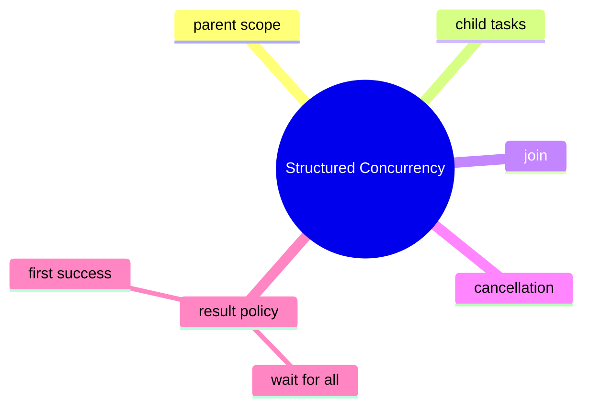
```mermaid
mindmap
  root((Structured Concurrency))
    parent scope
    child tasks
    join
    cancellation
    result policy
      wait for all
      first success
```

## Quick Summary

### Scope

- the parent task owns child-task lifetime
- child tasks should not escape that scope

### Result Handling

- joining all successful subtasks is useful when every result is required
- failure should be handled as part of the whole operation

### Shutdown Policy

- some problems want the first successful answer
- slower siblings can be cancelled once the result is no longer needed

## Compare With

- scattered `Future` handling vs structured scope:
  structured scope keeps lifetime, cancellation, and failure policy in one place
- await-all vs first-success:
  await-all fits workflows that need every result, first-success fits fallback or replica strategies
- unbounded background tasks vs request-scoped tasks:
  structured concurrency favors tasks that belong to a parent operation

## Mini Case Study

Imagine a profile page request.

- fetch account details
- fetch subscription plan
- fetch recommendations

If the request fails or is cancelled, child tasks should stop too. If one of two mirror services returns first, the loser should be stopped. That is the problem structured concurrency solves.

## When To Use

- use it when several tasks belong to one request or workflow
- use it when cancellation and failure should be coordinated
- use it when task lifetime should stay easy to reason about

## When Not To Use

- do not use it for independent long-lived background jobs
- do not force a first-success policy when the workflow truly needs all results
- do not treat preview APIs as fully stable across Java releases without checking version notes

## Version Note

This chapter uses the Java 25 preview form of `StructuredTaskScope`. Preview APIs can change between releases, so always match the code to the JDK version you compile with.

## Interview Focus

Q: What is the main benefit of structured concurrency?  
A: It keeps related concurrent tasks under one parent lifetime, which improves cancellation, failure handling, and readability.

Q: When is a first-success policy useful?  
A: When several providers can return interchangeable answers and only the fastest success is needed.

Q: Why is this better than manually managing futures everywhere?  
A: Because the policy is explicit and local instead of being spread across unrelated code paths.

## Quick Quiz

1. Why is a request-scoped task model safer than letting child tasks escape?
2. When is waiting for all subtasks the correct design?
3. Why should preview API version changes be treated as part of the learning material here?

## Effective Java Mapping

- Item 78: Synchronize access to shared mutable data
- Item 80: Prefer executors, tasks, and streams to threads
- Item 81: Prefer concurrency utilities to `wait` and `notify`

## Sources

- Java API documentation: https://docs.oracle.com/en/java/
- OpenJDK JEP index: https://openjdk.org/jeps/0
- Effective Java, 3rd Edition: https://www.informit.com/store/effective-java-9780134686042

#### Revision

## Before Revision

- rerun `RunAllTopics.java`
- compare the actual output with the expected output comments in each topic file
- explain the chapter in your own words before reading this sheet

## Five Key Ideas

- understand the core idea behind Choosing First Successful Result
- understand how Collecting Results From Child Tasks changes code behavior or design choice
- know when Keeping Child Tasks Inside One Request is useful in real code
- know the common confusion around Collecting Results From Child Tasks
- be able to explain the tradeoff behind Keeping Child Tasks Inside One Request

## Three Mistakes To Avoid

- memorizing syntax without checking why the output appears
- using this chapter's idea where a simpler option would be clearer
- ignoring naming, input, output, and side-effect clarity

## Three Interview Questions

1. What real problem does Structured Concurrency solve?
2. When would you avoid a heavier approach and choose a simpler one instead?
3. Which example in this chapter is most useful in production code, and why?

## Three OCJP Checks

1. Can you predict the output of the main runnable example without executing it?
2. Can you explain which behavior is compile-time and which is runtime?
3. Can you name one edge case that could confuse a learner in this chapter?

## After Reading This Chapter, You Should Know

- what this chapter is trying to solve
- which Java tool or pattern expresses that idea
- what common mistake to avoid
- how to explain the idea in plain English

### Scoped Values

This chapter teaches a narrow but important idea: some context should flow through a call tree for one operation, without becoming mutable global state.

Read these examples after the virtual-thread and structured-concurrency chapters. After reading this chapter, you should know why scoped values are about safe context sharing, not about replacing ordinary method parameters everywhere.

## What Problem This Chapter Solves

Many systems need request context:

- request id
- current user
- tenant id
- trace id

Passing those values through every method can be noisy. Using mutable thread-local state can be risky. Scoped values provide a way to bind context for a limited dynamic scope.

## Study Order

1. Run [IntroducingScopedValues.java](/Users/indiadelhi/repo/career/java-missing-tutorial/code/src/main/java/com/learning/javamissing/sec05_multithreading_and_concurrency/ch04_scoped_values/topics/introducing_scoped_values/IntroducingScopedValues.java)
2. Run [BindingRequestContext.java](/Users/indiadelhi/repo/career/java-missing-tutorial/code/src/main/java/com/learning/javamissing/sec05_multithreading_and_concurrency/ch04_scoped_values/topics/binding_request_context/BindingRequestContext.java)
3. Run [ScopedValuesVsThreadLocal.java](/Users/indiadelhi/repo/career/java-missing-tutorial/code/src/main/java/com/learning/javamissing/sec05_multithreading_and_concurrency/ch04_scoped_values/topics/scoped_values_vs_thread_local/ScopedValuesVsThreadLocal.java)

## Concept Map

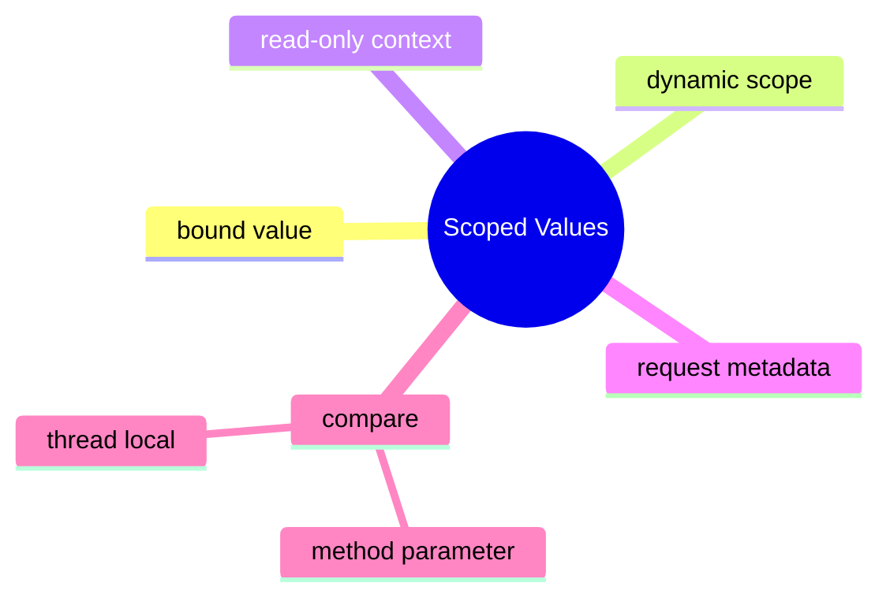
```mermaid
mindmap
  root((Scoped Values))
    bound value
    dynamic scope
    read-only context
    request metadata
    compare
      method parameter
      thread local
```

## Quick Summary

### Intro

- a scoped value is bound for a limited execution scope
- code inside that scope can read it directly

### Binding

- binding is useful for request-level context such as request ids
- the value disappears outside the bound region

### Vs Thread Local

- thread-local state is mutable per thread
- scoped values are a better fit when context should be bound and read, not mutated and leaked

## Compare With

- method parameter vs scoped value:
  parameters are clearer when only a few calls need the value, scoped values help when context must cross many layers
- thread local vs scoped value:
  thread locals are mutable and easier to misuse, scoped values emphasize bounded read-only context
- global static state vs scoped value:
  static state leaks everywhere, scoped values stay within the operation boundary

## Mini Case Study

An API request enters the server with request id `req-2026-04-07`.

- controller needs it for logging
- service layer needs it for tracing
- repository needs it for diagnostics

That value belongs to the request, not to one object forever. Scoped values model that better than a mutable shared holder.

## When To Use

- use scoped values for operation-scoped context
- use them when the context should be readable but not arbitrarily mutated
- use them when many layers need the same request metadata

## When Not To Use

- do not use them as a substitute for ordinary business data parameters everywhere
- do not store mutable domain state in them
- do not ignore lifecycle boundaries

## Version Note

This chapter depends on preview APIs. Match your JDK and compiler flags to the chapter setup before running the examples.

## Interview Focus

Q: What is the main use case for scoped values?  
A: Passing read-mostly request context through an execution scope without manual plumbing everywhere.

Q: Why are scoped values often safer than thread locals?  
A: Their lifetime is explicit and bounded, which reduces accidental leakage and mutation.

Q: When should you still prefer a normal parameter?  
A: When the value is part of the business data of a method and only a small call chain needs it.

## Quick Quiz

1. Why is request id a good scoped-value candidate?
2. Why should mutable business state stay out of scoped values?
3. When is a plain method parameter clearer than a scoped value?

## Effective Java Mapping

- Item 17: Minimize mutability
- Item 57: Minimize the scope of local variables
- Item 78: Synchronize access to shared mutable data

## Sources

- Java API documentation: https://docs.oracle.com/en/java/
- OpenJDK JEP index: https://openjdk.org/jeps/0
- Effective Java, 3rd Edition: https://www.informit.com/store/effective-java-9780134686042

#### Revision

## Before Revision

- rerun `RunAllTopics.java`
- compare the actual output with the expected output comments in each topic file
- explain the chapter in your own words before reading this sheet

## Five Key Ideas

- understand the core idea behind Binding Request Context
- understand how Introducing Scoped Values changes code behavior or design choice
- know when Scoped Values Vs Thread Local is useful in real code
- know the common confusion around Introducing Scoped Values
- be able to explain the tradeoff behind Scoped Values Vs Thread Local

## Three Mistakes To Avoid

- memorizing syntax without checking why the output appears
- using this chapter's idea where a simpler option would be clearer
- ignoring naming, input, output, and side-effect clarity

## Three Interview Questions

1. What real problem does Scoped Values solve?
2. When would you avoid a heavier approach and choose a simpler one instead?
3. Which example in this chapter is most useful in production code, and why?

## Three OCJP Checks

1. Can you predict the output of the main runnable example without executing it?
2. Can you explain which behavior is compile-time and which is runtime?
3. Can you name one edge case that could confuse a learner in this chapter?

## After Reading This Chapter, You Should Know

- what this chapter is trying to solve
- which Java tool or pattern expresses that idea
- what common mistake to avoid
- how to explain the idea in plain English

## Design Patterns

Current chapters:

- `ch01_strategy_pattern`
- `ch02_creational_patterns`
- `ch03_structural_patterns`
- `ch04_behavioral_patterns`
- `ch05_request_routing_patterns`

## Before You Start

- Prerequisites: sec01_fundamentals and sec07_principles_and_solid are helpful.
- This section prepares you for: Architectural conversations, framework reading, and cleaner extension points in production code.
- Suggested pace: 3 to 5 focused sessions.

## How To Read This Section

- run the topic files before trying to memorize names
- compare the printed output with the explanation in each topic
- finish the chapter with its revision sheet before moving on

## Why This Section Matters

Architectural conversations, framework reading, and cleaner extension points in production code.

## Recommended Next Step

Move to sec07_principles_and_solid and sec18_architecture_and_integration.

### Strategy Pattern

This chapter teaches one simple idea: when behavior changes, move that behavior behind an interface instead of growing a large `if-else` block.

## Study Order

1. Run [ChoosingBehaviorWithStrategy.java](/Users/indiadelhi/repo/career/java-missing-tutorial/code/src/main/java/com/learning/javamissing/sec06_design_patterns/ch01_strategy_pattern/topics/choosing_behavior_with_strategy/ChoosingBehaviorWithStrategy.java)

## Why This Chapter Matters

Many systems choose one behavior from many:

- payment discount rule
- shipping cost rule
- pricing rule

The strategy pattern keeps that choice flexible and readable.

#### Revision

## Before Revision

- rerun `RunAllTopics.java`
- compare the actual output with the expected output comments in each topic file
- explain the chapter in your own words before reading this sheet

## Five Key Ideas

- understand the core idea behind Choosing Behavior With Strategy
- understand how Choosing Behavior With Strategy changes code behavior or design choice
- know when Choosing Behavior With Strategy is useful in real code
- know the common confusion around Choosing Behavior With Strategy
- be able to explain the tradeoff behind Choosing Behavior With Strategy

## Three Mistakes To Avoid

- memorizing syntax without checking why the output appears
- using this chapter's idea where a simpler option would be clearer
- ignoring naming, input, output, and side-effect clarity

## Three Interview Questions

1. What real problem does Strategy Pattern solve?
2. When would you avoid a heavier approach and choose a simpler one instead?
3. Which example in this chapter is most useful in production code, and why?

## Three OCJP Checks

1. Can you predict the output of the main runnable example without executing it?
2. Can you explain which behavior is compile-time and which is runtime?
3. Can you name one edge case that could confuse a learner in this chapter?

## After Reading This Chapter, You Should Know

- what this chapter is trying to solve
- which Java tool or pattern expresses that idea
- what common mistake to avoid
- how to explain the idea in plain English

### Creational Patterns

This chapter covers the common question: how should an object be created when construction logic starts becoming messy?

## Study Order

1. Run [CreatingObjectsWithFactoryMethod.java](/Users/indiadelhi/repo/career/java-missing-tutorial/code/src/main/java/com/learning/javamissing/sec06_design_patterns/ch02_creational_patterns/topics/creating_objects_with_factory_method/CreatingObjectsWithFactoryMethod.java)
2. Run [AssemblingObjectsWithBuilder.java](/Users/indiadelhi/repo/career/java-missing-tutorial/code/src/main/java/com/learning/javamissing/sec06_design_patterns/ch02_creational_patterns/topics/assembling_objects_with_builder/AssemblingObjectsWithBuilder.java)

## What You Learn

- when a factory method removes object-creation branching from callers
- when a builder makes many optional fields easier to read
- when simple constructors are still the better choice

## Compare With

- constructor vs factory:
  a constructor always exposes one concrete class, a factory can hide the concrete choice
- telescoping constructor vs builder:
  a builder is clearer when many optional settings exist

## Interview Focus

Q: When is a factory method useful?  
A: When callers should ask for a capability and not care about the concrete class.

Q: When is a builder useful?  
A: When object creation has many optional inputs and readability matters more than minimal code.

## Effective Java Mapping

- Item 1: Consider static factory methods instead of constructors
- Item 2: Consider a builder when faced with many constructor parameters

## Sources

- Effective Java, 3rd Edition: https://www.informit.com/store/effective-java-9780134686042
- Head First Design Patterns: https://www.oreilly.com/library/view/head-first-design/9781492077992/

#### Revision

## Before Revision

- rerun `RunAllTopics.java`
- compare the actual output with the expected output comments in each topic file
- explain the chapter in your own words before reading this sheet

## Five Key Ideas

- understand the core idea behind Assembling Objects With Builder
- understand how Creating Objects With Factory Method changes code behavior or design choice
- know when Assembling Objects With Builder is useful in real code
- know the common confusion around Creating Objects With Factory Method
- be able to explain the tradeoff behind Assembling Objects With Builder

## Three Mistakes To Avoid

- memorizing syntax without checking why the output appears
- using this chapter's idea where a simpler option would be clearer
- ignoring naming, input, output, and side-effect clarity

## Three Interview Questions

1. What real problem does Creational Patterns solve?
2. When would you avoid a heavier approach and choose a simpler one instead?
3. Which example in this chapter is most useful in production code, and why?

## Three OCJP Checks

1. Can you predict the output of the main runnable example without executing it?
2. Can you explain which behavior is compile-time and which is runtime?
3. Can you name one edge case that could confuse a learner in this chapter?

## After Reading This Chapter, You Should Know

- what this chapter is trying to solve
- which Java tool or pattern expresses that idea
- what common mistake to avoid
- how to explain the idea in plain English

### Structural Patterns

This chapter is about shape, not business rules. Structural patterns help separate what your code wants from what an existing API provides.

## Study Order

1. Run [TranslatingIncompatibleApisWithAdapter.java](/Users/indiadelhi/repo/career/java-missing-tutorial/code/src/main/java/com/learning/javamissing/sec06_design_patterns/ch03_structural_patterns/topics/translating_incompatible_apis_with_adapter/TranslatingIncompatibleApisWithAdapter.java)
2. Run [AddingFeaturesWithDecorator.java](/Users/indiadelhi/repo/career/java-missing-tutorial/code/src/main/java/com/learning/javamissing/sec06_design_patterns/ch03_structural_patterns/topics/adding_features_with_decorator/AddingFeaturesWithDecorator.java)

## What You Learn

- adapter helps one interface talk to another
- decorator adds behavior without changing the original object
- structural patterns are strongest at integration boundaries

## Interview Focus

Q: Adapter vs decorator?  
A: Adapter changes the shape of an API. Decorator keeps the same shape and adds behavior around it.

## Sources

- Head First Design Patterns: https://www.oreilly.com/library/view/head-first-design/9781492077992/
- Refactoring.Guru Pattern Catalog: https://refactoring.guru/design-patterns/catalog

#### Revision

## Before Revision

- rerun `RunAllTopics.java`
- compare the actual output with the expected output comments in each topic file
- explain the chapter in your own words before reading this sheet

## Five Key Ideas

- understand the core idea behind Adding Features With Decorator
- understand how Translating Incompatible Apis With Adapter changes code behavior or design choice
- know when Adding Features With Decorator is useful in real code
- know the common confusion around Translating Incompatible Apis With Adapter
- be able to explain the tradeoff behind Adding Features With Decorator

## Three Mistakes To Avoid

- memorizing syntax without checking why the output appears
- using this chapter's idea where a simpler option would be clearer
- ignoring naming, input, output, and side-effect clarity

## Three Interview Questions

1. What real problem does Structural Patterns solve?
2. When would you avoid a heavier approach and choose a simpler one instead?
3. Which example in this chapter is most useful in production code, and why?

## Three OCJP Checks

1. Can you predict the output of the main runnable example without executing it?
2. Can you explain which behavior is compile-time and which is runtime?
3. Can you name one edge case that could confuse a learner in this chapter?

## After Reading This Chapter, You Should Know

- what this chapter is trying to solve
- which Java tool or pattern expresses that idea
- what common mistake to avoid
- how to explain the idea in plain English

### Behavioral Patterns

Behavioral patterns focus on how work flows through the system.

## Study Order

1. Run [PublishingUpdatesWithObserver.java](/Users/indiadelhi/repo/career/java-missing-tutorial/code/src/main/java/com/learning/javamissing/sec06_design_patterns/ch04_behavioral_patterns/topics/publishing_updates_with_observer/PublishingUpdatesWithObserver.java)
2. Run [CapturingWorkflowsWithTemplateMethod.java](/Users/indiadelhi/repo/career/java-missing-tutorial/code/src/main/java/com/learning/javamissing/sec06_design_patterns/ch04_behavioral_patterns/topics/capturing_workflows_with_template_method/CapturingWorkflowsWithTemplateMethod.java)

## What You Learn

- observer helps multiple listeners react to one event
- template method keeps a stable workflow while allowing small variations
- behavioral patterns often appear in frameworks, integrations, and event-driven code

## Sources

- Head First Design Patterns: https://www.oreilly.com/library/view/head-first-design/9781492077992/
- Refactoring.Guru Pattern Catalog: https://refactoring.guru/design-patterns/catalog

#### Revision

## Before Revision

- rerun `RunAllTopics.java`
- compare the actual output with the expected output comments in each topic file
- explain the chapter in your own words before reading this sheet

## Five Key Ideas

- understand the core idea behind Capturing Workflows With Template Method
- understand how Publishing Updates With Observer changes code behavior or design choice
- know when Capturing Workflows With Template Method is useful in real code
- know the common confusion around Publishing Updates With Observer
- be able to explain the tradeoff behind Capturing Workflows With Template Method

## Three Mistakes To Avoid

- memorizing syntax without checking why the output appears
- using this chapter's idea where a simpler option would be clearer
- ignoring naming, input, output, and side-effect clarity

## Three Interview Questions

1. What real problem does Behavioral Patterns solve?
2. When would you avoid a heavier approach and choose a simpler one instead?
3. Which example in this chapter is most useful in production code, and why?

## Three OCJP Checks

1. Can you predict the output of the main runnable example without executing it?
2. Can you explain which behavior is compile-time and which is runtime?
3. Can you name one edge case that could confuse a learner in this chapter?

## After Reading This Chapter, You Should Know

- what this chapter is trying to solve
- which Java tool or pattern expresses that idea
- what common mistake to avoid
- how to explain the idea in plain English

### Request Routing Patterns

This chapter focuses on one pattern that appears in validation pipelines, middleware chains, and approval steps.

## Study Order

1. Run [PassingRequestsWithChainOfResponsibility.java](/Users/indiadelhi/repo/career/java-missing-tutorial/code/src/main/java/com/learning/javamissing/sec06_design_patterns/ch05_request_routing_patterns/topics/passing_requests_with_chain_of_responsibility/PassingRequestsWithChainOfResponsibility.java)

## What You Learn

- how to split validation into small handlers
- how one handler passes work to the next
- why a chain is often cleaner than a giant validation method

## Sources

- Head First Design Patterns: https://www.oreilly.com/library/view/head-first-design/9781492077992/
- Refactoring.Guru Chain Of Responsibility: https://refactoring.guru/design-patterns/chain-of-responsibility

#### Revision

## Before Revision

- rerun `RunAllTopics.java`
- compare the actual output with the expected output comments in each topic file
- explain the chapter in your own words before reading this sheet

## Five Key Ideas

- understand the core idea behind Passing Requests With Chain Of Responsibility
- understand how Passing Requests With Chain Of Responsibility changes code behavior or design choice
- know when Passing Requests With Chain Of Responsibility is useful in real code
- know the common confusion around Passing Requests With Chain Of Responsibility
- be able to explain the tradeoff behind Passing Requests With Chain Of Responsibility

## Three Mistakes To Avoid

- memorizing syntax without checking why the output appears
- using this chapter's idea where a simpler option would be clearer
- ignoring naming, input, output, and side-effect clarity

## Three Interview Questions

1. What real problem does Request Routing Patterns solve?
2. When would you avoid a heavier approach and choose a simpler one instead?
3. Which example in this chapter is most useful in production code, and why?

## Three OCJP Checks

1. Can you predict the output of the main runnable example without executing it?
2. Can you explain which behavior is compile-time and which is runtime?
3. Can you name one edge case that could confuse a learner in this chapter?

## After Reading This Chapter, You Should Know

- what this chapter is trying to solve
- which Java tool or pattern expresses that idea
- what common mistake to avoid
- how to explain the idea in plain English

## Principles And Solid

Current chapters:

- `ch01_designing_classes`
- `ch02_immutability_and_value_objects`

## Before You Start

- Prerequisites: sec01_fundamentals and some experience with classes.
- This section prepares you for: Design patterns, clean code, refactoring, and large-codebase thinking.
- Suggested pace: 2 to 4 focused sessions.

## How To Read This Section

- run the topic files before trying to memorize names
- compare the printed output with the explanation in each topic
- finish the chapter with its revision sheet before moving on

## Why This Section Matters

Design patterns, clean code, refactoring, and large-codebase thinking.

## Recommended Next Step

Move to sec06_design_patterns and sec15_clean_code_and_refactoring.

### Designing Classes

This chapter teaches the concept of giving each class one clear responsibility.

## Study Order

1. Run [SeparatingResponsibilities.java](/Users/indiadelhi/repo/career/java-missing-tutorial/code/src/main/java/com/learning/javamissing/sec07_principles_and_solid/ch01_designing_classes/topics/separating_responsibilities/SeparatingResponsibilities.java)
2. Focus on the concept first: classes should model roles, not piles of mixed behavior.

#### Revision

## Before Revision

- rerun `RunAllTopics.java`
- compare the actual output with the expected output comments in each topic file
- explain the chapter in your own words before reading this sheet

## Five Key Ideas

- understand the core idea behind Separating Responsibilities
- understand how Separating Responsibilities changes code behavior or design choice
- know when Separating Responsibilities is useful in real code
- know the common confusion around Separating Responsibilities
- be able to explain the tradeoff behind Separating Responsibilities

## Three Mistakes To Avoid

- memorizing syntax without checking why the output appears
- using this chapter's idea where a simpler option would be clearer
- ignoring naming, input, output, and side-effect clarity

## Three Interview Questions

1. What real problem does Designing Classes solve?
2. When would you avoid a heavier approach and choose a simpler one instead?
3. Which example in this chapter is most useful in production code, and why?

## Three OCJP Checks

1. Can you predict the output of the main runnable example without executing it?
2. Can you explain which behavior is compile-time and which is runtime?
3. Can you name one edge case that could confuse a learner in this chapter?

## After Reading This Chapter, You Should Know

- what this chapter is trying to solve
- which Java tool or pattern expresses that idea
- what common mistake to avoid
- how to explain the idea in plain English

### Immutability And Value Objects

This chapter teaches the concept of keeping important data stable and predictable.

## Study Order

1. Run [ProtectingInvoiceData.java](/Users/indiadelhi/repo/career/java-missing-tutorial/code/src/main/java/com/learning/javamissing/sec07_principles_and_solid/ch02_immutability_and_value_objects/topics/protecting_invoice_data/ProtectingInvoiceData.java)
2. Focus on the concept first: stable data is easier to trust and share.

#### Revision

## Before Revision

- rerun `RunAllTopics.java`
- compare the actual output with the expected output comments in each topic file
- explain the chapter in your own words before reading this sheet

## Five Key Ideas

- understand the core idea behind Protecting Invoice Data
- understand how Protecting Invoice Data changes code behavior or design choice
- know when Protecting Invoice Data is useful in real code
- know the common confusion around Protecting Invoice Data
- be able to explain the tradeoff behind Protecting Invoice Data

## Three Mistakes To Avoid

- memorizing syntax without checking why the output appears
- using this chapter's idea where a simpler option would be clearer
- ignoring naming, input, output, and side-effect clarity

## Three Interview Questions

1. What real problem does Immutability And Value Objects solve?
2. When would you avoid a heavier approach and choose a simpler one instead?
3. Which example in this chapter is most useful in production code, and why?

## Three OCJP Checks

1. Can you predict the output of the main runnable example without executing it?
2. Can you explain which behavior is compile-time and which is runtime?
3. Can you name one edge case that could confuse a learner in this chapter?

## After Reading This Chapter, You Should Know

- what this chapter is trying to solve
- which Java tool or pattern expresses that idea
- what common mistake to avoid
- how to explain the idea in plain English

## Internal Of Jvm

Current chapters:

- `ch01_memory_and_execution_basics`

## Before You Start

- Prerequisites: sec01_fundamentals. Concurrency and DSA experience help deepen the discussion.
- This section prepares you for: Performance reasoning, memory discussions, and debugging harder Java behavior.
- Suggested pace: 1 to 2 focused sessions.

## How To Read This Section

- run the topic files before trying to memorize names
- compare the printed output with the explanation in each topic
- finish the chapter with its revision sheet before moving on

## Why This Section Matters

Performance reasoning, memory discussions, and debugging harder Java behavior.

## Recommended Next Step

Move to sec20_data_structures_and_complexity and sec05_multithreading_and_concurrency.

### Memory And Execution Basics

This chapter gives the first JVM-internals mental model: local variables live in one place, objects live in another place, and references connect them.

## Study Order

1. Run [UnderstandingStackHeapAndReferences.java](/Users/indiadelhi/repo/career/java-missing-tutorial/code/src/main/java/com/learning/javamissing/sec08_internal_of_jvm/ch01_memory_and_execution_basics/topics/understanding_stack_heap_and_references/UnderstandingStackHeapAndReferences.java)

## Why This Chapter Matters

This chapter helps answer:

- what a reference really points to
- why object mutation is seen through multiple references
- why local values and object state behave differently

#### Revision

## Before Revision

- rerun `RunAllTopics.java`
- compare the actual output with the expected output comments in each topic file
- explain the chapter in your own words before reading this sheet

## Five Key Ideas

- understand the core idea behind Understanding Stack Heap And References
- understand how Understanding Stack Heap And References changes code behavior or design choice
- know when Understanding Stack Heap And References is useful in real code
- know the common confusion around Understanding Stack Heap And References
- be able to explain the tradeoff behind Understanding Stack Heap And References

## Three Mistakes To Avoid

- memorizing syntax without checking why the output appears
- using this chapter's idea where a simpler option would be clearer
- ignoring naming, input, output, and side-effect clarity

## Three Interview Questions

1. What real problem does Memory And Execution Basics solve?
2. When would you avoid a heavier approach and choose a simpler one instead?
3. Which example in this chapter is most useful in production code, and why?

## Three OCJP Checks

1. Can you predict the output of the main runnable example without executing it?
2. Can you explain which behavior is compile-time and which is runtime?
3. Can you name one edge case that could confuse a learner in this chapter?

## After Reading This Chapter, You Should Know

- what this chapter is trying to solve
- which Java tool or pattern expresses that idea
- what common mistake to avoid
- how to explain the idea in plain English

## Hidden Java Features

Current chapters:

- `ch01_underused_core_utilities`

## Before You Start

- Prerequisites: sec01_fundamentals and some day-to-day Java coding.
- This section prepares you for: Cleaner standard-library usage and stronger modern Java style.
- Suggested pace: 1 to 2 focused sessions.

## How To Read This Section

- run the topic files before trying to memorize names
- compare the printed output with the explanation in each topic
- finish the chapter with its revision sheet before moving on

## Why This Section Matters

Cleaner standard-library usage and stronger modern Java style.

## Recommended Next Step

Use these ideas while reading collections, streams, clean code, and architecture sections.

### Underused Core Utilities

This chapter shows that some very small Java features remove a lot of boilerplate when used well.

## Study Order

1. Run [UsingFactoryMethodsAndCopyOf.java](/Users/indiadelhi/repo/career/java-missing-tutorial/code/src/main/java/com/learning/javamissing/sec09_hidden_java_features/ch01_underused_core_utilities/topics/using_factory_methods_and_copy_of/UsingFactoryMethodsAndCopyOf.java)

## Why This Chapter Matters

Many teams keep writing verbose collection setup even though modern Java already provides compact factory methods and safe copy helpers.

#### Revision

## Before Revision

- rerun `RunAllTopics.java`
- compare the actual output with the expected output comments in each topic file
- explain the chapter in your own words before reading this sheet

## Five Key Ideas

- understand the core idea behind Using Factory Methods And Copy Of
- understand how Using Factory Methods And Copy Of changes code behavior or design choice
- know when Using Factory Methods And Copy Of is useful in real code
- know the common confusion around Using Factory Methods And Copy Of
- be able to explain the tradeoff behind Using Factory Methods And Copy Of

## Three Mistakes To Avoid

- memorizing syntax without checking why the output appears
- using this chapter's idea where a simpler option would be clearer
- ignoring naming, input, output, and side-effect clarity

## Three Interview Questions

1. What real problem does Underused Core Utilities solve?
2. When would you avoid a heavier approach and choose a simpler one instead?
3. Which example in this chapter is most useful in production code, and why?

## Three OCJP Checks

1. Can you predict the output of the main runnable example without executing it?
2. Can you explain which behavior is compile-time and which is runtime?
3. Can you name one edge case that could confuse a learner in this chapter?

## After Reading This Chapter, You Should Know

- what this chapter is trying to solve
- which Java tool or pattern expresses that idea
- what common mistake to avoid
- how to explain the idea in plain English

## Reflection And Metadata

Current chapters:

- `ch01_metadata_and_annotations`

## Before You Start

- Prerequisites: sec01_fundamentals and sec02_collections are enough to start.
- This section prepares you for: Framework understanding, annotations, and advanced library design.
- Suggested pace: 1 to 2 focused sessions.

## How To Read This Section

- run the topic files before trying to memorize names
- compare the printed output with the explanation in each topic
- finish the chapter with its revision sheet before moving on

## Why This Section Matters

Framework understanding, annotations, and advanced library design.

## Recommended Next Step

Move to sec18_architecture_and_integration or sec19_testing_and_quality.

### Metadata And Annotations

This chapter teaches the concept of attaching meaning to code beyond plain statements.

## Study Order

1. Run [MarkingApiContracts.java](/Users/indiadelhi/repo/career/java-missing-tutorial/code/src/main/java/com/learning/javamissing/sec10_reflection_and_metadata/ch01_metadata_and_annotations/topics/marking_api_contracts/MarkingApiContracts.java)
2. Focus on the concept first: metadata helps tools and teammates understand intent.

#### Revision

## Before Revision

- rerun `RunAllTopics.java`
- compare the actual output with the expected output comments in each topic file
- explain the chapter in your own words before reading this sheet

## Five Key Ideas

- understand the core idea behind Marking Api Contracts
- understand how Marking Api Contracts changes code behavior or design choice
- know when Marking Api Contracts is useful in real code
- know the common confusion around Marking Api Contracts
- be able to explain the tradeoff behind Marking Api Contracts

## Three Mistakes To Avoid

- memorizing syntax without checking why the output appears
- using this chapter's idea where a simpler option would be clearer
- ignoring naming, input, output, and side-effect clarity

## Three Interview Questions

1. What real problem does Metadata And Annotations solve?
2. When would you avoid a heavier approach and choose a simpler one instead?
3. Which example in this chapter is most useful in production code, and why?

## Three OCJP Checks

1. Can you predict the output of the main runnable example without executing it?
2. Can you explain which behavior is compile-time and which is runtime?
3. Can you name one edge case that could confuse a learner in this chapter?

## After Reading This Chapter, You Should Know

- what this chapter is trying to solve
- which Java tool or pattern expresses that idea
- what common mistake to avoid
- how to explain the idea in plain English

## Exception Handling

Current chapters:

- `ch01_handling_errors`

## Before You Start

- Prerequisites: sec01_fundamentals.
- This section prepares you for: Safer APIs, better error messages, and production failure handling.
- Suggested pace: 1 to 2 focused sessions.

## How To Read This Section

- run the topic files before trying to memorize names
- compare the printed output with the explanation in each topic
- finish the chapter with its revision sheet before moving on

## Why This Section Matters

Safer APIs, better error messages, and production failure handling.

## Recommended Next Step

Move to sec13_io_and_data_access, sec12_networking, and sec19_testing_and_quality.

### Handling Errors

This chapter teaches the concept of turning failures into understandable program behavior.

## Study Order

1. Run [HandlingPaymentFailures.java](/Users/indiadelhi/repo/career/java-missing-tutorial/code/src/main/java/com/learning/javamissing/sec11_exception_handling/ch01_handling_errors/topics/handling_payment_failures/HandlingPaymentFailures.java)
2. Focus on the concept first: errors are part of system behavior, not side notes.

#### Revision

## Before Revision

- rerun `RunAllTopics.java`
- compare the actual output with the expected output comments in each topic file
- explain the chapter in your own words before reading this sheet

## Five Key Ideas

- understand the core idea behind Handling Payment Failures
- understand how Handling Payment Failures changes code behavior or design choice
- know when Handling Payment Failures is useful in real code
- know the common confusion around Handling Payment Failures
- be able to explain the tradeoff behind Handling Payment Failures

## Three Mistakes To Avoid

- memorizing syntax without checking why the output appears
- using this chapter's idea where a simpler option would be clearer
- ignoring naming, input, output, and side-effect clarity

## Three Interview Questions

1. What real problem does Handling Errors solve?
2. When would you avoid a heavier approach and choose a simpler one instead?
3. Which example in this chapter is most useful in production code, and why?

## Three OCJP Checks

1. Can you predict the output of the main runnable example without executing it?
2. Can you explain which behavior is compile-time and which is runtime?
3. Can you name one edge case that could confuse a learner in this chapter?

## After Reading This Chapter, You Should Know

- what this chapter is trying to solve
- which Java tool or pattern expresses that idea
- what common mistake to avoid
- how to explain the idea in plain English

## Networking

Current chapters:

- `ch01_http_client_basics`

## Before You Start

- Prerequisites: sec01_fundamentals and sec11_exception_handling.
- This section prepares you for: HTTP integrations, remote service calls, and distributed-system boundaries.
- Suggested pace: 1 to 2 focused sessions.

## How To Read This Section

- run the topic files before trying to memorize names
- compare the printed output with the explanation in each topic
- finish the chapter with its revision sheet before moving on

## Why This Section Matters

HTTP integrations, remote service calls, and distributed-system boundaries.

## Recommended Next Step

Move to sec18_architecture_and_integration or sec13_io_and_data_access.

### Http Client Basics

This chapter teaches the first networking idea in Java: build requests clearly and treat the network as a boundary with latency and failure.

## Study Order

1. Run [BuildingRequestsWithHttpClient.java](/Users/indiadelhi/repo/career/java-missing-tutorial/code/src/main/java/com/learning/javamissing/sec12_networking/ch01_http_client_basics/topics/building_requests_with_http_client/BuildingRequestsWithHttpClient.java)

## Why This Chapter Matters

Many systems call external APIs. Before worrying about retries and resilience, the learner should understand the basic request model.

#### Revision

## Before Revision

- rerun `RunAllTopics.java`
- compare the actual output with the expected output comments in each topic file
- explain the chapter in your own words before reading this sheet

## Five Key Ideas

- understand the core idea behind Building Requests With Http Client
- understand how Building Requests With Http Client changes code behavior or design choice
- know when Building Requests With Http Client is useful in real code
- know the common confusion around Building Requests With Http Client
- be able to explain the tradeoff behind Building Requests With Http Client

## Three Mistakes To Avoid

- memorizing syntax without checking why the output appears
- using this chapter's idea where a simpler option would be clearer
- ignoring naming, input, output, and side-effect clarity

## Three Interview Questions

1. What real problem does HTTP Client Basics solve?
2. When would you avoid a heavier approach and choose a simpler one instead?
3. Which example in this chapter is most useful in production code, and why?

## Three OCJP Checks

1. Can you predict the output of the main runnable example without executing it?
2. Can you explain which behavior is compile-time and which is runtime?
3. Can you name one edge case that could confuse a learner in this chapter?

## After Reading This Chapter, You Should Know

- what this chapter is trying to solve
- which Java tool or pattern expresses that idea
- what common mistake to avoid
- how to explain the idea in plain English

## Io And Data Access

Current chapters:

- `ch01_talking_to_databases`

## Before You Start

- Prerequisites: sec01_fundamentals and sec11_exception_handling.
- This section prepares you for: Database access, file boundaries, and persistence discussions.
- Suggested pace: 1 to 2 focused sessions.

## How To Read This Section

- run the topic files before trying to memorize names
- compare the printed output with the explanation in each topic
- finish the chapter with its revision sheet before moving on

## Why This Section Matters

Database access, file boundaries, and persistence discussions.

## Recommended Next Step

Move to sec18_architecture_and_integration and sec19_testing_and_quality.

### Talking To Databases

This chapter teaches the concept of moving data between Java code and persistent storage.

## Study Order

1. Run [QueryingStudentResults.java](/Users/indiadelhi/repo/career/java-missing-tutorial/code/src/main/java/com/learning/javamissing/sec13_io_and_data_access/ch01_talking_to_databases/topics/querying_student_results/QueryingStudentResults.java)
2. Focus on the concept first: code asks for data, then turns rows into domain meaning.

#### Revision

## Before Revision

- rerun `RunAllTopics.java`
- compare the actual output with the expected output comments in each topic file
- explain the chapter in your own words before reading this sheet

## Five Key Ideas

- understand the core idea behind Querying Student Results
- understand how Querying Student Results changes code behavior or design choice
- know when Querying Student Results is useful in real code
- know the common confusion around Querying Student Results
- be able to explain the tradeoff behind Querying Student Results

## Three Mistakes To Avoid

- memorizing syntax without checking why the output appears
- using this chapter's idea where a simpler option would be clearer
- ignoring naming, input, output, and side-effect clarity

## Three Interview Questions

1. What real problem does Talking To Databases solve?
2. When would you avoid a heavier approach and choose a simpler one instead?
3. Which example in this chapter is most useful in production code, and why?

## Three OCJP Checks

1. Can you predict the output of the main runnable example without executing it?
2. Can you explain which behavior is compile-time and which is runtime?
3. Can you name one edge case that could confuse a learner in this chapter?

## After Reading This Chapter, You Should Know

- what this chapter is trying to solve
- which Java tool or pattern expresses that idea
- what common mistake to avoid
- how to explain the idea in plain English

## Famous Design Problems

Current chapters:

- `ch01_cache_design_basics`

## Before You Start

- Prerequisites: sec01_fundamentals, sec02_collections, and sec20_data_structures_and_complexity.
- This section prepares you for: Interview system-design conversations and practical tradeoff discussions.
- Suggested pace: 1 to 2 focused sessions.

## How To Read This Section

- run the topic files before trying to memorize names
- compare the printed output with the explanation in each topic
- finish the chapter with its revision sheet before moving on

## Why This Section Matters

Interview system-design conversations and practical tradeoff discussions.

## Recommended Next Step

Move to sec06_design_patterns and sec18_architecture_and_integration.

### Cache Design Basics

This chapter introduces a famous design problem: keeping frequently used data close so the system avoids repeated expensive work.

## Study Order

1. Run [BuildingASimpleLruCache.java](/Users/indiadelhi/repo/career/java-missing-tutorial/code/src/main/java/com/learning/javamissing/sec14_famous_design_problems/ch01_cache_design_basics/topics/building_a_simple_lru_cache/BuildingASimpleLruCache.java)

## Why This Chapter Matters

Cache design appears in interviews and in real systems because it forces tradeoff thinking:

- what to keep
- when to evict
- what consistency means

#### Revision

## Before Revision

- rerun `RunAllTopics.java`
- compare the actual output with the expected output comments in each topic file
- explain the chapter in your own words before reading this sheet

## Five Key Ideas

- understand the core idea behind Building A Simple Lru Cache
- understand how Building A Simple Lru Cache changes code behavior or design choice
- know when Building A Simple Lru Cache is useful in real code
- know the common confusion around Building A Simple Lru Cache
- be able to explain the tradeoff behind Building A Simple Lru Cache

## Three Mistakes To Avoid

- memorizing syntax without checking why the output appears
- using this chapter's idea where a simpler option would be clearer
- ignoring naming, input, output, and side-effect clarity

## Three Interview Questions

1. What real problem does Cache Design Basics solve?
2. When would you avoid a heavier approach and choose a simpler one instead?
3. Which example in this chapter is most useful in production code, and why?

## Three OCJP Checks

1. Can you predict the output of the main runnable example without executing it?
2. Can you explain which behavior is compile-time and which is runtime?
3. Can you name one edge case that could confuse a learner in this chapter?

## After Reading This Chapter, You Should Know

- what this chapter is trying to solve
- which Java tool or pattern expresses that idea
- what common mistake to avoid
- how to explain the idea in plain English

## Clean Code And Refactoring

Current chapters:

- `ch01_readable_code_basics`

## Before You Start

- Prerequisites: sec01_fundamentals. sec07_principles_and_solid helps.
- This section prepares you for: Safer code reviews, day-to-day cleanup work, and maintainability discussions.
- Suggested pace: 1 to 2 focused sessions.

## How To Read This Section

- run the topic files before trying to memorize names
- compare the printed output with the explanation in each topic
- finish the chapter with its revision sheet before moving on

## Why This Section Matters

Safer code reviews, day-to-day cleanup work, and maintainability discussions.

## Recommended Next Step

Apply this lens to every other section, especially sec06_design_patterns and sec19_testing_and_quality.

### Readable Code Basics

This chapter teaches one practical clean-code idea: clarity improves when code names intent and separates small steps.

## Study Order

1. Run [RenamingAndExtractingMethods.java](/Users/indiadelhi/repo/career/java-missing-tutorial/code/src/main/java/com/learning/javamissing/sec15_clean_code_and_refactoring/ch01_readable_code_basics/topics/renaming_and_extracting_methods/RenamingAndExtractingMethods.java)

## Why This Chapter Matters

Readable code matters because most code is read more often than it is written.

#### Revision

## Before Revision

- rerun `RunAllTopics.java`
- compare the actual output with the expected output comments in each topic file
- explain the chapter in your own words before reading this sheet

## Five Key Ideas

- understand the core idea behind Renaming And Extracting Methods
- understand how Renaming And Extracting Methods changes code behavior or design choice
- know when Renaming And Extracting Methods is useful in real code
- know the common confusion around Renaming And Extracting Methods
- be able to explain the tradeoff behind Renaming And Extracting Methods

## Three Mistakes To Avoid

- memorizing syntax without checking why the output appears
- using this chapter's idea where a simpler option would be clearer
- ignoring naming, input, output, and side-effect clarity

## Three Interview Questions

1. What real problem does Readable Code Basics solve?
2. When would you avoid a heavier approach and choose a simpler one instead?
3. Which example in this chapter is most useful in production code, and why?

## Three OCJP Checks

1. Can you predict the output of the main runnable example without executing it?
2. Can you explain which behavior is compile-time and which is runtime?
3. Can you name one edge case that could confuse a learner in this chapter?

## After Reading This Chapter, You Should Know

- what this chapter is trying to solve
- which Java tool or pattern expresses that idea
- what common mistake to avoid
- how to explain the idea in plain English

## Core Data Time And Text

Current chapters:

- `ch01_optional`
- `ch02_date_and_time`
- `ch03_missing_values_and_optional`
- `ch04_working_with_time`
- `ch05_numbers_and_formatting`
- `ch06_text_processing_and_regex`

## Before You Start

- Prerequisites: sec01_fundamentals and sec02_collections.
- This section prepares you for: Real business code involving dates, money formatting, text cleanup, and optional values.
- Suggested pace: 3 to 4 focused sessions.

## How To Read This Section

- run the topic files before trying to memorize names
- compare the printed output with the explanation in each topic
- finish the chapter with its revision sheet before moving on

## Why This Section Matters

Real business code involving dates, money formatting, text cleanup, and optional values.

## Recommended Next Step

Move to sec18_architecture_and_integration and sec19_testing_and_quality.

### Optional

This chapter is written for a college fresher.

The goal is to understand how Java represents “value may be missing” in a clearer way.

## Beginner Focus

- represent missing values with `Optional` safely
- transform present values without manual null checks
- choose where `Optional` belongs in an API

## Study Order

1. Run [RepresentingOptionalValues.java](/Users/indiadelhi/repo/career/java-missing-tutorial/code/src/main/java/com/learning/javamissing/sec16_core_data_time_and_text/ch01_optional/topics/representing_optional_values/RepresentingOptionalValues.java)
2. Run [TransformingOptionalValues.java](/Users/indiadelhi/repo/career/java-missing-tutorial/code/src/main/java/com/learning/javamissing/sec16_core_data_time_and_text/ch01_optional/topics/transforming_optional_values/TransformingOptionalValues.java)
3. Run [ChoosingOptionalBoundaries.java](/Users/indiadelhi/repo/career/java-missing-tutorial/code/src/main/java/com/learning/javamissing/sec16_core_data_time_and_text/ch01_optional/topics/choosing_optional_boundaries/ChoosingOptionalBoundaries.java)

## Visual Map

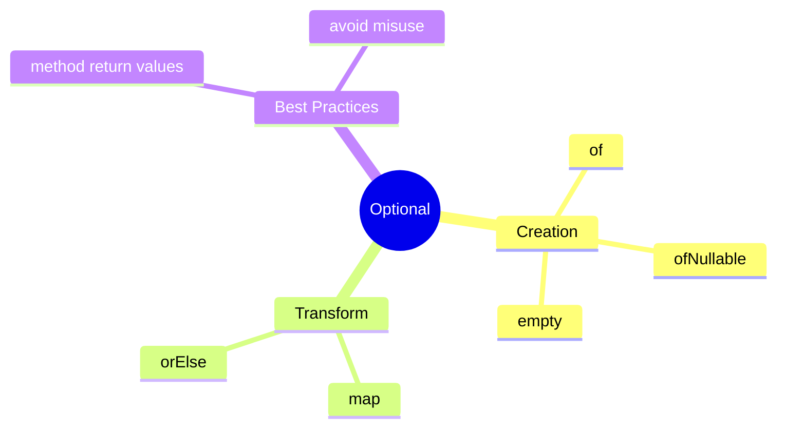
```mermaid
mindmap
  root((Optional))
    Creation
      of
      ofNullable
      empty
    Transform
      map
      orElse
    Best Practices
      method return values
      avoid misuse
```

## Quick Summary

### Representing Optional Values

- `Optional.of(value)` means the value must not be null
- `Optional.ofNullable(value)` is safe when null is possible
- `Optional.empty()` means no value is present

### Transforming Optional Values

- `map(...)` changes the inside value if present
- `orElse(...)` gives a fallback if missing

### Choosing Optional Boundaries

- `Optional` is useful in method returns
- it is not a replacement for every field or every parameter

## Compare With

| Compare | Prefer Left When | Prefer Right When |
| --- | --- | --- |
| `null` vs `Optional` | almost never for a meaningful API boundary | absence should be explicit to the caller |
| `of()` vs `ofNullable()` | you already know the value must exist | the input may be null |
| `map()` vs `orElse()` | you want to transform the present value | you want a fallback result when the value is absent |

## Senior Engineer Lens

- Optional is most valuable at API boundaries where absence is business-meaningful
- using Optional everywhere often adds ceremony without clarifying the model
- `get()` is rarely the right abstraction because it bypasses the contract
- good Optional usage reduces null-handling bugs and makes call sites more explicit

## Decision Chart

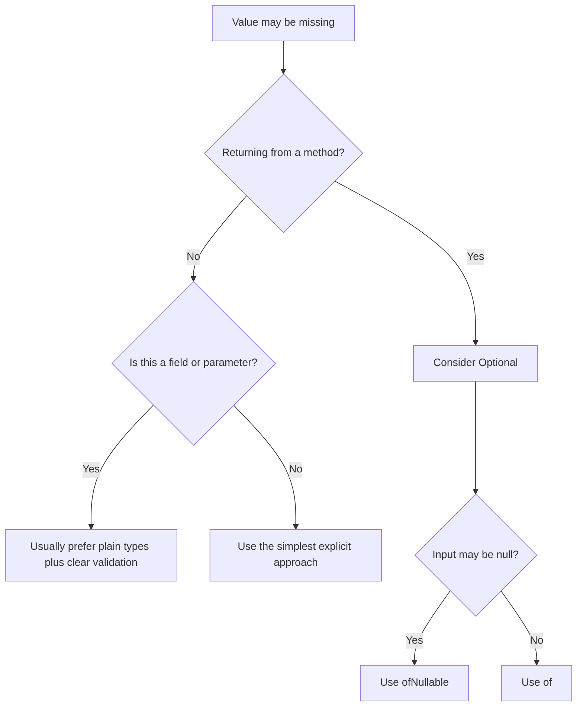
```mermaid
flowchart TD
  A[Value may be missing] --> B{Returning from a method?}
  B -->|Yes| C[Consider Optional]
  B -->|No| D{Is this a field or parameter?}
  D -->|Yes| E[Usually prefer plain types plus clear validation]
  D -->|No| F[Use the simplest explicit approach]
  C --> G{Input may be null?}
  G -->|Yes| H[Use ofNullable]
  G -->|No| I[Use of]
```

## Mini Case Study

Imagine a user profile page.

- nickname may be present or missing
- middle name may be missing
- profile picture URL may be missing

`Optional` helps the code handle those missing values clearly.

## When To Use

- use `Optional` for return values when absence is normal
- use it when you want the caller to think about the missing case

## When Not To Use

- do not use `Optional.of(...)` on a possibly null value
- do not use `Optional` only for style
- do not call `get()` without proving the value exists

## OCJP Focus

- `Optional.of(null)` throws `NullPointerException`
- `Optional.ofNullable(null)` returns `Optional.empty()`
- `map()` does not run if the value is missing

## Interview Focus

Q: Why return `Optional` from a method?  
A: It makes the missing-value case explicit for the caller.

Q: Why avoid `Optional.get()` in normal code?  
A: Because it can fail at runtime if the value is absent.

Q: When is `orElse(...)` useful?  
A: When you want a clear fallback value.

## Quick Quiz

1. What is the difference between `of()` and `ofNullable()`?
2. What does `map()` do on an empty `Optional`?
3. Why is `Optional` better than hidden null checks in some APIs?

## Effective Java Mapping

- Item 55: Return optionals judiciously
- Item 54: Return empty collections or arrays, not nulls

## Sources

- Effective Java, 3rd Edition: https://www.informit.com/store/effective-java-9780134686042
- Modern Java in Action: https://www.manning.com/books/modern-java-in-action
- Java API documentation: https://docs.oracle.com/en/java/

#### Revision

## Before Revision

- rerun `RunAllTopics.java`
- compare the actual output with the expected output comments in each topic file
- explain the chapter in your own words before reading this sheet

## Five Key Ideas

- understand the core idea behind Choosing Optional Boundaries
- understand how Representing Optional Values changes code behavior or design choice
- know when Transforming Optional Values is useful in real code
- know the common confusion around Representing Optional Values
- be able to explain the tradeoff behind Transforming Optional Values

## Three Mistakes To Avoid

- memorizing syntax without checking why the output appears
- using this chapter's idea where a simpler option would be clearer
- ignoring naming, input, output, and side-effect clarity

## Three Interview Questions

1. What real problem does Optional solve?
2. When would you avoid a heavier approach and choose a simpler one instead?
3. Which example in this chapter is most useful in production code, and why?

## Three OCJP Checks

1. Can you predict the output of the main runnable example without executing it?
2. Can you explain which behavior is compile-time and which is runtime?
3. Can you name one edge case that could confuse a learner in this chapter?

## After Reading This Chapter, You Should Know

- what this chapter is trying to solve
- which Java tool or pattern expresses that idea
- what common mistake to avoid
- how to explain the idea in plain English

### Date And Time

This chapter teaches one core idea: date and time values should be modeled as time values, not as loose strings or integers.

Read the topic files in order. Run each example. Check the printed output. After reading this chapter, you should know when to use `LocalDateTime`, when to use a zone-aware type, and why formatting belongs at the boundary of the system.

## What Problem This Chapter Solves

Real systems constantly handle:

- meeting schedules
- delivery windows
- report timestamps
- user-visible dates

Most bugs happen when teams mix these ideas together. A date without a zone is not the same thing as a point in global time. A formatted string is not the same thing as a time value.

## Study Order

1. Run [LocalDateTime.java](/Users/indiadelhi/repo/career/java-missing-tutorial/code/src/main/java/com/learning/javamissing/sec16_core_data_time_and_text/ch02_date_and_time/topics/local_date_time/LocalDateTime.java)
2. Run [Zones.java](/Users/indiadelhi/repo/career/java-missing-tutorial/code/src/main/java/com/learning/javamissing/sec16_core_data_time_and_text/ch02_date_and_time/topics/zones/Zones.java)
3. Run [Formatting.java](/Users/indiadelhi/repo/career/java-missing-tutorial/code/src/main/java/com/learning/javamissing/sec16_core_data_time_and_text/ch02_date_and_time/topics/formatting/Formatting.java)

## Concept Map

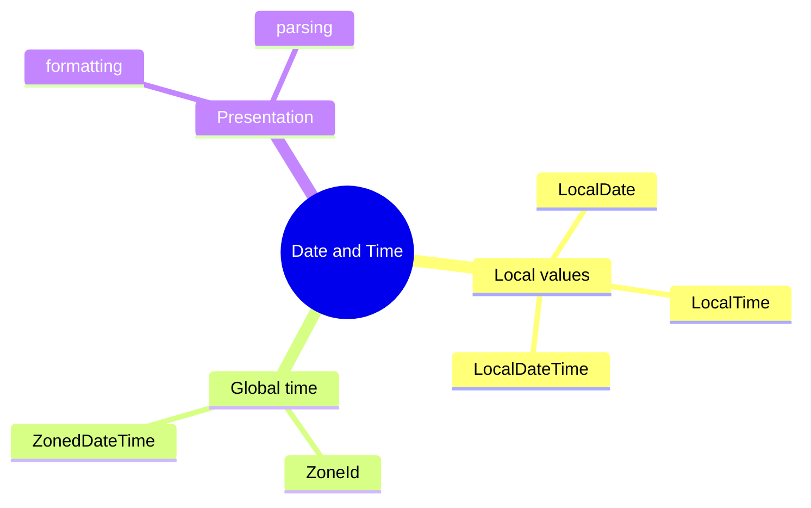
```mermaid
mindmap
  root((Date and Time))
    Local values
      LocalDate
      LocalTime
      LocalDateTime
    Global time
      ZoneId
      ZonedDateTime
    Presentation
      formatting
      parsing
```

## Quick Summary

### Local Date Time

- use `LocalDateTime` when the value is local to one business context, like "store opens at 9:30"
- operations like `plusMinutes(...)` return a new value because `java.time` types are immutable

### Zones

- use a zone-aware type when the same event must be understood across locations
- `withZoneSameInstant(...)` keeps the same real instant but shows it in another zone

### Formatting

- formatting is for display or input parsing
- keep internal logic on typed date/time values, not on strings

## Compare With

- `LocalDateTime` vs `ZonedDateTime`:
  `LocalDateTime` has no zone, `ZonedDateTime` represents a date-time in a specific region
- formatting vs modeling:
  formatting is presentation, modeling is the actual business value
- storing string dates vs typed dates:
  strings are fragile, typed values are safer and easier to validate

## Mini Case Study

An online learning platform sends a webinar reminder.

- the course team stores the event as `2026-04-07 18:00` in India time
- a learner in London should see the same instant in London time
- the email should display a formatted value like `07 Apr 2026`

This chapter covers exactly those three steps:

- model the local time
- convert across zones
- format for display

## When To Use

- use local date/time types for business-local schedules
- use zone-aware types for shared global events
- use formatters only at display and parsing boundaries

## When Not To Use

- do not store dates as free-form strings in core logic
- do not use `LocalDateTime` when the zone actually matters
- do not confuse formatting with conversion

## OCJP Focus

- `java.time` types are immutable
- parsing and formatting require matching patterns
- changing zones can either preserve the instant or preserve the local fields, depending on the API

## Interview Focus

Q: Why is `java.time` better than old mutable date APIs?  
A: It is clearer, immutable, and models dates, times, and zones separately.

Q: When is `LocalDateTime` the wrong choice?  
A: When the value must mean the same instant across regions, because it has no zone.

Q: Why should formatting be delayed until the boundary?  
A: Because business logic should work with typed values, not presentation strings.

## Quick Quiz

1. Why can two users see different clock times for the same `ZonedDateTime` instant?
2. Why is `DateTimeFormatter` not a replacement for `LocalDateTime`?
3. Why does `plusMinutes(...)` return a new value instead of changing the original one?

## Effective Java Mapping

- Item 17: Minimize mutability
- Item 49: Check parameters for validity
- Item 61: Prefer primitive types to boxed primitives where they make modeling clearer

## Sources

- Java API documentation: https://docs.oracle.com/en/java/
- Core Java, Volume I: https://www.informit.com/store/core-java-volume-i-fundamentals-9780135558577
- Core Java, Volume II: https://www.informit.com/store/core-java-volume-ii-advanced-features-9780135558690
- Effective Java, 3rd Edition: https://www.informit.com/store/effective-java-9780134686042

#### Revision

## Before Revision

- rerun `RunAllTopics.java`
- compare the actual output with the expected output comments in each topic file
- explain the chapter in your own words before reading this sheet

## Five Key Ideas

- understand the core idea behind Formatting
- understand how Local Date Time changes code behavior or design choice
- know when Zones is useful in real code
- know the common confusion around Local Date Time
- be able to explain the tradeoff behind Zones

## Three Mistakes To Avoid

- memorizing syntax without checking why the output appears
- using this chapter's idea where a simpler option would be clearer
- ignoring naming, input, output, and side-effect clarity

## Three Interview Questions

1. What real problem does Date And Time solve?
2. When would you avoid a heavier approach and choose a simpler one instead?
3. Which example in this chapter is most useful in production code, and why?

## Three OCJP Checks

1. Can you predict the output of the main runnable example without executing it?
2. Can you explain which behavior is compile-time and which is runtime?
3. Can you name one edge case that could confuse a learner in this chapter?

## After Reading This Chapter, You Should Know

- what this chapter is trying to solve
- which Java tool or pattern expresses that idea
- what common mistake to avoid
- how to explain the idea in plain English

### Missing Values And Optional

This chapter teaches the concept of absence in data.

## Study Order

1. Run [RepresentingAbsence.java](/Users/indiadelhi/repo/career/java-missing-tutorial/code/src/main/java/com/learning/javamissing/sec16_core_data_time_and_text/ch03_missing_values_and_optional/topics/representing_absence/RepresentingAbsence.java)
2. Focus on the concept first: a value may exist or may be missing.

#### Revision

## Before Revision

- rerun `RunAllTopics.java`
- compare the actual output with the expected output comments in each topic file
- explain the chapter in your own words before reading this sheet

## Five Key Ideas

- understand the core idea behind Representing Absence
- understand how Representing Absence changes code behavior or design choice
- know when Representing Absence is useful in real code
- know the common confusion around Representing Absence
- be able to explain the tradeoff behind Representing Absence

## Three Mistakes To Avoid

- memorizing syntax without checking why the output appears
- using this chapter's idea where a simpler option would be clearer
- ignoring naming, input, output, and side-effect clarity

## Three Interview Questions

1. What real problem does Missing Values And Optional solve?
2. When would you avoid a heavier approach and choose a simpler one instead?
3. Which example in this chapter is most useful in production code, and why?

## Three OCJP Checks

1. Can you predict the output of the main runnable example without executing it?
2. Can you explain which behavior is compile-time and which is runtime?
3. Can you name one edge case that could confuse a learner in this chapter?

## After Reading This Chapter, You Should Know

- what this chapter is trying to solve
- which Java tool or pattern expresses that idea
- what common mistake to avoid
- how to explain the idea in plain English

### Working With Time

This chapter teaches the concept of modeling dates, times, and schedules correctly.

## Study Order

1. Run [SchedulingDeliveries.java](/Users/indiadelhi/repo/career/java-missing-tutorial/code/src/main/java/com/learning/javamissing/sec16_core_data_time_and_text/ch04_working_with_time/topics/scheduling_deliveries/SchedulingDeliveries.java)
2. Focus on the concept first: business time is data, not just text.

#### Revision

## Before Revision

- rerun `RunAllTopics.java`
- compare the actual output with the expected output comments in each topic file
- explain the chapter in your own words before reading this sheet

## Five Key Ideas

- understand the core idea behind Scheduling Deliveries
- understand how Scheduling Deliveries changes code behavior or design choice
- know when Scheduling Deliveries is useful in real code
- know the common confusion around Scheduling Deliveries
- be able to explain the tradeoff behind Scheduling Deliveries

## Three Mistakes To Avoid

- memorizing syntax without checking why the output appears
- using this chapter's idea where a simpler option would be clearer
- ignoring naming, input, output, and side-effect clarity

## Three Interview Questions

1. What real problem does Working With Time solve?
2. When would you avoid a heavier approach and choose a simpler one instead?
3. Which example in this chapter is most useful in production code, and why?

## Three OCJP Checks

1. Can you predict the output of the main runnable example without executing it?
2. Can you explain which behavior is compile-time and which is runtime?
3. Can you name one edge case that could confuse a learner in this chapter?

## After Reading This Chapter, You Should Know

- what this chapter is trying to solve
- which Java tool or pattern expresses that idea
- what common mistake to avoid
- how to explain the idea in plain English

### Numbers And Formatting

This chapter teaches the concept of presenting numeric values clearly and correctly.

## Study Order

1. Run [FormattingPrices.java](/Users/indiadelhi/repo/career/java-missing-tutorial/code/src/main/java/com/learning/javamissing/sec16_core_data_time_and_text/ch05_numbers_and_formatting/topics/formatting_prices/FormattingPrices.java)
2. Focus on the concept first: internal numeric values and displayed values are not the same thing.

#### Revision

## Before Revision

- rerun `RunAllTopics.java`
- compare the actual output with the expected output comments in each topic file
- explain the chapter in your own words before reading this sheet

## Five Key Ideas

- understand the core idea behind Formatting Prices
- understand how Formatting Prices changes code behavior or design choice
- know when Formatting Prices is useful in real code
- know the common confusion around Formatting Prices
- be able to explain the tradeoff behind Formatting Prices

## Three Mistakes To Avoid

- memorizing syntax without checking why the output appears
- using this chapter's idea where a simpler option would be clearer
- ignoring naming, input, output, and side-effect clarity

## Three Interview Questions

1. What real problem does Numbers And Formatting solve?
2. When would you avoid a heavier approach and choose a simpler one instead?
3. Which example in this chapter is most useful in production code, and why?

## Three OCJP Checks

1. Can you predict the output of the main runnable example without executing it?
2. Can you explain which behavior is compile-time and which is runtime?
3. Can you name one edge case that could confuse a learner in this chapter?

## After Reading This Chapter, You Should Know

- what this chapter is trying to solve
- which Java tool or pattern expresses that idea
- what common mistake to avoid
- how to explain the idea in plain English

### Text Processing And Regex

This chapter teaches the concept of checking and transforming text data safely.

## Study Order

1. Run [ValidatingUserInput.java](/Users/indiadelhi/repo/career/java-missing-tutorial/code/src/main/java/com/learning/javamissing/sec16_core_data_time_and_text/ch06_text_processing_and_regex/topics/validating_user_input/ValidatingUserInput.java)
2. Focus on the concept first: text from users must be checked before it is trusted.

#### Revision

## Before Revision

- rerun `RunAllTopics.java`
- compare the actual output with the expected output comments in each topic file
- explain the chapter in your own words before reading this sheet

## Five Key Ideas

- understand the core idea behind Validating User Input
- understand how Validating User Input changes code behavior or design choice
- know when Validating User Input is useful in real code
- know the common confusion around Validating User Input
- be able to explain the tradeoff behind Validating User Input

## Three Mistakes To Avoid

- memorizing syntax without checking why the output appears
- using this chapter's idea where a simpler option would be clearer
- ignoring naming, input, output, and side-effect clarity

## Three Interview Questions

1. What real problem does Text Processing And Regex solve?
2. When would you avoid a heavier approach and choose a simpler one instead?
3. Which example in this chapter is most useful in production code, and why?

## Three OCJP Checks

1. Can you predict the output of the main runnable example without executing it?
2. Can you explain which behavior is compile-time and which is runtime?
3. Can you name one edge case that could confuse a learner in this chapter?

## After Reading This Chapter, You Should Know

- what this chapter is trying to solve
- which Java tool or pattern expresses that idea
- what common mistake to avoid
- how to explain the idea in plain English

## Language Modeling And Modern Types

Current chapters:

- `ch01_pattern_matching`
- `ch02_records_and_sealed_types`

## Before You Start

- Prerequisites: sec01_fundamentals and classes/interfaces basics.
- This section prepares you for: Modern Java modeling, safer domain types, and cleaner branching.
- Suggested pace: 2 to 3 focused sessions.

## How To Read This Section

- run the topic files before trying to memorize names
- compare the printed output with the explanation in each topic
- finish the chapter with its revision sheet before moving on

## Why This Section Matters

Modern Java modeling, safer domain types, and cleaner branching.

## Recommended Next Step

Move to sec18_architecture_and_integration and sec06_design_patterns.

### Pattern Matching

This chapter teaches a modeling idea: code becomes safer and clearer when the program can check shape and unpack data in one step.

Read the examples with one question in mind: "What do I know about the value after this check succeeds?" After reading this chapter, you should know why pattern matching reduces manual casting noise and why it works best with well-modeled data.

## What Problem This Chapter Solves

Java programs often receive mixed input:

- event objects
- API payload variants
- different payment types
- different command shapes

Older code often uses `instanceof`, then a cast, then more branching. Pattern matching makes the check and the usable variable part of the same statement.

## Study Order

1. Run [CheckingShapeWithInstanceof.java](/Users/indiadelhi/repo/career/java-missing-tutorial/code/src/main/java/com/learning/javamissing/sec17_language_modeling_and_modern_types/ch01_pattern_matching/topics/checking_shape_with_instanceof/CheckingShapeWithInstanceof.java)
2. Run [UnpackingRecordsWithPatterns.java](/Users/indiadelhi/repo/career/java-missing-tutorial/code/src/main/java/com/learning/javamissing/sec17_language_modeling_and_modern_types/ch01_pattern_matching/topics/unpacking_records_with_patterns/UnpackingRecordsWithPatterns.java)
3. Run [SwitchingOnRuntimeShape.java](/Users/indiadelhi/repo/career/java-missing-tutorial/code/src/main/java/com/learning/javamissing/sec17_language_modeling_and_modern_types/ch01_pattern_matching/topics/switching_on_runtime_shape/SwitchingOnRuntimeShape.java)

## Concept Map

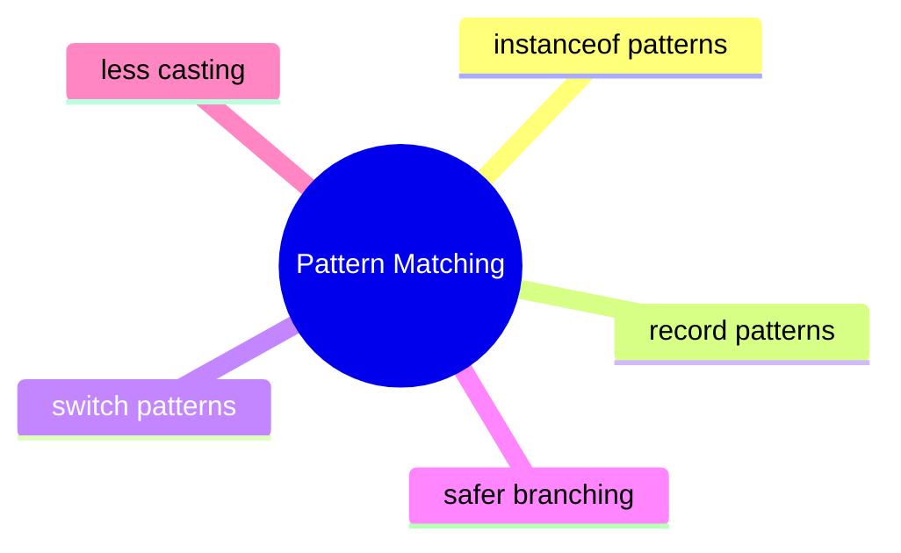
```mermaid
mindmap
  root((Pattern Matching))
    instanceof patterns
    record patterns
    switch patterns
    safer branching
    less casting
```

## Quick Summary

### `instanceof` Patterns

- the check and the typed variable appear together
- code becomes shorter and less error-prone

### Record Patterns

- record patterns unpack data while matching shape
- they are strongest when records model stable data clearly

### Switch Patterns

- switch can choose behavior based on the runtime shape of data
- guarded cases add more precise branching

## Compare With

- old `instanceof` plus cast vs pattern matching:
  pattern matching removes duplicated type information
- manual getter extraction vs record patterns:
  record patterns unpack the structure directly in the match
- `if-else` chains vs switch patterns:
  switch patterns can centralize branching more clearly

## Mini Case Study

An event-processing service receives different event shapes:

- login event
- payment event
- shipping event

The service needs to inspect the type, extract fields, and decide behavior. Pattern matching keeps that branching readable when the domain is modeled well.

## When To Use

- use pattern matching when behavior depends on the runtime shape of data
- use record patterns when records already express the domain well
- use switch patterns when one branching point should describe all supported shapes

## When Not To Use

- do not use pattern matching to compensate for a badly modeled domain
- do not add complex nested patterns when ordinary method calls are clearer
- do not forget that maintainability matters more than language cleverness

## Interview Focus

Q: What is the main gain from pattern matching for `instanceof`?  
A: It combines type test and typed variable binding, reducing boilerplate and cast noise.

Q: When do record patterns shine most?  
A: When records represent stable structured data that must be unpacked often.

Q: What is the real prerequisite for good pattern-matching code?  
A: A well-designed data model.

## Quick Quiz

1. Why is pattern matching better than separate check-and-cast code?
2. Why do record patterns work best with clearly structured data?
3. When would a normal method call be clearer than a complex pattern?

## Effective Java Mapping

- Item 15: Minimize the accessibility of classes and members
- Item 17: Minimize mutability
- Item 18: Favor composition over inheritance

## Sources

- Java API documentation: https://docs.oracle.com/en/java/
- OpenJDK JEP index: https://openjdk.org/jeps/0
- Core Java, Volume I: https://www.informit.com/store/core-java-volume-i-fundamentals-9780135558577

#### Revision

## Before Revision

- rerun `RunAllTopics.java`
- compare the actual output with the expected output comments in each topic file
- explain the chapter in your own words before reading this sheet

## Five Key Ideas

- understand the core idea behind Checking Shape With Instanceof
- understand how Switching On Runtime Shape changes code behavior or design choice
- know when Unpacking Records With Patterns is useful in real code
- know the common confusion around Switching On Runtime Shape
- be able to explain the tradeoff behind Unpacking Records With Patterns

## Three Mistakes To Avoid

- memorizing syntax without checking why the output appears
- using this chapter's idea where a simpler option would be clearer
- ignoring naming, input, output, and side-effect clarity

## Three Interview Questions

1. What real problem does Pattern Matching solve?
2. When would you avoid a heavier approach and choose a simpler one instead?
3. Which example in this chapter is most useful in production code, and why?

## Three OCJP Checks

1. Can you predict the output of the main runnable example without executing it?
2. Can you explain which behavior is compile-time and which is runtime?
3. Can you name one edge case that could confuse a learner in this chapter?

## After Reading This Chapter, You Should Know

- what this chapter is trying to solve
- which Java tool or pattern expresses that idea
- what common mistake to avoid
- how to explain the idea in plain English

### Records And Sealed Types

This chapter teaches two related modeling tools:

- records for transparent data carriers
- sealed types for closed sets of allowed variants

After reading this chapter, you should know that these features are not shortcuts for less code only. They are ways to make domain boundaries and intent clearer.

## What Problem This Chapter Solves

Many business models have one of these shapes:

- pure data objects such as invoice summaries
- closed families such as payment status or delivery state

Without clear modeling, teams end up with verbose data classes, weak invariants, and switches that silently miss new cases.

## Study Order

1. Run [ModelingImmutableDataWithRecords.java](/Users/indiadelhi/repo/career/java-missing-tutorial/code/src/main/java/com/learning/javamissing/sec17_language_modeling_and_modern_types/ch02_records_and_sealed_types/topics/modeling_immutable_data_with_records/ModelingImmutableDataWithRecords.java)
2. Run [ClosingHierarchiesWithSealedTypes.java](/Users/indiadelhi/repo/career/java-missing-tutorial/code/src/main/java/com/learning/javamissing/sec17_language_modeling_and_modern_types/ch02_records_and_sealed_types/topics/closing_hierarchies_with_sealed_types/ClosingHierarchiesWithSealedTypes.java)
3. Run [ExhaustiveBranchingOverClosedHierarchies.java](/Users/indiadelhi/repo/career/java-missing-tutorial/code/src/main/java/com/learning/javamissing/sec17_language_modeling_and_modern_types/ch02_records_and_sealed_types/topics/exhaustive_branching_over_closed_hierarchies/ExhaustiveBranchingOverClosedHierarchies.java)

## Concept Map

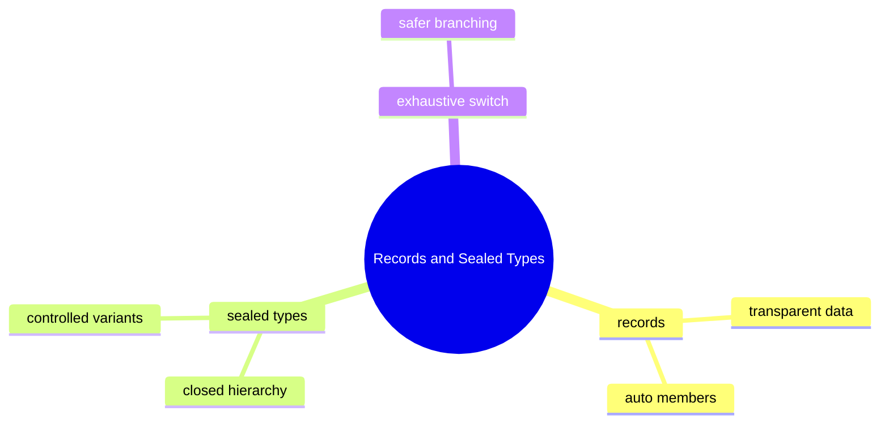
```mermaid
mindmap
  root((Records and Sealed Types))
    records
      transparent data
      auto members
    sealed types
      closed hierarchy
      controlled variants
    exhaustive switch
      safer branching
```

## Quick Summary

### Records

- records are a good fit for immutable data carriers
- they express that the data itself is the main point of the type

### Sealed Types

- sealed types declare exactly which implementations are allowed
- they help model known variants explicitly

### Exhaustive Switch

- sealed hierarchies improve switch safety because the compiler knows the permitted cases
- missing cases become visible earlier

## Compare With

- record vs ordinary class:
  use a record when the type is mainly data, use a class when custom identity or mutable behavior matters
- sealed hierarchy vs open hierarchy:
  sealed types are better when the domain variants are intentionally closed
- enum vs sealed hierarchy:
  enums fit constant-like variants, sealed hierarchies fit variants with different data and behavior

## Mini Case Study

Consider an order system.

- `Order` summary is pure data: record is a natural fit
- `DeliveryStatus` has a fixed set of states: sealed type is a natural fit
- the UI needs one branch per status: exhaustive switch becomes safer

This chapter shows those three ideas working together.

## When To Use

- use records for small immutable value-focused models
- use sealed types for domains with intentionally closed variants
- use exhaustive switches when business logic truly depends on every supported case

## When Not To Use

- do not use records for entities that need complex mutable lifecycle behavior
- do not use sealed types when extension by outside code is a real requirement
- do not confuse "less code" with "better model"

## Interview Focus

Q: What is the real benefit of a record?  
A: It communicates that the type is a transparent immutable data carrier.

Q: Why use a sealed type instead of a normal interface?  
A: To express and enforce that only a known set of implementations is valid.

Q: Why are sealed types and pattern matching often discussed together?  
A: Because a closed hierarchy makes branching more complete and safer.

## Quick Quiz

1. Why is a record better than a verbose data class for pure value data?
2. Why might an enum be insufficient where a sealed hierarchy works well?
3. Why does a closed hierarchy improve switch safety?

## Effective Java Mapping

- Item 15: Minimize the accessibility of classes and members
- Item 17: Minimize mutability
- Item 18: Favor composition over inheritance

## Sources

- Java API documentation: https://docs.oracle.com/en/java/
- OpenJDK JEP index: https://openjdk.org/jeps/0
- Effective Java, 3rd Edition: https://www.informit.com/store/effective-java-9780134686042

#### Revision

## Before Revision

- rerun `RunAllTopics.java`
- compare the actual output with the expected output comments in each topic file
- explain the chapter in your own words before reading this sheet

## Five Key Ideas

- understand the core idea behind Closing Hierarchies With Sealed Types
- understand how Exhaustive Branching Over Closed Hierarchies changes code behavior or design choice
- know when Modeling Immutable Data With Records is useful in real code
- know the common confusion around Exhaustive Branching Over Closed Hierarchies
- be able to explain the tradeoff behind Modeling Immutable Data With Records

## Three Mistakes To Avoid

- memorizing syntax without checking why the output appears
- using this chapter's idea where a simpler option would be clearer
- ignoring naming, input, output, and side-effect clarity

## Three Interview Questions

1. What real problem does Records And Sealed Types solve?
2. When would you avoid a heavier approach and choose a simpler one instead?
3. Which example in this chapter is most useful in production code, and why?

## Three OCJP Checks

1. Can you predict the output of the main runnable example without executing it?
2. Can you explain which behavior is compile-time and which is runtime?
3. Can you name one edge case that could confuse a learner in this chapter?

## After Reading This Chapter, You Should Know

- what this chapter is trying to solve
- which Java tool or pattern expresses that idea
- what common mistake to avoid
- how to explain the idea in plain English

## Architecture And Integration

Current chapters:

- `ch01_modules`
- `ch02_modular_design`
- `ch03_building_for_many_languages`
- `ch04_writing_safe_java`

## Before You Start

- Prerequisites: sec01_fundamentals, sec07_principles_and_solid, and helpful exposure to modules or localization.
- This section prepares you for: Real application boundaries, modular thinking, and safer integration design.
- Suggested pace: 3 to 4 focused sessions.

## How To Read This Section

- run the topic files before trying to memorize names
- compare the printed output with the explanation in each topic
- finish the chapter with its revision sheet before moving on

## Why This Section Matters

Real application boundaries, modular thinking, and safer integration design.

## Recommended Next Step

Use this section together with sec19_testing_and_quality and sec06_design_patterns.

### Modules

This chapter teaches a boundary concept: a large codebase becomes easier to reason about when dependencies and exported APIs are made explicit.

After reading this chapter, you should know what problem modules solve, what `requires` and `exports` actually mean, and why service loading is about decoupling implementations from consumers.

## What Problem This Chapter Solves

As a system grows, these problems appear:

- too many accidental dependencies
- unclear public API surface
- implementation packages being used directly
- hard-wired implementations

Modules help make those boundaries visible.

## Study Order

1. Run [DeclaringModuleBoundaries.java](/Users/indiadelhi/repo/career/java-missing-tutorial/code/src/main/java/com/learning/javamissing/sec18_architecture_and_integration/ch01_modules/topics/declaring_module_boundaries/DeclaringModuleBoundaries.java)
2. Run [ChoosingDependenciesAndExposedPackages.java](/Users/indiadelhi/repo/career/java-missing-tutorial/code/src/main/java/com/learning/javamissing/sec18_architecture_and_integration/ch01_modules/topics/choosing_dependencies_and_exposed_packages/ChoosingDependenciesAndExposedPackages.java)
3. Run [PluggableImplementations.java](/Users/indiadelhi/repo/career/java-missing-tutorial/code/src/main/java/com/learning/javamissing/sec18_architecture_and_integration/ch01_modules/topics/pluggable_implementations/PluggableImplementations.java)

## Concept Map

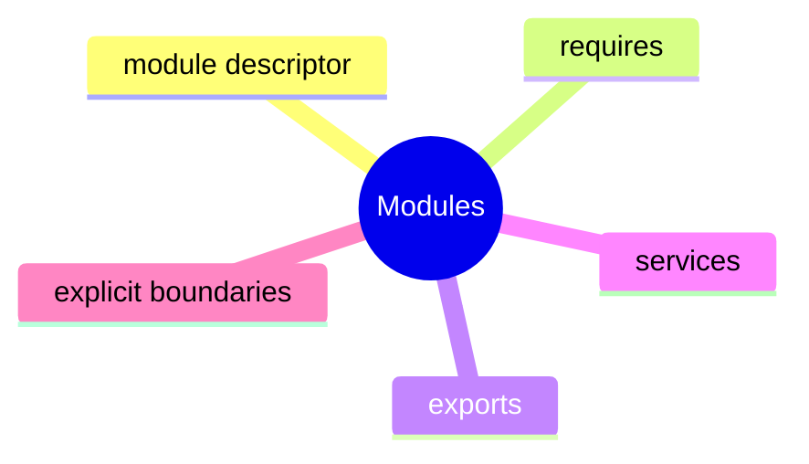
```mermaid
mindmap
  root((Modules))
    module descriptor
    requires
    exports
    services
    explicit boundaries
```

## Quick Summary

### Module Descriptor

- `module-info.java` declares the module boundary
- it is the entry point for understanding dependencies and exposed packages

### `requires` And `exports`

- `requires` says what this module depends on
- `exports` says what packages other modules may use

### Services

- services let consumers depend on an abstraction instead of a concrete implementation
- this supports pluggable designs

## Compare With

- classpath vs module path:
  classpath is looser, modules make boundaries more explicit
- public class vs exported package:
  a public type is not enough by itself in a modular world; package export matters too
- direct implementation dependency vs service loading:
  services reduce coupling to one specific implementation

## Mini Case Study

Imagine a retail platform split into modules:

- `store.api`
- `store.pricing`
- `store.reporting`

Reporting should not reach into pricing internals. Pricing should expose only its API package. Discount providers may vary by country, so a service-based design fits better than hard-coded implementation references.

## When To Use

- use modules when the codebase is large enough that dependency boundaries matter
- use `exports` to expose only intended API packages
- use services when one abstraction may have multiple implementations

## When Not To Use

- do not add modules mechanically to a tiny toy application with no boundary benefit
- do not export internal implementation packages
- do not use service loading where a direct dependency is simpler and clearer

## Interview Focus

Q: What problem do Java modules primarily solve?  
A: They make dependencies and visible API boundaries explicit.

Q: What is the difference between `requires` and `exports`?  
A: `requires` brings in another module; `exports` makes one of your packages available to other modules.

Q: Why use services in a modular design?  
A: To decouple consumers from concrete implementations.

## Quick Quiz

1. Why can "public" still be insufficient without `exports`?
2. Why is service loading useful in a pluggable system?
3. What is the risk of exporting too many packages?

## Effective Java Mapping

- Item 15: Minimize the accessibility of classes and members
- Item 18: Favor composition over inheritance
- Item 64: Refer to objects by their interfaces

## Sources

- Java API documentation: https://docs.oracle.com/en/java/
- Core Java, Volume II: https://www.informit.com/store/core-java-volume-ii-advanced-features-9780135558690
- Effective Java, 3rd Edition: https://www.informit.com/store/effective-java-9780134686042

#### Revision

## Before Revision

- rerun `RunAllTopics.java`
- compare the actual output with the expected output comments in each topic file
- explain the chapter in your own words before reading this sheet

## Five Key Ideas

- understand the core idea behind Choosing Dependencies And Exposed Packages
- understand how Declaring Module Boundaries changes code behavior or design choice
- know when Pluggable Implementations is useful in real code
- know the common confusion around Declaring Module Boundaries
- be able to explain the tradeoff behind Pluggable Implementations

## Three Mistakes To Avoid

- memorizing syntax without checking why the output appears
- using this chapter's idea where a simpler option would be clearer
- ignoring naming, input, output, and side-effect clarity

## Three Interview Questions

1. What real problem does Java Modules solve?
2. When would you avoid a heavier approach and choose a simpler one instead?
3. Which example in this chapter is most useful in production code, and why?

## Three OCJP Checks

1. Can you predict the output of the main runnable example without executing it?
2. Can you explain which behavior is compile-time and which is runtime?
3. Can you name one edge case that could confuse a learner in this chapter?

## After Reading This Chapter, You Should Know

- what this chapter is trying to solve
- which Java tool or pattern expresses that idea
- what common mistake to avoid
- how to explain the idea in plain English

### Modular Design

This chapter teaches the concept of splitting a large system into understandable parts.

## Study Order

1. Run [SeparatingSystemBoundaries.java](/Users/indiadelhi/repo/career/java-missing-tutorial/code/src/main/java/com/learning/javamissing/sec18_architecture_and_integration/ch02_modular_design/topics/separating_system_boundaries/SeparatingSystemBoundaries.java)
2. Focus on the concept first: boundaries reduce coupling.

#### Revision

## Before Revision

- rerun `RunAllTopics.java`
- compare the actual output with the expected output comments in each topic file
- explain the chapter in your own words before reading this sheet

## Five Key Ideas

- understand the core idea behind Separating System Boundaries
- understand how Separating System Boundaries changes code behavior or design choice
- know when Separating System Boundaries is useful in real code
- know the common confusion around Separating System Boundaries
- be able to explain the tradeoff behind Separating System Boundaries

## Three Mistakes To Avoid

- memorizing syntax without checking why the output appears
- using this chapter's idea where a simpler option would be clearer
- ignoring naming, input, output, and side-effect clarity

## Three Interview Questions

1. What real problem does Modular Design solve?
2. When would you avoid a heavier approach and choose a simpler one instead?
3. Which example in this chapter is most useful in production code, and why?

## Three OCJP Checks

1. Can you predict the output of the main runnable example without executing it?
2. Can you explain which behavior is compile-time and which is runtime?
3. Can you name one edge case that could confuse a learner in this chapter?

## After Reading This Chapter, You Should Know

- what this chapter is trying to solve
- which Java tool or pattern expresses that idea
- what common mistake to avoid
- how to explain the idea in plain English

### Building For Many Languages

This chapter teaches the concept of adapting software for users in different locales.

## Study Order

1. Run [ShowingMessagesByLocale.java](/Users/indiadelhi/repo/career/java-missing-tutorial/code/src/main/java/com/learning/javamissing/sec18_architecture_and_integration/ch03_building_for_many_languages/topics/showing_messages_by_locale/ShowingMessagesByLocale.java)
2. Focus on the concept first: user-facing text depends on language and region.

#### Revision

## Before Revision

- rerun `RunAllTopics.java`
- compare the actual output with the expected output comments in each topic file
- explain the chapter in your own words before reading this sheet

## Five Key Ideas

- understand the core idea behind Showing Messages By Locale
- understand how Showing Messages By Locale changes code behavior or design choice
- know when Showing Messages By Locale is useful in real code
- know the common confusion around Showing Messages By Locale
- be able to explain the tradeoff behind Showing Messages By Locale

## Three Mistakes To Avoid

- memorizing syntax without checking why the output appears
- using this chapter's idea where a simpler option would be clearer
- ignoring naming, input, output, and side-effect clarity

## Three Interview Questions

1. What real problem does Building For Many Languages solve?
2. When would you avoid a heavier approach and choose a simpler one instead?
3. Which example in this chapter is most useful in production code, and why?

## Three OCJP Checks

1. Can you predict the output of the main runnable example without executing it?
2. Can you explain which behavior is compile-time and which is runtime?
3. Can you name one edge case that could confuse a learner in this chapter?

## After Reading This Chapter, You Should Know

- what this chapter is trying to solve
- which Java tool or pattern expresses that idea
- what common mistake to avoid
- how to explain the idea in plain English

### Writing Safe Java

This chapter teaches the concept of validating inputs and reducing avoidable bugs.

## Study Order

1. Run [ValidatingCheckoutInput.java](/Users/indiadelhi/repo/career/java-missing-tutorial/code/src/main/java/com/learning/javamissing/sec18_architecture_and_integration/ch04_writing_safe_java/topics/validating_checkout_input/ValidatingCheckoutInput.java)
2. Focus on the concept first: trusted systems still need defensive boundaries.

#### Revision

## Before Revision

- rerun `RunAllTopics.java`
- compare the actual output with the expected output comments in each topic file
- explain the chapter in your own words before reading this sheet

## Five Key Ideas

- understand the core idea behind Validating Checkout Input
- understand how Validating Checkout Input changes code behavior or design choice
- know when Validating Checkout Input is useful in real code
- know the common confusion around Validating Checkout Input
- be able to explain the tradeoff behind Validating Checkout Input

## Three Mistakes To Avoid

- memorizing syntax without checking why the output appears
- using this chapter's idea where a simpler option would be clearer
- ignoring naming, input, output, and side-effect clarity

## Three Interview Questions

1. What real problem does Writing Safe Java solve?
2. When would you avoid a heavier approach and choose a simpler one instead?
3. Which example in this chapter is most useful in production code, and why?

## Three OCJP Checks

1. Can you predict the output of the main runnable example without executing it?
2. Can you explain which behavior is compile-time and which is runtime?
3. Can you name one edge case that could confuse a learner in this chapter?

## After Reading This Chapter, You Should Know

- what this chapter is trying to solve
- which Java tool or pattern expresses that idea
- what common mistake to avoid
- how to explain the idea in plain English

## Testing And Quality

Current chapters:

- `ch01_testing_and_quality`

## Before You Start

- Prerequisites: sec01_fundamentals. Every earlier section benefits from testing.
- This section prepares you for: Reliable refactoring, safer releases, and stronger interview answers about quality.
- Suggested pace: 2 to 3 focused sessions.

## How To Read This Section

- run the topic files before trying to memorize names
- compare the printed output with the explanation in each topic
- finish the chapter with its revision sheet before moving on

## Why This Section Matters

Reliable refactoring, safer releases, and stronger interview answers about quality.

## Recommended Next Step

Use testing as the companion section while revisiting any earlier part of the book.

### Testing And Quality

This chapter teaches a durable engineering idea: good code is not only code that works once. Good code can be checked repeatedly, confidently, and cheaply.

After reading this chapter, you should know why test design matters more than test count, why JUnit is a tool instead of the goal, and why parameterized tests are useful for repeating one rule across many inputs.

## What Problem This Chapter Solves

Without tests, teams usually suffer from:

- fear of changing code
- hidden regressions
- unclear business rules
- duplicate manual checking

This chapter focuses on small, readable, repeatable verification.

## Study Order

1. Run [DesigningTestsAroundBusinessRules.java](/Users/indiadelhi/repo/career/java-missing-tutorial/code/src/main/java/com/learning/javamissing/sec19_testing_and_quality/ch01_testing_and_quality/topics/designing_tests_around_business_rules/DesigningTestsAroundBusinessRules.java)
2. Run [WritingReadableJUnitTests.java](/Users/indiadelhi/repo/career/java-missing-tutorial/code/src/main/java/com/learning/javamissing/sec19_testing_and_quality/ch01_testing_and_quality/topics/writing_readable_junit_tests/WritingReadableJUnitTests.java)
3. Run [CheckingOneRuleWithManyInputs.java](/Users/indiadelhi/repo/career/java-missing-tutorial/code/src/main/java/com/learning/javamissing/sec19_testing_and_quality/ch01_testing_and_quality/topics/checking_one_rule_with_many_inputs/CheckingOneRuleWithManyInputs.java)

## Concept Map

```mermaid
mindmap
  root((Testing and Quality))
    business rule
    expected result
    JUnit test
    parameterized test
    regression safety
```

## Quick Summary

### Designing Tests

- start from the business rule, not from framework syntax
- a good test states expected and actual behavior clearly

### JUnit Basics

- JUnit gives structure to setup, execution, and assertion
- the real value comes from precise assertions and readable test names

### Parameterized Tests

- parameterized tests help when the same rule must hold for many inputs
- they reduce repetition while preserving clarity

## Compare With

- manual checking vs automated test:
  manual checking is slow and inconsistent, automated tests are repeatable
- one giant test vs focused tests:
  focused tests fail more clearly and are easier to maintain
- copy-paste tests vs parameterized tests:
  parameterized tests work well when one rule is evaluated against multiple cases

## Mini Case Study

A pricing service adds tax to an item price.

- one test should verify the normal case
- another should verify edge cases such as zero tax
- if many tax rates are checked, parameterized tests reduce repetition

That is exactly what the topic files in this chapter model.

## When To Use

- write tests for business rules and failure-prone behavior
- use JUnit when you need structured automated verification
- use parameterized tests when many inputs exercise one rule

## When Not To Use

- do not write vague tests that only repeat implementation details
- do not create huge assertion bundles that hide the failing behavior
- do not parameterize tests so heavily that readability collapses

## Interview Focus

Q: What makes a test high quality?  
A: It is readable, focused, repeatable, and clearly tied to a business rule.

Q: When is a parameterized test better than several copied tests?  
A: When the same behavior should be checked against many input combinations.

Q: Why is test design more important than framework syntax?  
A: Because poor tests remain poor even if they use a good tool.

## Quick Quiz

1. Why should a test name describe behavior instead of only the method name?
2. When does a parameterized test improve quality, and when can it hurt readability?
3. Why is asserting a business rule stronger than only asserting that a method ran?

## Effective Java Mapping

- Item 49: Check parameters for validity
- Item 67: Optimize judiciously
- Item 76: Strive for failure atomicity

## Sources

- Unit Testing: Principles, Practices, and Patterns: https://www.manning.com/books/unit-testing
- Refactoring, 2nd Edition: https://www.informit.com/store/refactoring-improving-the-design-of-existing-code-9780134757698
- Effective Java, 3rd Edition: https://www.informit.com/store/effective-java-9780134686042

#### Revision

## Before Revision

- rerun `RunAllTopics.java`
- compare the actual output with the expected output comments in each topic file
- explain the chapter in your own words before reading this sheet

## Five Key Ideas

- understand the core idea behind Checking One Rule With Many Inputs
- understand how Designing Tests Around Business Rules changes code behavior or design choice
- know when Writing Readable Junit Tests is useful in real code
- know the common confusion around Designing Tests Around Business Rules
- be able to explain the tradeoff behind Writing Readable Junit Tests

## Three Mistakes To Avoid

- memorizing syntax without checking why the output appears
- using this chapter's idea where a simpler option would be clearer
- ignoring naming, input, output, and side-effect clarity

## Three Interview Questions

1. What real problem does Testing And Quality solve?
2. When would you avoid a heavier approach and choose a simpler one instead?
3. Which example in this chapter is most useful in production code, and why?

## Three OCJP Checks

1. Can you predict the output of the main runnable example without executing it?
2. Can you explain which behavior is compile-time and which is runtime?
3. Can you name one edge case that could confuse a learner in this chapter?

## After Reading This Chapter, You Should Know

- what this chapter is trying to solve
- which Java tool or pattern expresses that idea
- what common mistake to avoid
- how to explain the idea in plain English

## Data Structures And Complexity

Current chapters:

- `ch01_reasoning_about_time_and_space`
- `ch02_collections_internals_and_tradeoffs`
- `ch03_sorting_searching_and_binary_search`
- `ch04_problem_solving_patterns`

## Before You Start

- Prerequisites: sec01_fundamentals and sec02_collections.
- This section prepares you for: Interview problem solving, performance discussions, and better collection choices in real code.
- Suggested pace: 3 to 4 focused sessions.

## How To Read This Section

- run the topic files before trying to memorize names
- compare the printed output with the explanation in each topic
- finish the chapter with its revision sheet before moving on

## Why This Section Matters

Interview problem solving, performance discussions, and better collection choices in real code.

## Recommended Next Step

Revisit collections, streams, and concurrency with this stronger complexity lens.

### Reasoning About Time And Space

This chapter teaches the mental model behind complexity, not just the symbols.

## Study Order

1. Run [MeasuringGrowthWithBigO.java](/Users/indiadelhi/repo/career/java-missing-tutorial/code/src/main/java/com/learning/javamissing/sec20_data_structures_and_complexity/ch01_reasoning_about_time_and_space/topics/measuring_growth_with_big_o/MeasuringGrowthWithBigO.java)

## What You Learn

- what Big-O means in plain language
- why growth matters more than one small timing result
- how to compare two approaches by step count

## Interview Focus

Q: Why is `O(log n)` usually better than `O(n)` for search?  
A: Because the work grows much more slowly as input size becomes large.

## Sources

- Grokking Algorithms: https://www.manning.com/books/grokking-algorithms-second-edition
- Java Performance, 2nd Edition: https://www.oreilly.com/library/view/java-performance-2nd/9781492056102/

#### Revision

## Before Revision

- rerun `RunAllTopics.java`
- compare the actual output with the expected output comments in each topic file
- explain the chapter in your own words before reading this sheet

## Five Key Ideas

- understand the core idea behind Measuring Growth With Big O
- understand how Measuring Growth With Big O changes code behavior or design choice
- know when Measuring Growth With Big O is useful in real code
- know the common confusion around Measuring Growth With Big O
- be able to explain the tradeoff behind Measuring Growth With Big O

## Three Mistakes To Avoid

- memorizing syntax without checking why the output appears
- using this chapter's idea where a simpler option would be clearer
- ignoring naming, input, output, and side-effect clarity

## Three Interview Questions

1. What real problem does Reasoning About Time And Space solve?
2. When would you avoid a heavier approach and choose a simpler one instead?
3. Which example in this chapter is most useful in production code, and why?

## Three OCJP Checks

1. Can you predict the output of the main runnable example without executing it?
2. Can you explain which behavior is compile-time and which is runtime?
3. Can you name one edge case that could confuse a learner in this chapter?

## After Reading This Chapter, You Should Know

- what this chapter is trying to solve
- which Java tool or pattern expresses that idea
- what common mistake to avoid
- how to explain the idea in plain English

### Collections Internals And Tradeoffs

This chapter connects Java collection usage to the costs hidden underneath.

## Study Order

1. Run [UnderstandingArrayListGrowthAndLookup.java](/Users/indiadelhi/repo/career/java-missing-tutorial/code/src/main/java/com/learning/javamissing/sec20_data_structures_and_complexity/ch02_collections_internals_and_tradeoffs/topics/understanding_arraylist_growth_and_lookup/UnderstandingArrayListGrowthAndLookup.java)
2. Run [UnderstandingHashMapBucketsAndCollisions.java](/Users/indiadelhi/repo/career/java-missing-tutorial/code/src/main/java/com/learning/javamissing/sec20_data_structures_and_complexity/ch02_collections_internals_and_tradeoffs/topics/understanding_hashmap_buckets_and_collisions/UnderstandingHashMapBucketsAndCollisions.java)

## What You Learn

- why `ArrayList` appends are usually fast but resizing still costs work
- why `HashMap` lookups are usually fast but collisions still matter
- why complexity discussions should stay approximate and practical

## Quick Compare Table

| Compare | Prefer Left When | Prefer Right When |
| --- | --- | --- |
| `ArrayList` append vs middle insert | most new items go to the end | you genuinely need frequent middle inserts and can justify a different structure |
| direct index lookup vs repeated scan | the data is stored in an index-based structure | the data shape forces sequential traversal |
| average `HashMap` lookup vs collision-heavy lookup | hashes spread keys well | many keys collide and the bucket must do more work |

## Sources

- Core Java, Volume I: https://www.informit.com/store/core-java-volume-i-fundamentals-9780135558577
- Java Performance, 2nd Edition: https://www.oreilly.com/library/view/java-performance-2nd/9781492056102/

#### Revision

## Before Revision

- rerun `RunAllTopics.java`
- compare the actual output with the expected output comments in each topic file
- explain the chapter in your own words before reading this sheet

## Five Key Ideas

- understand the core idea behind Understanding Arraylist Growth And Lookup
- understand how Understanding Hashmap Buckets And Collisions changes code behavior or design choice
- know when Understanding Arraylist Growth And Lookup is useful in real code
- know the common confusion around Understanding Hashmap Buckets And Collisions
- be able to explain the tradeoff behind Understanding Arraylist Growth And Lookup

## Three Mistakes To Avoid

- memorizing syntax without checking why the output appears
- using this chapter's idea where a simpler option would be clearer
- ignoring naming, input, output, and side-effect clarity

## Three Interview Questions

1. What real problem does Collections Internals And Tradeoffs solve?
2. When would you avoid a heavier approach and choose a simpler one instead?
3. Which example in this chapter is most useful in production code, and why?

## Three OCJP Checks

1. Can you predict the output of the main runnable example without executing it?
2. Can you explain which behavior is compile-time and which is runtime?
3. Can you name one edge case that could confuse a learner in this chapter?

## After Reading This Chapter, You Should Know

- what this chapter is trying to solve
- which Java tool or pattern expresses that idea
- what common mistake to avoid
- how to explain the idea in plain English

### Sorting Searching And Binary Search

This chapter turns common interview ideas into clean Java reasoning.

## Study Order

1. Run [UsingBinarySearchCorrectly.java](/Users/indiadelhi/repo/career/java-missing-tutorial/code/src/main/java/com/learning/javamissing/sec20_data_structures_and_complexity/ch03_sorting_searching_and_binary_search/topics/using_binary_search_correctly/UsingBinarySearchCorrectly.java)
2. Run [UnderstandingSortingTradeoffs.java](/Users/indiadelhi/repo/career/java-missing-tutorial/code/src/main/java/com/learning/javamissing/sec20_data_structures_and_complexity/ch03_sorting_searching_and_binary_search/topics/understanding_sorting_tradeoffs/UnderstandingSortingTradeoffs.java)

## What You Learn

- binary search needs sorted data
- sorting can make later queries much cheaper
- one extra preprocessing step can reduce repeated lookup cost

## Sources

- Grokking Algorithms: https://www.manning.com/books/grokking-algorithms-second-edition
- Core Java, Volume I: https://www.informit.com/store/core-java-volume-i-fundamentals-9780135558577

#### Revision

## Before Revision

- rerun `RunAllTopics.java`
- compare the actual output with the expected output comments in each topic file
- explain the chapter in your own words before reading this sheet

## Five Key Ideas

- understand the core idea behind Understanding Sorting Tradeoffs
- understand how Using Binary Search Correctly changes code behavior or design choice
- know when Understanding Sorting Tradeoffs is useful in real code
- know the common confusion around Using Binary Search Correctly
- be able to explain the tradeoff behind Understanding Sorting Tradeoffs

## Three Mistakes To Avoid

- memorizing syntax without checking why the output appears
- using this chapter's idea where a simpler option would be clearer
- ignoring naming, input, output, and side-effect clarity

## Three Interview Questions

1. What real problem does Sorting Searching And Binary Search solve?
2. When would you avoid a heavier approach and choose a simpler one instead?
3. Which example in this chapter is most useful in production code, and why?

## Three OCJP Checks

1. Can you predict the output of the main runnable example without executing it?
2. Can you explain which behavior is compile-time and which is runtime?
3. Can you name one edge case that could confuse a learner in this chapter?

## After Reading This Chapter, You Should Know

- what this chapter is trying to solve
- which Java tool or pattern expresses that idea
- what common mistake to avoid
- how to explain the idea in plain English

### Problem Solving Patterns

This chapter collects two DSA patterns that appear often in interviews and production analytics code.

## Study Order

1. Run [SolvingWindowProblemsWithSlidingWindow.java](/Users/indiadelhi/repo/career/java-missing-tutorial/code/src/main/java/com/learning/javamissing/sec20_data_structures_and_complexity/ch04_problem_solving_patterns/topics/solving_window_problems_with_sliding_window/SolvingWindowProblemsWithSlidingWindow.java)
2. Run [ScanningSortedDataWithTwoPointers.java](/Users/indiadelhi/repo/career/java-missing-tutorial/code/src/main/java/com/learning/javamissing/sec20_data_structures_and_complexity/ch04_problem_solving_patterns/topics/scanning_sorted_data_with_two_pointers/ScanningSortedDataWithTwoPointers.java)

## What You Learn

- sliding window avoids recalculating overlapping ranges from scratch
- two pointers help scan sorted data without nested loops
- patterns matter because they turn brute force into a repeatable approach

## Sources

- Grokking Algorithms: https://www.manning.com/books/grokking-algorithms-second-edition
- Grokking the Coding Interview: https://www.educative.io/courses/grokking-the-coding-interview

#### Revision

## Before Revision

- rerun `RunAllTopics.java`
- compare the actual output with the expected output comments in each topic file
- explain the chapter in your own words before reading this sheet

## Five Key Ideas

- understand the core idea behind Scanning Sorted Data With Two Pointers
- understand how Solving Window Problems With Sliding Window changes code behavior or design choice
- know when Scanning Sorted Data With Two Pointers is useful in real code
- know the common confusion around Solving Window Problems With Sliding Window
- be able to explain the tradeoff behind Scanning Sorted Data With Two Pointers

## Three Mistakes To Avoid

- memorizing syntax without checking why the output appears
- using this chapter's idea where a simpler option would be clearer
- ignoring naming, input, output, and side-effect clarity

## Three Interview Questions

1. What real problem does Problem Solving Patterns solve?
2. When would you avoid a heavier approach and choose a simpler one instead?
3. Which example in this chapter is most useful in production code, and why?

## Three OCJP Checks

1. Can you predict the output of the main runnable example without executing it?
2. Can you explain which behavior is compile-time and which is runtime?
3. Can you name one edge case that could confuse a learner in this chapter?

## After Reading This Chapter, You Should Know

- what this chapter is trying to solve
- which Java tool or pattern expresses that idea
- what common mistake to avoid
- how to explain the idea in plain English

