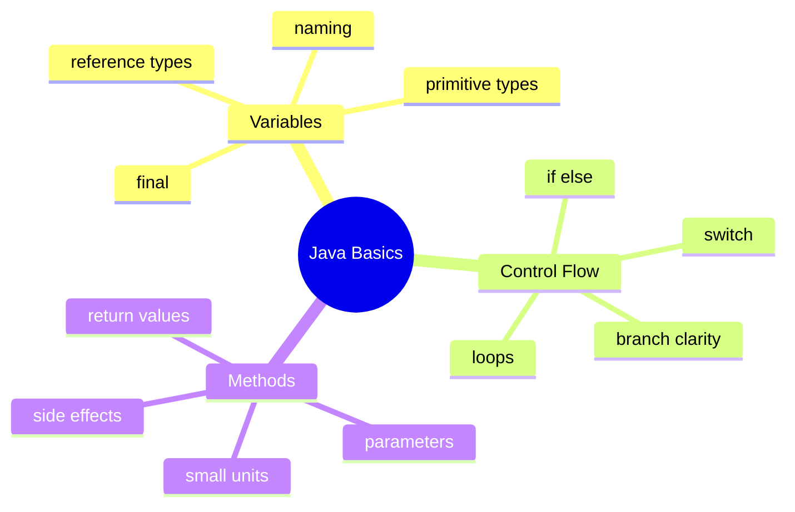
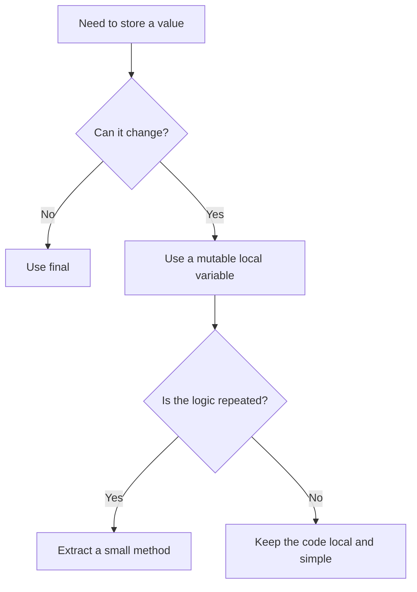

# Java Basics Learning Kit

This chapter is bundled into one guide so the learner does not need to jump across many files.

## What You Learn

- variables and type choice
- control flow
- writing small clear methods
- basic OCJP traps
- basic interview-style answers

## Study Order

1. Run [StoringAndNamingValues.java](/Users/indiadelhi/repo/career/java-missing-tutorial/code/src/main/java/com/learning/javamissing/sec01_fundamentals/ch01_java_basics/topics/storing_and_naming_values/StoringAndNamingValues.java)
2. Run [MakingDecisionsAndRepeatingWork.java](/Users/indiadelhi/repo/career/java-missing-tutorial/code/src/main/java/com/learning/javamissing/sec01_fundamentals/ch01_java_basics/topics/making_decisions_and_repeating_work/MakingDecisionsAndRepeatingWork.java)
3. Run [DesigningSmallMethods.java](/Users/indiadelhi/repo/career/java-missing-tutorial/code/src/main/java/com/learning/javamissing/sec01_fundamentals/ch01_java_basics/topics/designing_small_methods/DesigningSmallMethods.java)
4. Review quiz and interview questions below

## Visual Map

## Learning Flow

## Core Notes

### Variables

- choose names that explain the value
- use exact numeric types when correctness matters
- use `final` when reassignment should not happen

### Control Flow

- prefer simple branches first
- use loops that match the problem
- avoid deeply nested logic when guard clauses or simpler conditions work

### Methods

- one method should do one clear thing
- prefer return values over hidden side effects
- method names should explain intent

## Compare With

- variable vs value:
  a variable is the name, the value is the data stored inside it
- `if/else` vs loop:
  `if/else` chooses once, a loop repeats work
- method vs print statement:
  a method can return reusable logic, a print statement only shows text

## Senior Engineer Lens

- naming is not cosmetic; it controls how quickly code can be reviewed under pressure
- exact types reduce hidden defects, especially around money, rounding, and API contracts
- small methods are easier to test, inline mentally, and evolve safely
- basic control-flow clarity matters more in large codebases than clever syntax does

## Decision Chart

## Mini Case Study

Imagine a simple student marks program.

- variables store marks and names
- control flow decides pass or fail
- methods calculate total marks and average

This is why Java basics matter. Larger programs still depend on these same small ideas.

## OCJP Traps

- arithmetic on `byte`, `short`, and `char` promotes to `int`
- `switch` coverage rules matter
- Java is pass-by-value, even for object references
- `while` and `do-while` do not behave the same

## Interview Questions

Q: Why should local variables use meaningful names?  
A: Because names reduce mental load and make behavior easier to verify during reviews, debugging, and interviews.

Q: When is a `for-each` loop better than an indexed loop?  
A: When you only need the value and not the position.

Q: What makes a method easy to maintain?  
A: Small scope, clear name, obvious input and output, and limited side effects.

## Quick Quiz

1. Why does `byte c = a + b;` fail without a cast?
2. When would you use `final` on a local variable?
3. Why might a loop be clearer than a stream for very basic branching logic?
4. Why is returning a value often better than printing inside a method?

## Effective Java Coverage

- Item 5: Prefer dependency injection to hardwiring resources
  Relevance: constructor and method design will expand this in later chapters
- Item 49: Check parameters for validity
  Relevance: methods and defensive thinking
- Item 56: Write doc comments for all exposed API elements
  Relevance: method clarity and teaching style
- Item 61: Prefer primitive types to boxed primitives
  Relevance: variable type choice
- Item 62: Avoid strings where other types are more appropriate
  Relevance: variable and method design
- Item 68: Adhere to generally accepted naming conventions
  Relevance: variables and methods

## Sources

- Oracle Java SE overview: https://www.oracle.com/java/technologies/java-se-glance.html
- Java Language Specification: https://docs.oracle.com/javase/specs/
- Java API documentation: https://docs.oracle.com/en/java/
- Effective Java, 3rd Edition: https://www.informit.com/store/effective-java-9780134686042
- Core Java, Volume I: https://www.informit.com/store/core-java-volume-i-fundamentals-9780135558577
- Learn Java 17 Programming: https://www.packtpub.com/en-us/product/learn-java-17-programming-second-edition-9781803241432

## Slide-Ready Outline

Slide 1: Java basics matter because every later topic depends on them.  
Slide 2: Variables teach type choice and naming.  
Slide 3: Control flow teaches decisions and repetition.  
Slide 4: Methods teach reuse and clearer design.  
Slide 5: OCJP traps come from small syntax and type details.  
Slide 6: Interview questions test explanation, not just syntax.
