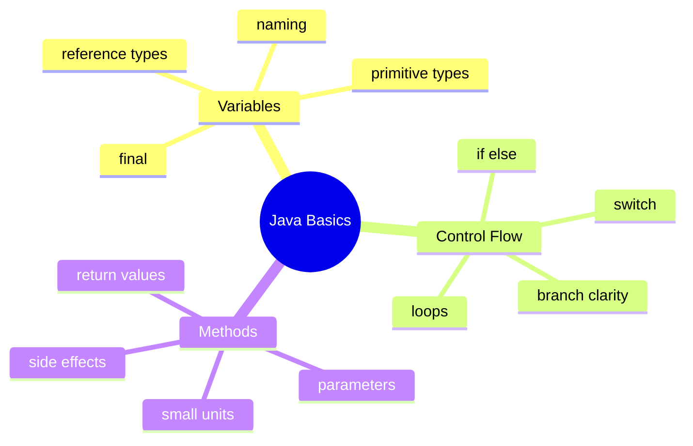
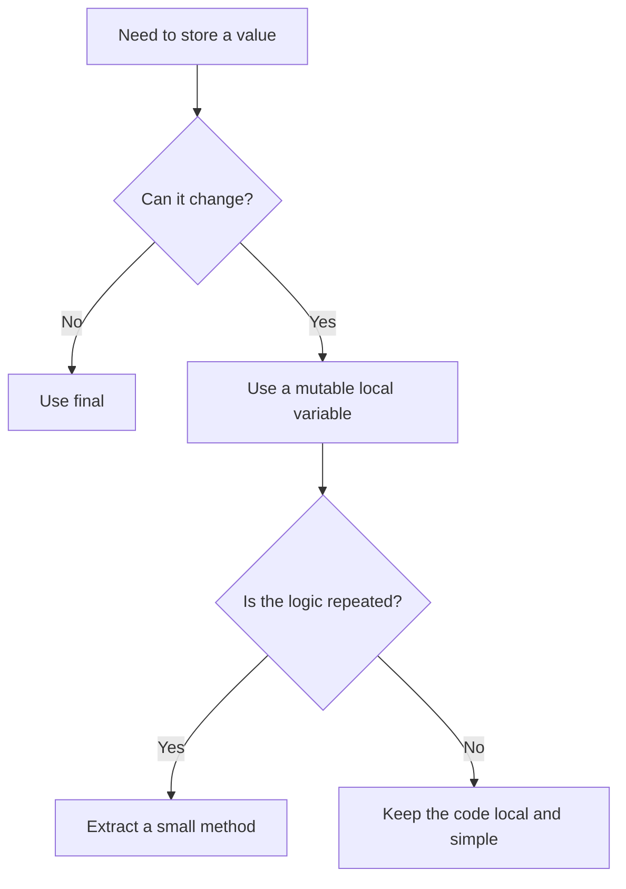

# Java Basics Learning Kit

## Why This Chapter Exists

- variables and type choice
- control flow
- writing small clear methods
- basic OCJP traps
- basic interview-style answers

## The Pain Before It

Before learners build a mental model for java basics, the APIs feel like isolated facts instead of answers to one connected problem.

## Java Creator Mindset

### Variables

- choose names that explain the value
- use exact numeric types when correctness matters
- use `final` when reassignment should not happen

### Control Flow

- prefer simple branches first
- use loops that match the problem
- avoid deeply nested logic when guard clauses or simpler conditions work

### Methods

- one method should do one clear thing
- prefer return values over hidden side effects
- method names should explain intent

## How You Might Invent It

## Naive Attempt

- variable vs value:
  a variable is the name, the value is the data stored inside it
- `if/else` vs loop:
  `if/else` chooses once, a loop repeats work
- method vs print statement:
  a method can return reusable logic, a print statement only shows text

## Why It Breaks

- arithmetic on `byte`, `short`, and `char` promotes to `int`
- `switch` coverage rules matter
- Java is pass-by-value, even for object references
- `while` and `do-while` do not behave the same

## Final Java Direction

### Variables

- choose names that explain the value
- use exact numeric types when correctness matters
- use `final` when reassignment should not happen

### Control Flow

- prefer simple branches first
- use loops that match the problem
- avoid deeply nested logic when guard clauses or simpler conditions work

### Methods

- one method should do one clear thing
- prefer return values over hidden side effects
- method names should explain intent

## Study Order

1. Run [Designing Small Methods](topics/designing_small_methods/DesigningSmallMethods.java)
2. Run [Making Decisions And Repeating Work](topics/making_decisions_and_repeating_work/MakingDecisionsAndRepeatingWork.java)
3. Run [Storing And Naming Values](topics/storing_and_naming_values/StoringAndNamingValues.java)

## What To Notice

### Compare With

- variable vs value:
  a variable is the name, the value is the data stored inside it
- `if/else` vs loop:
  `if/else` chooses once, a loop repeats work
- method vs print statement:
  a method can return reusable logic, a print statement only shows text

### Senior Lens

- naming is not cosmetic; it controls how quickly code can be reviewed under pressure
- exact types reduce hidden defects, especially around money, rounding, and API contracts
- small methods are easier to test, inline mentally, and evolve safely
- basic control-flow clarity matters more in large codebases than clever syntax does

### Decision Guide

## Mental Model

## Common Mistakes

- arithmetic on `byte`, `short`, and `char` promotes to `int`
- `switch` coverage rules matter
- Java is pass-by-value, even for object references
- `while` and `do-while` do not behave the same

## Tradeoffs

- variable vs value:
  a variable is the name, the value is the data stored inside it
- `if/else` vs loop:
  `if/else` chooses once, a loop repeats work
- method vs print statement:
  a method can return reusable logic, a print statement only shows text

- naming is not cosmetic; it controls how quickly code can be reviewed under pressure
- exact types reduce hidden defects, especially around money, rounding, and API contracts
- small methods are easier to test, inline mentally, and evolve safely
- basic control-flow clarity matters more in large codebases than clever syntax does

## Use / Avoid

Use this chapter when the surrounding design decision is still fuzzy. Do not force the patterns here into problems that are simpler than the examples.

## Practice

1. Why does `byte c = a + b;` fail without a cast?
2. When would you use `final` on a local variable?
3. Why might a loop be clearer than a stream for very basic branching logic?
4. Why is returning a value often better than printing inside a method?

### Mini Case Study

Imagine a simple student marks program.

- variables store marks and names
- control flow decides pass or fail
- methods calculate total marks and average

This is why Java basics matter. Larger programs still depend on these same small ideas.

## Summary

After this chapter, you should be able to explain the main decisions behind java basics and connect them back to the runnable examples.

## Next Chapter

Move to [Classes And Objects Learning Kit](../ch02_classes_and_objects/ChapterGuide.md) after this chapter.
