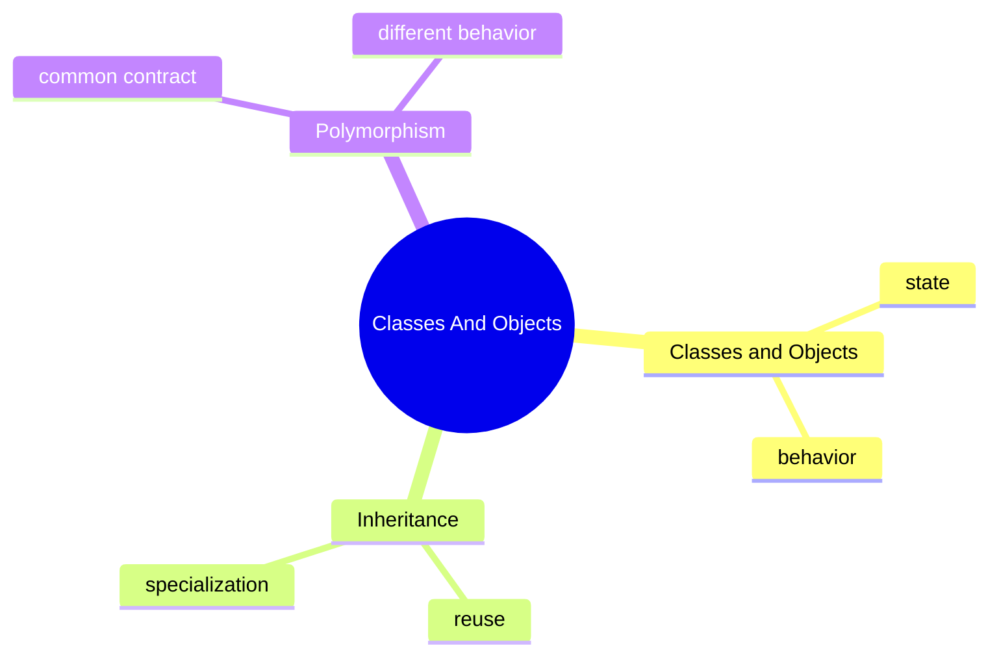

# Classes And Objects Learning Kit

## Why This Chapter Matters

Business software is full of things with identity and behavior:

- a student
- a vehicle
- an order
- a notification

If the code cannot model those clearly, everything later becomes harder:
validation, testing, maintenance, and debugging.

## Intuition

## Problem Statement

Business software is full of things with identity and behavior:

- a student
- a vehicle
- an order
- a notification

If the code cannot model those clearly, everything later becomes harder:
validation, testing, maintenance, and debugging.

## Core Ideas

### Classes And Objects

- a class is the blueprint
- an object is the working instance
- fields describe state
- methods describe behavior

### Inheritance

- inheritance models an `is-a` relationship
- it is useful when a child type is a specialized version of a parent type
- it becomes harmful when used only to reuse code mechanically

### Polymorphism

- polymorphism lets one contract support many implementations
- it is useful when the caller should not care about the exact subtype

## Mental Model

## Study Order

1. Run [ClassesObjects.java](topics/classes_objects/ClassesObjects.java)
2. Run [Inheritance.java](topics/inheritance/Inheritance.java)
3. Run [Polymorphism.java](topics/polymorphism/Polymorphism.java)
4. Revisit this guide for quiz, interview questions, traps, and design notes.

## What To Notice

### Compare With

- class vs object:
  a class defines the shape, an object is one real instance
- inheritance vs composition:
  inheritance specializes a parent, composition builds behavior from parts
- compile-time type vs runtime type:
  the reference type and the real object type are not always the same

### Interview Focus

Q: When is inheritance a bad choice?  
A: When the relationship is only code reuse and not true specialization.

Q: Why is polymorphism useful in production code?  
A: It reduces coupling by letting callers depend on behavior contracts instead of concrete implementations.

Q: What is the difference between composition and inheritance?  
A: Composition builds behavior from collaborating objects, while inheritance reuses and specializes a parent type.

## Common Mistakes

The most common mistake is to memorize labels without building a mental model for when the concept actually helps.

## When To Use / When Not To Use

Use this chapter when the surrounding design decision is still fuzzy. Do not force the patterns here into problems that are simpler than the examples.

## Practice

1. What is the difference between a class and an object?
2. Why is overriding resolved differently from field access?
3. When would composition be safer than inheritance?

### Mini Case Study

Imagine a notification system.

- a base notification contract defines `send()`
- email, SMS, and push notifications implement it differently
- the caller only knows it is sending a notification

That is a small but real example of polymorphism helping design.

## Summary

After this chapter, you should be able to explain the main decisions behind classes and objects and connect them back to the runnable examples.

## Why This Chapter Exists

Business software is full of things with identity and behavior:

- a student
- a vehicle
- an order
- a notification

If the code cannot model those clearly, everything later becomes harder:
validation, testing, maintenance, and debugging.

## Concept Map

## Real Problems This Chapter Solves

- how to model a student, product, or notification in code
- how to avoid copy-paste behavior across similar types
- how to write code that depends on abstractions instead of concrete classes

## Compare With

- class vs object:
  a class defines the shape, an object is one real instance
- inheritance vs composition:
  inheritance specializes a parent, composition builds behavior from parts
- compile-time type vs runtime type:
  the reference type and the real object type are not always the same

## Deep Dive

The main danger in OOP is not syntax.
It is modeling the wrong relationship.

Good design questions:

- is this really an `is-a` relationship?
- should this caller know the exact subtype?
- is behavior attached to the correct object?
- would composition make this easier to change later?

This is where beginners and experienced engineers both benefit from slowing down.

## Mini Case Study

Imagine a notification system.

- a base notification contract defines `send()`
- email, SMS, and push notifications implement it differently
- the caller only knows it is sending a notification

That is a small but real example of polymorphism helping design.

## OCJP Focus

- reference type and object type can differ
- overridden methods are chosen at runtime
- hidden fields do not behave like overridden methods
- constructor chaining rules matter

## Interview Focus

Q: When is inheritance a bad choice?  
A: When the relationship is only code reuse and not true specialization.

Q: Why is polymorphism useful in production code?  
A: It reduces coupling by letting callers depend on behavior contracts instead of concrete implementations.

Q: What is the difference between composition and inheritance?  
A: Composition builds behavior from collaborating objects, while inheritance reuses and specializes a parent type.

## Quick Quiz

1. What is the difference between a class and an object?
2. Why is overriding resolved differently from field access?
3. When would composition be safer than inheritance?

## Effective Java Mapping

- Item 18: Favor composition over inheritance
- Item 19: Design and document for inheritance or else prohibit it
- Item 20: Prefer interfaces to abstract classes
- Item 23: Prefer class hierarchies to tagged classes

## Sources

- Effective Java, 3rd Edition: https://www.informit.com/store/effective-java-9780134686042
- Core Java, Volume I: https://www.informit.com/store/core-java-volume-i-fundamentals-9780135558577
- Java Language Specification: https://docs.oracle.com/javase/specs/
- Java API documentation: https://docs.oracle.com/en/java/
