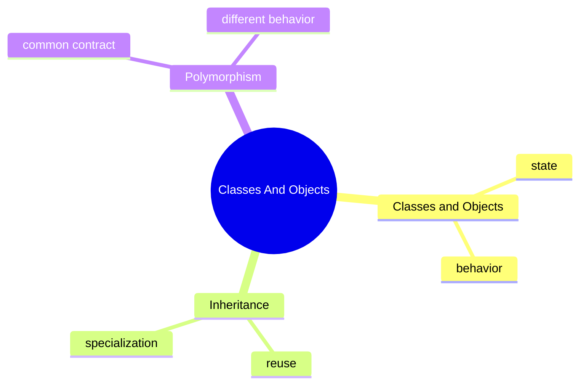

# Classes And Objects Learning Kit

## Why This Chapter Exists

Business software is full of things with identity and behavior:

- a student
- a vehicle
- an order
- a notification

If the code cannot model those clearly, everything later becomes harder:
validation, testing, maintenance, and debugging.

## The Pain Before It

- how to model a student, product, or notification in code
- how to avoid copy-paste behavior across similar types
- how to write code that depends on abstractions instead of concrete classes

## Java Creator Mindset

### Classes And Objects

- a class is the blueprint
- an object is the working instance
- fields describe state
- methods describe behavior

### Inheritance

- inheritance models an `is-a` relationship
- it is useful when a child type is a specialized version of a parent type
- it becomes harmful when used only to reuse code mechanically

### Polymorphism

- polymorphism lets one contract support many implementations
- it is useful when the caller should not care about the exact subtype

## How You Might Invent It

## Naive Attempt

- class vs object:
  a class defines the shape, an object is one real instance
- inheritance vs composition:
  inheritance specializes a parent, composition builds behavior from parts
- compile-time type vs runtime type:
  the reference type and the real object type are not always the same

## Why It Breaks

That breaks when the same mistake repeats across files, teams, or interview questions and the code has no shared mental model.

## Final Java Direction

### Classes And Objects

- a class is the blueprint
- an object is the working instance
- fields describe state
- methods describe behavior

### Inheritance

- inheritance models an `is-a` relationship
- it is useful when a child type is a specialized version of a parent type
- it becomes harmful when used only to reuse code mechanically

### Polymorphism

- polymorphism lets one contract support many implementations
- it is useful when the caller should not care about the exact subtype

## Study Order

1. Run [Classes Objects](topics/classes_objects/ClassesObjects.java)
2. Run [Inheritance](topics/inheritance/Inheritance.java)
3. Run [Polymorphism](topics/polymorphism/Polymorphism.java)

## What To Notice

### Compare With

- class vs object:
  a class defines the shape, an object is one real instance
- inheritance vs composition:
  inheritance specializes a parent, composition builds behavior from parts
- compile-time type vs runtime type:
  the reference type and the real object type are not always the same

### Interview Focus

Q: When is inheritance a bad choice?  
A: When the relationship is only code reuse and not true specialization.

Q: Why is polymorphism useful in production code?  
A: It reduces coupling by letting callers depend on behavior contracts instead of concrete implementations.

Q: What is the difference between composition and inheritance?  
A: Composition builds behavior from collaborating objects, while inheritance reuses and specializes a parent type.

## Mental Model

## Common Mistakes

The most common mistake is to memorize labels without building a mental model for when the concept actually helps.

## Tradeoffs

- class vs object:
  a class defines the shape, an object is one real instance
- inheritance vs composition:
  inheritance specializes a parent, composition builds behavior from parts
- compile-time type vs runtime type:
  the reference type and the real object type are not always the same

## Use / Avoid

Use this chapter when the surrounding design decision is still fuzzy. Do not force the patterns here into problems that are simpler than the examples.

## Practice

1. What is the difference between a class and an object?
2. Why is overriding resolved differently from field access?
3. When would composition be safer than inheritance?

### Mini Case Study

Imagine a notification system.

- a base notification contract defines `send()`
- email, SMS, and push notifications implement it differently
- the caller only knows it is sending a notification

That is a small but real example of polymorphism helping design.

## Summary

After this chapter, you should be able to explain the main decisions behind classes and objects and connect them back to the runnable examples.
