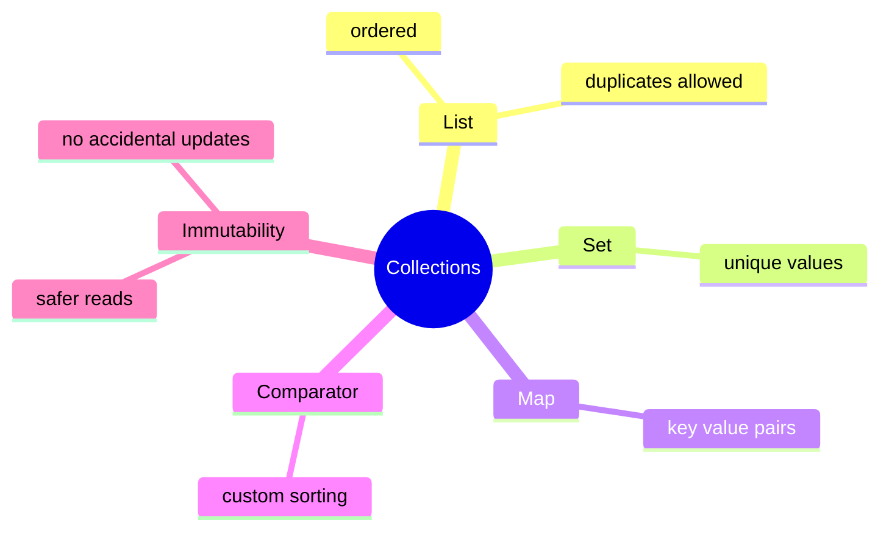

# Collections Learning Kit

## Why This Chapter Exists

Collections are the first place where Java starts feeling like API choice matters, not just syntax.
This chapter teaches the difference between `List`, `Set`, `Map`, immutable collections, and `Comparator`.

## The Pain Before It

Before a learner has a mental model for collections, the APIs feel like unrelated facts instead of answers to one connected problem.

## Java Creator Mindset

- `List` keeps order and allows duplicates.
- `Set` keeps unique values.
- `Map` stores `key -> value` pairs.
- immutable collections protect shared data from accidental change.
- `Comparator` lets Java sort the same object in different ways.

## How You Might Invent It

## Naive Attempt

| Compare | Prefer Left When | Prefer Right When |
| --- | --- | --- |
| `List` vs `Set` | order and duplicates matter | uniqueness matters more than duplicates |
| mutable vs immutable collection | the same owner must keep updating data | callers should not accidentally change shared data |
| built-in order vs comparator | one natural order is enough everywhere | sorting rules change by use case |

## Why It Breaks

That breaks when the same mistake repeats across files, teams, or interview questions and the code has no shared mental model.

## Final Java Direction

- use `List` when order matters.
- use `Set` when duplicates should not exist.
- use `Map` when you need lookup by key.
- use immutable collections when callers should not mutate shared data.
- use `Comparator` when sorting rules must be explicit.

## Study Order

1. Run [ListSetMap.java](topics/list_set_map/ListSetMap.java)
2. Run [Immutability.java](topics/immutability/Immutability.java)
3. Run [Comparator.java](topics/comparator/Comparator.java)

## What To Notice

- the collection type is part of the API contract, not just a storage detail
- immutable collections reduce defensive coding and make concurrent reading safer
- comparator design affects correctness, reproducibility, and sometimes cache or query behavior

## Mental Model

Think of the chapter as three questions:

1. Do I need order, uniqueness, or key lookup?
2. Should the data be mutable or protected?
3. Do I need one default sort or a custom sort rule?

## Common Mistakes

- memorizing labels without building a mental model for when the concept actually helps
- choosing `Set` when duplicates are meaningful
- choosing `Map` when plain ordered values are enough

## Tradeoffs

| Compare | Prefer Left When | Prefer Right When |
| --- | --- | --- |
| `List` vs `Set` | order and duplicates matter | uniqueness matters more than duplicates |
| mutable vs immutable collection | the same owner must keep updating data | callers should not accidentally change shared data |
| built-in order vs comparator | one natural order is enough everywhere | sorting rules change by use case |

## Use / Avoid

### Use It When

- use `List` when order matters
- use `Set` when duplicates should not exist
- use `Map` when you need lookup by key
- use `Comparator` when sorting rules must be explicit

### Avoid It When

- do not use `Set` if duplicates are meaningful
- do not use `Map` if you only need plain ordered values
- do not use mutable collections if shared code should not update them

## Practice

1. Which collection type allows duplicates and keeps order?
2. What happens if you call `add()` on `List.of(...)`?
3. When is a comparator better than changing the class itself?

### Mini Case Study

Imagine a shopping app.

- `List` keeps products in cart order
- `Set` keeps unique coupon codes
- `Map` stores product id to quantity
- `Comparator` sorts products by price or name
- immutable collections protect a final order summary

## Summary

- `List` keeps order and allows duplicates
- `Set` keeps unique values
- `Map` stores `key -> value` pairs
- immutable collections protect shared data
- `Comparator` makes sorting rules explicit
