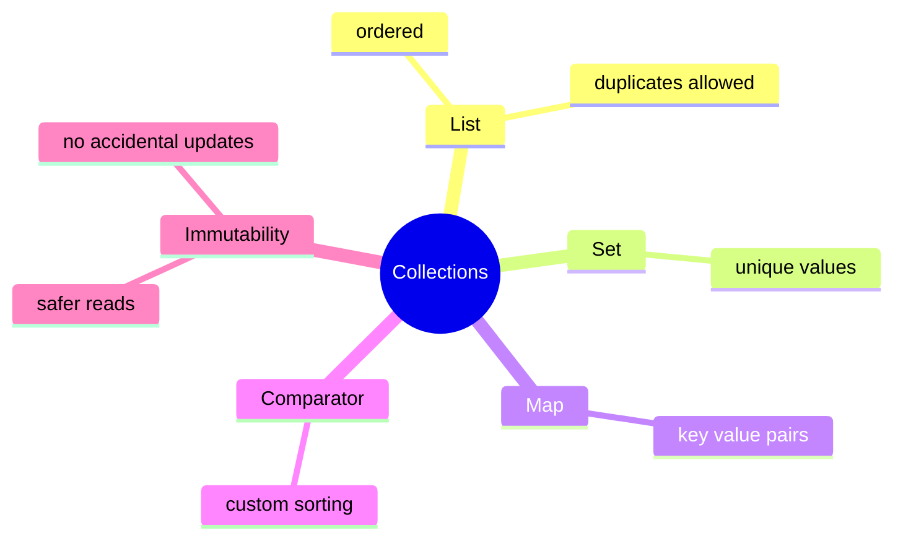
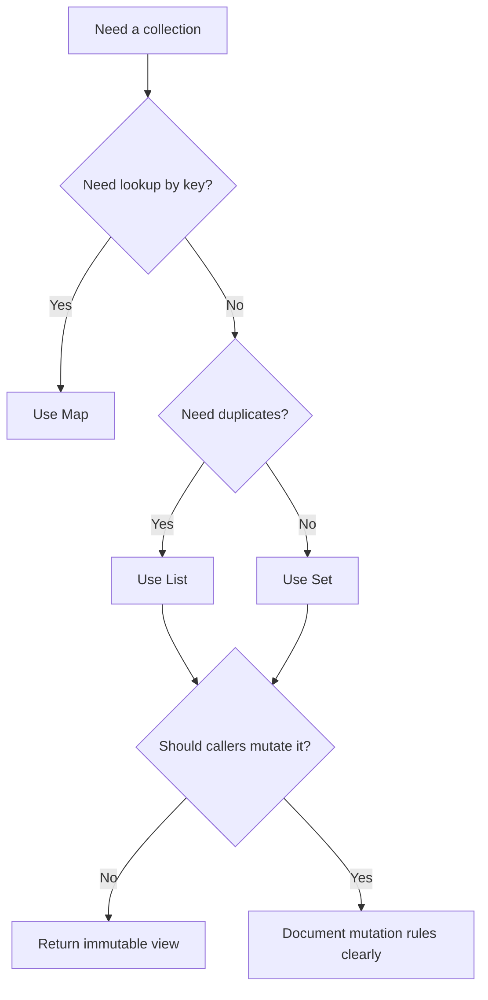

# Collections Learning Kit

## Why This Chapter Matters

- know the difference between `List`, `Set`, and `Map`
- understand when duplicate values are allowed
- understand why immutable collections are safer
- understand how a comparator changes sorting rules

## Intuition

## Problem Statement

- know the difference between `List`, `Set`, and `Map`
- understand when duplicate values are allowed
- understand why immutable collections are safer
- understand how a comparator changes sorting rules

## Core Ideas

### List, Set, Map

- `List` keeps order and allows duplicates
- `Set` keeps unique values
- `Map` stores data as `key -> value`

### Immutability

- immutable collections cannot be changed after creation
- they reduce accidental bugs

### Comparator

- a comparator tells Java how to sort objects
- it is useful when one object can be sorted in different ways

## Mental Model

## Study Order

1. Run [ListSetMap.java](topics/list_set_map/ListSetMap.java)
2. Run [Immutability.java](topics/immutability/Immutability.java)
3. Run [Comparator.java](topics/comparator/Comparator.java)

## What To Notice

### Compare With

| Compare | Prefer Left When | Prefer Right When |
| --- | --- | --- |
| `List` vs `Set` | order and duplicates matter | uniqueness matters more than duplicates |
| mutable vs immutable collection | the same owner must keep updating data | callers should not accidentally change shared data |
| built-in order vs comparator | one natural order is enough everywhere | sorting rules change by use case |

### Interview Focus

Q: When would you choose a `Set` over a `List`?  
A: When uniqueness is more important than duplicates or index-based access.

Q: Why are immutable collections useful?  
A: They protect shared data from accidental modification.

Q: Why use a comparator?  
A: Because the same object may need different sorting rules in different situations.

### Senior Lens

- the collection type is part of the API contract, not just a storage detail
- immutability reduces defensive coding and makes concurrent reading safer
- comparator design affects correctness, reproducibility, and sometimes cache or query behavior
- choosing the wrong collection leaks as both readability and performance debt

### Decision Guide

## Common Mistakes

The most common mistake is to memorize labels without building a mental model for when the concept actually helps.

## When To Use / When Not To Use

### Use It When

- use `List` when order matters
- use `Set` when duplicates should not exist
- use `Map` when you need lookup by key
- use `Comparator` when sorting rules must be explicit

### Avoid It When

- do not use `Set` if duplicates are meaningful
- do not use `Map` if you only need plain ordered values
- do not use mutable collections if shared code should not update them

## Practice

1. Which collection type allows duplicates and keeps order?
2. What happens if you call `add()` on `List.of(...)`?
3. When is a comparator better than changing the class itself?

### Mini Case Study

Imagine a shopping app.

- `List` keeps products in cart order
- `Set` keeps unique coupon codes
- `Map` stores product id to quantity
- `Comparator` sorts products by price or name
- immutable collections protect a final order summary

## Summary

### List, Set, Map

- `List` keeps order and allows duplicates
- `Set` keeps unique values
- `Map` stores data as `key -> value`

### Immutability

- immutable collections cannot be changed after creation
- they reduce accidental bugs

### Comparator

- a comparator tells Java how to sort objects
- it is useful when one object can be sorted in different ways

## Beginner Focus

- know the difference between `List`, `Set`, and `Map`
- understand when duplicate values are allowed
- understand why immutable collections are safer
- understand how a comparator changes sorting rules

## Visual Map

## Quick Summary

### List, Set, Map

- `List` keeps order and allows duplicates
- `Set` keeps unique values
- `Map` stores data as `key -> value`

### Immutability

- immutable collections cannot be changed after creation
- they reduce accidental bugs

### Comparator

- a comparator tells Java how to sort objects
- it is useful when one object can be sorted in different ways

## Compare With

| Compare | Prefer Left When | Prefer Right When |
| --- | --- | --- |
| `List` vs `Set` | order and duplicates matter | uniqueness matters more than duplicates |
| mutable vs immutable collection | the same owner must keep updating data | callers should not accidentally change shared data |
| built-in order vs comparator | one natural order is enough everywhere | sorting rules change by use case |

## Senior Engineer Lens

- the collection type is part of the API contract, not just a storage detail
- immutability reduces defensive coding and makes concurrent reading safer
- comparator design affects correctness, reproducibility, and sometimes cache or query behavior
- choosing the wrong collection leaks as both readability and performance debt

## Decision Chart

## Mini Case Study

Imagine a shopping app.

- `List` keeps products in cart order
- `Set` keeps unique coupon codes
- `Map` stores product id to quantity
- `Comparator` sorts products by price or name
- immutable collections protect a final order summary

## When To Use

- use `List` when order matters
- use `Set` when duplicates should not exist
- use `Map` when you need lookup by key
- use `Comparator` when sorting rules must be explicit

## When Not To Use

- do not use `Set` if duplicates are meaningful
- do not use `Map` if you only need plain ordered values
- do not use mutable collections if shared code should not update them

## OCJP Focus

- know which collections allow duplicates
- know that immutable collections throw exceptions on modification
- know how comparator-based sorting changes result order

## Interview Focus

Q: When would you choose a `Set` over a `List`?  
A: When uniqueness is more important than duplicates or index-based access.

Q: Why are immutable collections useful?  
A: They protect shared data from accidental modification.

Q: Why use a comparator?  
A: Because the same object may need different sorting rules in different situations.

## Quick Quiz

1. Which collection type allows duplicates and keeps order?
2. What happens if you call `add()` on `List.of(...)`?
3. When is a comparator better than changing the class itself?

## Effective Java Mapping

- Item 17: Minimize mutability
- Item 50: Make defensive copies when needed
- Item 58: Prefer for-each loops to traditional for loops
- Item 61: Prefer primitive types to boxed primitives

## Sources

- Core Java, Volume I: https://www.informit.com/store/core-java-volume-i-fundamentals-9780135558577
- Effective Java, 3rd Edition: https://www.informit.com/store/effective-java-9780134686042
- Java API documentation: https://docs.oracle.com/en/java/
