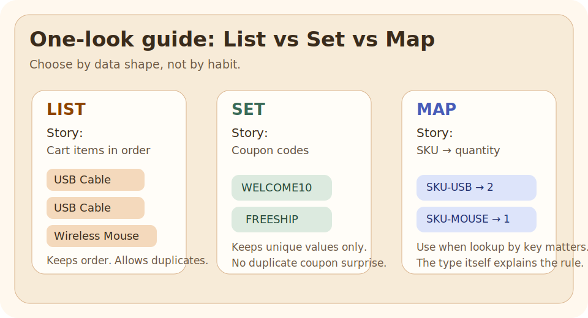

# List, Set, Map

## Why This Exists

Java bugs often come from choosing the wrong data shape, not from writing the wrong syntax.

If the business rule is "keep order", "keep values unique", or "look up by key", the collection type should express that rule directly.

## The Pain Before It

Imagine one small commerce flow:

- cart items must keep order and allow duplicates
- coupon codes should not repeat
- product quantities should be fetched by SKU

If all three are stored in `List`, the code compiles, but the intent is wrong from the start.

## Java Creator Mindset

Collections are not just containers. They are a way to make business rules visible in code:

- `List` says order matters
- `Set` says uniqueness matters
- `Map` says lookup by key matters

That makes code easier to read before anyone studies the implementation details.

## How You Might Invent It

Start with three questions:

1. Do I care about order?
2. Do I care about uniqueness?
3. Do I need lookup by key?

Those questions naturally lead to `List`, `Set`, or `Map`.

## Naive Attempt

Use `List` for everything because it is familiar and easy to print.

That looks harmless at first:

- one collection type to remember
- simple iteration
- simple examples

## Why It Breaks

The same `List`-everywhere choice causes three different problems:

- coupon codes can repeat even when the business rule says they should be unique
- quantity lookup becomes repeated scanning instead of direct key access
- the reader cannot tell the rule from the type alone

The bug is not only performance. It is loss of intent.

## Final Java Solution

Match the collection to the data rule:

- use `List<String>` for cart lines
- use `Set<String>` for coupon codes
- use `Map<String, Integer>` for quantities by SKU

That is the shape used in the runnable example.

## Code

### Run It

Run the example and compare cart items, coupon codes, and product quantities.

### Expected Result

- cart items keep duplicates and order
- coupon codes stay unique
- product quantities can be looked up by SKU

## Walkthrough

The Java file uses three small methods:

- `sampleCartItems()` returns a `List` because duplicate items are valid in a cart
- `sampleCouponCodes()` returns a `Set` because duplicates would be a business bug
- `sampleQuantitiesBySku()` returns a `Map` because the main question is "what is the quantity for this SKU?"

This is the main lesson: the type answers the first design question before any loop starts.

## Mental Model

Think in terms of the question the code needs to answer:

| Question | Best fit |
| --- | --- |
| "What came first, second, third?" | `List` |
| "Have we already seen this value?" | `Set` |
| "What value belongs to this key?" | `Map` |

If you cannot state the question clearly, you will usually choose the wrong collection.

## Mistakes

- using `List` when uniqueness is the real requirement
- using `Set` and then being surprised that index-based access does not exist
- using `Map` when there is no real key-based lookup need
- choosing by habit instead of by business rule

## Tradeoffs

| Collection | Strength | Cost |
| --- | --- | --- |
| `List` | keeps order and duplicates naturally | lookup by value is often repeated scanning |
| `Set` | prevents duplicates clearly | no positional access; ordering depends on implementation |
| `Map` | direct lookup by key | you must define a meaningful key |

For interview answers, say the correctness rule first and the performance implication second.

## Use / Avoid

### Use It When

- you want the collection type to document the data rule
- order, uniqueness, or lookup is the main decision
- you want simpler downstream code

### Avoid It When

- you are picking a collection only because it is the one you remember best
- you are discussing implementation classes before you understand the data shape

## Practice

Change one input in [ListSetMap.java](ListSetMap.java), rerun it, and write down what changed.

## Summary

- `List`, `Set`, and `Map` solve different data-shape problems
- the right choice makes correctness clearer before performance is discussed
- the fastest way to choose is to ask: order, uniqueness, or key lookup?
