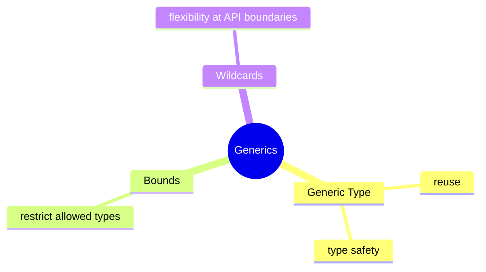

# Generics Learning Kit

## Why This Chapter Exists

Without generics, reusable code becomes unsafe:

- you store the wrong type
- you cast too often
- errors move from compile time to runtime

Generics solve the problem of reuse with type safety.

## The Pain Before It

- how to build a reusable container without losing type safety
- how to restrict an API to numbers, comparable values, or some other capability
- how to accept a wider range of collections safely in reusable methods

## Java Creator Mindset

### Generic Type

- one class or method can work for many types
- the compiler still checks correctness

### Bounds

- bounds say which kinds of types are allowed
- they are useful when reusable code still needs specific capabilities

### Wildcards

- wildcards make APIs more flexible
- they are useful when exact type parameters are not the main point of the caller

## How You Might Invent It

## Naive Attempt

| Compare | Prefer Left When | Prefer Right When |
| --- | --- | --- |
| raw type vs generic type | almost never in modern code | you want compile-time type safety |
| exact type parameter vs wildcard | the API both reads and writes one exact type | the API boundary should accept a wider related family |
| unbounded vs bounded generic | behavior does not depend on capabilities | behavior needs a guarantee such as `Number` or `Comparable` |

## Why It Breaks

That breaks when the same mistake repeats across files, teams, or interview questions and the code has no shared mental model.

## Final Java Direction

### Generic Type

- one class or method can work for many types
- the compiler still checks correctness

### Bounds

- bounds say which kinds of types are allowed
- they are useful when reusable code still needs specific capabilities

### Wildcards

- wildcards make APIs more flexible
- they are useful when exact type parameters are not the main point of the caller

## Study Order

1. Run [GenericType.java](topics/generic_type/GenericType.java)
2. Run [Bounds.java](topics/bounds/Bounds.java)
3. Run [Wildcards.java](topics/wildcards/Wildcards.java)
4. Revisit this guide for traps, interview angles, and the deeper mental model.

## What To Notice

### Compare With

| Compare | Prefer Left When | Prefer Right When |
| --- | --- | --- |
| raw type vs generic type | almost never in modern code | you want compile-time type safety |
| exact type parameter vs wildcard | the API both reads and writes one exact type | the API boundary should accept a wider related family |
| unbounded vs bounded generic | behavior does not depend on capabilities | behavior needs a guarantee such as `Number` or `Comparable` |

### Interview Focus

Q: Why are generics important in production code?  
A: They let reusable APIs stay type-safe and reduce casts and runtime failures.

Q: When would you use a bound?  
A: When reusable code still needs a guarantee about the capabilities of the type.

Q: Why do wildcards confuse people?  
A: Because they are about API flexibility, not only about syntax.

## Mental Model

Use this simple rule:

- if your code only needs “some type”, use a generic type parameter
- if your code needs “some subtype of X”, use an upper bound
- if your API should accept a range of related types, think about wildcards

## Common Mistakes

The most common mistake is to memorize labels without building a mental model for when the concept actually helps.

## Tradeoffs

| Compare | Prefer Left When | Prefer Right When |
| --- | --- | --- |
| raw type vs generic type | almost never in modern code | you want compile-time type safety |
| exact type parameter vs wildcard | the API both reads and writes one exact type | the API boundary should accept a wider related family |
| unbounded vs bounded generic | behavior does not depend on capabilities | behavior needs a guarantee such as `Number` or `Comparable` |

- whether the type arguments match the declaration
- whether a bound is respected
- whether a value can be safely assigned without an explicit cast

- most generic type information is erased
- the JVM does not keep full generic detail for ordinary object instances
- this is why `List<String>` and `List<Integer>` do not stay fully distinct at runtime in the same way they are at compile time

## Use / Avoid

### Use It When

- use a generic type when one abstraction should safely support many data types
- use bounds when behavior depends on a capability such as being numeric or comparable
- use wildcards when callers should not be forced into one exact type argument

### Avoid It When

- do not use raw types in normal modern code
- do not add type parameters only for style
- do not make APIs so generic that the business meaning disappears

## Practice

1. Why are raw types risky?
2. What problem does an upper bound solve?
3. When is a wildcard more useful than an exact type parameter?

### Mini Case Study

Imagine a reporting system.

- one report box may hold `StudentReport`
- another may hold `SalesReport`
- both should use the same reusable container design

That is the everyday value of generics: reuse without unsafe casting.

## Summary

After this chapter, you should be able to explain the main decisions behind generics and connect them back to the runnable examples.

## Why This Chapter Matters

Without generics, reusable code becomes unsafe:

- you store the wrong type
- you cast too often
- errors move from compile time to runtime

Generics solve the problem of reuse with type safety.

## Intuition

Use this simple rule:

- if your code only needs “some type”, use a generic type parameter
- if your code needs “some subtype of X”, use an upper bound
- if your API should accept a range of related types, think about wildcards

## Problem Statement

Without generics, reusable code becomes unsafe:

- you store the wrong type
- you cast too often
- errors move from compile time to runtime

Generics solve the problem of reuse with type safety.

## Core Ideas

### Generic Type

- one class or method can work for many types
- the compiler still checks correctness

### Bounds

- bounds say which kinds of types are allowed
- they are useful when reusable code still needs specific capabilities

### Wildcards

- wildcards make APIs more flexible
- they are useful when exact type parameters are not the main point of the caller

## When To Use / When Not To Use

### Use It When

- use a generic type when one abstraction should safely support many data types
- use bounds when behavior depends on a capability such as being numeric or comparable
- use wildcards when callers should not be forced into one exact type argument

### Avoid It When

- do not use raw types in normal modern code
- do not add type parameters only for style
- do not make APIs so generic that the business meaning disappears

## Deep-Dive Promise

This chapter does not stop at syntax.
It explains:

- what the compiler checks
- what survives at runtime
- why API flexibility becomes hard
- why wildcards confuse so many learners

## Concept Map

## Real Problems This Chapter Solves

- how to build a reusable container without losing type safety
- how to restrict an API to numbers, comparable values, or some other capability
- how to accept a wider range of collections safely in reusable methods

## Compare With

| Compare | Prefer Left When | Prefer Right When |
| --- | --- | --- |
| raw type vs generic type | almost never in modern code | you want compile-time type safety |
| exact type parameter vs wildcard | the API both reads and writes one exact type | the API boundary should accept a wider related family |
| unbounded vs bounded generic | behavior does not depend on capabilities | behavior needs a guarantee such as `Number` or `Comparable` |

## Deep Dive

Generics are mainly about API design, not syntax.

The real questions are:

- where should the type parameter live?
- should this method consume values, produce values, or both?
- is this API too rigid or too vague?

This is why generics become hard for many learners.
They are easy to read as symbols and hard to understand as design choices.

## What The Compiler Checks

- whether the type arguments match the declaration
- whether a bound is respected
- whether a value can be safely assigned without an explicit cast

## What Happens At Runtime

- most generic type information is erased
- the JVM does not keep full generic detail for ordinary object instances
- this is why `List<String>` and `List<Integer>` do not stay fully distinct at runtime in the same way they are at compile time

## Wrong Mental Model

- “generics are only fancy syntax”
- “wildcards are random symbols to memorize”
- “runtime knows every generic detail”

## Right Mental Model

- generics are compile-time contracts for reusable APIs
- bounds describe capability requirements
- wildcards are about flexibility at method boundaries
- type erasure explains many generic restrictions

## Mini Case Study

Imagine a reporting system.

- one report box may hold `StudentReport`
- another may hold `SalesReport`
- both should use the same reusable container design

That is the everyday value of generics: reuse without unsafe casting.

## When To Use

- use a generic type when one abstraction should safely support many data types
- use bounds when behavior depends on a capability such as being numeric or comparable
- use wildcards when callers should not be forced into one exact type argument

## When Not To Use

- do not use raw types in normal modern code
- do not add type parameters only for style
- do not make APIs so generic that the business meaning disappears

## OCJP Focus

- type erasure affects runtime behavior
- raw types compile but lose safety
- `? extends` and `? super` are common exam traps
- the compiler, not the JVM, enforces most generic checks

## Interview Focus

Q: Why are generics important in production code?  
A: They let reusable APIs stay type-safe and reduce casts and runtime failures.

Q: When would you use a bound?  
A: When reusable code still needs a guarantee about the capabilities of the type.

Q: Why do wildcards confuse people?  
A: Because they are about API flexibility, not only about syntax.

## Quick Quiz

1. Why are raw types risky?
2. What problem does an upper bound solve?
3. When is a wildcard more useful than an exact type parameter?

## Effective Java Mapping

- Item 26: Don’t use raw types
- Item 28: Prefer lists to arrays
- Item 29: Favor generic types
- Item 30: Favor generic methods
- Item 31: Use bounded wildcards to increase API flexibility

## Sources

- Effective Java, 3rd Edition: https://www.informit.com/store/effective-java-9780134686042
- Core Java, Volume I: https://www.informit.com/store/core-java-volume-i-fundamentals-9780135558577
- Java Language Specification: https://docs.oracle.com/javase/specs/
- Java API documentation: https://docs.oracle.com/en/java/
