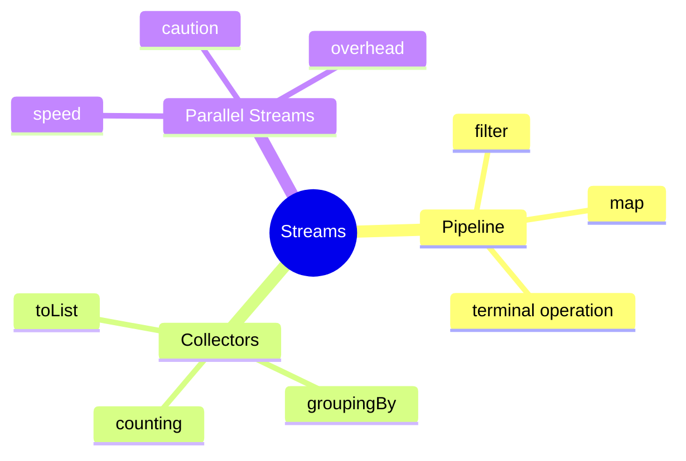
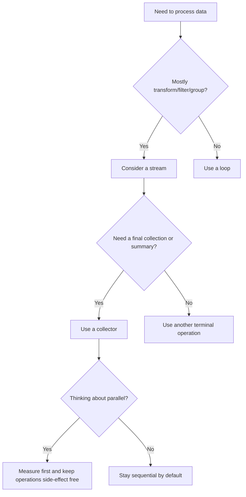

# Streams Learning Kit

This chapter is written for a college fresher.

Read one example at a time. Run the code. Compare the printed output with the explanation.

## Beginner Focus

- understand what a stream pipeline is
- understand when collectors are useful
- understand why parallel streams need care

## Study Order

1. Run [StreamPipeline.java](/Users/indiadelhi/repo/career/java-missing-tutorial/code/src/main/java/com/learning/javamissing/sec04_streams_and_functional_style/ch01_streams/topics/stream_pipeline/StreamPipeline.java)
2. Run [Collectors.java](/Users/indiadelhi/repo/career/java-missing-tutorial/code/src/main/java/com/learning/javamissing/sec04_streams_and_functional_style/ch01_streams/topics/collectors/Collectors.java)
3. Run [ParallelStreams.java](/Users/indiadelhi/repo/career/java-missing-tutorial/code/src/main/java/com/learning/javamissing/sec04_streams_and_functional_style/ch01_streams/topics/parallel_streams/ParallelStreams.java)

## Visual Map

## Quick Summary

### Stream Pipeline

- a stream pipeline processes data step by step
- intermediate operations prepare the work
- a terminal operation finishes the work

### Collectors

- collectors turn a stream into a final result
- examples: list, set, grouped map, count, summary

### Parallel Streams

- parallel streams can split work
- they are useful only when the work and data size justify the cost

## Compare With

| Compare | Prefer Left When | Prefer Right When |
| --- | --- | --- |
| loop vs stream | logic is stateful or easier to debug step by step | the task is mostly filtering, mapping, grouping, or aggregation |
| `groupingBy` vs `toMap` | many values can belong to one key | each key should map to one value, or you have a merge rule |
| sequential vs parallel stream | clarity and predictable execution matter most | the workload is large, side-effect free, and measured to benefit |

## Senior Engineer Lens

- streams are strongest when the business logic reads like data transformation
- side effects inside pipelines make debugging, testing, and parallelization harder
- collectors are often clearer than hand-written mutable accumulation
- parallel streams are a deployment decision, not a style preference

## Decision Chart

## Mini Case Study

Imagine an order processing screen.

- filter only priority orders
- collect product names by category
- count products per category
- calculate total price of selected orders

This is a natural fit for streams because the task is “take data, transform it, and produce a result”.

## When To Use

- use streams when the task is about filtering, mapping, grouping, or counting
- use collectors when the final result is a collection or summary
- use parallel streams only after checking readability and real performance

## When Not To Use

- do not use streams when a loop is simpler
- do not use parallel streams by default
- do not mutate shared state inside a stream pipeline

## OCJP Focus

- intermediate operations are lazy
- terminal operations trigger execution
- `toMap` can fail on duplicate keys
- `joining` needs text values

## Interview Focus

Q: When is a loop better than a stream?  
A: When the logic is stateful, easier to debug with a loop, or clearer without chaining operations.

Q: When is `groupingBy` better than `toMap`?  
A: When multiple values should belong to the same key.

Q: Why should you be careful with parallel streams?  
A: Because they add overhead and can make code harder to reason about.

## Quick Quiz

1. What is the difference between an intermediate operation and a terminal operation?
2. Why can `Collectors.toMap(...)` fail?
3. Why are parallel streams not always faster?

## Effective Java Mapping

- Item 45: Use streams judiciously
- Item 46: Prefer side-effect-free functions in streams
- Item 47: Prefer Collection to Stream as a return type
- Item 48: Use caution when making streams parallel

## Sources

- Modern Java in Action: https://www.manning.com/books/modern-java-in-action
- Core Java, Volume II: https://www.informit.com/store/core-java-volume-ii-advanced-features-9780135558690
- Effective Java, 3rd Edition: https://www.informit.com/store/effective-java-9780134686042
