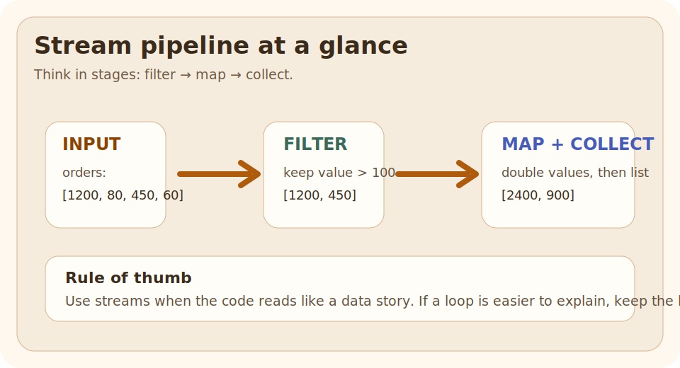

# Stream Pipeline

## Why This Exists

You have a list of data.  
You want to:

- filter it
- transform it
- collect the result

## The Pain Before It

You have a list of data.  
You want to:

- filter it
- transform it
- collect the result

The question is not "can Java do this?"  
The question is "how do I express that flow clearly?"

## Java Creator Mindset

Use streams when the work is really a data transformation pipeline.

If the code reads naturally as:

1. keep these items
2. change them this way
3. collect the result

then a stream is probably a good fit.

## How You Might Invent It

Read the picture left to right:

- raw data goes in
- filters remove what does not qualify
- map reshapes what remains
- collect produces the final answer

## Naive Attempt

A common mistake is to use streams only because they look modern.

That leads to:

- heavy nesting
- hard-to-debug side effects
- collectors that are harder to read than a loop

## Why It Breaks

A common mistake is to use streams only because they look modern.

That leads to:

- heavy nesting
- hard-to-debug side effects
- collectors that are harder to read than a loop

## Final Java Solution

Use streams when the work is really a data transformation pipeline.

If the code reads naturally as:

1. keep these items
2. change them this way
3. collect the result

then a stream is probably a good fit.

## Code

### Run It

Run the Java example and read the pipeline left to right.

### Expected Result

Compare the output with the pipeline stages:

- what got filtered out
- what got transformed
- what got collected at the end

## Walkthrough

Streams separate *what should happen* from the low-level loop mechanics.  
That can make business rules easier to scan, especially for filtering, mapping, grouping, and aggregating.

## Mental Model

Read the picture left to right:

- raw data goes in
- filters remove what does not qualify
- map reshapes what remains
- collect produces the final answer

| Question | Plain loop | Stream pipeline |
| --- | --- | --- |
| Best for | explicit step-by-step local state | data transformation flow |
| Easier to debug line by line | usually yes | sometimes no |
| Easier to read for filter-map-collect work | sometimes no | often yes |
| Safer for side effects | clearer because mutation is visible | risky when side effects are hidden in pipeline stages |

## Mistakes

A common mistake is to use streams only because they look modern.

That leads to:

- heavy nesting
- hard-to-debug side effects
- collectors that are harder to read than a loop

## Tradeoffs

| Question | Plain loop | Stream pipeline |
| --- | --- | --- |
| Best for | explicit step-by-step local state | data transformation flow |
| Easier to debug line by line | usually yes | sometimes no |
| Easier to read for filter-map-collect work | sometimes no | often yes |
| Safer for side effects | clearer because mutation is visible | risky when side effects are hidden in pipeline stages |

Do not teach streams with "always faster" language. The useful rule is:

- stream readability is the first reason to use streams
- allocation, boxing, and pipeline overhead can matter in hot loops
- side effects and poor collector choices usually hurt clarity before they hurt speed

If performance is critical, benchmark the real pipeline with realistic data size instead of arguing from style.

When you compare a loop and a stream, keep these conditions the same:

- same input size
- same result shape
- warm-up before measuring
- no logging inside the measured code
- do not confuse parallel work with simple sequential transformation

## Use / Avoid

### Use It When

- the code is mainly about transforming data
- each step can be read left to right
- the collector clearly shows the desired result

### Avoid It When

- side effects are the main point
- the pipeline becomes harder to explain than a loop
- debugging needs very explicit step-by-step local state

## Summary

- a stream pipeline is a good fit when the business rule naturally reads as filter, map, then finish
- stream clarity is more important than stream cleverness
- performance discussions should start with measurement, not assumption

## Why This Matters

You have a list of data.  
You want to:

- filter it
- transform it
- collect the result

## Intuition

Read the picture left to right:

- raw data goes in
- filters remove what does not qualify
- map reshapes what remains
- collect produces the final answer

## Problem Statement

You have a list of data.  
You want to:

- filter it
- transform it
- collect the result

The question is not "can Java do this?"  
The question is "how do I express that flow clearly?"

## Core Idea

Use streams when the work is really a data transformation pipeline.

If the code reads naturally as:

1. keep these items
2. change them this way
3. collect the result

then a stream is probably a good fit.

## Simple Example

### Run It

Run the Java example and read the pipeline left to right.

### Expected Result

Compare the output with the pipeline stages:

- what got filtered out
- what got transformed
- what got collected at the end

## Step-by-Step Working

Streams separate *what should happen* from the low-level loop mechanics.  
That can make business rules easier to scan, especially for filtering, mapping, grouping, and aggregating.

## Rules / Syntax

Streams were introduced in Java 8 and remain one of the core modern Java features every engineer should understand well.

- Prefer the smallest correct rule over cleverness.
- Connect the rule back to the runnable example.

## Common Mistakes

A common mistake is to use streams only because they look modern.

That leads to:

- heavy nesting
- hard-to-debug side effects
- collectors that are harder to read than a loop

## When To Use / When Not To Use

### Use It When

- the code is mainly about transforming data
- each step can be read left to right
- the collector clearly shows the desired result

### Avoid It When

- side effects are the main point
- the pipeline becomes harder to explain than a loop
- debugging needs very explicit step-by-step local state

## Practice

Change one part of the runnable example, rerun it, and explain whether stream pipeline still behaves the way you expected.

### After That

Open the collectors topic after this one. It is where many stream users become unsure, and it deserves extra attention.

## The Problem

You have a list of data.  
You want to:

- filter it
- transform it
- collect the result

The question is not "can Java do this?"  
The question is "how do I express that flow clearly?"

## Quick Visual

Read the picture left to right:

- raw data goes in
- filters remove what does not qualify
- map reshapes what remains
- collect produces the final answer

## Run This Code

Run the Java example and read the pipeline left to right.

## Expected Output

Compare the output with the pipeline stages:

- what got filtered out
- what got transformed
- what got collected at the end

## ❌ Bad Code

A common mistake is to use streams only because they look modern.

That leads to:

- heavy nesting
- hard-to-debug side effects
- collectors that are harder to read than a loop

## ✅ Better Code

Use streams when the work is really a data transformation pipeline.

If the code reads naturally as:

1. keep these items
2. change them this way
3. collect the result

then a stream is probably a good fit.

## Why This Works

Streams separate *what should happen* from the low-level loop mechanics.  
That can make business rules easier to scan, especially for filtering, mapping, grouping, and aggregating.

## Comparison Snapshot

| Question | Plain loop | Stream pipeline |
| --- | --- | --- |
| Best for | explicit step-by-step local state | data transformation flow |
| Easier to debug line by line | usually yes | sometimes no |
| Easier to read for filter-map-collect work | sometimes no | often yes |
| Safer for side effects | clearer because mutation is visible | risky when side effects are hidden in pipeline stages |

## Performance Lens

Do not teach streams with "always faster" language. The useful rule is:

- stream readability is the first reason to use streams
- allocation, boxing, and pipeline overhead can matter in hot loops
- side effects and poor collector choices usually hurt clarity before they hurt speed

If performance is critical, benchmark the real pipeline with realistic data size instead of arguing from style.

## Benchmark Checklist

When you compare a loop and a stream, keep these conditions the same:

- same input size
- same result shape
- warm-up before measuring
- no logging inside the measured code
- do not confuse parallel work with simple sequential transformation

## Use This When

- the code is mainly about transforming data
- each step can be read left to right
- the collector clearly shows the desired result

## Avoid This When

- side effects are the main point
- the pipeline becomes harder to explain than a loop
- debugging needs very explicit step-by-step local state

## Version Notes

Streams were introduced in Java 8 and remain one of the core modern Java features every engineer should understand well.

## After Reading This, You Should Know

- a stream pipeline is a good fit when the business rule naturally reads as filter, map, then finish
- stream clarity is more important than stream cleverness
- performance discussions should start with measurement, not assumption

## Next Topic

Open the collectors topic after this one. It is where many stream users become unsure, and it deserves extra attention.
