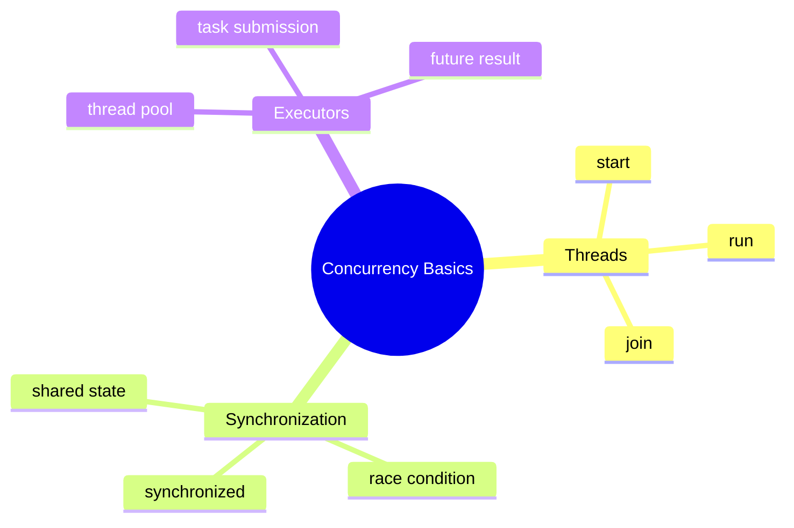
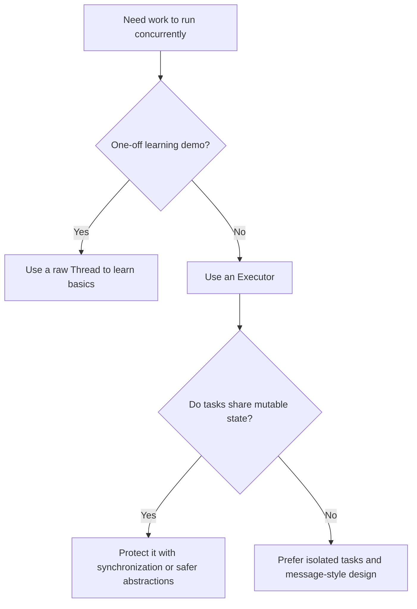

# Concurrency Basics Learning Kit

This chapter is written for a college fresher.

Read slowly here. Concurrency concepts are easier when you connect them to small examples and visible output.

## Beginner Focus

- understand what a thread is
- understand why shared data can break
- understand why executors are usually safer than manual thread creation

## Study Order

1. Run [Threads.java](/Users/indiadelhi/repo/career/java-missing-tutorial/code/src/main/java/com/learning/javamissing/sec05_multithreading_and_concurrency/ch01_concurrency_basics/topics/threads/Threads.java)
2. Run [Synchronization.java](/Users/indiadelhi/repo/career/java-missing-tutorial/code/src/main/java/com/learning/javamissing/sec05_multithreading_and_concurrency/ch01_concurrency_basics/topics/synchronization/Synchronization.java)
3. Run [Executors.java](/Users/indiadelhi/repo/career/java-missing-tutorial/code/src/main/java/com/learning/javamissing/sec05_multithreading_and_concurrency/ch01_concurrency_basics/topics/executors/Executors.java)

## Visual Map

## Quick Summary

### Threads

- a thread lets work happen independently
- `start()` begins a new thread
- `join()` waits for the work to finish

### Synchronization

- shared mutable data is dangerous without protection
- `synchronized` prevents lost updates in simple cases

### Executors

- executors manage threads for you
- they are usually cleaner than creating raw threads everywhere

## Compare With

| Compare | Prefer Left When | Prefer Right When |
| --- | --- | --- |
| `run()` vs `start()` | you intentionally want a normal method call on the current thread | you want real concurrent execution |
| thread vs executor | you are learning the basics or have a tiny one-off demo | you need task management, pooling, and cleaner production structure |
| synchronized vs unsynchronized updates | threads share mutable state and correctness matters | state is isolated and no shared mutation exists |

## Senior Engineer Lens

- concurrency bugs are expensive because they are intermittent and hard to reproduce
- executor-based designs usually age better than ad hoc thread creation
- synchronization is about protecting invariants, not only individual lines of code
- clarity beats micro-optimization until correctness and observability are solid

## Decision Chart

## Mini Case Study

Imagine a reporting system.

- one task loads sales data
- one task loads customer data
- a shared counter tracks progress
- an executor manages tasks instead of creating raw threads everywhere

This is where concurrency starts to matter in real applications.

## When To Use

- use threads for learning the basics
- use synchronization when multiple threads update the same data
- use executors when you have many tasks to manage

## When Not To Use

- do not create raw threads for every task in production-style code
- do not share mutable data without protection
- do not assume thread execution order from `start()` order

## OCJP Focus

- `run()` and `start()` are not the same
- race conditions can produce unpredictable results
- executor tasks may return values through `Future`

## Interview Focus

Q: Why is shared mutable state risky?  
A: Because multiple threads may read and write it at the same time.

Q: Why are executors preferred over manually creating many threads?  
A: They separate task submission from thread management.

Q: What problem does `synchronized` solve?  
A: It protects critical sections from overlapping access.

## Quick Quiz

1. What is the difference between `run()` and `start()`?
2. What is a race condition?
3. Why might an executor be a better choice than raw threads?

## Effective Java Mapping

- Item 78: Synchronize access to shared mutable data
- Item 79: Avoid excessive synchronization
- Item 80: Prefer executors, tasks, and streams to threads
- Item 81: Prefer concurrency utilities to wait and notify

## Sources

- Java Concurrency in Practice: https://www.informit.com/store/java-concurrency-in-practice-9780321349606
- Effective Java, 3rd Edition: https://www.informit.com/store/effective-java-9780134686042
- Java API documentation: https://docs.oracle.com/en/java/
