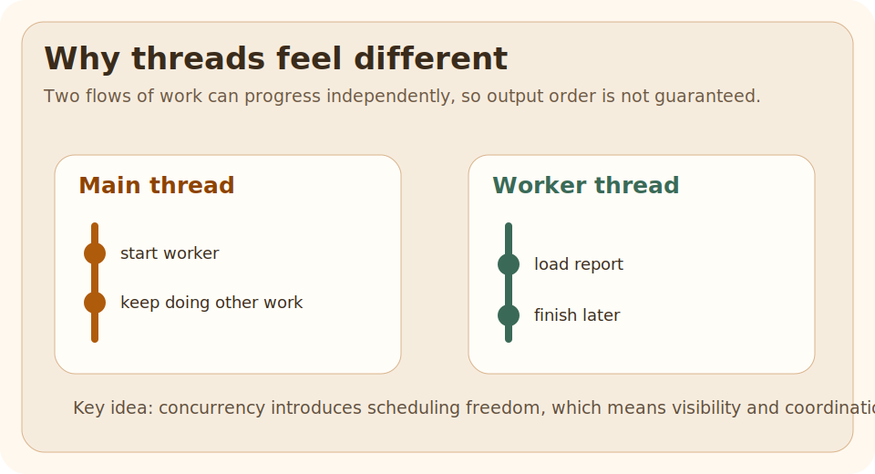

# Threads

## Why This Exists

Sometimes one flow of work is not enough.

## The Pain Before It

Sometimes one flow of work is not enough.

Examples:

- send a report while the main request continues
- process many independent tasks
- keep the UI or API responsive

Threads are the oldest Java tool for that problem.

## Java Creator Mindset

Call `start()` when you want the JVM to schedule a new thread.

## How You Might Invent It

At one glance:

- the main thread keeps moving
- a worker thread handles a separate task
- as soon as both touch shared state, design risk appears

## Naive Attempt

A very common beginner mistake is to call `run()` directly and think a new thread started.

It did not.  
That just ran the method on the current thread.

## Why It Breaks

A very common beginner mistake is to call `run()` directly and think a new thread started.

It did not.  
That just ran the method on the current thread.

## Final Java Solution

Call `start()` when you want the JVM to schedule a new thread.

## Code

### Run It

Run the example and watch the main flow and worker flow both print output.

### Expected Result

You should see work happening from more than one thread, but not necessarily in the same order every time.

That non-deterministic order is part of the lesson.

## Walkthrough

Threads let the JVM schedule separate units of execution.  
That gives you concurrency, but it also introduces coordination and shared-state risks.

## Mental Model

At one glance:

- the main thread keeps moving
- a worker thread handles a separate task
- as soon as both touch shared state, design risk appears

| Need | Raw `Thread` | `ExecutorService` | Virtual thread |
| --- | --- | --- | --- |
| Learn the mental model | best starting point | hides some basics | builds on thread mental model |
| Run many managed tasks | weak fit | strong fit | strong fit for waiting-heavy work |
| One-off demo | simple | more setup | needs newer JDK |
| Production task orchestration | usually not ideal | common choice | increasingly useful |

## Mistakes

A very common beginner mistake is to call `run()` directly and think a new thread started.

It did not.  
That just ran the method on the current thread.

## Tradeoffs

| Need | Raw `Thread` | `ExecutorService` | Virtual thread |
| --- | --- | --- | --- |
| Learn the mental model | best starting point | hides some basics | builds on thread mental model |
| Run many managed tasks | weak fit | strong fit | strong fit for waiting-heavy work |
| One-off demo | simple | more setup | needs newer JDK |
| Production task orchestration | usually not ideal | common choice | increasingly useful |

Do not benchmark threads only by "time to print".

The real costs are:

- thread creation
- waiting and blocking
- coordination
- contention on shared state

For tiny demos the cost looks invisible.  
For real systems the hidden cost appears when you create many threads, wait on slow I/O, or lock shared objects too often.

## Use / Avoid

### Use It When

- you are learning the basic mental model of concurrency
- you need to understand what executors and virtual threads build on top of

### Avoid It When

- production task orchestration would be clearer with executors or structured concurrency
- shared mutable state is not well controlled

## Practice

Change one part of the runnable example, rerun it, and explain whether threads still behaves the way you expected.

### After That

Move to executors after this one. That is the practical next step for most production code.

## Summary

- `start()` and `run()` are not interchangeable
- thread ordering is not guaranteed just because the source code has one order
- concurrency problems usually begin when multiple threads share mutable state
