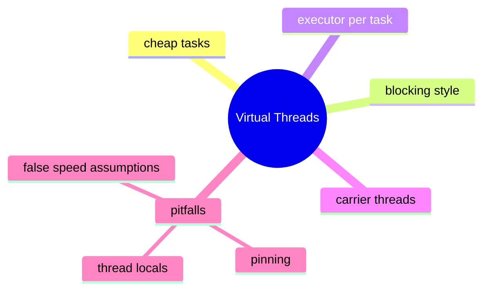

# Virtual Threads Learning Kit

This chapter teaches one concept first: some workloads spend most of their time waiting, not computing. Virtual threads make that style of code easier to scale without forcing callback-heavy designs.

Read the examples in order. After reading this chapter, you should know what virtual threads are good at, what they do not fix, and why "many cheap threads" is different from "magically faster code".

## What Problem This Chapter Solves

Traditional platform threads are relatively expensive when you need huge numbers of blocking tasks, such as:

- request-per-user systems
- background job polling
- calling slow external services
- waiting on files, sockets, or databases

Virtual threads help when the work mostly waits. They do not remove bad locking, bad design, or slow algorithms.

## Study Order

1. Run [WhyVirtualThreadsMatter.java](/Users/indiadelhi/repo/career/java-missing-tutorial/code/src/main/java/com/learning/javamissing/sec05_multithreading_and_concurrency/ch02_virtual_threads/topics/why_virtual_threads_matter/WhyVirtualThreadsMatter.java)
2. Run [RunningTasksWithVirtualThreadExecutor.java](/Users/indiadelhi/repo/career/java-missing-tutorial/code/src/main/java/com/learning/javamissing/sec05_multithreading_and_concurrency/ch02_virtual_threads/topics/running_tasks_with_virtual_thread_executor/RunningTasksWithVirtualThreadExecutor.java)
3. Run [AvoidingVirtualThreadMisuse.java](/Users/indiadelhi/repo/career/java-missing-tutorial/code/src/main/java/com/learning/javamissing/sec05_multithreading_and_concurrency/ch02_virtual_threads/topics/avoiding_virtual_thread_misuse/AvoidingVirtualThreadMisuse.java)

## Concept Map

## Quick Summary

### Why Virtual Threads Matter

- a virtual thread is still a `Thread`
- the difference is cost model, not the programming model
- it is useful when tasks block often

### Running Tasks With A Virtual-Thread Executor

- `newVirtualThreadPerTaskExecutor()` is a practical way to launch many independent tasks
- each submitted task can use a simple blocking style

### Avoiding Virtual Thread Misuse

- virtual threads do not make CPU-bound work faster
- long `synchronized` sections can pin carriers and reduce scalability
- thread-local-heavy code may need review

## Compare With

- platform thread vs virtual thread:
  both are threads, but virtual threads are meant to be much cheaper to create in large numbers
- thread pool reuse vs virtual-thread-per-task:
  pools limit concurrency explicitly, virtual threads let you model one task as one thread more naturally
- blocking style vs callback style:
  virtual threads let you keep blocking code readable in many I/O-heavy cases

## Mini Case Study

Imagine a travel site handling hotel search.

- one request needs room availability
- one request needs pricing
- one request needs reviews

All three calls mostly wait on I/O. Virtual threads let the code keep a direct request style while still handling large concurrency.

## When To Use

- use virtual threads for large numbers of mostly waiting tasks
- use them when simpler blocking code improves readability
- use per-task executors when tasks are independent

## When Not To Use

- do not expect them to speed up heavy CPU calculation
- do not keep long lock-holding blocks just because the thread is virtual
- do not ignore memory and context propagation costs

## OCJP Focus

- virtual threads are still threads
- code using them must still handle interruption and task coordination correctly
- thread safety rules do not change because the thread type changed

## Interview Focus

Q: What problem do virtual threads solve?  
A: They reduce the cost of handling very many blocking tasks while preserving a direct thread-based coding style.

Q: Are virtual threads always better than thread pools?  
A: No. They are better for many waiting tasks, not for every workload.

Q: What is a common mistake when adopting virtual threads?  
A: Assuming they automatically fix slow synchronized code, CPU-heavy work, or poor resource management.

## Quick Quiz

1. Why can a virtual-thread-based design still perform badly?
2. Why is "one task, one virtual thread" often easier to read than callback chains?
3. Why should you still care about locking and shared state when using virtual threads?

## Effective Java Mapping

- Item 78: Synchronize access to shared mutable data
- Item 79: Avoid excessive synchronization
- Item 80: Prefer executors, tasks, and streams to threads
- Item 81: Prefer concurrency utilities to `wait` and `notify`

## Sources

- Java API documentation: https://docs.oracle.com/en/java/
- OpenJDK JEP index: https://openjdk.org/jeps/0
- Core Java, Volume I: https://www.informit.com/store/core-java-volume-i-fundamentals-9780135558577
- Effective Java, 3rd Edition: https://www.informit.com/store/effective-java-9780134686042
