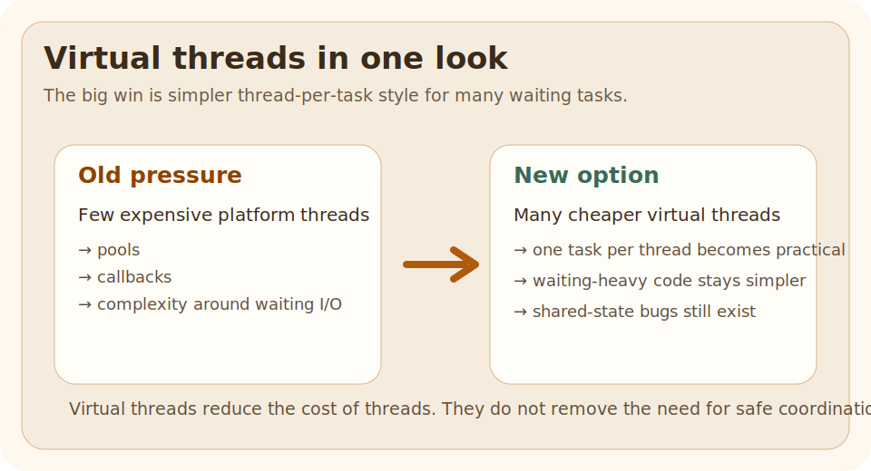

# Why Virtual Threads Matter

## Why This Matters

Traditional threads are expensive enough that teams started designing around the cost:

- thread pools
- callback-heavy code
- reactive complexity even when the business logic is simple

## Intuition

One glance should tell you the real story:

- platform threads are limited, expensive workers
- virtual threads are much lighter for waiting-heavy tasks
- the business code can stay direct and blocking-style

## Problem Statement

Traditional threads are expensive enough that teams started designing around the cost:

- thread pools
- callback-heavy code
- reactive complexity even when the business logic is simple

Virtual threads change that tradeoff for many request-per-task workloads.

## Core Idea

Virtual threads reduce thread cost for many waiting tasks.  
They do not remove the need for safe coordination, clear ownership, or good shared-state design.

## Mental Model

One glance should tell you the real story:

- platform threads are limited, expensive workers
- virtual threads are much lighter for waiting-heavy tasks
- the business code can stay direct and blocking-style

| Question | Platform thread | Virtual thread |
| --- | --- | --- |
| Best for | long-lived heavier worker threads | many waiting tasks |
| Cost per thread | higher | much lower |
| Blocking style code | possible but costly at scale | practical again |
| Removes race conditions | no | no |

## Simple Example

### Run It

This example is best run locally on a modern JDK because it depends on newer Java support.

### Expected Result

The main point is not a flashy output string.  
The point is that many blocking tasks can be modeled with a much simpler one-task-per-thread style again.

## Step-by-Step Working

Virtual threads make thread-per-task style practical again for many I/O-heavy workflows.  
That often improves clarity because the code can read in straight lines instead of callback chains.

## Rules / Syntax

Virtual threads became final in Java 21.  
They are one of the most important changes in modern Java concurrency.

- Prefer the smallest correct rule over cleverness.
- Connect the rule back to the runnable example.

## Common Mistakes

The wrong mental model is "virtual threads make concurrency problems disappear."

They do not.

They reduce the cost of threads.  
They do not remove:

- race conditions
- bad shared-state design
- blocking calls that pin platform resources in the wrong places

## When To Use / When Not To Use

### Use It When

- your tasks spend time waiting on I/O
- the one-request-one-thread model fits the business flow
- readability matters more than low-level concurrency tricks

### Avoid It When

- the workload is dominated by heavy CPU computation
- you still have unsafe shared mutable state
- you have not checked whether frameworks and libraries are ready for the new model

## Practice

Change one part of the runnable example, rerun it, and explain whether why virtual threads matter still behaves the way you expected.

### After That

Read the executor-based virtual thread example next, then compare it with structured concurrency.

## Summary

- virtual threads are still threads, not magic background jobs
- they reduce thread cost for waiting-heavy workloads
- they improve the cost model, but not the need for safe shared-state design

## The Problem

Traditional threads are expensive enough that teams started designing around the cost:

- thread pools
- callback-heavy code
- reactive complexity even when the business logic is simple

Virtual threads change that tradeoff for many request-per-task workloads.

## Quick Visual

One glance should tell you the real story:

- platform threads are limited, expensive workers
- virtual threads are much lighter for waiting-heavy tasks
- the business code can stay direct and blocking-style

## Run This Code

This example is best run locally on a modern JDK because it depends on newer Java support.

## Expected Output

The main point is not a flashy output string.  
The point is that many blocking tasks can be modeled with a much simpler one-task-per-thread style again.

## ❌ Bad Mental Model

The wrong mental model is "virtual threads make concurrency problems disappear."

They do not.

They reduce the cost of threads.  
They do not remove:

- race conditions
- bad shared-state design
- blocking calls that pin platform resources in the wrong places

## ✅ Better Mental Model

Virtual threads reduce thread cost for many waiting tasks.  
They do not remove the need for safe coordination, clear ownership, or good shared-state design.

## Why This Works

Virtual threads make thread-per-task style practical again for many I/O-heavy workflows.  
That often improves clarity because the code can read in straight lines instead of callback chains.

## Comparison Snapshot

| Question | Platform thread | Virtual thread |
| --- | --- | --- |
| Best for | long-lived heavier worker threads | many waiting tasks |
| Cost per thread | higher | much lower |
| Blocking style code | possible but costly at scale | practical again |
| Removes race conditions | no | no |

## Performance Lens

The most useful benchmark question is not "which thread is faster?"

It is:

- how many waiting tasks can I model clearly
- what happens to throughput when many requests block on I/O
- does the simpler thread-per-task model lower code complexity

Virtual threads shine when most time is spent waiting, not burning CPU.

## Benchmark Checklist

When you compare executor pools and virtual threads, measure:

- total concurrent requests handled
- average and tail latency
- memory growth
- blocked or pinned behavior
- code complexity and failure handling, not just raw timing

## Use This When

- your tasks spend time waiting on I/O
- the one-request-one-thread model fits the business flow
- readability matters more than low-level concurrency tricks

## Avoid This When

- the workload is dominated by heavy CPU computation
- you still have unsafe shared mutable state
- you have not checked whether frameworks and libraries are ready for the new model

## Version Notes

Virtual threads became final in Java 21.  
They are one of the most important changes in modern Java concurrency.

## After Reading This, You Should Know

- virtual threads are still threads, not magic background jobs
- they reduce thread cost for waiting-heavy workloads
- they improve the cost model, but not the need for safe shared-state design

## Next Topic

Read the executor-based virtual thread example next, then compare it with structured concurrency.
