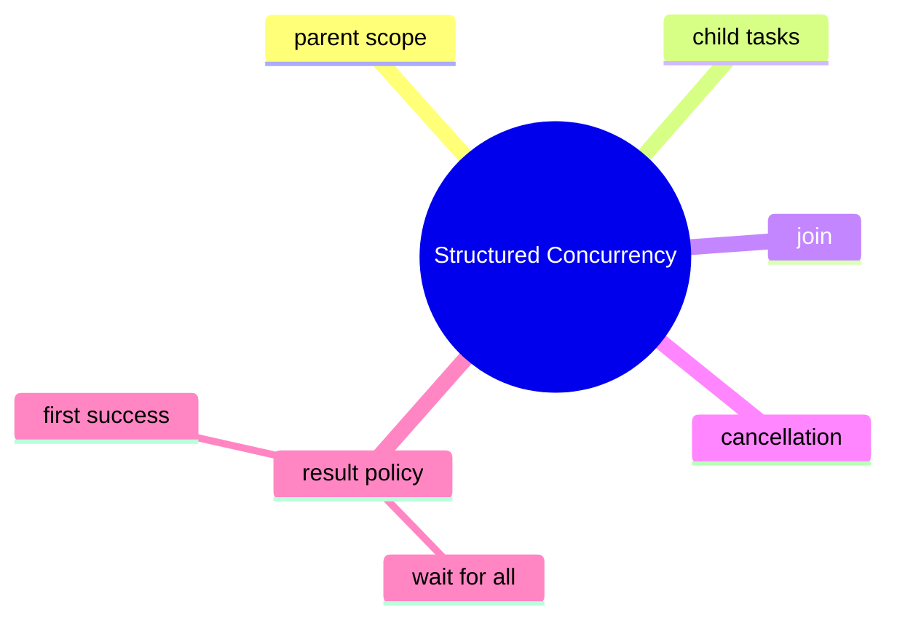

# Structured Concurrency Learning Kit

This chapter teaches a design idea, not just an API: related tasks should be started, awaited, cancelled, and failed as one unit.

Read the code with that mental model in mind. After reading this chapter, you should know why grouping subtasks under one parent scope is safer than scattering futures across the codebase.

## What Problem This Chapter Solves

Many request flows need several subtasks:

- fetch user profile
- fetch billing plan
- send email
- load backup data source

Without structure, those subtasks can outlive the request, fail independently, or keep running after the result is no longer needed. Structured concurrency keeps child tasks inside a clear lifetime.

## Study Order

1. Run [KeepingChildTasksInsideOneRequest.java](/Users/indiadelhi/repo/career/java-missing-tutorial/code/src/main/java/com/learning/javamissing/sec05_multithreading_and_concurrency/ch03_structured_concurrency/topics/keeping_child_tasks_inside_one_request/KeepingChildTasksInsideOneRequest.java)
2. Run [CollectingResultsFromChildTasks.java](/Users/indiadelhi/repo/career/java-missing-tutorial/code/src/main/java/com/learning/javamissing/sec05_multithreading_and_concurrency/ch03_structured_concurrency/topics/collecting_results_from_child_tasks/CollectingResultsFromChildTasks.java)
3. Run [ChoosingFirstSuccessfulResult.java](/Users/indiadelhi/repo/career/java-missing-tutorial/code/src/main/java/com/learning/javamissing/sec05_multithreading_and_concurrency/ch03_structured_concurrency/topics/choosing_first_successful_result/ChoosingFirstSuccessfulResult.java)

## Concept Map

## Quick Summary

### Scope

- the parent task owns child-task lifetime
- child tasks should not escape that scope

### Result Handling

- joining all successful subtasks is useful when every result is required
- failure should be handled as part of the whole operation

### Shutdown Policy

- some problems want the first successful answer
- slower siblings can be cancelled once the result is no longer needed

## Compare With

- scattered `Future` handling vs structured scope:
  structured scope keeps lifetime, cancellation, and failure policy in one place
- await-all vs first-success:
  await-all fits workflows that need every result, first-success fits fallback or replica strategies
- unbounded background tasks vs request-scoped tasks:
  structured concurrency favors tasks that belong to a parent operation

## Mini Case Study

Imagine a profile page request.

- fetch account details
- fetch subscription plan
- fetch recommendations

If the request fails or is cancelled, child tasks should stop too. If one of two mirror services returns first, the loser should be stopped. That is the problem structured concurrency solves.

## When To Use

- use it when several tasks belong to one request or workflow
- use it when cancellation and failure should be coordinated
- use it when task lifetime should stay easy to reason about

## When Not To Use

- do not use it for independent long-lived background jobs
- do not force a first-success policy when the workflow truly needs all results
- do not treat preview APIs as fully stable across Java releases without checking version notes

## Version Note

This chapter uses the Java 25 preview form of `StructuredTaskScope`. Preview APIs can change between releases, so always match the code to the JDK version you compile with.

## Interview Focus

Q: What is the main benefit of structured concurrency?  
A: It keeps related concurrent tasks under one parent lifetime, which improves cancellation, failure handling, and readability.

Q: When is a first-success policy useful?  
A: When several providers can return interchangeable answers and only the fastest success is needed.

Q: Why is this better than manually managing futures everywhere?  
A: Because the policy is explicit and local instead of being spread across unrelated code paths.

## Quick Quiz

1. Why is a request-scoped task model safer than letting child tasks escape?
2. When is waiting for all subtasks the correct design?
3. Why should preview API version changes be treated as part of the learning material here?

## Effective Java Mapping

- Item 78: Synchronize access to shared mutable data
- Item 80: Prefer executors, tasks, and streams to threads
- Item 81: Prefer concurrency utilities to `wait` and `notify`

## Sources

- Java API documentation: https://docs.oracle.com/en/java/
- OpenJDK JEP index: https://openjdk.org/jeps/0
- Effective Java, 3rd Edition: https://www.informit.com/store/effective-java-9780134686042
