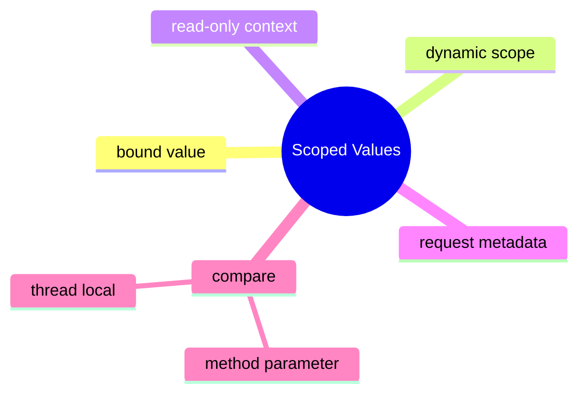

# Scoped Values Learning Kit

This chapter teaches a narrow but important idea: some context should flow through a call tree for one operation, without becoming mutable global state.

Read these examples after the virtual-thread and structured-concurrency chapters. After reading this chapter, you should know why scoped values are about safe context sharing, not about replacing ordinary method parameters everywhere.

## What Problem This Chapter Solves

Many systems need request context:

- request id
- current user
- tenant id
- trace id

Passing those values through every method can be noisy. Using mutable thread-local state can be risky. Scoped values provide a way to bind context for a limited dynamic scope.

## Study Order

1. Run [IntroducingScopedValues.java](/Users/indiadelhi/repo/career/java-missing-tutorial/code/src/main/java/com/learning/javamissing/sec05_multithreading_and_concurrency/ch04_scoped_values/topics/introducing_scoped_values/IntroducingScopedValues.java)
2. Run [BindingRequestContext.java](/Users/indiadelhi/repo/career/java-missing-tutorial/code/src/main/java/com/learning/javamissing/sec05_multithreading_and_concurrency/ch04_scoped_values/topics/binding_request_context/BindingRequestContext.java)
3. Run [ScopedValuesVsThreadLocal.java](/Users/indiadelhi/repo/career/java-missing-tutorial/code/src/main/java/com/learning/javamissing/sec05_multithreading_and_concurrency/ch04_scoped_values/topics/scoped_values_vs_thread_local/ScopedValuesVsThreadLocal.java)

## Concept Map

## Quick Summary

### Intro

- a scoped value is bound for a limited execution scope
- code inside that scope can read it directly

### Binding

- binding is useful for request-level context such as request ids
- the value disappears outside the bound region

### Vs Thread Local

- thread-local state is mutable per thread
- scoped values are a better fit when context should be bound and read, not mutated and leaked

## Compare With

- method parameter vs scoped value:
  parameters are clearer when only a few calls need the value, scoped values help when context must cross many layers
- thread local vs scoped value:
  thread locals are mutable and easier to misuse, scoped values emphasize bounded read-only context
- global static state vs scoped value:
  static state leaks everywhere, scoped values stay within the operation boundary

## Mini Case Study

An API request enters the server with request id `req-2026-04-07`.

- controller needs it for logging
- service layer needs it for tracing
- repository needs it for diagnostics

That value belongs to the request, not to one object forever. Scoped values model that better than a mutable shared holder.

## When To Use

- use scoped values for operation-scoped context
- use them when the context should be readable but not arbitrarily mutated
- use them when many layers need the same request metadata

## When Not To Use

- do not use them as a substitute for ordinary business data parameters everywhere
- do not store mutable domain state in them
- do not ignore lifecycle boundaries

## Version Note

This chapter depends on preview APIs. Match your JDK and compiler flags to the chapter setup before running the examples.

## Interview Focus

Q: What is the main use case for scoped values?  
A: Passing read-mostly request context through an execution scope without manual plumbing everywhere.

Q: Why are scoped values often safer than thread locals?  
A: Their lifetime is explicit and bounded, which reduces accidental leakage and mutation.

Q: When should you still prefer a normal parameter?  
A: When the value is part of the business data of a method and only a small call chain needs it.

## Quick Quiz

1. Why is request id a good scoped-value candidate?
2. Why should mutable business state stay out of scoped values?
3. When is a plain method parameter clearer than a scoped value?

## Effective Java Mapping

- Item 17: Minimize mutability
- Item 57: Minimize the scope of local variables
- Item 78: Synchronize access to shared mutable data

## Sources

- Java API documentation: https://docs.oracle.com/en/java/
- OpenJDK JEP index: https://openjdk.org/jeps/0
- Effective Java, 3rd Edition: https://www.informit.com/store/effective-java-9780134686042
