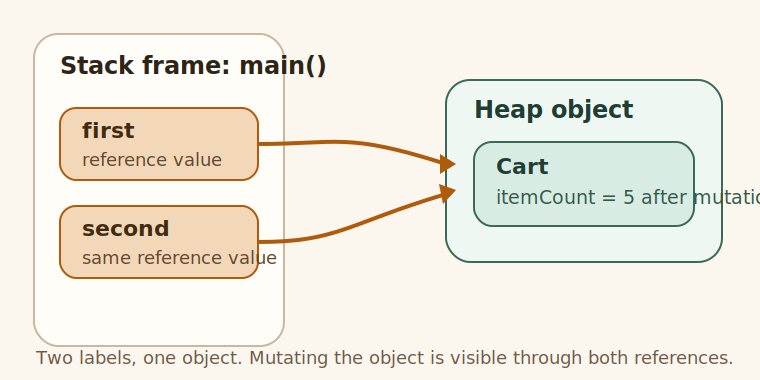

# Understanding Stack, Heap, And References

## Why This Exists

This topic exists because many Java mutation bugs come from confusing the variable with the object.

## The Pain Before It

Learners often ask:

"I changed `second`. Why did `first` also change?"

That confusion comes from not separating:

- local variable slot
- reference value
- heap object

## Java Creator Mindset

In Java, the local variable is not the object. It only holds the value needed to reach the object.

## How You Might Invent It

If every local variable copied the whole object, sharing and method calls would become expensive and awkward.

Java instead keeps objects separate and lets local variables hold references.



What to notice in the picture:

- `first` and `second` are separate local variables
- both arrows point to the same `Cart` object
- mutating the object through one reference is visible through the other

## Naive Attempt

The naive mental model is:

"Two variables means two objects."

## Why It Breaks

That breaks the moment one reference is assigned from another:

```java
Cart first = new Cart(2);
Cart second = first;
```

Now you have two labels for one shared object.

## Final Java Solution

Trace the arrows, not the variable names.

If two references point to one object, one mutation can be observed through both.

## Code

### Run It

Run the example and watch the shared `Cart` object after `second.itemCount = 5`.

### Expected Result

- `first.itemCount = 5`
- `second.itemCount = 5`

## Walkthrough

1. `first` points to a new `Cart`
2. `second = first` copies the reference value, not the object
3. `second.itemCount = 5` mutates the shared heap object
4. reading through `first` shows the same object state

## Mental Model

Use this sentence:

"References are labels that can point to the same object; mutation changes object state, not the label itself."

## Mistakes

- saying "the variable lives on the heap"
- saying "Java is pass-by-reference" instead of explaining reference values
- confusing reassignment with mutation

## Tradeoffs

This model makes Java easier to reason about, but only if you trace references deliberately instead of relying on names.

## Use / Avoid

### Use It When

- debugging shared-state surprises
- learning parameter passing
- preparing for collections and concurrency discussions

### Avoid It When

- you are repeating stack/heap words without drawing the reference flow

## Practice

Change one input in [UnderstandingStackHeapAndReferences.java](UnderstandingStackHeapAndReferences.java), rerun it, and write down what changed.

## Summary

After this topic, you should be able to explain exactly why two variables can show the same mutated value without claiming that Java copied the object twice.
