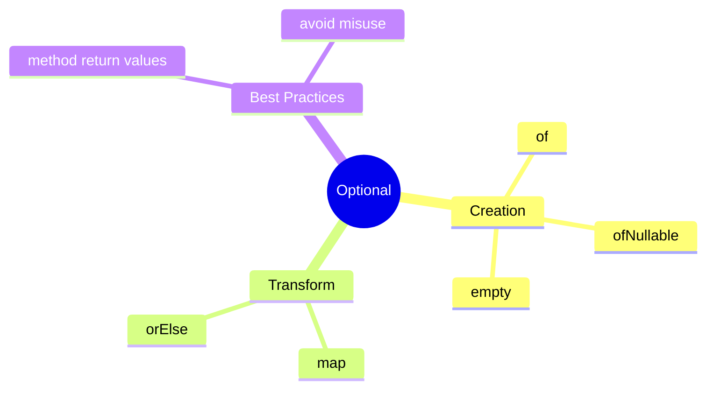
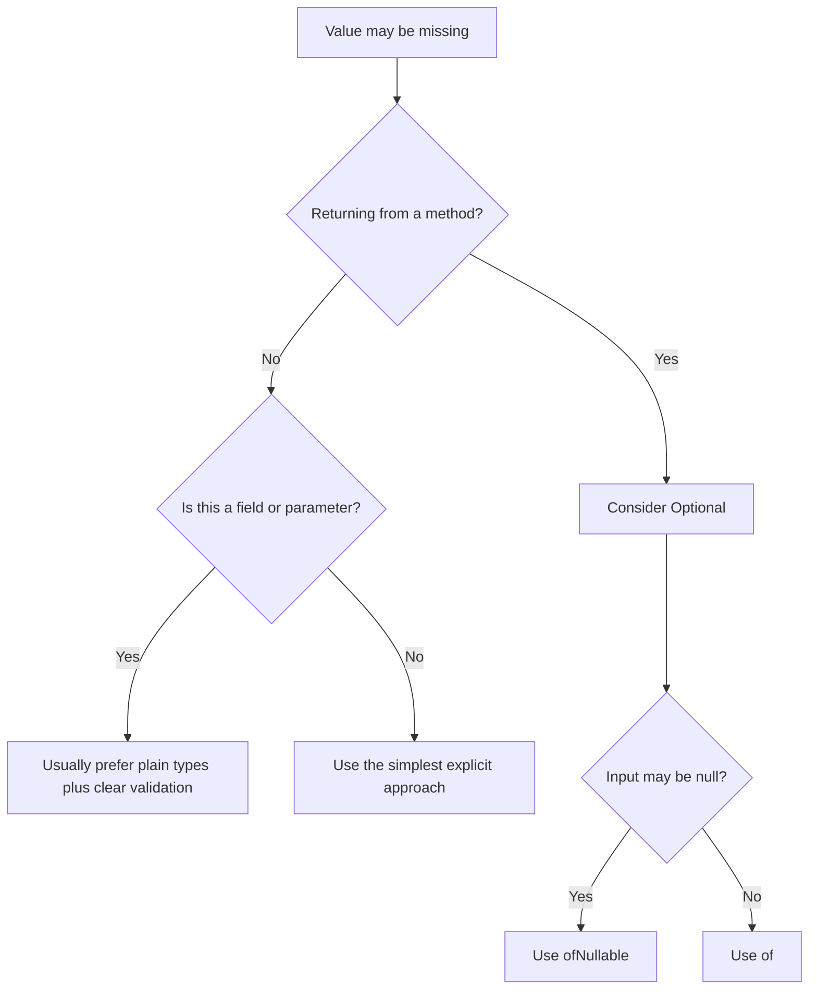

# Optional Learning Kit

## Why This Chapter Matters

- represent missing values with `Optional` safely
- transform present values without manual null checks
- choose where `Optional` belongs in an API

## Intuition

## Problem Statement

- represent missing values with `Optional` safely
- transform present values without manual null checks
- choose where `Optional` belongs in an API

## Core Ideas

### Representing Optional Values

- `Optional.of(value)` means the value must not be null
- `Optional.ofNullable(value)` is safe when null is possible
- `Optional.empty()` means no value is present

### Transforming Optional Values

- `map(...)` changes the inside value if present
- `orElse(...)` gives a fallback if missing

### Choosing Optional Boundaries

- `Optional` is useful in method returns
- it is not a replacement for every field or every parameter

## Mental Model

## Study Order

1. Run [RepresentingOptionalValues.java](topics/representing_optional_values/RepresentingOptionalValues.java)
2. Run [TransformingOptionalValues.java](topics/transforming_optional_values/TransformingOptionalValues.java)
3. Run [ChoosingOptionalBoundaries.java](topics/choosing_optional_boundaries/ChoosingOptionalBoundaries.java)

## What To Notice

### Compare With

| Compare | Prefer Left When | Prefer Right When |
| --- | --- | --- |
| `null` vs `Optional` | almost never for a meaningful API boundary | absence should be explicit to the caller |
| `of()` vs `ofNullable()` | you already know the value must exist | the input may be null |
| `map()` vs `orElse()` | you want to transform the present value | you want a fallback result when the value is absent |

### Interview Focus

Q: Why return `Optional` from a method?  
A: It makes the missing-value case explicit for the caller.

Q: Why avoid `Optional.get()` in normal code?  
A: Because it can fail at runtime if the value is absent.

Q: When is `orElse(...)` useful?  
A: When you want a clear fallback value.

### Senior Lens

- Optional is most valuable at API boundaries where absence is business-meaningful
- using Optional everywhere often adds ceremony without clarifying the model
- `get()` is rarely the right abstraction because it bypasses the contract
- good Optional usage reduces null-handling bugs and makes call sites more explicit

### Decision Guide

## Common Mistakes

The most common mistake is to memorize labels without building a mental model for when the concept actually helps.

## When To Use / When Not To Use

### Use It When

- use `Optional` for return values when absence is normal
- use it when you want the caller to think about the missing case

### Avoid It When

- do not use `Optional.of(...)` on a possibly null value
- do not use `Optional` only for style
- do not call `get()` without proving the value exists

## Practice

1. What is the difference between `of()` and `ofNullable()`?
2. What does `map()` do on an empty `Optional`?
3. Why is `Optional` better than hidden null checks in some APIs?

### Mini Case Study

Imagine a user profile page.

- nickname may be present or missing
- middle name may be missing
- profile picture URL may be missing

`Optional` helps the code handle those missing values clearly.

## Summary

### Representing Optional Values

- `Optional.of(value)` means the value must not be null
- `Optional.ofNullable(value)` is safe when null is possible
- `Optional.empty()` means no value is present

### Transforming Optional Values

- `map(...)` changes the inside value if present
- `orElse(...)` gives a fallback if missing

### Choosing Optional Boundaries

- `Optional` is useful in method returns
- it is not a replacement for every field or every parameter

## Beginner Focus

- represent missing values with `Optional` safely
- transform present values without manual null checks
- choose where `Optional` belongs in an API

## Visual Map

## Quick Summary

### Representing Optional Values

- `Optional.of(value)` means the value must not be null
- `Optional.ofNullable(value)` is safe when null is possible
- `Optional.empty()` means no value is present

### Transforming Optional Values

- `map(...)` changes the inside value if present
- `orElse(...)` gives a fallback if missing

### Choosing Optional Boundaries

- `Optional` is useful in method returns
- it is not a replacement for every field or every parameter

## Compare With

| Compare | Prefer Left When | Prefer Right When |
| --- | --- | --- |
| `null` vs `Optional` | almost never for a meaningful API boundary | absence should be explicit to the caller |
| `of()` vs `ofNullable()` | you already know the value must exist | the input may be null |
| `map()` vs `orElse()` | you want to transform the present value | you want a fallback result when the value is absent |

## Senior Engineer Lens

- Optional is most valuable at API boundaries where absence is business-meaningful
- using Optional everywhere often adds ceremony without clarifying the model
- `get()` is rarely the right abstraction because it bypasses the contract
- good Optional usage reduces null-handling bugs and makes call sites more explicit

## Decision Chart

## Mini Case Study

Imagine a user profile page.

- nickname may be present or missing
- middle name may be missing
- profile picture URL may be missing

`Optional` helps the code handle those missing values clearly.

## When To Use

- use `Optional` for return values when absence is normal
- use it when you want the caller to think about the missing case

## When Not To Use

- do not use `Optional.of(...)` on a possibly null value
- do not use `Optional` only for style
- do not call `get()` without proving the value exists

## OCJP Focus

- `Optional.of(null)` throws `NullPointerException`
- `Optional.ofNullable(null)` returns `Optional.empty()`
- `map()` does not run if the value is missing

## Interview Focus

Q: Why return `Optional` from a method?  
A: It makes the missing-value case explicit for the caller.

Q: Why avoid `Optional.get()` in normal code?  
A: Because it can fail at runtime if the value is absent.

Q: When is `orElse(...)` useful?  
A: When you want a clear fallback value.

## Quick Quiz

1. What is the difference between `of()` and `ofNullable()`?
2. What does `map()` do on an empty `Optional`?
3. Why is `Optional` better than hidden null checks in some APIs?

## Effective Java Mapping

- Item 55: Return optionals judiciously
- Item 54: Return empty collections or arrays, not nulls

## Sources

- Effective Java, 3rd Edition: https://www.informit.com/store/effective-java-9780134686042
- Modern Java in Action: https://www.manning.com/books/modern-java-in-action
- Java API documentation: https://docs.oracle.com/en/java/
