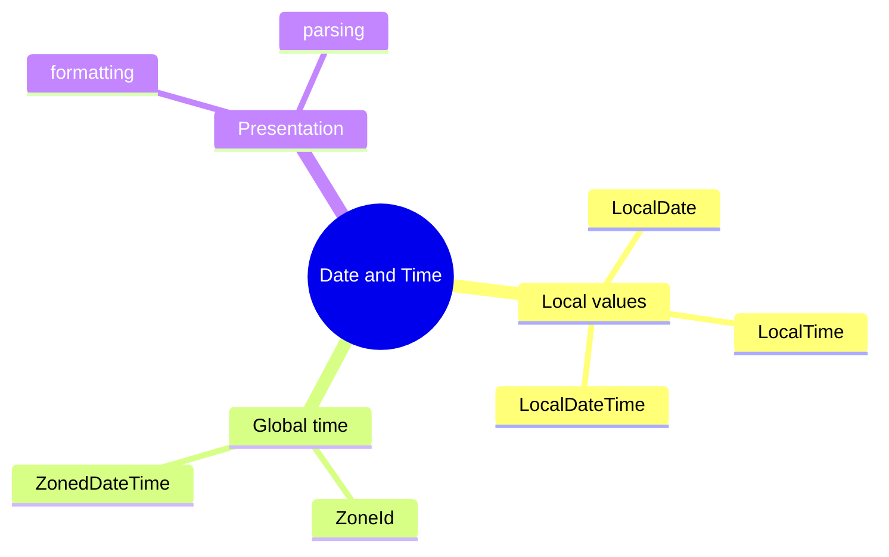

# Date And Time Learning Kit

This chapter teaches one core idea: date and time values should be modeled as time values, not as loose strings or integers.

Read the topic files in order. Run each example. Check the printed output. After reading this chapter, you should know when to use `LocalDateTime`, when to use a zone-aware type, and why formatting belongs at the boundary of the system.

## What Problem This Chapter Solves

Real systems constantly handle:

- meeting schedules
- delivery windows
- report timestamps
- user-visible dates

Most bugs happen when teams mix these ideas together. A date without a zone is not the same thing as a point in global time. A formatted string is not the same thing as a time value.

## Study Order

1. Run [LocalDateTime.java](topics/local_date_time/LocalDateTime.java)
2. Run [Zones.java](topics/zones/Zones.java)
3. Run [Formatting.java](topics/formatting/Formatting.java)

## Concept Map

## Quick Summary

### Local Date Time

- use `LocalDateTime` when the value is local to one business context, like "store opens at 9:30"
- operations like `plusMinutes(...)` return a new value because `java.time` types are immutable

### Zones

- use a zone-aware type when the same event must be understood across locations
- `withZoneSameInstant(...)` keeps the same real instant but shows it in another zone

### Formatting

- formatting is for display or input parsing
- keep internal logic on typed date/time values, not on strings

## Compare With

- `LocalDateTime` vs `ZonedDateTime`:
  `LocalDateTime` has no zone, `ZonedDateTime` represents a date-time in a specific region
- formatting vs modeling:
  formatting is presentation, modeling is the actual business value
- storing string dates vs typed dates:
  strings are fragile, typed values are safer and easier to validate

## Mini Case Study

An online learning platform sends a webinar reminder.

- the course team stores the event as `2026-04-07 18:00` in India time
- a learner in London should see the same instant in London time
- the email should display a formatted value like `07 Apr 2026`

This chapter covers exactly those three steps:

- model the local time
- convert across zones
- format for display

## When To Use

- use local date/time types for business-local schedules
- use zone-aware types for shared global events
- use formatters only at display and parsing boundaries

## When Not To Use

- do not store dates as free-form strings in core logic
- do not use `LocalDateTime` when the zone actually matters
- do not confuse formatting with conversion

## OCJP Focus

- `java.time` types are immutable
- parsing and formatting require matching patterns
- changing zones can either preserve the instant or preserve the local fields, depending on the API

## Interview Focus

Q: Why is `java.time` better than old mutable date APIs?  
A: It is clearer, immutable, and models dates, times, and zones separately.

Q: When is `LocalDateTime` the wrong choice?  
A: When the value must mean the same instant across regions, because it has no zone.

Q: Why should formatting be delayed until the boundary?  
A: Because business logic should work with typed values, not presentation strings.

## Quick Quiz

1. Why can two users see different clock times for the same `ZonedDateTime` instant?
2. Why is `DateTimeFormatter` not a replacement for `LocalDateTime`?
3. Why does `plusMinutes(...)` return a new value instead of changing the original one?

## Effective Java Mapping

- Item 17: Minimize mutability
- Item 49: Check parameters for validity
- Item 61: Prefer primitive types to boxed primitives where they make modeling clearer

## Sources

- Java API documentation: https://docs.oracle.com/en/java/
- Core Java, Volume I: https://www.informit.com/store/core-java-volume-i-fundamentals-9780135558577
- Core Java, Volume II: https://www.informit.com/store/core-java-volume-ii-advanced-features-9780135558690
- Effective Java, 3rd Edition: https://www.informit.com/store/effective-java-9780134686042
