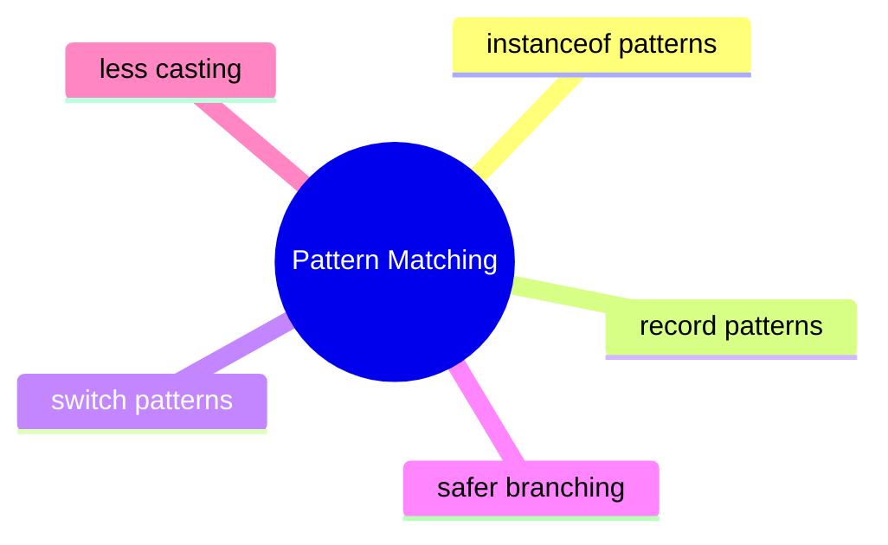

# Pattern Matching Learning Kit

## Why This Chapter Exists

Java programs often receive mixed input:

- event objects
- API payload variants
- different payment types
- different command shapes

Older code often uses `instanceof`, then a cast, then more branching. Pattern matching makes the check and the usable variable part of the same statement.

## The Pain Before It

Java programs often receive mixed input:

- event objects
- API payload variants
- different payment types
- different command shapes

Older code often uses `instanceof`, then a cast, then more branching. Pattern matching makes the check and the usable variable part of the same statement.

## Java Creator Mindset

### `instanceof` Patterns

- the check and the typed variable appear together
- code becomes shorter and less error-prone

### Record Patterns

- record patterns unpack data while matching shape
- they are strongest when records model stable data clearly

### Switch Patterns

- switch can choose behavior based on the runtime shape of data
- guarded cases add more precise branching

## How You Might Invent It

## Naive Attempt

- old `instanceof` plus cast vs pattern matching:
  pattern matching removes duplicated type information
- manual getter extraction vs record patterns:
  record patterns unpack the structure directly in the match
- `if-else` chains vs switch patterns:
  switch patterns can centralize branching more clearly

## Why It Breaks

That breaks when the same mistake repeats across files, teams, or interview questions and the code has no shared mental model.

## Final Java Direction

### `instanceof` Patterns

- the check and the typed variable appear together
- code becomes shorter and less error-prone

### Record Patterns

- record patterns unpack data while matching shape
- they are strongest when records model stable data clearly

### Switch Patterns

- switch can choose behavior based on the runtime shape of data
- guarded cases add more precise branching

## Study Order

1. Run [CheckingShapeWithInstanceof.java](topics/checking_shape_with_instanceof/CheckingShapeWithInstanceof.java)
2. Run [UnpackingRecordsWithPatterns.java](topics/unpacking_records_with_patterns/UnpackingRecordsWithPatterns.java)
3. Run [SwitchingOnRuntimeShape.java](topics/switching_on_runtime_shape/SwitchingOnRuntimeShape.java)

## What To Notice

### Compare With

- old `instanceof` plus cast vs pattern matching:
  pattern matching removes duplicated type information
- manual getter extraction vs record patterns:
  record patterns unpack the structure directly in the match
- `if-else` chains vs switch patterns:
  switch patterns can centralize branching more clearly

### Interview Focus

Q: What is the main gain from pattern matching for `instanceof`?  
A: It combines type test and typed variable binding, reducing boilerplate and cast noise.

Q: When do record patterns shine most?  
A: When records represent stable structured data that must be unpacked often.

Q: What is the real prerequisite for good pattern-matching code?  
A: A well-designed data model.

## Mental Model

## Common Mistakes

The most common mistake is to memorize labels without building a mental model for when the concept actually helps.

## Tradeoffs

- old `instanceof` plus cast vs pattern matching:
  pattern matching removes duplicated type information
- manual getter extraction vs record patterns:
  record patterns unpack the structure directly in the match
- `if-else` chains vs switch patterns:
  switch patterns can centralize branching more clearly

## Use / Avoid

### Use It When

- use pattern matching when behavior depends on the runtime shape of data
- use record patterns when records already express the domain well
- use switch patterns when one branching point should describe all supported shapes

### Avoid It When

- do not use pattern matching to compensate for a badly modeled domain
- do not add complex nested patterns when ordinary method calls are clearer
- do not forget that maintainability matters more than language cleverness

## Practice

1. Why is pattern matching better than separate check-and-cast code?
2. Why do record patterns work best with clearly structured data?
3. When would a normal method call be clearer than a complex pattern?

### Mini Case Study

An event-processing service receives different event shapes:

- login event
- payment event
- shipping event

The service needs to inspect the type, extract fields, and decide behavior. Pattern matching keeps that branching readable when the domain is modeled well.

## Summary

### `instanceof` Patterns

- the check and the typed variable appear together
- code becomes shorter and less error-prone

### Record Patterns

- record patterns unpack data while matching shape
- they are strongest when records model stable data clearly

### Switch Patterns

- switch can choose behavior based on the runtime shape of data
- guarded cases add more precise branching

## Why This Chapter Matters

Java programs often receive mixed input:

- event objects
- API payload variants
- different payment types
- different command shapes

Older code often uses `instanceof`, then a cast, then more branching. Pattern matching makes the check and the usable variable part of the same statement.

## Intuition

## Problem Statement

Java programs often receive mixed input:

- event objects
- API payload variants
- different payment types
- different command shapes

Older code often uses `instanceof`, then a cast, then more branching. Pattern matching makes the check and the usable variable part of the same statement.

## Core Ideas

### `instanceof` Patterns

- the check and the typed variable appear together
- code becomes shorter and less error-prone

### Record Patterns

- record patterns unpack data while matching shape
- they are strongest when records model stable data clearly

### Switch Patterns

- switch can choose behavior based on the runtime shape of data
- guarded cases add more precise branching

## When To Use / When Not To Use

### Use It When

- use pattern matching when behavior depends on the runtime shape of data
- use record patterns when records already express the domain well
- use switch patterns when one branching point should describe all supported shapes

### Avoid It When

- do not use pattern matching to compensate for a badly modeled domain
- do not add complex nested patterns when ordinary method calls are clearer
- do not forget that maintainability matters more than language cleverness

## What Problem This Chapter Solves

Java programs often receive mixed input:

- event objects
- API payload variants
- different payment types
- different command shapes

Older code often uses `instanceof`, then a cast, then more branching. Pattern matching makes the check and the usable variable part of the same statement.

## Concept Map

## Quick Summary

### `instanceof` Patterns

- the check and the typed variable appear together
- code becomes shorter and less error-prone

### Record Patterns

- record patterns unpack data while matching shape
- they are strongest when records model stable data clearly

### Switch Patterns

- switch can choose behavior based on the runtime shape of data
- guarded cases add more precise branching

## Compare With

- old `instanceof` plus cast vs pattern matching:
  pattern matching removes duplicated type information
- manual getter extraction vs record patterns:
  record patterns unpack the structure directly in the match
- `if-else` chains vs switch patterns:
  switch patterns can centralize branching more clearly

## Mini Case Study

An event-processing service receives different event shapes:

- login event
- payment event
- shipping event

The service needs to inspect the type, extract fields, and decide behavior. Pattern matching keeps that branching readable when the domain is modeled well.

## When To Use

- use pattern matching when behavior depends on the runtime shape of data
- use record patterns when records already express the domain well
- use switch patterns when one branching point should describe all supported shapes

## When Not To Use

- do not use pattern matching to compensate for a badly modeled domain
- do not add complex nested patterns when ordinary method calls are clearer
- do not forget that maintainability matters more than language cleverness

## Interview Focus

Q: What is the main gain from pattern matching for `instanceof`?  
A: It combines type test and typed variable binding, reducing boilerplate and cast noise.

Q: When do record patterns shine most?  
A: When records represent stable structured data that must be unpacked often.

Q: What is the real prerequisite for good pattern-matching code?  
A: A well-designed data model.

## Quick Quiz

1. Why is pattern matching better than separate check-and-cast code?
2. Why do record patterns work best with clearly structured data?
3. When would a normal method call be clearer than a complex pattern?

## Effective Java Mapping

- Item 15: Minimize the accessibility of classes and members
- Item 17: Minimize mutability
- Item 18: Favor composition over inheritance

## Sources

- Java API documentation: https://docs.oracle.com/en/java/
- OpenJDK JEP index: https://openjdk.org/jeps/0
- Core Java, Volume I: https://www.informit.com/store/core-java-volume-i-fundamentals-9780135558577
