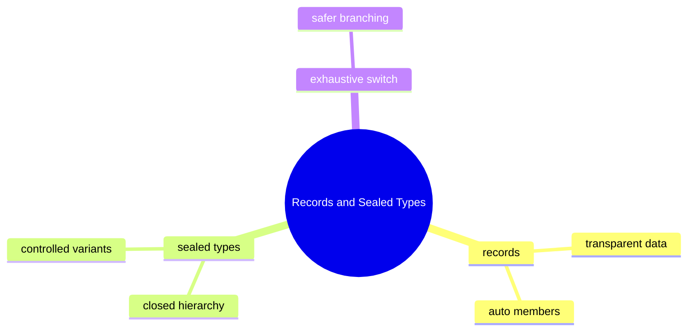

# Records And Sealed Types Learning Kit

## Why This Chapter Exists

Many business models have one of these shapes:

- pure data objects such as invoice summaries
- closed families such as payment status or delivery state

Without clear modeling, teams end up with verbose data classes, weak invariants, and switches that silently miss new cases.

## The Pain Before It

Many business models have one of these shapes:

- pure data objects such as invoice summaries
- closed families such as payment status or delivery state

Without clear modeling, teams end up with verbose data classes, weak invariants, and switches that silently miss new cases.

## Java Creator Mindset

### Records

- records are a good fit for immutable data carriers
- they express that the data itself is the main point of the type

### Sealed Types

- sealed types declare exactly which implementations are allowed
- they help model known variants explicitly

### Exhaustive Switch

- sealed hierarchies improve switch safety because the compiler knows the permitted cases
- missing cases become visible earlier

## How You Might Invent It

## Naive Attempt

- record vs ordinary class:
  use a record when the type is mainly data, use a class when custom identity or mutable behavior matters
- sealed hierarchy vs open hierarchy:
  sealed types are better when the domain variants are intentionally closed
- enum vs sealed hierarchy:
  enums fit constant-like variants, sealed hierarchies fit variants with different data and behavior

## Why It Breaks

That breaks when the same mistake repeats across files, teams, or interview questions and the code has no shared mental model.

## Final Java Direction

### Records

- records are a good fit for immutable data carriers
- they express that the data itself is the main point of the type

### Sealed Types

- sealed types declare exactly which implementations are allowed
- they help model known variants explicitly

### Exhaustive Switch

- sealed hierarchies improve switch safety because the compiler knows the permitted cases
- missing cases become visible earlier

## Study Order

1. Run [Closing Hierarchies With Sealed Types](topics/closing_hierarchies_with_sealed_types/ClosingHierarchiesWithSealedTypes.java)
2. Run [Exhaustive Sealed Branching](topics/exhaustive_sealed_branching/ExhaustiveSealedBranching.java)
3. Run [Modeling Immutable Data With Records](topics/modeling_immutable_data_with_records/ModelingImmutableDataWithRecords.java)
4. Run [Record Classes Deep Dive](topics/record_classes_deep_dive/RecordClassesDeepDive.java)

## What To Notice

### Compare With

- record vs ordinary class:
  use a record when the type is mainly data, use a class when custom identity or mutable behavior matters
- sealed hierarchy vs open hierarchy:
  sealed types are better when the domain variants are intentionally closed
- enum vs sealed hierarchy:
  enums fit constant-like variants, sealed hierarchies fit variants with different data and behavior

### Interview Focus

Q: What is the real benefit of a record?  
A: It communicates that the type is a transparent immutable data carrier.

Q: Why use a sealed type instead of a normal interface?  
A: To express and enforce that only a known set of implementations is valid.

Q: Why are sealed types and pattern matching often discussed together?  
A: Because a closed hierarchy makes branching more complete and safer.

## Mental Model

## Common Mistakes

The most common mistake is to memorize labels without building a mental model for when the concept actually helps.

## Tradeoffs

- record vs ordinary class:
  use a record when the type is mainly data, use a class when custom identity or mutable behavior matters
- sealed hierarchy vs open hierarchy:
  sealed types are better when the domain variants are intentionally closed
- enum vs sealed hierarchy:
  enums fit constant-like variants, sealed hierarchies fit variants with different data and behavior

## Use / Avoid

### Use It When

- use records for small immutable value-focused models
- use sealed types for domains with intentionally closed variants
- use exhaustive switches when business logic truly depends on every supported case

### Avoid It When

- do not use records for entities that need complex mutable lifecycle behavior
- do not use sealed types when extension by outside code is a real requirement
- do not confuse "less code" with "better model"

## Practice

1. Why is a record better than a verbose data class for pure value data?
2. Why might an enum be insufficient where a sealed hierarchy works well?
3. Why does a closed hierarchy improve switch safety?

### Mini Case Study

Consider an order system.

- `Order` summary is pure data: record is a natural fit
- `DeliveryStatus` has a fixed set of states: sealed type is a natural fit
- the UI needs one branch per status: exhaustive switch becomes safer

This chapter shows those three ideas working together.

## Summary

### Records

- records are a good fit for immutable data carriers
- they express that the data itself is the main point of the type

### Sealed Types

- sealed types declare exactly which implementations are allowed
- they help model known variants explicitly

### Exhaustive Switch

- sealed hierarchies improve switch safety because the compiler knows the permitted cases
- missing cases become visible earlier
