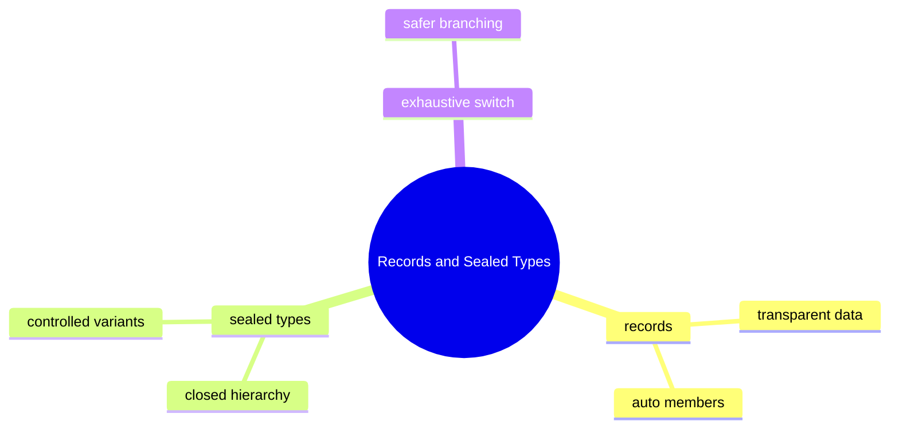

# Records And Sealed Types Learning Kit

This chapter teaches two related modeling tools:

- records for transparent data carriers
- sealed types for closed sets of allowed variants

After reading this chapter, you should know that these features are not shortcuts for less code only. They are ways to make domain boundaries and intent clearer.

## What Problem This Chapter Solves

Many business models have one of these shapes:

- pure data objects such as invoice summaries
- closed families such as payment status or delivery state

Without clear modeling, teams end up with verbose data classes, weak invariants, and switches that silently miss new cases.

## Study Order

1. Run [ModelingImmutableDataWithRecords.java](/Users/indiadelhi/repo/career/java-missing-tutorial/code/src/main/java/com/learning/javamissing/sec17_language_modeling_and_modern_types/ch02_records_and_sealed_types/topics/modeling_immutable_data_with_records/ModelingImmutableDataWithRecords.java)
2. Run [ClosingHierarchiesWithSealedTypes.java](/Users/indiadelhi/repo/career/java-missing-tutorial/code/src/main/java/com/learning/javamissing/sec17_language_modeling_and_modern_types/ch02_records_and_sealed_types/topics/closing_hierarchies_with_sealed_types/ClosingHierarchiesWithSealedTypes.java)
3. Run [ExhaustiveBranchingOverClosedHierarchies.java](/Users/indiadelhi/repo/career/java-missing-tutorial/code/src/main/java/com/learning/javamissing/sec17_language_modeling_and_modern_types/ch02_records_and_sealed_types/topics/exhaustive_branching_over_closed_hierarchies/ExhaustiveBranchingOverClosedHierarchies.java)

## Concept Map

## Quick Summary

### Records

- records are a good fit for immutable data carriers
- they express that the data itself is the main point of the type

### Sealed Types

- sealed types declare exactly which implementations are allowed
- they help model known variants explicitly

### Exhaustive Switch

- sealed hierarchies improve switch safety because the compiler knows the permitted cases
- missing cases become visible earlier

## Compare With

- record vs ordinary class:
  use a record when the type is mainly data, use a class when custom identity or mutable behavior matters
- sealed hierarchy vs open hierarchy:
  sealed types are better when the domain variants are intentionally closed
- enum vs sealed hierarchy:
  enums fit constant-like variants, sealed hierarchies fit variants with different data and behavior

## Mini Case Study

Consider an order system.

- `Order` summary is pure data: record is a natural fit
- `DeliveryStatus` has a fixed set of states: sealed type is a natural fit
- the UI needs one branch per status: exhaustive switch becomes safer

This chapter shows those three ideas working together.

## When To Use

- use records for small immutable value-focused models
- use sealed types for domains with intentionally closed variants
- use exhaustive switches when business logic truly depends on every supported case

## When Not To Use

- do not use records for entities that need complex mutable lifecycle behavior
- do not use sealed types when extension by outside code is a real requirement
- do not confuse "less code" with "better model"

## Interview Focus

Q: What is the real benefit of a record?  
A: It communicates that the type is a transparent immutable data carrier.

Q: Why use a sealed type instead of a normal interface?  
A: To express and enforce that only a known set of implementations is valid.

Q: Why are sealed types and pattern matching often discussed together?  
A: Because a closed hierarchy makes branching more complete and safer.

## Quick Quiz

1. Why is a record better than a verbose data class for pure value data?
2. Why might an enum be insufficient where a sealed hierarchy works well?
3. Why does a closed hierarchy improve switch safety?

## Effective Java Mapping

- Item 15: Minimize the accessibility of classes and members
- Item 17: Minimize mutability
- Item 18: Favor composition over inheritance

## Sources

- Java API documentation: https://docs.oracle.com/en/java/
- OpenJDK JEP index: https://openjdk.org/jeps/0
- Effective Java, 3rd Edition: https://www.informit.com/store/effective-java-9780134686042
