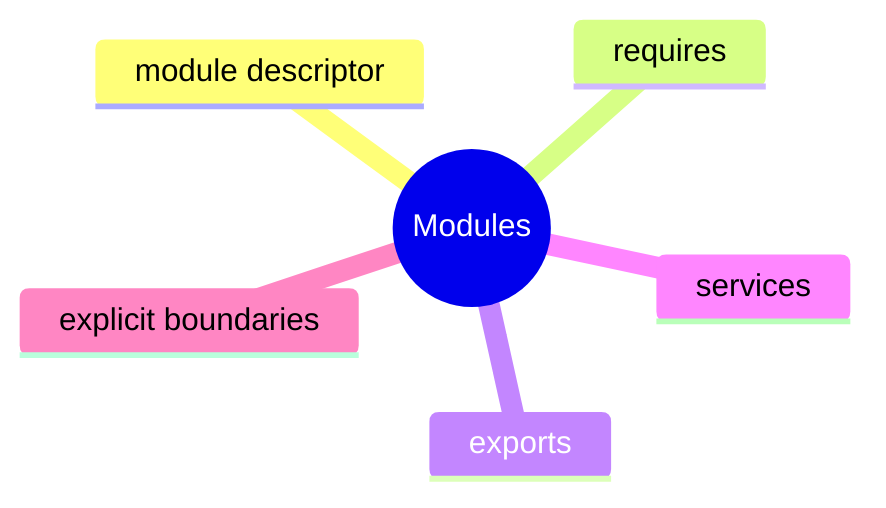

# Java Modules Learning Kit

This chapter teaches a boundary concept: a large codebase becomes easier to reason about when dependencies and exported APIs are made explicit.

After reading this chapter, you should know what problem modules solve, what `requires` and `exports` actually mean, and why service loading is about decoupling implementations from consumers.

## What Problem This Chapter Solves

As a system grows, these problems appear:

- too many accidental dependencies
- unclear public API surface
- implementation packages being used directly
- hard-wired implementations

Modules help make those boundaries visible.

## Study Order

1. Run [DeclaringModuleBoundaries.java](/Users/indiadelhi/repo/career/java-missing-tutorial/code/src/main/java/com/learning/javamissing/sec18_architecture_and_integration/ch01_modules/topics/declaring_module_boundaries/DeclaringModuleBoundaries.java)
2. Run [ChoosingDependenciesAndExposedPackages.java](/Users/indiadelhi/repo/career/java-missing-tutorial/code/src/main/java/com/learning/javamissing/sec18_architecture_and_integration/ch01_modules/topics/choosing_dependencies_and_exposed_packages/ChoosingDependenciesAndExposedPackages.java)
3. Run [PluggableImplementations.java](/Users/indiadelhi/repo/career/java-missing-tutorial/code/src/main/java/com/learning/javamissing/sec18_architecture_and_integration/ch01_modules/topics/pluggable_implementations/PluggableImplementations.java)

## Concept Map

## Quick Summary

### Module Descriptor

- `module-info.java` declares the module boundary
- it is the entry point for understanding dependencies and exposed packages

### `requires` And `exports`

- `requires` says what this module depends on
- `exports` says what packages other modules may use

### Services

- services let consumers depend on an abstraction instead of a concrete implementation
- this supports pluggable designs

## Compare With

- classpath vs module path:
  classpath is looser, modules make boundaries more explicit
- public class vs exported package:
  a public type is not enough by itself in a modular world; package export matters too
- direct implementation dependency vs service loading:
  services reduce coupling to one specific implementation

## Mini Case Study

Imagine a retail platform split into modules:

- `store.api`
- `store.pricing`
- `store.reporting`

Reporting should not reach into pricing internals. Pricing should expose only its API package. Discount providers may vary by country, so a service-based design fits better than hard-coded implementation references.

## When To Use

- use modules when the codebase is large enough that dependency boundaries matter
- use `exports` to expose only intended API packages
- use services when one abstraction may have multiple implementations

## When Not To Use

- do not add modules mechanically to a tiny toy application with no boundary benefit
- do not export internal implementation packages
- do not use service loading where a direct dependency is simpler and clearer

## Interview Focus

Q: What problem do Java modules primarily solve?  
A: They make dependencies and visible API boundaries explicit.

Q: What is the difference between `requires` and `exports`?  
A: `requires` brings in another module; `exports` makes one of your packages available to other modules.

Q: Why use services in a modular design?  
A: To decouple consumers from concrete implementations.

## Quick Quiz

1. Why can "public" still be insufficient without `exports`?
2. Why is service loading useful in a pluggable system?
3. What is the risk of exporting too many packages?

## Effective Java Mapping

- Item 15: Minimize the accessibility of classes and members
- Item 18: Favor composition over inheritance
- Item 64: Refer to objects by their interfaces

## Sources

- Java API documentation: https://docs.oracle.com/en/java/
- Core Java, Volume II: https://www.informit.com/store/core-java-volume-ii-advanced-features-9780135558690
- Effective Java, 3rd Edition: https://www.informit.com/store/effective-java-9780134686042
