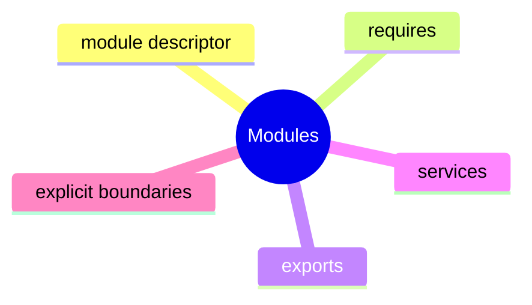

# Java Modules Learning Kit

## Why This Chapter Exists

As a system grows, these problems appear:

- too many accidental dependencies
- unclear public API surface
- implementation packages being used directly
- hard-wired implementations

Modules help make those boundaries visible.

## The Pain Before It

As a system grows, these problems appear:

- too many accidental dependencies
- unclear public API surface
- implementation packages being used directly
- hard-wired implementations

Modules help make those boundaries visible.

## Java Creator Mindset

### Module Descriptor

- `module-info.java` declares the module boundary
- it is the entry point for understanding dependencies and exposed packages

### `requires` And `exports`

- `requires` says what this module depends on
- `exports` says what packages other modules may use

### Services

- services let consumers depend on an abstraction instead of a concrete implementation
- this supports pluggable designs

## How You Might Invent It

## Naive Attempt

- classpath vs module path:
  classpath is looser, modules make boundaries more explicit
- public class vs exported package:
  a public type is not enough by itself in a modular world; package export matters too
- direct implementation dependency vs service loading:
  services reduce coupling to one specific implementation

## Why It Breaks

That breaks when the same mistake repeats across files, teams, or interview questions and the code has no shared mental model.

## Final Java Direction

### Module Descriptor

- `module-info.java` declares the module boundary
- it is the entry point for understanding dependencies and exposed packages

### `requires` And `exports`

- `requires` says what this module depends on
- `exports` says what packages other modules may use

### Services

- services let consumers depend on an abstraction instead of a concrete implementation
- this supports pluggable designs

## Study Order

1. Run [Declaring Module Boundaries](topics/declaring_module_boundaries/DeclaringModuleBoundaries.java)
2. Run [Module Boundaries](topics/module_boundaries/ModuleBoundaries.java)
3. Run [Pluggable Implementations](topics/pluggable_implementations/PluggableImplementations.java)

## What To Notice

### Compare With

- classpath vs module path:
  classpath is looser, modules make boundaries more explicit
- public class vs exported package:
  a public type is not enough by itself in a modular world; package export matters too
- direct implementation dependency vs service loading:
  services reduce coupling to one specific implementation

### Interview Focus

Q: What problem do Java modules primarily solve?  
A: They make dependencies and visible API boundaries explicit.

Q: What is the difference between `requires` and `exports`?  
A: `requires` brings in another module; `exports` makes one of your packages available to other modules.

Q: Why use services in a modular design?  
A: To decouple consumers from concrete implementations.

## Mental Model

## Common Mistakes

The most common mistake is to memorize labels without building a mental model for when the concept actually helps.

## Tradeoffs

- classpath vs module path:
  classpath is looser, modules make boundaries more explicit
- public class vs exported package:
  a public type is not enough by itself in a modular world; package export matters too
- direct implementation dependency vs service loading:
  services reduce coupling to one specific implementation

## Use / Avoid

### Use It When

- use modules when the codebase is large enough that dependency boundaries matter
- use `exports` to expose only intended API packages
- use services when one abstraction may have multiple implementations

### Avoid It When

- do not add modules mechanically to a tiny toy application with no boundary benefit
- do not export internal implementation packages
- do not use service loading where a direct dependency is simpler and clearer

## Practice

1. Why can "public" still be insufficient without `exports`?
2. Why is service loading useful in a pluggable system?
3. What is the risk of exporting too many packages?

### Mini Case Study

Imagine a retail platform split into modules:

- `store.api`
- `store.pricing`
- `store.reporting`

Reporting should not reach into pricing internals. Pricing should expose only its API package. Discount providers may vary by country, so a service-based design fits better than hard-coded implementation references.

## Summary

### Module Descriptor

- `module-info.java` declares the module boundary
- it is the entry point for understanding dependencies and exposed packages

### `requires` And `exports`

- `requires` says what this module depends on
- `exports` says what packages other modules may use

### Services

- services let consumers depend on an abstraction instead of a concrete implementation
- this supports pluggable designs

## Next Chapter

Move to [Modular Design Learning Kit](../ch02_modular_design/ChapterGuide.md) after this chapter.
