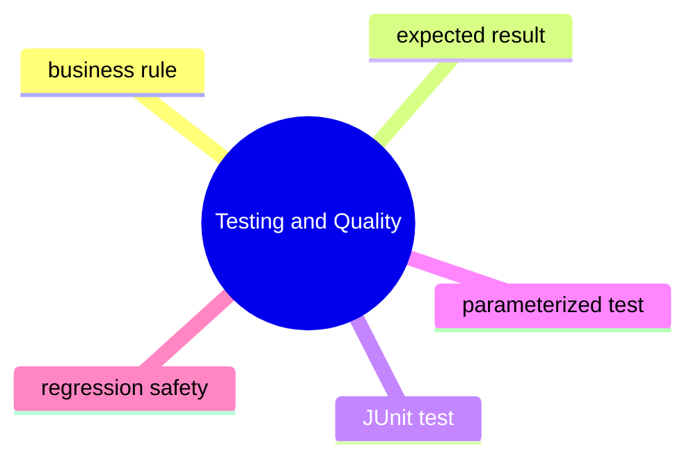

# Testing And Quality Learning Kit

This chapter teaches a durable engineering idea: good code is not only code that works once. Good code can be checked repeatedly, confidently, and cheaply.

After reading this chapter, you should know why test design matters more than test count, why JUnit is a tool instead of the goal, and why parameterized tests are useful for repeating one rule across many inputs.

## What Problem This Chapter Solves

Without tests, teams usually suffer from:

- fear of changing code
- hidden regressions
- unclear business rules
- duplicate manual checking

This chapter focuses on small, readable, repeatable verification.

## Study Order

1. Run [DesigningTestsAroundBusinessRules.java](/Users/indiadelhi/repo/career/java-missing-tutorial/code/src/main/java/com/learning/javamissing/sec19_testing_and_quality/ch01_testing_and_quality/topics/designing_tests_around_business_rules/DesigningTestsAroundBusinessRules.java)
2. Run [WritingReadableJUnitTests.java](/Users/indiadelhi/repo/career/java-missing-tutorial/code/src/main/java/com/learning/javamissing/sec19_testing_and_quality/ch01_testing_and_quality/topics/writing_readable_junit_tests/WritingReadableJUnitTests.java)
3. Run [CheckingOneRuleWithManyInputs.java](/Users/indiadelhi/repo/career/java-missing-tutorial/code/src/main/java/com/learning/javamissing/sec19_testing_and_quality/ch01_testing_and_quality/topics/checking_one_rule_with_many_inputs/CheckingOneRuleWithManyInputs.java)

## Concept Map

## Quick Summary

### Designing Tests

- start from the business rule, not from framework syntax
- a good test states expected and actual behavior clearly

### JUnit Basics

- JUnit gives structure to setup, execution, and assertion
- the real value comes from precise assertions and readable test names

### Parameterized Tests

- parameterized tests help when the same rule must hold for many inputs
- they reduce repetition while preserving clarity

## Compare With

- manual checking vs automated test:
  manual checking is slow and inconsistent, automated tests are repeatable
- one giant test vs focused tests:
  focused tests fail more clearly and are easier to maintain
- copy-paste tests vs parameterized tests:
  parameterized tests work well when one rule is evaluated against multiple cases

## Mini Case Study

A pricing service adds tax to an item price.

- one test should verify the normal case
- another should verify edge cases such as zero tax
- if many tax rates are checked, parameterized tests reduce repetition

That is exactly what the topic files in this chapter model.

## When To Use

- write tests for business rules and failure-prone behavior
- use JUnit when you need structured automated verification
- use parameterized tests when many inputs exercise one rule

## When Not To Use

- do not write vague tests that only repeat implementation details
- do not create huge assertion bundles that hide the failing behavior
- do not parameterize tests so heavily that readability collapses

## Interview Focus

Q: What makes a test high quality?  
A: It is readable, focused, repeatable, and clearly tied to a business rule.

Q: When is a parameterized test better than several copied tests?  
A: When the same behavior should be checked against many input combinations.

Q: Why is test design more important than framework syntax?  
A: Because poor tests remain poor even if they use a good tool.

## Quick Quiz

1. Why should a test name describe behavior instead of only the method name?
2. When does a parameterized test improve quality, and when can it hurt readability?
3. Why is asserting a business rule stronger than only asserting that a method ran?

## Effective Java Mapping

- Item 49: Check parameters for validity
- Item 67: Optimize judiciously
- Item 76: Strive for failure atomicity

## Sources

- Unit Testing: Principles, Practices, and Patterns: https://www.manning.com/books/unit-testing
- Refactoring, 2nd Edition: https://www.informit.com/store/refactoring-improving-the-design-of-existing-code-9780134757698
- Effective Java, 3rd Edition: https://www.informit.com/store/effective-java-9780134686042
