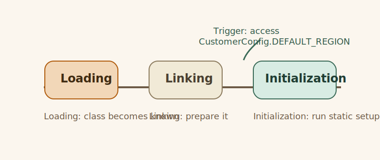

# Class Loading Lifecycle

## Class Loading Lifecycle

**Concept**

Concept: classes are loaded and initialized only when the JVM decides they are needed.

**Example**

```java
    public static void main(String[] args) {
        System.out.println("Concept: classes are loaded and initialized only when the JVM decides they are needed.");
        System.out.println("Accessing CustomerConfig.DEFAULT_REGION triggers class initialization.");
        System.out.println("region = " + CustomerConfig.DEFAULT_REGION);
        System.out.println("Why it works: loading makes class data available, linking prepares it, and initialization runs static setup.");
    }
```



**What happens**

- Concept: classes are loaded and initialized only when the JVM decides they are needed.
- Accessing CustomerConfig.DEFAULT_REGION triggers class initialization.
- Why it works: loading makes class data available, linking prepares it, and initialization runs static setup.

**What stays stable**

- Concept: classes are loaded and initialized only when the JVM decides they are needed. Accessing CustomerConfig.DEFAULT_REGION triggers class initialization.
- The example keeps the same Java shape while you vary one thing.

**What changes**

- Concept: classes are loaded and initialized only when the JVM decides they are needed. Accessing CustomerConfig.DEFAULT_REGION triggers class initialization.
- That change is what reveals the behavior you need to understand.

**Why it matters**

Concept: classes are loaded and initialized only when the JVM decides they are needed. Accessing CustomerConfig.DEFAULT_REGION triggers class initialization.

**Rule**

👉 Rule: Concept: classes are loaded and initialized only when the JVM decides they are needed.

**Try this**

- Concept: classes are loaded and initialized only when the JVM decides they are needed.
- Accessing CustomerConfig.DEFAULT_REGION triggers class initialization.
- Why it works: loading makes class data available, linking prepares it, and initialization runs static setup.
