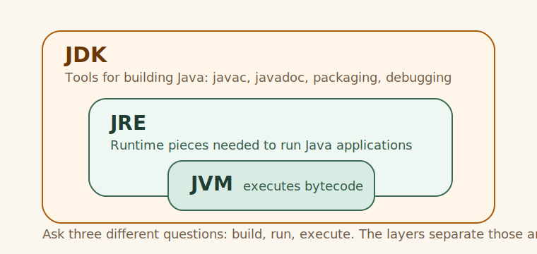

# Runtime Layers

## Runtime Layers

**Concept**

Concept: JVM, JRE, and JDK answer different questions.

**Example**

```java
    public static void main(String[] args) {
        System.out.println("Concept: JVM, JRE, and JDK answer different questions.");
        System.out.println("Real-world problem: a new developer can run code in the IDE but cannot explain what the runtime and toolchain actually are.");
        System.out.println();

        // Expected output:
        // JVM = executes bytecode
        // JRE = runtime pieces needed to run Java programs
        // JDK = tools + runtime for developing Java
        System.out.println("JVM = executes bytecode");
        System.out.println("JRE = runtime pieces needed to run Java programs");
        System.out.println("JDK = tools + runtime for developing Java");
        System.out.println("Why it matters: the JDK contains tools like javac, while the JVM is the execution engine inside the larger runtime story.");
    }
```



**What happens**

- Concept: JVM, JRE, and JDK answer different questions.
- Real-world problem: a new developer can run code in the IDE but cannot explain what the runtime and toolchain actually are.
- JVM = executes bytecode

**What stays stable**

- Concept: JVM, JRE, and JDK answer different questions. Real-world problem: a new developer can run code in the IDE but cannot explain what the runtime and toolchain actually are.
- The example keeps the same Java shape while you vary one thing.

**What changes**

- Concept: JVM, JRE, and JDK answer different questions. Real-world problem: a new developer can run code in the IDE but cannot explain what the runtime and toolchain actually are.
- That change is what reveals the behavior you need to understand.

**Why it matters**

Concept: JVM, JRE, and JDK answer different questions. Real-world problem: a new developer can run code in the IDE but cannot explain what the runtime and toolchain actually are.

**Rule**

👉 Rule: Concept: JVM, JRE, and JDK answer different questions.

**Try this**

- Concept: JVM, JRE, and JDK answer different questions.
- Real-world problem: a new developer can run code in the IDE but cannot explain what the runtime and toolchain actually are.
- JVM = executes bytecode
