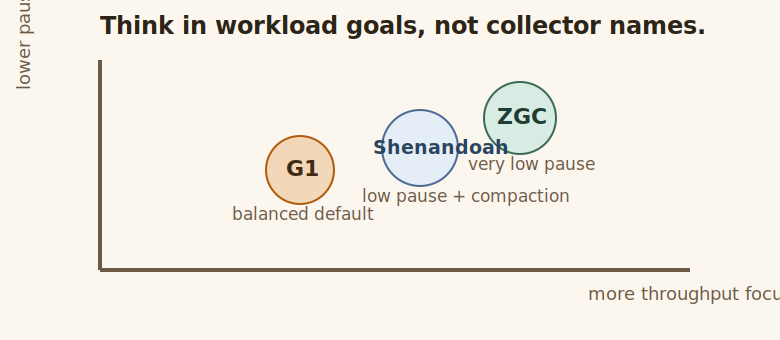

# GC Strategies

## GC Strategies

**Concept**

Concept: different garbage collectors optimize for different tradeoffs.

**Example**

```java
    public static void main(String[] args) {
        System.out.println("Concept: different garbage collectors optimize for different tradeoffs.");
        List<String> collectors = List.of("G1", "ZGC", "Shenandoah");

        // Expected output:
        // G1 -> balanced default for many server workloads
        // ZGC -> very low pause time focus
        // Shenandoah -> low pause time with concurrent compaction focus
        System.out.println("G1 -> balanced default for many server workloads");
        System.out.println("ZGC -> very low pause time focus");
        System.out.println("Shenandoah -> low pause time with concurrent compaction focus");
        System.out.println("collector count = " + collectors.size());
        System.out.println("Use this when: you need a first mental model before reading deeper GC tuning material.");
    }
```



**What happens**

- Concept: different garbage collectors optimize for different tradeoffs.
- G1 -> balanced default for many server workloads
- ZGC -> very low pause time focus

**What stays stable**

- Concept: different garbage collectors optimize for different tradeoffs. G1 -> balanced default for many server workloads ZGC -> very low pause time focus Shenandoah -> low pause time with concurrent compaction focus Use this when: you need a first mental model before reading deeper GC tuning material.
- The example keeps the same Java shape while you vary one thing.

**What changes**

- Concept: different garbage collectors optimize for different tradeoffs. G1 -> balanced default for many server workloads ZGC -> very low pause time focus Shenandoah -> low pause time with concurrent compaction focus Use this when: you need a first mental model before reading deeper GC tuning material.
- That change is what reveals the behavior you need to understand.

**Why it matters**

Concept: different garbage collectors optimize for different tradeoffs. G1 -> balanced default for many server workloads ZGC -> very low pause time focus Shenandoah -> low pause time with concurrent compaction focus Use this when: you need a first mental model before reading deeper GC tuning material.

**Rule**

👉 Rule: Concept: different garbage collectors optimize for different tradeoffs.

**Try this**

- Concept: different garbage collectors optimize for different tradeoffs.
- G1 -> balanced default for many server workloads
- ZGC -> very low pause time focus
