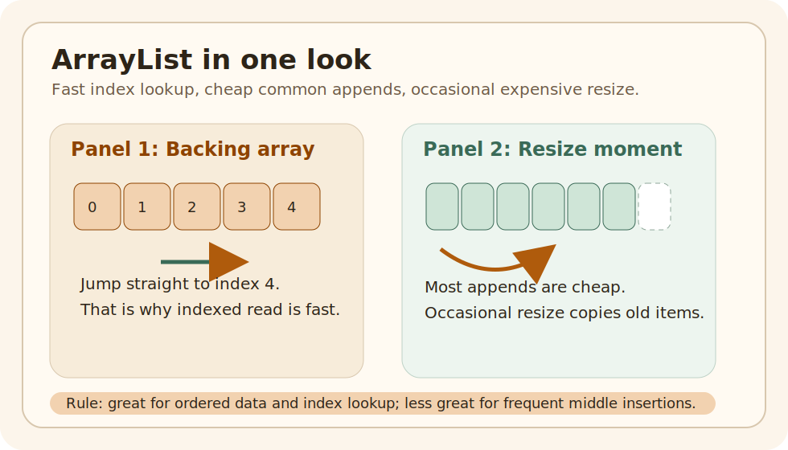

# ArrayList Growth And Lookup

## Why This Matters

Many developers can use `ArrayList`, but fewer can explain why it is usually fast and where it becomes costly.

## Intuition

The picture tells the whole story:

- items sit in an array
- index lookup jumps straight to a slot
- growth occasionally copies old items into a larger array

## Problem Statement

Many developers can use `ArrayList`, but fewer can explain why it is usually fast and where it becomes costly.

That gap matters because performance problems often begin with the wrong mental model, not the wrong syntax.

## Core Idea

`ArrayList` stores elements in an array.  
That gives fast index access, but growth sometimes needs a bigger array and element copying.

## Mental Model

The picture tells the whole story:

- items sit in an array
- index lookup jumps straight to a slot
- growth occasionally copies old items into a larger array

| Need | `ArrayList` | `LinkedList` |
| --- | --- | --- |
| Read by index | strong fit | weak fit |
| Append often | strong fit | fine, but rarely worth the tradeoff |
| Insert in middle often | can be costly | can help if you already have the node position |
| Cache-friendly iteration | usually better | usually worse |

## Simple Example

### Run It

Run the example and focus on these ideas:

- indexed lookup
- append behavior
- resizing cost

### Expected Result

The printed output should make it clear that:

- lookup by index is direct
- appending is usually cheap
- occasional growth has a larger one-time cost

## Step-by-Step Working

`ArrayList` stores elements in an array.  
That gives fast index access, but growth sometimes needs a bigger array and element copying.

## Rules / Syntax

`ArrayList` has existed since the Java Collections Framework arrived in Java 1.2, so this is a concept every Java engineer should understand no matter which Java version they use.

- Prefer the smallest correct rule over cleverness.
- Connect the rule back to the runnable example.

## Common Mistakes

The wrong mental model is "every append is always O(1) with no caveat."

The better mental model is:

- most appends are cheap
- resizing is occasional
- average append cost stays good because the expensive resize does not happen every time

## When To Use / When Not To Use

### Use It When

- order matters
- index-based lookup matters
- duplicates are fine
- append-heavy workloads are common

### Avoid It When

- frequent middle insertions dominate
- uniqueness is the main requirement
- key-based lookup is the real problem

## Practice

Change one part of the runnable example, rerun it, and explain whether arraylist growth and lookup still behaves the way you expected.

### After That

Read the HashMap buckets and collisions topic next. Together, these two topics form the base of practical Java collection judgment.

## Summary

- `ArrayList` is fast because it uses an array, not because it is magically optimized for everything
- occasional resize cost is the tradeoff behind usually-cheap append
- complexity language becomes much easier once you connect it to actual storage shape

## The Problem

Many developers can use `ArrayList`, but fewer can explain why it is usually fast and where it becomes costly.

That gap matters because performance problems often begin with the wrong mental model, not the wrong syntax.

## Quick Visual

The picture tells the whole story:

- items sit in an array
- index lookup jumps straight to a slot
- growth occasionally copies old items into a larger array

## Run This Code

Run the example and focus on these ideas:

- indexed lookup
- append behavior
- resizing cost

## Expected Output

The printed output should make it clear that:

- lookup by index is direct
- appending is usually cheap
- occasional growth has a larger one-time cost

## Wrong Example First

The wrong mental model is "every append is always O(1) with no caveat."

The better mental model is:

- most appends are cheap
- resizing is occasional
- average append cost stays good because the expensive resize does not happen every time

## Why This Works

`ArrayList` stores elements in an array.  
That gives fast index access, but growth sometimes needs a bigger array and element copying.

## Comparison Snapshot

| Need | `ArrayList` | `LinkedList` |
| --- | --- | --- |
| Read by index | strong fit | weak fit |
| Append often | strong fit | fine, but rarely worth the tradeoff |
| Insert in middle often | can be costly | can help if you already have the node position |
| Cache-friendly iteration | usually better | usually worse |

## Performance Lens

The key metric is not "does resize happen?"  
It is "how often does the expensive resize happen compared with cheap appends?"

That is why the right phrase is:

- append is amortized `O(1)`
- indexed lookup is `O(1)`
- middle insertion is often `O(n)`

## Benchmark Lens

If you measure `ArrayList`, watch these operations separately:

- append at end
- read by index
- insert in middle
- remove in middle

Those four numbers teach more than one generic "ArrayList benchmark" ever will.

## Use This When

- order matters
- index-based lookup matters
- duplicates are fine
- append-heavy workloads are common

## Avoid This When

- frequent middle insertions dominate
- uniqueness is the main requirement
- key-based lookup is the real problem

## Version Notes

`ArrayList` has existed since the Java Collections Framework arrived in Java 1.2, so this is a concept every Java engineer should understand no matter which Java version they use.

## After Reading This, You Should Know

- `ArrayList` is fast because it uses an array, not because it is magically optimized for everything
- occasional resize cost is the tradeoff behind usually-cheap append
- complexity language becomes much easier once you connect it to actual storage shape

## Next Topic

Read the HashMap buckets and collisions topic next. Together, these two topics form the base of practical Java collection judgment.
